# Contributing to Uptime Watcher

Thank you for considering contributing to Uptime Watcher! This document provides guidelines and information for contributors.

## 🚀 Getting Started

### Prerequisites

- **Node.js** 24.8+ (required)
- **npm** 11.6.4+ (included with Node.js)
- **Git** (latest version)

### Development Setup

1. **Fork and Clone**

   ```bash
   git clone https://github.com/your-username/Uptime-Watcher.git
   cd Uptime-Watcher
   ```

2. **Install Dependencies**

   ```bash
   npm install
   ```

3. **Start Development Environment**

   ```bash
   npm run electron-dev
   ```

4. **Verify Setup**
   - The application window should launch successfully (Vite + Electron)
   - Check that hot reloading works by making a small change in `src/`

## 📋 Development Guidelines

### Code Quality Standards

- **TypeScript**: Strict TypeScript with comprehensive type safety
- **ESLint**: 50+ plugins configured for comprehensive code checking
- **Testing**: Comprehensive suites (unit, integration, Playwright, property-based, mutation) with sustained coverage growth across modules
- **Documentation**: TSDoc comments required for all public APIs

### Development Scripts

| Script                   | Purpose      | Description                                    |
| ------------------------ | ------------ | ---------------------------------------------- |
| `npm run dev`            | Development  | Start Vite dev server for frontend development |
| `npm run electron-dev`   | Full App     | Launch complete application (Vite + Electron)  |
| `npm run electron`       | Electron     | Launch Electron shell (requires Vite running)  |
| `npm run build`          | Production   | Build application for production               |
| `npm run test`           | Testing      | Run core Vitest suites (unit/integration)      |
| `npm run lint`           | Code Quality | Check code formatting and style                |
| `npm run lint:fix`       | Code Quality | Automatically fix linting issues               |
| `npm run type-check:all` | Type Safety  | Verify TypeScript types across all modules     |

### Architecture Standards

- **State Management**: Zustand stores with domain separation
- **Database**: Repository pattern with transaction safety
- **IPC**: Secure contextBridge communication only
- **Testing**: Vitest + Stryker + Playwright + fast-check coverage

### Git Workflow

#### Contribution lifecycle

```mermaid
flowchart LR
    classDef idea fill:#e0f2fe,stroke:#0284c7,stroke-width:2px,color:#075985;
    classDef work fill:#dcfce7,stroke:#16a34a,stroke-width:2px,color:#14532d;
    classDef review fill:#fef3c7,stroke:#d97706,stroke-width:2px,color:#92400e;
    classDef merge fill:#fae8ff,stroke:#a855f7,stroke-width:2px,color:#6b21a8;

    Idea(["Idea or Bug Report"]):::idea
    Issue{"Issue Created?"}:::review
    Assign["Self-assign or Discuss"]:::idea
    Branch["Create Feature Branch"]:::work
    Implement["Implement & Write Tests"]:::work
    Verify["Run lint / type / test suites"]:::work
    PR["Open Pull Request"]:::review
    Review{"Code Review"}:::review
    Merge["Merge via PR Template"]:::merge
    Celebrate(["Document & Release"]):::merge

    Idea --> Issue
    Issue -- yes --> Assign --> Branch --> Implement --> Verify --> PR --> Review
    Issue -- no --> Idea
    Review -- Changes requested --> Implement
    Review -- Approved --> Merge --> Celebrate
```



1. **Create a Feature Branch**

   ```bash
   git checkout -b feature/your-feature-name
   ```

2. **Make Your Changes**
   - Keep commits small and focused
   - Write clear commit messages
   - Follow conventional commit format when possible

3. **Test Your Changes**

   ```bash
   npm run build
   npm run test  # if tests exist
   ```

4. **Submit a Pull Request**
   - Use the provided PR template
   - Include screenshots for UI changes
   - Reference any related issues

### Commit Message Format

We follow the [Conventional Commits](https://www.conventionalcommits.org/) specification:

```text
type(scope): brief description

Detailed explanation if needed

Fixes #123
```

**Types:**

- `feat`: New feature
- `fix`: Bug fix
- `docs`: Documentation changes
- `style`: Code style changes (formatting, etc.)
- `refactor`: Code refactoring
- `test`: Adding or updating tests
- `chore`: Maintenance tasks

## 🧩 Project Structure

```text
├── electron/         # Electron main process code
├── src/              # React frontend code
├── docs/             # Documentation (architecture, guides, testing, TSDoc)
├── public/           # Static assets
├── scripts/          # Build and utility scripts
└── dist/             # Packaged application artifacts
```

### Key Files

- `electron/main.ts` - Electron main process entry point
- `src/App.tsx` - React application root
- `src/stores/` - Zustand domain stores (sites, alerts, settings, etc.)
- `docs/` - Complete documentation system

## 🐛 Reporting Issues

### Bug Reports

Use the bug report template and include:

- **Environment**: OS, Node.js version, app version
- **Steps to Reproduce**: Clear, step-by-step instructions
- **Expected Behavior**: What should have happened
- **Actual Behavior**: What actually happened
- **Screenshots**: If applicable

### Feature Requests

Use the feature request template and include:

- **Problem Statement**: What problem does this solve?
- **Proposed Solution**: Detailed description of the feature
- **Alternatives**: Other solutions you've considered
- **Additional Context**: Any other relevant information

## 📝 Documentation

### Writing Documentation

- Use clear, concise language
- Include code examples where appropriate
- Follow the existing documentation structure
- Ensure all links work correctly

### Documentation Structure

- **Architecture & ADRs**: In `docs/Architecture/` - core architecture, ADRs, and patterns
- **Guides**: In `docs/Guides/` - user and developer guides
- **Testing Docs**: In `docs/Testing/` - testing methodology, fuzzing, and Playwright
- **API / TSDoc**: In `docs/TSDoc/` - generated API documentation and TSDoc references

### Updating Documentation

- Update relevant docs when changing functionality
- Ensure markdown passes linting (use markdownlint)
- Run `npm run docs:check-links` to verify Architecture and Docusaurus routes

## 🔧 Development Tasks

### Available Scripts

| Category          | Script                     | Description                                                       |
| ----------------- | -------------------------- | ----------------------------------------------------------------- |
| **Development**   | `npm run dev`              | Start Vite dev server                                             |
|                   | `npm run electron`         | Launch Electron shell (requires Vite dev server)                  |
|                   | `npm run electron-dev`     | Start dev server + Electron concurrently                          |
|                   | `npm run start-both`       | Alias for `electron-dev`                                          |
| **Building**      | `npm run build`            | Build for production                                              |
|                   | `npm run clean`            | Clean all build artifacts                                         |
| **Code Quality**  | `npm run lint`             | Run ESLint checks                                                 |
|                   | `npm run lint:fix`         | Fix ESLint issues automatically                                   |
|                   | `npm run format`           | Format code with Prettier                                         |
|                   | `npm run type-check:all`   | TypeScript type checking                                          |
| **Documentation** | `npm run docs:check-links` | Validate internal documentation links (Architecture & Docusaurus) |
| **Testing**       | `npm run test`             | Run core Vitest suites (unit/integration)                         |
|                   | `npm run test:coverage`    | Generate coverage reports                                         |
|                   | `npm run test:electron`    | Run Electron-specific tests                                       |

### Testing Requirements

- **Unit Tests**: Required for all business logic components
- **Integration Tests**: Required for IPC and database operations
- **E2E Tests**: Required for critical user workflows using Playwright
- **Property Tests**: Use fast-check for complex algorithmic functions
- **Mutation Testing**: Stryker configuration validates test quality
- **Coverage**: Keep coverage trending upward; add tests alongside features and fixes (unit, integration, E2E, property-based, mutation)

### Validation Layers

- Follow the layered validation contract when adding features. Shape validation belongs in preload/IPC schemas, business rules in managers, and persistence checks in repositories.
- Emit structured `ApplicationError` instances when validation fails so renderer error handling stays consistent.
- Review the [Validation Strategy](docs/Guides/VALIDATION_STRATEGY.md) guide before introducing new input flows or modifying existing schemas.

## 🌟 Priority Contribution Areas

### High Impact Opportunities

- **Enhanced Monitoring**: Advanced notification rules and alerting systems
- **Data Visualization**: Improved dashboard analytics and trending
- **Configuration Management**: Import/export of monitoring configurations
- **Performance Optimization**: Monitoring efficiency and UI responsiveness
- **Accessibility**: Enhanced keyboard navigation and screen reader support

### Technical Improvements

- **Additional Test Coverage**: Expand edge case testing
- **Error Recovery**: Enhanced error handling and user feedback
- **Internationalization**: Multi-language support infrastructure
- **Advanced Analytics**: Historical data analysis and reporting
- **Plugin Architecture**: Extensible monitoring modules

### Documentation Enhancements

- **Tutorial Content**: Step-by-step usage guides with screenshots
- **API Documentation**: Comprehensive API reference materials
- **Migration Guides**: Version upgrade and data migration instructions
- **Integration Examples**: Sample configurations and use cases

## 🌟 Recognition

Contributors are recognized in:

- Release notes for significant contributions
- GitHub contributors section
- Special thanks in documentation

## 📞 Getting Help

- **Documentation**: Check the [docs](README.md) first
- **Discussions**: Use GitHub Discussions for questions
- **Issues**: Create an issue for bugs or feature requests
- **Chat**: Join our development discussions (if applicable)

## 📄 License

By contributing to Uptime Watcher, you agree that your contributions will be released under the terms of the
[Unlicense](LICENSE), consistent with the project's public domain dedication.

---

Thank you for contributing to Uptime Watcher! 🎉
