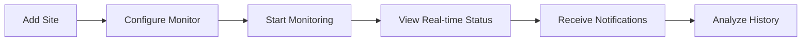
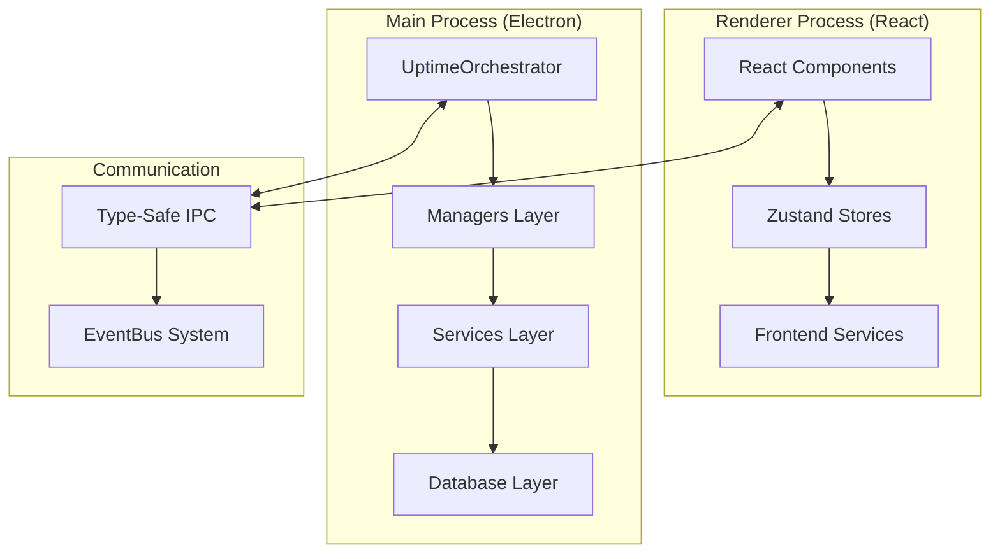

# 📊 Uptime Watcher

<div align="center">

[](https://github.com/Nick2bad4u/Uptime-Watcher/releases)
[](LICENSE)
[](https://www.electronjs.org/)
[](https://reactjs.org/)
[](https://www.typescriptlang.org/)

[](https://github.com/Nick2bad4u/Uptime-Watcher/actions)
[](https://sonarcloud.io/summary/new_code?id=Nick2bad4u_Uptime-Watcher)
[](https://codecov.io/gh/Nick2bad4u/Uptime-Watcher)
[](https://github.com/Nick2bad4u/Uptime-Watcher/releases)

[](https://github.com/Nick2bad4u/Uptime-Watcher)
[](https://github.com/Nick2bad4u/Uptime-Watcher/stargazers)
[](https://github.com/Nick2bad4u/Uptime-Watcher/network/members)

**A sophisticated Electron desktop application for comprehensive uptime monitoring**
_Track multiple services simultaneously with real-time updates, response time analytics, and historical data visualization_


</div>

---

## 🎯 **What is Uptime Watcher?**

Uptime Watcher is a desktop application built with modern web technologies that provides **monitoring capabilities** for websites, APIs, servers, and network services. Unlike most monitoring tools, there's **no cloud dependency** or command-line interface required. You can monitor everything with ease from a GUI.

## ✨ **Key Features**

<div align="center">

| 🌐 **Multi-Protocol Monitoring** |  📊 **Real-Time Analytics**   | 🔔 **Smart Notifications** |
| :------------------------------: | :---------------------------: | :------------------------: |
|    HTTP/HTTPS websites & APIs    |      Live status updates      | Desktop alerts for outages |
|      TCP port connectivity       |    Response time tracking     |    Sound notifications     |
|       ICMP ping monitoring       | Historical data visualization |  Custom alert thresholds   |
|      DNS record validation       |      Performance metrics      |  Status change detection   |

</div>

### � **Core Capabilities**

- **🎯 Multi-Service Monitoring**: Supports HTTP/HTTPS, TCP ports, ICMP ping, and DNS monitoring
- **⚡ Real-Time Updates**: Live status changes with sub-second responsiveness
- **📈 Performance Analytics**: Response time tracking with trend analysis
- **� Historical Data**: Comprehensive uptime history with SQLite storage
- **🔔 Smart Notifications**: Desktop notifications with configurable settings
- **🌓 Modern UI**: Dark/light theme support with responsive design
- **⚙️ Flexible Configuration**: Customizable check intervals from 30 seconds to 30 minutes
- **💾 Data Persistence**: Local SQLite database with backup/restore functionality
- **🔄 Auto-Updates**: Built-in update mechanism with seamless restart coordination
- **🏗️ Service Architecture**: Modular design with dependency injection and event-driven communication

### 📋 **Monitor Types**

| Type           | Purpose                   | Features                                                |
| -------------- | ------------------------- | ------------------------------------------------------- |
| **HTTP/HTTPS** | Website & API monitoring  | Status codes, redirects, custom headers, SSL validation |
| **TCP Port**   | Port connectivity testing | Socket connection validation, timeout handling          |
| **ICMP Ping**  | Network reachability      | Packet loss monitoring, latency measurement             |
| **DNS**        | DNS resolution monitoring | Support for A, AAAA, CNAME, MX, TXT, NS, SRV records    |

## 🛠️ **Technology Stack**

<div align="center">

### **Frontend Architecture**

[](https://reactjs.org/)
[](https://www.typescriptlang.org/)
[](https://tailwindcss.com/)
[](https://vitejs.dev/)

### **Desktop Framework**

[](https://www.electronjs.org/)
[](https://nodejs.org/)

### **State & Data Management**

[](https://github.com/pmndrs/zustand)
[](https://sqlite.org/)

### **Development & Quality**

[](https://vitest.dev/)
[](https://eslint.org/)
[](https://prettier.io/)

</div>

### **Architecture Highlights**

- **🏗️ Service-Oriented Architecture**: Modular design with dependency injection
- **🔒 Type-Safe IPC**: Secure communication via Electron contextBridge
- **📡 Event-Driven System**: TypedEventBus with middleware and correlation IDs
- **🗃️ Repository Pattern**: Transactional database operations with SQLite
- **⚡ Real-Time Updates**: Live monitoring with race condition prevention
- **🧪 Comprehensive Testing**: Dual Vitest configuration for frontend + backend
- **📦 Modern Build System**: Vite + TypeScript + Electron Builder

## 🚀 **Quick Start**

### **Installation**

#### **Option 1: Download Release (Recommended)**

```bash
# Download the latest release from GitHub
# Available for Windows, macOS, and Linux
```

**👉 [Download Latest Release](https://github.com/Nick2bad4u/Uptime-Watcher/releases/latest)**

#### **Option 2: Build from Source**

```bash
# Clone the repository
git clone https://github.com/Nick2bad4u/Uptime-Watcher.git
cd Uptime-Watcher

# Install dependencies
npm install

# Start development environment
npm run electron-dev
```

## 📖 **How to Use**

<div align="center">



</div>

### **Advanced Features**

- **🔄 Auto-Updates**: Automatic application updates with restart coordination
- **📁 Data Management**: Export/import monitoring configurations
- **🎨 Theme Support**: Dark/light mode with system preference detection
- **⚡ Performance**: Optimized for minimal resource usage
- **🔒 Privacy**: All data stored locally, no cloud dependencies

## 🖼️ **Screenshots & Demo**

<div align="center">

### **Main Dashboard**


_Real-time monitoring dashboard with multiple service status overview_

### **Monitor Configuration**


_Easy-to-use monitor configuration with multiple protocol support_

### **Historical Analytics**


_Comprehensive analytics with response time graphs and uptime statistics_

### **Notification System**


_Smart desktop notifications with customizable alert preferences_

</div>

---

## 👨‍💻 **Development**

### **Development Setup**

```bash
# Start Vite dev server only
npm run dev

# Start Electron only (requires Vite to be running)
npm run electron

# Start both Vite and Electron concurrently (recommended)
npm run electron-dev

# Build for production
npm run build

# Package the application
npm run dist
```

### **Development Prerequisites**

<div align="center">

| Requirement | Version                      | Download                         |
| ----------- | ---------------------------- | -------------------------------- |
| **Node.js** | 18.0+ (LTS recommended)      | [Download](https://nodejs.org/)  |
| **npm**     | 9.0+ (included with Node.js) | [Docs](https://www.npmjs.com/)   |
| **Git**     | Latest version               | [Download](https://git-scm.com/) |

> **💡 Tip**: Check out the [Developer Quick Start Guide](./docs/Guides/DEVELOPER-QUICK-START.md) for detailed setup instructions and architecture overview.

</div>

### **Project Structure**

```text
uptime-watcher/
├── 📁 electron/           # Main process (Node.js backend)
│   ├── 📄 main.ts         # Application entry point
│   ├── 📁 services/       # Service-oriented architecture
│   │   ├── 📁 database/   # Repository pattern with SQLite
│   │   ├── 📁 ipc/        # Type-safe IPC handlers
│   │   └── 📁 monitoring/ # Monitor services (HTTP, Ping, Port, DNS)
│   └── 📁 managers/       # Business logic orchestrators
├── 📁 src/               # Renderer process (React frontend)
│   ├── 📁 components/    # React components with TypeScript
│   ├── 📁 stores/        # Zustand state management
│   └── 📁 services/      # Frontend service layer
├── 📁 shared/            # Common code (types, validation, utilities)
└── 📁 docs/              # Comprehensive documentation
```

## 🏗️ **Architecture Overview**

<div align="center">



</div>

### **Architectural Principles**

The application follows a **service-oriented architecture** with clear separation of concerns:

#### **🔧 Core Components**

- **🖥️ Main Process (Electron)**: Service container with dependency injection
- **🎨 Renderer Process (React)**: Component-based UI with Zustand state management
- **🔗 IPC Communication**: Type-safe communication via contextBridge
- **🗃️ Database Layer**: Repository pattern with SQLite and transaction safety
- **📡 Event System**: TypedEventBus for cross-service communication
- **📊 Monitoring System**: Enhanced monitoring with operation correlation

#### **🎯 Key Design Features**

- **🏗️ Service-Oriented Architecture**: Modular, testable service design
- **🔒 Type Safety**: Strict TypeScript with comprehensive interfaces
- **📊 Enhanced Monitoring**: Race condition prevention and operation correlation
- **🗃️ Repository Pattern**: Transactional database operations
- **🎯 Event-Driven**: Reactive communication between services
- **📚 Comprehensive Documentation**: ADRs, guides, and code templates

#### **🔄 Data Flow**

1. **User Interaction** → React Components trigger actions
2. **State Management** → Zustand stores manage UI state
3. **IPC Communication** → Type-safe messages to main process
4. **Business Logic** → Managers orchestrate operations
5. **Data Persistence** → Repository pattern with SQLite
6. **Event Propagation** → Real-time updates via EventBus
7. **UI Updates** → React components re-render with new data

## 🤝 **Contributing**

We welcome contributions from the community! Here's how you can help:

### **🎯 Ways to Contribute**

- 🐛 **Bug Reports**: Found an issue? [Open an issue](https://github.com/Nick2bad4u/Uptime-Watcher/issues/new)
- 💡 **Feature Requests**: Have an idea? [Start a discussion](https://github.com/Nick2bad4u/Uptime-Watcher/discussions)
- 🔧 **Code Contributions**: Submit pull requests with improvements
- � **Documentation**: Help improve our docs and guides
- 🧪 **Testing**: Help test new features and report issues

### **📋 Development Guidelines**

1. **Fork the Repository** and create a feature branch
2. **Follow Code Standards** (TypeScript, ESLint, Prettier)
3. **Write Tests** for new functionality
4. **Update Documentation** for any user-facing changes
5. **Submit a Pull Request** with a clear description

---

## 📄 **License & Legal**

<div align="center">

[](LICENSE)

**This project is released under the [Unlicense](LICENSE) - Public Domain**

_You are free to use, modify, and distribute this software for any purpose, commercial or non-commercial, without any restrictions. Credit is appreciated but not required._

</div>

---

## 🌟 **Support & Community**

<div align="center">

### **💬 Get Help**

[](https://github.com/Nick2bad4u/Uptime-Watcher/issues)
[](https://github.com/Nick2bad4u/Uptime-Watcher/discussions)
[](./docs/)

</div>

---

<div align="center">

**Made with ❤️ by [Nick2bad4u](https://github.com/Nick2bad4u)**

_Monitoring made simple, reliable, and powerful._

[](https://github.com/Nick2bad4u/Uptime-Watcher)

---

_Last updated: August 2025 • Version 12.8.0_

</div>
