# 📊 Uptime Watcher

<div align="center"><a href="https://github.com/Nick2bad4u/Uptime-Watcher/releases">
  
</a>
<a href="LICENSE">
  
</a>
<a href="https://www.electronjs.org/">
  
</a>
<a href="https://reactjs.org/">
  
</a>
<a href="https://www.typescriptlang.org/">
  
</a>

<a href="https://github.com/Nick2bad4u/Uptime-Watcher/actions">
  
</a>
<a href="https://sonarcloud.io/summary/new_code?id=Nick2bad4u_Uptime-Watcher">
  
</a>
<a href="https://codecov.io/gh/Nick2bad4u/Uptime-Watcher">
  
</a>
<a href="https://github.com/Nick2bad4u/Uptime-Watcher/releases">
  
</a>

<a href="https://github.com/Nick2bad4u/Uptime-Watcher">
  
</a>
<a href="https://github.com/Nick2bad4u/Uptime-Watcher/stargazers">
  
</a>
<a href="https://github.com/Nick2bad4u/Uptime-Watcher/network/members">
  
</a>
<a href="https://deepwiki.com/Nick2bad4u/Uptime-Watcher">
  
</a>

<strong>A Electron desktop application for uptime monitoring</strong> <em>Track multiple services simultaneously with real-time updates, response time analytics, and historical data visualization</em>

<comment> Application screenshots will be added here once available </comment></div>

<div align="center">
  
</div>

## What is Uptime Watcher?

Uptime Watcher is a desktop application built with modern web technologies that provides __monitoring capabilities__ for websites, APIs, servers, and network services. Unlike most monitoring tools, there's __no cloud dependency__ or command-line interface required. You can monitor everything with ease from a GUI.

## ✨ Key features

<div align="center">

| 🌐 <strong>Multi-Protocol Monitoring</strong>          | 📊 <strong>Real-Time Analytics</strong> | 🔔 <strong>Smart Notifications</strong> |
| ------------------------------------------------------ | --------------------------------------- | --------------------------------------- |
| 14 monitor types: HTTP family (6 variants)             | Live status updates                     | Desktop alerts for outages              |
| Transport: TCP ports, ICMP ping                        | Response time tracking                  | Sound notifications                     |
| Network services: DNS resolution, SSL certificates     | Historical data visualization           | Custom alert thresholds                 |
| Advanced: CDN drift, replication lag, WebSocket health | Performance metrics                     | Status change detection                 |

</div>

## Core capabilities

* __🎯 Multi-Service Monitoring__: Fourteen built-in monitor types covering HTTP variants (status, headers, JSON fields, keywords, latency), DNS, SSL certificates, TCP ports, ICMP ping, CDN edge drift, replication lag, heartbeat endpoints, and WebSocket keepalive health
* __⚡ Real-Time Updates__: Live status changes with sub-second responsiveness
* __📈 Performance Analytics__: Response time tracking with trend analysis
* __📜 Historical Data__: Comprehensive uptime history with SQLite storage
* __⚙️ Flexible Configuration__: Customizable check intervals from 30 seconds to 30 minutes
* __💾 Data Persistence__: Local SQLite database with backup/restore functionality
* __🔁 Retention Sync__: Renderer settings stay aligned with orchestrator/database changes via `settings:history-limit-updated`
* __⚡ Instant Manual Checks__: Optimistic status updates immediately after manual monitor checks resolve

## Monitor types

| Category           | Monitor                     | Primary objective                              | Highlights                                                                 |
| ------------------ | --------------------------- | ---------------------------------------------- | -------------------------------------------------------------------------- |
| HTTP Availability  | __HTTP (Website/API)__      | Measure general availability and response time | Handles redirects, captures response code, records latency                 |
| HTTP Validation    | __HTTP Status Code__        | Enforce an exact response status               | Marks monitor degraded/down when status deviates from expectation          |
| HTTP Content       | __HTTP Header Match__       | Validate specific response headers             | Case-insensitive comparisons with retry-aware checks                       |
| HTTP Content       | __HTTP Keyword Match__      | Ensure body contains a keyword                 | Case-insensitive substring search for rapid regressions                    |
| HTTP Content       | __HTTP JSON Match__         | Inspect JSON payload fields                    | JSON path extraction with typed comparison                                 |
| HTTP Performance   | __HTTP Latency Threshold__  | Detect slow responses                          | Flags degraded when latency exceeds configured threshold                   |
| Transport          | __Port (Host/Port)__        | Verify TCP connectivity                        | Connection handshake timing with configurable ports                        |
| Transport          | __Ping (Host)__             | Check reachability                             | ICMP ping with latency sampling and packet loss handling                   |
| Network Services   | __DNS (Domain Resolution)__ | Resolve DNS records                            | Supports A, AAAA, CNAME, MX, TXT, NS, SRV, CAA, PTR, NAPTR, SOA, TLSA, ANY |
| Security           | __SSL Certificate__         | Track TLS validity                             | Warns on expiry windows and handshake anomalies                            |
| Edge Delivery      | __CDN Edge Consistency__    | Compare edge vs origin responses               | Detects drift in status/content across edge nodes                          |
| Data Platforms     | __Replication Lag__         | Monitor replica freshness                      | Compares timestamps between primary and replica endpoints                  |
| Application Health | __Server Heartbeat__        | Validate custom heartbeat payloads             | Status/timestamp drift analysis with JSON path extraction                  |
| Realtime Channels  | __WebSocket Keepalive__     | Ensure WebSocket responsiveness                | Ping/pong watchdog for stalled connections                                 |

## 🛠️ Technology stack

<div align="center">

### <strong>Frontend Architecture</strong>

<a href="https://reactjs.org/">
  
</a>
<a href="https://www.typescriptlang.org/">
  
</a>
<a href="https://tailwindcss.com/">
  
</a>
<a href="https://vitejs.dev/">
  
</a>

### <strong>Desktop Framework</strong>

<a href="https://www.electronjs.org/">
  
</a>
<a href="https://nodejs.org/">
  
</a>

### <strong>State & Data Management</strong>

<a href="https://github.com/pmndrs/zustand">
  
</a>
<a href="https://sqlite.org/">
  
</a>

### <strong>Development & Quality</strong>

<a href="https://vitest.dev/">
  
</a>
<a href="https://eslint.org/">
  
</a>
<a href="https://prettier.io/">
  
</a></div>

## 🚀 Quick start

### __Installation__

#### __Option 1: Download release (Recommended)__

```bash
# Download the latest release from GitHub
# Available for Windows, macOS, and Linux
```

__👉 [Download Latest Release](https://github.com/Nick2bad4u/Uptime-Watcher/releases/latest)__

#### __Option 2: Build from source__

```bash
# Clone the repository
git clone https://github.com/Nick2bad4u/Uptime-Watcher.git
cd Uptime-Watcher

# Install dependencies
npm install

# Start development environment
npm run electron-dev               # Append flags if needed: npm run electron-dev -- --log-debug
```

## Screenshots & demo

<div align="center"><em>Application screenshots and demo videos will be added in future releases.</em>

### Key interface components:

* 📊 <strong>Main Dashboard</strong>: Real-time monitoring overview with service status across all 14 monitor types
* ⚙️ <strong>Monitor Configuration</strong>: Easy setup for HTTP variants, TCP ports, DNS, ping, SSL certificates, CDN edge checks, replication lag, heartbeat validation, and WebSocket keepalive
* 📈 <strong>Historical Analytics</strong>: Response time graphs and uptime statistics for every monitored endpoint
* 🔔 <strong>Notification System</strong>: Customizable desktop alerts for status changes across all monitor types

</div>

***

## 👨‍💻 Development

### __Development setup__

```bash
# Start Vite dev server only
npm run dev

# Start Electron only (requires Vite to be running)
npm run electron

# Start both Vite and Electron concurrently (recommended)
npm run electron-dev               # Supports flags: npm run electron-dev -- --log-debug

# Build for production
npm run build

# Package the application
npm run dist
```

### __Development prerequisites__

<div align="center">

| Requirement              | Version                         | Download                                    |
| ------------------------ | ------------------------------- | ------------------------------------------- |
| <strong>Node.js</strong> | 24.8+ (required)                | <a href="https://nodejs.org/">Download</a>  |
| <strong>npm</strong>     | 11.5.2+ (included with Node.js) | <a href="https://www.npmjs.com/">Docs</a>   |
| <strong>Git</strong>     | Latest version                  | <a href="https://git-scm.com/">Download</a> |

\> <strong>💡 Tip</strong>: Check out the <a href="./docs/Guides/DEVELOPER_QUICK_START.md">Developer Quick Start Guide</a> for detailed setup instructions and architecture overview.

</div>

### Monitoring recommendations

For practical guidance on configuring monitors and writing tests, see our comprehensive testing documentation:

* [Testing Documentation](./docs/Testing/) - Includes fuzzing coverage, Playwright guides, and testing best practices

### Fuzzing and property-based tests

For running and tuning our fast-check based fuzzing suites, see:

* Fast-Check Fuzzing Coverage Guide → [docs/Testing/FAST\_CHECK\_FUZZING\_GUIDE.md](./docs/Testing/FAST_CHECK_FUZZING_GUIDE.md)

### End-to-end testing with Playwright

For comprehensive testing with Playwright, including setup, configuration, and troubleshooting common issues:

* Playwright Testing Guide → [docs/Testing/PLAYWRIGHT\_TESTING\_GUIDE.md](./docs/Testing/PLAYWRIGHT_TESTING_GUIDE.md)

### IPC automation workflow

* `npm run generate:ipc` – Regenerates preload bridge typings and the channel inventory.
* `npm run check:ipc` – Validates that generated artifacts are in sync; this command runs in CI.

Need deeper guidance? See the [IPC Automation Workflow](./docs/Guides/IPC_AUTOMATION_WORKFLOW.md) guide for examples, troubleshooting, and CI integration tips.

## Architectural principles

The application follows a __service-oriented architecture__ with clear separation of concerns:

### System architecture overview

```mermaid
flowchart LR
    classDef persona fill:#1f2937,stroke:#fbbf24,color:#f9fafb,font-weight:bold;
    classDef main fill:#1e1b4b,stroke:#ec4899,color:#fce7f3;
    classDef renderer fill:#0f172a,stroke:#06b6d4,color:#cffafe;
    classDef data fill:#064e3b,stroke:#10b981,color:#d1fae5;
    classDef service fill:#312e81,stroke:#8b5cf6,color:#e9d5ff;
    classDef infra fill:#451a03,stroke:#f59e0b,color:#fef3c7;
    linkStyle default stroke-width:2px;

    User((👩‍💻 Operator)):::persona
    subgraph Renderer['Renderer · React + Zustand']
        direction TB
        UI['React UI Components']
        Store['Zustand Domain Stores']
        Telemetry['UX Telemetry Hooks']
    end
    subgraph Main['Electron Main Process']
        direction TB
        Services['Monitoring Orchestrator']
        IPC['Typed IPC Gateway']
        Scheduler['Task Scheduler']
        EventBus['TypedEventBus']
    end
    subgraph Persistence['Local Persistence & Cache']
        direction TB
        SQLite[(SQLite Database)]
        Cache[(In-Memory Cache)]
        Backups['Backup Service']
    end
    subgraph Integrations['Infrastructure & Services']
        direction TB
  Monitors['Protocol Workers
HTTP Family • DNS • SSL • Ping • Port • CDN • Replication • Heartbeat • WebSocket']
        Alerts['Notification Engine']
    end

    User -->|Configures| UI
    UI --> Store
    Store -->|Requests| IPC
    IPC --> Services
    Services --> EventBus
    Services --> Scheduler
    Scheduler --> Monitors
    Monitors --> Services
    Services -->|Status Events| IPC
    IPC --> Store
    Store --> Telemetry --> EventBus
    Services --> SQLite
    SQLite --> Cache
    Cache --> Services
    SQLite --> Backups
    EventBus --> Alerts
    Alerts --> User

    class Services,IPC,Scheduler,EventBus,Monitors,Alerts service;
    class UI,Store,Telemetry renderer;
    class Integrations infra;

    click Services "docs/Architecture/README.md" "Open architecture documentation"
    click Store "docs/Architecture/ADRs/ADR-004-Frontend-State-Management.md" "Read ADR-004"
    click IPC "docs/Architecture/ADRs/ADR-005-IPC-Communication-Protocol.md" "Read IPC protocol"
    click EventBus "docs/Architecture/ADRs/ADR-002-Event-Driven-Architecture.md" "Read event-driven architecture"
    click SQLite "docs/Architecture/ADRs/ADR-001-Repository-Pattern.md" "Review repository pattern"
```



### __🔧 Core components__

* __🖥️ Main Process (Electron)__: Service container with dependency injection
* __🎨 Renderer Process (React)__: Component-based UI with Zustand state management
* __🔗 IPC Communication__: Type-safe communication via contextBridge
* __🗃️ Database Layer__: Repository pattern with SQLite and transaction safety
* __📡 Event System__: TypedEventBus for cross-service communication
* __📊 Monitoring System__: Enhanced monitoring with operation correlation

### __🎯 Key design features__

* __🏗️ Service-Oriented Architecture__: Modular, testable service design
* __🔒 Type Safety__: Strict TypeScript with comprehensive interfaces
* __📊 Enhanced Monitoring__: Race condition prevention and operation correlation
* __🗃️ Repository Pattern__: Transactional database operations
* __🎯 Event-Driven__: Reactive communication between services

## 🤝 Contributing

We welcome contributions from the community! Here's how you can help:

### __🎯 Ways to contribute__

* 🐛 __Bug Reports__: Found an issue? [Open an issue](https://github.com/Nick2bad4u/Uptime-Watcher/issues/new)
* 💡 __Feature Requests__: Have an idea? [Start a discussion](https://github.com/Nick2bad4u/Uptime-Watcher/issues/new)
* 🔧 __Code Contributions__: Submit pull requests with improvements
* 📚 __Documentation__: Help improve our docs and guides
* 🧪 __Testing__: Help test new features and report issues

### __📋 Development guidelines__

1. __Fork the Repository__ and create a feature branch
2. __Follow Code Standards__ (TypeScript, ESLint, Prettier)
3. __Write Tests__ for new functionality
4. __Update Documentation__ for any user-facing changes
5. __Submit a Pull Request__ with a clear description

***

## 📄 License

<div align="center"><a href="LICENSE">
  
</a>

<strong>This project is released under the <a href="LICENSE">Unlicense</a> - Public Domain</strong>

<em>You are free to use, modify, and distribute this software for any purpose, commercial or non-commercial, without any restrictions. Credit is appreciated but not required.</em></div>

***

## Get help

[](https://github.com/Nick2bad4u/Uptime-Watcher/issues) [](./docs/)

***

<div align="center"><strong>Made with ❤️ by <a href="https://github.com/Nick2bad4u">Nick2bad4u</a></strong>

<em>Last updated: November 2025 • Version 18.0.0</em></div>
