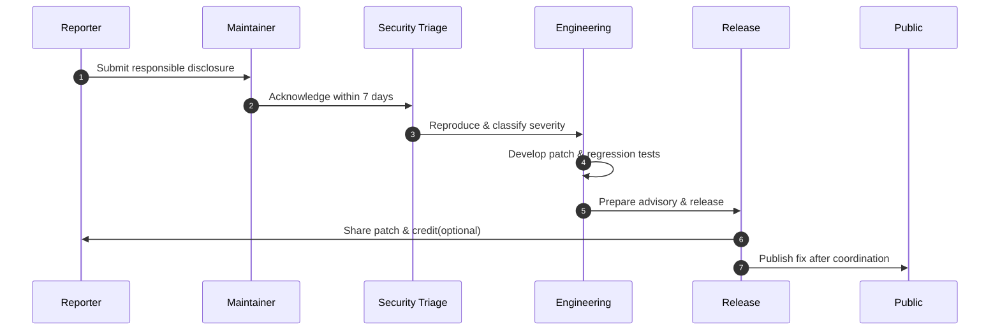

# Security Policy

## Reporting a Vulnerability

If you discover a security vulnerability, please report it by emailing <20943337+Nick2bad4u@users.noreply.github.com> or by opening a [private issue on GitHub](https://github.com/Nick2bad4u/Uptime-Watcher/issues/new). Do **not** disclose security issues publicly until they have been reviewed and patched.

- Please include as much detail as possible to help us reproduce and address the issue quickly.
- We aim to respond to security reports within 7 days.

### Vulnerability response workflow

## Security Best Practices

- Always use the latest version of Uptime Watcher.
- Keep all dependencies up to date. The current major dependencies and their versions are:

| Dependency        | Version  |
| ----------------- | -------- |
| electron          | ^39.2.5  |
| electron-builder  | ^26.0.12 |
| electron-updater  | ^6.6.2   |
| node-sqlite3-wasm | ^0.8.52  |
| react             | ^19.2.1  |
| typescript        | ^5.9.3   |
| vite              | ^7.2.6   |
| tailwindcss       | ^4.1.17  |

- Do not monitor sensitive internal URLs that could expose credentials.
- Be cautious when sharing monitoring configurations that might contain sensitive information.
- Ensure your system firewall allows the application to make necessary network requests.
- If you use a custom build, ensure your dependencies are up to date.

## Data Security

Uptime Watcher stores monitoring data locally:

- Site URLs and monitoring configurations are stored in local SQLite database
- No sensitive data is transmitted to external servers beyond the monitored URLs
- Historical monitoring data remains on your local system

## Acknowledgements

We appreciate responsible disclosure of security issues and will credit reporters in our release notes if desired.
