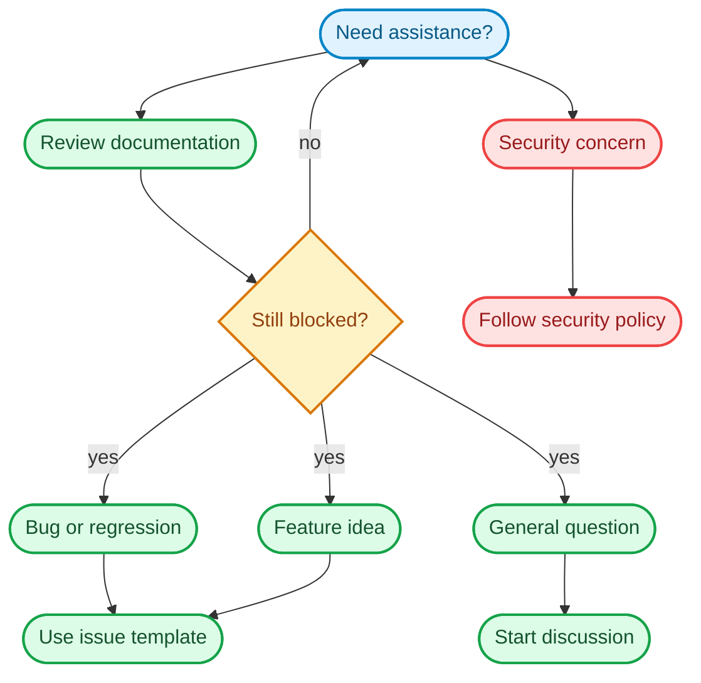

# Support

Thank you for using Uptime Watcher! This document provides information on how to get help and support.

## 🆘 Getting Help

### 📚 Documentation

Review the primary references (README, full docs, and troubleshooting guide)
before opening an issue so that straightforward configuration problems can be
resolved immediately.

### Support triage flow

First, please check our comprehensive documentation:

- **[Project README](README.md)** - Project overview and quick start
- **[Documentation directory](docs/)** - Detailed documentation and guides
- **[Troubleshooting Guide](docs/Guides/troubleshooting.md)** - Common issues and solutions

### 🐛 Reporting Bugs

If you found a bug, please:

1. Check [existing issues](https://github.com/Nick2bad4u/Uptime-Watcher/issues) to see if it's already reported
2. Create a new issue using our [bug report template](https://github.com/Nick2bad4u/Uptime-Watcher/issues/new?template=bug_report.md)
3. Include as much detail as possible (version, OS, steps to reproduce, etc.)

### 💡 Feature Requests

To request a new feature:

1. Check [existing feature requests](https://github.com/Nick2bad4u/Uptime-Watcher/issues?q=is%3Aissue+is%3Aopen+label%3Aenhancement)
2. Create a new issue using our [feature request template](https://github.com/Nick2bad4u/Uptime-Watcher/issues/new?template=feature_request.md)
3. Describe your use case and how the feature would help

### 💬 Discussions

For questions, ideas, or general discussion:

- Use [GitHub Discussions](https://github.com/Nick2bad4u/Uptime-Watcher/discussions)
- Check the [Q\&A section](https://github.com/Nick2bad4u/Uptime-Watcher/discussions/categories/q-a) for common questions

## 🤝 Community Guidelines

Please follow these guidelines when seeking support:

### ✅ Do

- Be respectful and patient
- Provide clear, detailed information
- Search existing issues and discussions first
- Use appropriate templates when creating issues
- Include relevant system information (OS, version, etc.)
- Provide minimal reproducible examples for bugs

### ❌ Don't

- Use issues for general questions (use Discussions instead)
- Open duplicate issues
- Ask for urgent fixes or timeline commitments
- Include sensitive information (passwords, API keys, etc.)

## 🔧 Self-Help Resources

### Common Issues

1. **Application won't start**: Check Node.js version (>=24.8.0 required)
2. **Build failures**: Try `npm clean-install` to refresh dependencies
3. **Test failures**: Ensure you're using the correct Node.js version
4. **Electron issues**: Check our [Electron troubleshooting guide](docs/Guides/troubleshooting.md)

### Development Setup

1. Clone the repository
2. Run `npm install --force` to install dependencies
3. Use `npm run build` to compile the project
4. Run `npm start` to launch the application

## 📞 Contact Information

### Project Maintainer

- **Nick2bad4u** - [@Nick2bad4u](https://github.com/Nick2bad4u)
- Email: <20943337+Nick2bad4u@users.noreply.github.com>

### Response Times

- **Bug reports**: We aim to respond within 48 hours
- **Feature requests**: We review these weekly
- **Security issues**: Please follow our [security policy](SECURITY.md)

## 🏷️ Issue Labels

We use these labels to organize issues:

- `bug` - Something isn't working
- `enhancement` - New feature or request
- `documentation` - Improvements or additions to documentation
- `good first issue` - Good for newcomers
- `help wanted` - Extra attention is needed
- `question` - Further information is requested

## 📈 Contributing

If you'd like to help improve Uptime Watcher:

- Read our [contributing guidelines](CONTRIBUTING.md)
- Check issues labeled `good first issue` or `help wanted`
- Join discussions about new features and improvements

## 🛡️ Security

For security-related issues, please follow our [Security Policy](SECURITY.md) rather than opening a public issue.

---

Thank you for being part of the Uptime Watcher community! 🚀
