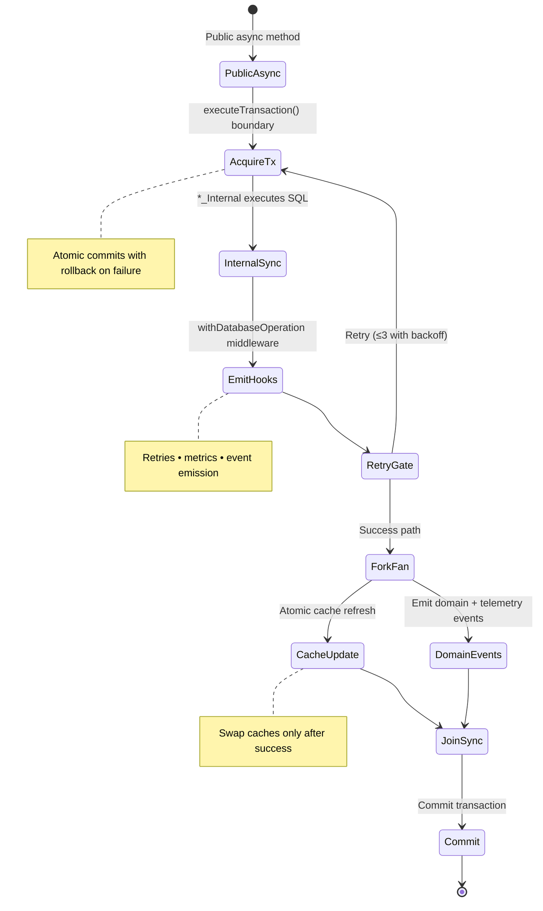

# ADR-001: Repository Pattern for Database Access

## Table of Contents

1. [Status](#status)
2. [Context](#context)
3. [Decision](#decision)
4. [Consequences](#consequences)
5. [Implementation Quality Assurance](#implementation-quality-assurance)
6. [Compliance](#compliance)
7. [Related ADRs](#related-adrs)

## Status

**Accepted** - Implemented across all database operations with standardized transaction boundaries, typed queries/mappers, and consistent retry + observability hooks.

## Context

The application needed a consistent, testable, and transaction-safe approach to database operations. Direct database access throughout the codebase would lead to:

- Inconsistent error handling
- Difficult testing due to tight coupling
- Lack of transaction safety
- Code duplication
- Race conditions in concurrent data access
- Poor separation of concerns between business logic and data access

## Decision

We will use the **Repository Pattern** for all database access with the following characteristics:

### Repository operation lifecycle



### 1. Dual Method Pattern

- **Public async methods** that own their transaction boundary (`deleteAll()`)
- **Internal methods** that accept an active `Database` handle and execute synchronously (`deleteAllInternal(db)`)

> **Repository evolution note:** Some newer flows use a _transaction adapter_ object (a small interface that exposes the internal sync operations) to avoid passing `db` across multiple call sites. The contract is the same: **public methods create the transaction boundary; internal methods run within it**.

### 2. Enhanced Transaction Safety

- All mutations wrapped in `DatabaseService.executeTransaction()` (including nested-transaction isolation via SQLite `SAVEPOINT` when already in a transaction).
- Mutating repository entrypoints wrap the transactional operation with `withDatabaseOperation()` for standardized retry/backoff + structured logging.
- **Important correctness nuance:** node-sqlite3-wasm exposes _synchronous_ SQLite calls, which avoids multi-threaded statement interleaving, but it does **not** magically remove application-level race conditions. Correctness still depends on:
  - keeping multi-step writes inside a single transaction boundary, and
  - using idempotent writes (e.g. `INSERT OR IGNORE`, `INSERT OR REPLACE`) or explicit uniqueness constraints where appropriate.
- Cache updates (when present) must be applied **after** a successful transaction commit (or treated as an invalidation-only cache) so the renderer never observes partial state.

> **Observability note:** `withDatabaseOperation()` only emits lifecycle events when an event emitter is explicitly provided. Most repositories use it primarily for retry + logging; services that need telemetry can pass the shared backend event emitter.

### 3. Consistent Structure

<!-- prettier-ignore -->

````typescript

import type { Database } from "node-sqlite3-wasm";
import { withDatabaseOperation } from "@electron/utils/operationalHooks";
import type { DatabaseService } from "@electron/services/database/DatabaseService";

/**
 * Example repository demonstrating the standard repository pattern
 * implementation.
 *
 * @remarks
 *   This repository follows the dual method pattern with public async methods
 *   that create transactions and internal sync methods for use within existing
 *   transaction contexts. All database operations are wrapped with proper error
 *   handling. Lifecycle event emission is optional and enabled only when an
 *   event emitter is passed to {@link withDatabaseOperation}.
 *
 * @example
 *  ```typescript
 *  const repository = new ExampleRepository({ databaseService });
 *
 *  // Public async method - creates its own transaction
 *  await repository.bulkInsert([data1, data2]);
 *
 *  // Internal sync method - used within existing transaction
 *  await databaseService.executeTransaction((db) => {
 *   repository.bulkInsertInternal(db, [data1, data2]);
 *   // other operations...
 *  });
 *  ```;
 *
 * @public
 */
export class ExampleRepository {
 /**
  * Database service instance for executing database operations.
  *
  * @private
  *
  * @readonly
  */
 private readonly databaseService: DatabaseService;

 /**
  * Creates a new ExampleRepository instance.
  *
  * @example
  *  ```typescript
  *
  *
  *
  *
  *  const repository = new ExampleRepository({
  *   databaseService: serviceContainer.getDatabaseService(),
  *  });
  *  ```;
  *
  * @param dependencies - Required dependencies for repository operations
  * @param dependencies.databaseService - The {@link DatabaseService} instance
  *   for database access
  */
 constructor(dependencies: ExampleRepositoryDependencies) {
  this.databaseService = dependencies.databaseService;
 }

 /**
  * Bulk inserts multiple records into the database.
  *
  * @remarks
  *   This is a public async method that creates its own database transaction.
  *   Uses {@link withDatabaseOperation} for retry logic and event emission. For
  *   use within existing transactions, use {@link bulkInsertInternal} instead.
  *
  * @example
  *  ```typescript
  *
  *
  *
  *
  *  // Bulk insert records with automatic transaction handling
  *  await repository.bulkInsert([record1, record2, record3]);
  *  ```;
  *
  * @param records - Array of records to insert
  *
  * @returns Promise that resolves when all records are successfully inserted
  *
  * @throws {@link Error} When database operation fails or transaction cannot be
  *   completed
  *
  * @public
  *
  * @see {@link bulkInsertInternal} for transaction-internal operations
  */
 public async bulkInsert(records: ExampleRow[]): Promise<void> {
  if (records.length === 0) {
   return;
  }

    return withDatabaseOperation(
   async () =>
    this.databaseService.executeTransaction((db) => {
     this.bulkInsertInternal(db, records);
     return Promise.resolve();
    }),
   "ExampleRepository.bulkInsert"
  );
 }

 /**
  * Bulk inserts multiple records within an existing transaction context.
  *
  * @remarks
  *   This is an internal sync method designed for use within existing database
  *   transactions. Uses prepared statements for optimal performance with large
  *   datasets. Does not create its own transaction - must be called within a
  *   transaction context.
  *
  * @example
  *  ```typescript
  *
  *
  *
  *
  *  // Use within an existing transaction
  *  await databaseService.executeTransaction((db) => {
  *   repository.bulkInsertInternal(db, records);
  *   // other transactional operations...
  *  });
  *  ```;
  *
  * @param db - The active {@link Database} connection within a transaction
  * @param records - Array of records to insert
  *
  * @throws {@link Error} When the SQL execution fails
  *
  * @public
  *
  * @see {@link bulkInsert} for standalone operation with automatic transaction
  */
 public bulkInsertInternal(db: Database, records: ExampleRow[]): void {
  const stmt = db.prepare(QUERIES.INSERT);

  try {
   for (const record of records) {
    stmt.run([record.id, record.name, record.createdAt]);
   }
   logger.debug(
    `[ExampleRepository] Bulk inserted ${records.length} records (internal)`
   );
  } finally {
   stmt.finalize();
  }
 }

 /**
  * Retrieves all records from the database.
  *
  * @remarks
  *   This is a read operation wrapped with {@link withDatabaseOperation} for
  *   consistent error handling and event emission.
  *
  * @example
  *  ```typescript
  *
  *
  *
  *
  *  const allRecords = await repository.findAll();
  *  ```;
  *
  * @returns Promise resolving to array of all records
  *
  * @throws {@link Error} When database operation fails
  *
  * @public
  */
 public async findAll(): Promise<ExampleRow[]> {
    return withDatabaseOperation(
     () => {
        const db = this.getDb();
        return Promise.resolve(db.all(QUERIES.SELECT_ALL) as ExampleRow[]);
     },
     "ExampleRepository.findAll"
    );
 }

 /**
  * Deletes all records from the repository table.
  *
  * @remarks
  *   This is a public async method that creates its own database transaction.
  *   Uses {@link withDatabaseOperation} for retry logic and event emission. For
  *   use within existing transactions, use {@link deleteAllInternal} instead.
  *
  * @example
  *  ```typescript
  *
  *
  *
  *
  *  // Delete all records with automatic transaction handling
  *  await repository.deleteAll();
  *  ```;
  *
  * @returns Promise that resolves when all records are successfully deleted
  *
  * @throws {@link Error} When database operation fails or transaction cannot be
  *   completed
  *
  * @public
  *
  * @see {@link deleteAllInternal} for transaction-internal operations
  */
 public async deleteAll(): Promise<void> {
  return withDatabaseOperation(
   async () =>
    this.databaseService.executeTransaction((db) => {
     this.deleteAllInternal(db);
     return Promise.resolve();
    }),
   "ExampleRepository.deleteAll"
  );
 }

 /**
  * Deletes all records from the repository table within an existing transaction
  * context.
  *
  * @remarks
  *   This is an internal sync method designed for use within existing database
  *   transactions. Does not create its own transaction - must be called within
  *   a transaction context. Logs debug information about the operation
  *   completion.
  *
  * @example
  *  ```typescript
  *
  *
  *
  *
  *  // Use within an existing transaction
  *  await databaseService.executeTransaction((db) => {
  *   repository.deleteAllInternal(db);
  *   // other transactional operations...
  *  });
  *  ```;
  *
  * @param db - The active {@link Database} connection within a transaction
  *
  * @throws {@link Error} When the SQL execution fails
  *
  * @public
  *
  * @see {@link deleteAll} for standalone operation with automatic transaction
  */
 public deleteAllInternal(db: Database): void {
  db.run(QUERIES.DELETE_ALL);
  logger.debug("[ExampleRepository] All records deleted (internal)");
 }

 /**
  * Gets the current database connection instance.
  *
  * @remarks
  *   Provides access to the underlying database connection through the database
  *   service. Should be used sparingly and only when the repository pattern
  *   methods are insufficient.
  *
  * @private
  *
  * @example
  *  ```typescript
  *
  *
  *
  *
  *  const db = repository.getDb();
  *  // Use for complex queries not covered by repository methods
  *  ```;
  *
  * @returns The active {@link Database} connection instance
  */
 private getDb(): Database {
  return this.databaseService.getDatabase();
 }
}

/**
 * Interface representing a data row structure.
 */
interface ExampleRow {
 /** Unique identifier for the record */
 id: string;
 /** Display name of the record */
 name: string;
 /** Creation timestamp */
 createdAt: number;
}

/**
 * Dependencies required for {@link ExampleRepository} instantiation.
 *
 * @remarks
 *   Defines the dependency injection contract for the repository, ensuring proper
 *   service availability and testability.
 *
 * @public
 */
interface ExampleRepositoryDependencies {
 /**
  * Database service instance for executing database operations.
  *
  * @remarks
  *   Must be a properly initialized {@link DatabaseService} with an active
  *   database connection.
  */
 readonly databaseService: DatabaseService;
}

/**
 * Centralized SQL query constants for the example repository.
 *
 * @remarks
 *   Prevents SQL duplication across repository methods and improves
 *   maintainability. All queries should be defined here rather than inline in
 *   methods.
 *
 * @private
 */
const QUERIES = {
 /**
  * SQL query to insert a single record.
  */
 INSERT: "INSERT INTO example_table (id, name, createdAt) VALUES (?, ?, ?)",

 /**
  * SQL query to select all records.
  */
 SELECT_ALL:
  "SELECT id, name, createdAt FROM example_table ORDER BY createdAt DESC",

 /**
  * SQL query to delete all records from the repository table.
  *
  * @defaultValue "DELETE FROM example_table"
  */
 DELETE_ALL: "DELETE FROM example_table",
} as const;
````

### 4. Query Constants

- Centralized query strings in constants object
- Prevents SQL duplication and improves maintainability

### 5. Package Boundaries and Dependency Rules

- The SQLite driver (`node-sqlite3-wasm`) and all direct SQL execution live in **Electron main** only under `electron/services/database/**`.
- The renderer (`src/**`) must never import or depend on database code. Renderer state changes happen via **IPC** (see ADR-005) and renderer events (see ADR-002).
- Cross-process contracts (types, event payload shapes, IPC channel registries, Zod schemas/guards) live in **shared** (`shared/**`).
- `shared/**` must remain environment-agnostic: it must not import Electron modules or Node-only APIs.

### 6. Testing Abstractions and Required Coverage

- Repository tests are **integration-first** (Vitest) and should exercise the real SQLite driver wherever practical.
- Transaction semantics must be covered, including:
  - commit vs rollback,
  - nested transactions (SAVEPOINT),
  - retries on transient `SQLITE_BUSY` / `SQLITE_LOCKED` (handled by `DatabaseService.executeTransaction`).
- Property-based tests (fast-check) are recommended for:
  - mapper round-trips (row <-> domain conversions),
  - idempotent operations (repeating writes yields stable results).

## Consequences

### Positive

- **Consistent error handling** across all database operations
- **Easy testing** through dependency injection and mocking
- **Enhanced transaction safety** prevents data corruption and race conditions
- **Clear separation** between transactional and non-transactional operations
- **Retry logic** and event emission through operational hooks
- **Race condition prevention** through synchronous database operations (node-sqlite3-wasm)
- **Atomic cache updates** ensure data consistency during concurrent access
- **Comprehensive logging** and monitoring of all database operations

### Negative

- **Slight complexity increase** with dual method pattern
- **Learning curve** for developers unfamiliar with repository pattern
- **Additional abstraction layer** may seem unnecessary for simple operations

## Implementation Quality Assurance

### Race Condition Prevention

- **Synchronous Statements**: node-sqlite3-wasm executes statements synchronously, preventing concurrent statement execution on the same connection.
- **Atomic Transactions**: BEGIN/COMMIT/ROLLBACK provide atomicity for multi-statement mutations.
- **Concurrency correctness**: application-level correctness is enforced via transaction boundaries, idempotent writes, and explicit uniqueness constraints.

### Memory Management

- **Proper Cleanup**: All repositories implement proper resource cleanup
- **Event Listener Management**: Event emissions are handled asynchronously with proper error handling
- **Connection management**: Single database connection managed by `DatabaseService` singleton.

## Compliance

All repository classes implement this pattern:

- `SiteRepository`
- `MonitorRepository`
- `HistoryRepository`
- `SettingsRepository`

### Current Implementation Audit (2025-11-04)

- Verified `electron/services/database/SiteRepository.ts`, `MonitorRepository.ts`, `HistoryRepository.ts`, and `SettingsRepository.ts` all expose public async APIs that wrap `executeTransaction()` and delegate to `_Internal` helpers.
- Confirmed `withDatabaseOperation` usage throughout the repositories to capture retries, logging, and event emission.
- Checked `electron/services/database/SiteRepositoryService.ts` to ensure cache swaps still happen only after successful commits, maintaining the atomic update guarantees described above.

## Related ADRs

- [ADR-002: Event-Driven Architecture](./ADR_002_EVENT_DRIVEN_ARCHITECTURE.md)
- [ADR-003: Error Handling Strategy](./ADR_003_ERROR_HANDLING_STRATEGY.md)
