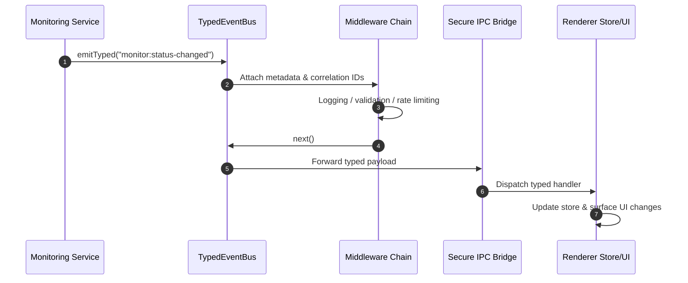

# ADR-002: Event-Driven Architecture with TypedEventBus

## Table of Contents

1. [Status](#status)
2. [Context](#context)
3. [Decision](#decision)
4. [Architecture Flow](#architecture-flow)
5. [Event Categories](#event-categories)
6. [Consequences](#consequences)
7. [Quality Assurance](#quality-assurance)
8. [Implementation Requirements](#implementation-requirements)
9. [Compliance](#compliance)
10. [Related ADRs](#related-adrs)

## Status

**Accepted** - Core communication mechanism with advanced middleware and memory management

## Context

The application needed a way to decouple components and enable reactive communication between:

- Backend services and frontend UI
- Different services within the backend
- Multiple UI components reacting to state changes
- Cross-cutting concerns like logging, monitoring, and error handling

Traditional direct method calls would create tight coupling, make the system difficult to extend and test, and provide no mechanism for monitoring or debugging inter-component communication.

## Decision

We will use an **Event-Driven Architecture** based on a custom `TypedEventBus` with the following characteristics:

### Event propagation overview



### 1. Enhanced Type Safety

```typescript
interface UptimeEvents extends Record<string, unknown> {
 "sites:added": {
  site: Site;
  timestamp: number;
  correlationId: string;
 };
 "monitor:status-changed": {
  monitor: Monitor;
  newStatus: "up" | "down";
  previousStatus: "up" | "down";
  timestamp: number;
  responseTime?: number;
  error?: string;
 };
 "database:transaction-completed": {
  duration: number;
  operation: string;
  success: boolean;
  timestamp: number;
 };
 "system:error": {
  error: Error;
  context: string;
  severity: "low" | "medium" | "high" | "critical";
  recovery?: string;
  timestamp: number;
 };
}

// Usage with compile-time type checking
await eventBus.emitTyped("sites:added", {
 site: newSite,
 timestamp: Date.now(),
 correlationId: generateCorrelationId(),
});
```

### 2. Advanced Metadata and Correlation

- **Unique correlation IDs** for request tracing across system boundaries
- **Automatic timestamps** for event ordering and debugging
- **Bus identification** for multi-bus architectures
- **Event metadata** enrichment for comprehensive monitoring

### 3. Consistent Event Naming

- **Domain-based naming**: `domain:action` (e.g., `sites:added`, `monitor:status-changed`)
- **Hierarchical structure**: Major category followed by specific action
- **Past tense verbs** for completed actions

### 4. Production-Ready Middleware Support

```typescript
// Logging middleware with correlation tracking
eventBus.use(async (eventName, data, next) => {
 const correlationId = data._meta?.correlationId;
 logger.debug(`[Event] ${eventName} [${correlationId}]`, data);
 await next();
 logger.debug(`[Event] ${eventName} completed [${correlationId}]`);
});

// Rate limiting middleware
eventBus.use(
 createRateLimitMiddleware({
  maxEventsPerSecond: 100,
  burstLimit: 10,
  onRateLimit: ({ event, reason }) => {
   logger.warn(`Rate limit exceeded for ${event} (${reason})`);
  },
 })
);

// Validation middleware
eventBus.use(
 createValidationMiddleware({
  "monitor:status-changed": (data) => validateMonitorStatusData(data),
  "sites:added": (data) => validateSiteData(data),
 })
);
```

### 5. Memory-Safe IPC Event Forwarding

Events are automatically forwarded from backend to frontend with proper cleanup:

```typescript
// Backend emits event with automatic IPC forwarding
await this.eventBus.emitTyped("monitor:status-changed", eventData);

// Frontend receives with automatic cleanup functions
import { EventsService } from "src/services/EventsService";

const registerMonitorUpdates = async () =>
 await EventsService.onMonitorStatusChanged((data) => {
  monitorStore.applyStatusUpdate(data);
 });

// Later in component cleanup
useEffect(() => {
 let cleanup: (() => void) | undefined;

 void registerMonitorUpdates().then((unsubscribe) => {
  cleanup = unsubscribe;
 });

 return () => {
  cleanup?.();
 };
}, []);
```

### 6. Advanced Memory Management

- **Max listeners**: Configurable limit (default: 50) prevents memory leaks
- **Automatic cleanup**: All event listeners provide cleanup functions
- **Middleware limits**: Configurable middleware chain size (default: 20)
- **Event validation**: Type-safe event structures prevent runtime errors

## Architecture Flow

```mermaid
Backend Service → TypedEventBus → IPC → Frontend Store → UI Update
     ↓
Other Backend Services (via event listeners)
```

## Event Categories

### 1. Site Events

**Public Events:**

- `site:added` - When a site is successfully added
- `site:updated` - When site properties are modified
- `site:removed` - When a site is deleted
- `sites:state-synchronized` - When frontend and backend state are synchronized

_Historical note_: the former `site:cache-updated` and `site:cache-miss`
topics were retired in favor of the internal namespace. Cache telemetry now
flows exclusively through those internal channels and the orchestrator
converts them into the canonical `cache:invalidated` broadcast when the
renderer must react.

**Internal Events:**

- `internal:site:added` - Internal site creation events
- `internal:site:updated` - Internal site modification events
- `internal:site:removed` - Internal site deletion events
- `internal:site:cache-updated` - Internal cache management
- `internal:site:cache-miss` - Internal cache lookup miss telemetry
- `internal:site:start-monitoring-requested` - Internal monitoring control
- `internal:site:stop-monitoring-requested` - Internal monitoring control
- `internal:site:restart-monitoring-requested` - Internal monitoring control
- `internal:site:restart-monitoring-response` - Internal monitoring responses
- `internal:site:is-monitoring-active-requested` - Internal status queries
- `internal:site:is-monitoring-active-response` - Internal status responses

> **Emission flow:** `SiteManager` emits only `internal:site:*` topics. The
> `UptimeOrchestrator` enriches those payloads and rebroadcasts any
> renderer-facing `site:*` events, translating cache telemetry into the
> canonical `cache:invalidated` pipeline when appropriate.

### 2. Monitor Events

**Public Events:**

- `monitor:added` - When a monitor is created
- `monitor:removed` - When a monitor is deleted
- `monitor:status-changed` - When monitor status changes
- `monitor:up` - When monitor detects service is online
- `monitor:down` - When monitor detects service is offline
- `monitor:check-completed` - When a health check finishes

**Internal Events:**

- `internal:monitor:started` - Internal monitor activation
- `internal:monitor:stopped` - Internal monitor deactivation
- `internal:monitor:all-started` - When all monitors are activated
- `internal:monitor:all-stopped` - When all monitors are deactivated
- `internal:monitor:manual-check-completed` - Manual check results

> **Emission flow:** `MonitorManager` raises `internal:monitor:*` events for
> lifecycle transitions and continues to emit high-frequency telemetry such as
> `monitor:status-changed` directly. The `UptimeOrchestrator` translates the
> lifecycle events into `monitoring:*` plus the canonical `cache:invalidated`
> broadcasts (using `{ type: "all" }` for global transitions).

- `internal:monitor:site-setup-completed` - Site monitor setup completion

### 3. Database Events

- `database:transaction-completed` - When database transactions finish
- `database:error` - When database operations fail
- `database:success` - When database operations succeed
- `database:retry` - When database operations are retried
- `database:backup-created` - When database backups are created

**Internal Database Events:**

- `internal:database:initialized` - Database initialization completion
- `internal:database:data-exported` - Data export completion
- `internal:database:data-imported` - Data import completion
- `internal:database:backup-downloaded` - Backup download completion
- `internal:database:history-limit-updated` - History retention changes
- `internal:database:sites-refreshed` - Site data refresh
- `internal:database:get-sites-from-cache-requested` - Cache requests
- `internal:database:get-sites-from-cache-response` - Cache responses
- `internal:database:update-sites-cache-requested` - Cache update requests

### 4. System Events

- `monitoring:started` - When monitoring system starts
- `monitoring:stopped` - When monitoring system stops
- `system:startup` - Application startup
- `system:shutdown` - Application shutdown
- `system:error` - System-level errors

### 5. Performance and Configuration Events

- `performance:metric` - Performance measurements
- `performance:warning` - Performance threshold alerts
- `config:changed` - Configuration changes
- `cache:invalidated` - Cache invalidation events

### Event Summary Table (Public Events)

The following table summarizes the primary public events by domain. Internal
events (`internal:*`) are documented inline in the sections above and are
omitted here for brevity.

| Domain              | Event name                       | Description                                           |
| ------------------- | -------------------------------- | ----------------------------------------------------- |
| Site                | `site:added`                     | When a site is successfully added.                    |
| Site                | `site:updated`                   | When site properties are modified.                    |
| Site                | `site:removed`                   | When a site is deleted.                               |
| Site / State Sync   | `sites:state-synchronized`       | When frontend and backend site state are synchronized |
| Monitor             | `monitor:added`                  | When a monitor is created.                            |
| Monitor             | `monitor:removed`                | When a monitor is deleted.                            |
| Monitor             | `monitor:status-changed`         | When monitor status changes.                          |
| Monitor             | `monitor:up`                     | When a monitor detects service is online.             |
| Monitor             | `monitor:down`                   | When a monitor detects service is offline.            |
| Monitor             | `monitor:check-completed`        | When a health check finishes.                         |
| Database            | `database:transaction-completed` | When database transactions finish.                    |
| Database            | `database:error`                 | When database operations fail.                        |
| Database            | `database:success`               | When database operations succeed.                     |
| Database            | `database:retry`                 | When database operations are retried.                 |
| Database            | `database:backup-created`        | When database backups are created.                    |
| System / Monitoring | `monitoring:started`             | When the monitoring system starts.                    |
| System / Monitoring | `monitoring:stopped`             | When the monitoring system stops.                     |
| System              | `system:startup`                 | Application startup.                                  |
| System              | `system:shutdown`                | Application shutdown.                                 |
| System              | `system:error`                   | System-level errors.                                  |
| Performance         | `performance:metric`             | Performance measurements.                             |
| Performance         | `performance:warning`            | Performance threshold alerts.                         |
| Configuration       | `config:changed`                 | Configuration changes.                                |
| Cache               | `cache:invalidated`              | Cache invalidation events.                            |

> **Event catalog note:** The table above intentionally focuses on the
> externally relevant public events. The authoritative event payload types
> live in `shared/types/events.ts` and the Electron event bus definitions.
> Long term, a generated event catalog (similar to
> `docs/Architecture/generated/IPC_CHANNEL_INVENTORY.md` for IPC channels)
> may be introduced to keep this table and the code-level contracts perfectly
> synchronized.

## Consequences

### Positive

- **Decoupled architecture** - Components don't need direct references
- **Enhanced type safety** - Compile-time checking prevents runtime errors
- **Extensibility** - Easy to add new event listeners without modifying emitters
- **Advanced debugging** - Correlation IDs and metadata enable comprehensive request tracing
- **Superior testability** - Easy to mock and verify event emissions
- **Memory safety** - Automatic cleanup and configurable limits prevent leaks
- **Production monitoring** - Middleware enables comprehensive observability
- **Cross-cutting concerns** - Logging, validation, and rate limiting handled declaratively

### Negative

- **Initial complexity** - Indirect flow can be harder to follow initially
- **Minimal performance overhead** - Event processing adds negligible latency
- **Learning curve** - Developers need to understand event-driven patterns
- **Debugging complexity** - Async event flows require correlation tracking

## Quality Assurance

### Memory Management

- **Automatic cleanup**: All event listeners return cleanup functions
- **Configurable limits**: Max listeners and middleware prevent resource exhaustion
- **Leak prevention**: Proper cleanup in component unmount lifecycle

### Error Handling

- **Middleware isolation**: Errors in one middleware don't affect others
- **Event validation**: Type-safe structures prevent runtime errors
- **Error propagation**: Failed events don't crash the event bus

### Performance

- **Rate limiting**: Middleware prevents event flooding
- **Efficient forwarding**: IPC events use optimized serialization
- **Minimal overhead**: Event processing designed for production use

## Implementation Requirements

### Event Emission

```typescript
// In services/managers
await this.eventBus.emitTyped("domain:action", {
 // Event-specific data
 timestamp: Date.now(),
 // ... other properties
});
```

### Event Listening

```typescript
// Type-safe event listening
eventBus.onTyped("domain:action", (data) => {
 // data is properly typed
 // _meta is automatically available
});
```

### IPC Integration

```typescript
// Automatic forwarding in IpcService
private async forwardEventToRenderer(eventName: string, data: unknown) {
    this.webContents?.send(eventName, data);
}
```

## Compliance

All communication follows this pattern:

- Service layer emits domain events
- UI components listen to events via IPC
- Database operations emit lifecycle events
- Error handling emits failure events

### Current Implementation Audit (2025-11-04)

- Inspected `electron/events/TypedEventBus.ts` to confirm middleware, correlation metadata, and type-safe emit/on helpers remain the single event backbone.
- Verified `electron/services/ipc/utils.ts` uses `registerStandardizedIpcHandler` to forward events and rejects duplicate registrations, matching the standardized gateway described here.
- Checked `electron/preload/domains/eventsApi.ts` and `src/services/events/EventsService.ts` to ensure renderer subscriptions still traverse the preload bridge with validated cleanup handlers.

## Related ADRs

- [ADR-001: Repository Pattern](./ADR_001_REPOSITORY_PATTERN.md)
- [ADR-003: Error Handling Strategy](./ADR_003_ERROR_HANDLING_STRATEGY.md)
- [ADR-004: Frontend State Management](./ADR_004_FRONTEND_STATE_MANAGEMENT.md)
