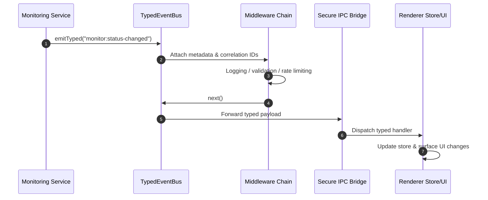

# ADR-002: Event-Driven Architecture with TypedEventBus

## Status

__Accepted__ - Core communication mechanism with advanced middleware and memory management

## Context

The application needed a way to decouple components and enable reactive communication between:

* Backend services and frontend UI
* Different services within the backend
* Multiple UI components reacting to state changes
* Cross-cutting concerns like logging, monitoring, and error handling

Traditional direct method calls would create tight coupling, make the system difficult to extend and test, and provide no mechanism for monitoring or debugging inter-component communication.

## Decision

We will use an __Event-Driven Architecture__ based on a custom `TypedEventBus` with the following characteristics:

### Event propagation overview



### 1. Enhanced Type Safety

```typescript
interface UptimeEvents extends Record<string, unknown> {
 "sites:added": {
  site: Site;
  timestamp: number;
  correlationId: string;
 };
 "monitor:status-changed": {
  monitor: Monitor;
  newStatus: "up" | "down";
  previousStatus: "up" | "down";
  timestamp: number;
  responseTime?: number;
  error?: string;
 };
 "database:transaction-completed": {
  duration: number;
  operation: string;
  success: boolean;
  timestamp: number;
 };
 "system:error": {
  error: Error;
  context: string;
  severity: "low" | "medium" | "high" | "critical";
  recovery?: string;
  timestamp: number;
 };
}

// Usage with compile-time type checking
await eventBus.emitTyped("sites:added", {
 site: newSite,
 timestamp: Date.now(),
 correlationId: generateCorrelationId(),
});
```

### 2. Advanced Metadata and Correlation

* __Unique correlation IDs__ for request tracing across system boundaries
* __Automatic timestamps__ for event ordering and debugging
* __Bus identification__ for multi-bus architectures
* __Event metadata__ enrichment for comprehensive monitoring

### 3. Consistent Event Naming

* __Domain-based naming__: `domain:action` (e.g., `sites:added`, `monitor:status-changed`)
* __Hierarchical structure__: Major category followed by specific action
* __Past tense verbs__ for completed actions

### 4. Production-Ready Middleware Support

```typescript
// Logging middleware with correlation tracking
eventBus.use(async (eventName, data, next) => {
 const correlationId = data._meta?.correlationId;
 logger.debug(`[Event] ${eventName} [${correlationId}]`, data);
 await next();
 logger.debug(`[Event] ${eventName} completed [${correlationId}]`);
});

// Rate limiting middleware
eventBus.use(
 createRateLimitMiddleware({
  maxEventsPerSecond: 100,
  burstLimit: 10,
  onRateLimit: (eventName, data) => {
   logger.warn(`Rate limit exceeded for ${eventName}`);
  },
 })
);

// Validation middleware
eventBus.use(
 createValidationMiddleware({
  "monitor:status-changed": (data) => validateMonitorStatusData(data),
  "sites:added": (data) => validateSiteData(data),
 })
);
```

### 5. Memory-Safe IPC Event Forwarding

Events are automatically forwarded from backend to frontend with proper cleanup:

```typescript
// Backend emits event with automatic IPC forwarding
await this.eventBus.emitTyped("monitor:status-changed", eventData);

// Frontend receives with automatic cleanup functions
import { EventsService } from "src/services/EventsService";

const registerMonitorUpdates = async () =>
 await EventsService.onMonitorStatusChanged((data) => {
  monitorStore.applyStatusUpdate(data);
 });

// Later in component cleanup
useEffect(() => {
 let cleanup: (() => void) | undefined;

 void registerMonitorUpdates().then((unsubscribe) => {
  cleanup = unsubscribe;
 });

 return () => {
  cleanup?.();
 };
}, []);
```

### 6. Advanced Memory Management

* __Max listeners__: Configurable limit (default: 50) prevents memory leaks
* __Automatic cleanup__: All event listeners provide cleanup functions
* __Middleware limits__: Configurable middleware chain size (default: 20)
* __Event validation__: Type-safe event structures prevent runtime errors

## Architecture Flow

```mermaid
Backend Service → TypedEventBus → IPC → Frontend Store → UI Update
     ↓
Other Backend Services (via event listeners)
```

## Event Categories

### 1. Site Events

__Public Events:__

* `site:added` - When a site is successfully added
* `site:updated` - When site properties are modified
* `site:removed` - When a site is deleted
* `sites:state-synchronized` - When frontend and backend state are synchronized

*Historical note*: the former `site:cache-updated` and `site:cache-miss`
topics were retired in favor of the internal namespace. Cache telemetry now
flows exclusively through those internal channels and the orchestrator
converts them into the canonical `cache:invalidated` broadcast when the
renderer must react.

__Internal Events:__

* `internal:site:added` - Internal site creation events
* `internal:site:updated` - Internal site modification events
* `internal:site:removed` - Internal site deletion events
* `internal:site:cache-updated` - Internal cache management
* `internal:site:cache-miss` - Internal cache lookup miss telemetry
* `internal:site:start-monitoring-requested` - Internal monitoring control
* `internal:site:stop-monitoring-requested` - Internal monitoring control
* `internal:site:restart-monitoring-requested` - Internal monitoring control
* `internal:site:restart-monitoring-response` - Internal monitoring responses
* `internal:site:is-monitoring-active-requested` - Internal status queries
* `internal:site:is-monitoring-active-response` - Internal status responses

> __Emission flow:__ `SiteManager` emits only `internal:site:*` topics. The
> `UptimeOrchestrator` enriches those payloads and rebroadcasts any
> renderer-facing `site:*` events, translating cache telemetry into the
> canonical `cache:invalidated` pipeline when appropriate.

### 2. Monitor Events

__Public Events:__

* `monitor:added` - When a monitor is created
* `monitor:removed` - When a monitor is deleted
* `monitor:status-changed` - When monitor status changes
* `monitor:up` - When monitor detects service is online
* `monitor:down` - When monitor detects service is offline
* `monitor:check-completed` - When a health check finishes

__Internal Events:__

* `internal:monitor:started` - Internal monitor activation
* `internal:monitor:stopped` - Internal monitor deactivation
* `internal:monitor:all-started` - When all monitors are activated
* `internal:monitor:all-stopped` - When all monitors are deactivated
* `internal:monitor:manual-check-completed` - Manual check results

> __Emission flow:__ `MonitorManager` raises `internal:monitor:*` events for
> lifecycle transitions and continues to emit high-frequency telemetry such as
> `monitor:status-changed` directly. The `UptimeOrchestrator` translates the
> lifecycle events into `monitoring:*` plus the canonical `cache:invalidated`
> broadcasts (using `{ type: "all" }` for global transitions).

* `internal:monitor:site-setup-completed` - Site monitor setup completion

### 3. Database Events

* `database:transaction-completed` - When database transactions finish
* `database:error` - When database operations fail
* `database:success` - When database operations succeed
* `database:retry` - When database operations are retried
* `database:backup-created` - When database backups are created

__Internal Database Events:__

* `internal:database:initialized` - Database initialization completion
* `internal:database:data-exported` - Data export completion
* `internal:database:data-imported` - Data import completion
* `internal:database:backup-downloaded` - Backup download completion
* `internal:database:history-limit-updated` - History retention changes
* `internal:database:sites-refreshed` - Site data refresh
* `internal:database:get-sites-from-cache-requested` - Cache requests
* `internal:database:get-sites-from-cache-response` - Cache responses
* `internal:database:update-sites-cache-requested` - Cache update requests

### 4. System Events

* `monitoring:started` - When monitoring system starts
* `monitoring:stopped` - When monitoring system stops
* `system:startup` - Application startup
* `system:shutdown` - Application shutdown
* `system:error` - System-level errors

### 5. Performance and Configuration Events

* `performance:metric` - Performance measurements
* `performance:warning` - Performance threshold alerts
* `config:changed` - Configuration changes
* `cache:invalidated` - Cache invalidation events

## Consequences

### Positive

* __Decoupled architecture__ - Components don't need direct references
* __Enhanced type safety__ - Compile-time checking prevents runtime errors
* __Extensibility__ - Easy to add new event listeners without modifying emitters
* __Advanced debugging__ - Correlation IDs and metadata enable comprehensive request tracing
* __Superior testability__ - Easy to mock and verify event emissions
* __Memory safety__ - Automatic cleanup and configurable limits prevent leaks
* __Production monitoring__ - Middleware enables comprehensive observability
* __Cross-cutting concerns__ - Logging, validation, and rate limiting handled declaratively

### Negative

* __Initial complexity__ - Indirect flow can be harder to follow initially
* __Minimal performance overhead__ - Event processing adds negligible latency
* __Learning curve__ - Developers need to understand event-driven patterns
* __Debugging complexity__ - Async event flows require correlation tracking

## Quality Assurance

### Memory Management

* __Automatic cleanup__: All event listeners return cleanup functions
* __Configurable limits__: Max listeners and middleware prevent resource exhaustion
* __Leak prevention__: Proper cleanup in component unmount lifecycle

### Error Handling

* __Middleware isolation__: Errors in one middleware don't affect others
* __Event validation__: Type-safe structures prevent runtime errors
* __Error propagation__: Failed events don't crash the event bus

### Performance

* __Rate limiting__: Middleware prevents event flooding
* __Efficient forwarding__: IPC events use optimized serialization
* __Minimal overhead__: Event processing designed for production use

## Implementation Requirements

### Event Emission

```typescript
// In services/managers
await this.eventBus.emitTyped("domain:action", {
 // Event-specific data
 timestamp: Date.now(),
 // ... other properties
});
```

### Event Listening

```typescript
// Type-safe event listening
eventBus.onTyped("domain:action", (data) => {
 // data is properly typed
 // _meta is automatically available
});
```

### IPC Integration

```typescript
// Automatic forwarding in IpcService
private async forwardEventToRenderer(eventName: string, data: unknown) {
    this.webContents?.send(eventName, data);
}
```

## Compliance

All communication follows this pattern:

* Service layer emits domain events
* UI components listen to events via IPC
* Database operations emit lifecycle events
* Error handling emits failure events

## Related ADRs

* [ADR-001: Repository Pattern](./ADR_001_REPOSITORY_PATTERN.md)
* [ADR-003: Error Handling Strategy](./ADR_003_ERROR_HANDLING_STRATEGY.md)
* [ADR-004: Frontend State Management](./ADR_004_FRONTEND_STATE_MANAGEMENT.md)
