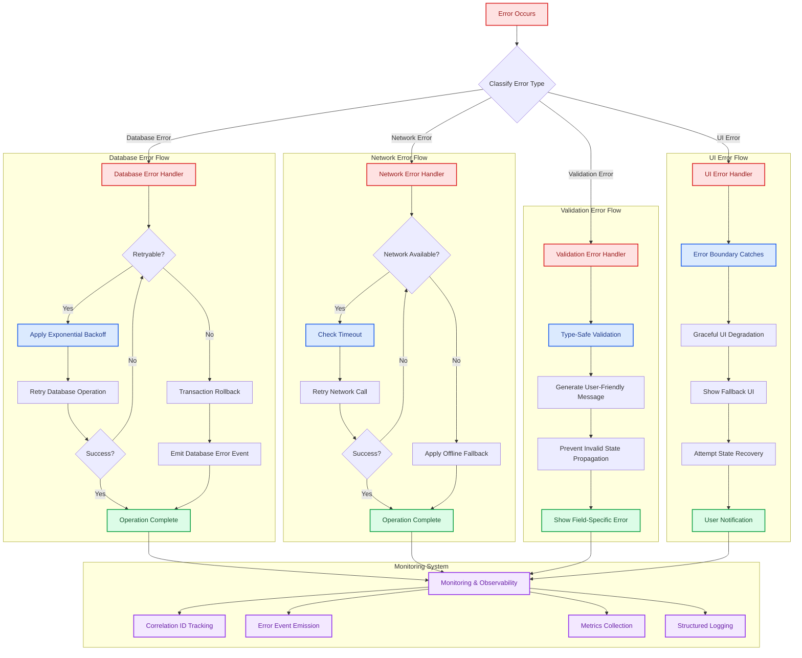

# ADR-003: Comprehensive Error Handling Strategy

## Table of Contents

1. [Status](#status)
2. [Context](#context)
3. [Decision](#decision)
4. [Error Handling Layers](#error-handling-layers)
5. [Error Categories and Handling](#error-categories-and-handling)
6. [Monitoring and Observability](#monitoring-and-observability)
7. [Consequences](#consequences)
8. [Quality Assurance](#quality-assurance)
9. [Implementation Guidelines](#implementation-guidelines)
10. [Compliance](#compliance)
11. [Related ADRs](#related-adrs)

## Status

**Accepted** - Implemented across all layers with standardized error normalization, user-facing messaging, structured logging context, and targeted retry/backoff for selected operations.

## Context

A robust error handling strategy was needed to:

- Prevent cascading failures and system crashes
- Provide consistent error reporting and user feedback
- Enable comprehensive debugging and monitoring
- Maintain application stability under error conditions
- Preserve error context and stack traces for troubleshooting
- Support production monitoring and alerting
- Handle race conditions and concurrent operation failures

## Decision

We will implement a **comprehensive multi-layered error handling strategy** with shared utilities, consistent patterns, and production-grade resilience across frontend and backend.

### 1. Enhanced Shared Error Handling Utility

The `withErrorHandling()` function provides unified error handling with context-aware overloads:

```typescript
// Frontend usage with store integration
await withErrorHandling(async () => {
 return await performAsyncOperation();
}, errorStore);

// Backend usage with logger integration and operation naming
await withErrorHandling(
 async () => {
  return await performAsyncOperation();
 },
 {
  logger,
  operationName: "database-operation",
  correlationId: "op-12345",
 }
);

// Utility operations with minimal overhead
const utilityResult = await withUtilityErrorHandling(
 async () => doUtilityWork(),
 "utility-operation",
 // When shouldThrow is false, a fallbackValue **must** be provided.
 // It will be returned when the operation fails instead of rethrowing.
 null,
 false
);
```

### 2. Typed Errors and User-Facing Messaging

We standardize on **typed errors** internally, but we only surface **sanitized** user-facing messaging to the UI.

- Use `ApplicationError` (`shared/utils/errorHandling.ts`) for domain and operational failures where we want:
  - stable machine-readable codes,
  - safe user messaging, and
  - rich internal details for logs/diagnostics.

- Use `ensureError()` / `convertError()` to normalize `unknown` throws into `Error` instances.

- Convert internal errors to UI-safe strings/details using `getUserFacingErrorDetail()` (`shared/utils/userFacingErrors.ts`) backed by the `ERROR_CATALOG`.

- Never leak secrets or raw backend stack traces to the renderer. IPC responses must return a safe message and correlation id so the user can report the failure.

- Example:

  ```typescript
  import { ApplicationError } from "@shared/utils/errorHandling";

  throw new ApplicationError("DATABASE_WRITE_FAILED", {
          operation: "site-delete",
          // Extra details for logs/diagnostics (must be safe/redacted)
          details: { identifier },
  });
  ```

### 3. Production-Grade Operational Hooks

All database operations use `withDatabaseOperation()` which provides:

- **Configurable retry logic** with exponential/linear backoff (deterministic by default; jitter can be added explicitly if needed)
- **Optional lifecycle event emission** when an event emitter is provided
- **Consistent error handling** across all database operations
- **Performance monitoring** and comprehensive logging
- **Correlation tracking** for distributed debugging
- **No circuit breaker is implemented today** (see “Future improvements” notes below)

  ```typescript
  return withDatabaseOperation(
   async () => this.databaseService.executeTransaction(operation),
   "SiteRepository.deleteAll"
  );
  ```

### 4. Frontend Store Error Protection

Frontend stores implement safe error handling to prevent UI crashes:

```typescript
import { withErrorHandling } from "@shared/utils/errorHandling";

import { SettingsService } from "@app/services/SettingsService";
import { createStoreErrorHandler } from "@app/stores/utils/storeErrorHandling";

await withErrorHandling(
 async () => {
  const historyLimit = await SettingsService.getHistoryLimit();
  // ...update store state...
  return historyLimit;
 },
 createStoreErrorHandler("settings", "getHistoryLimit")
);
```

#### 4.1 Store Error Handling Contexts

Asynchronous store actions that call renderer services use the shared
`withErrorHandling()` utility together with an `ErrorHandlingFrontendStore`
context. This context encapsulates how errors and loading state are surfaced to
the global error store while keeping individual stores free of ad-hoc
try/catch blocks.

There are two supported patterns for constructing this context:

1. **Factory-based context (default)** – use `createStoreErrorHandler()`
   for standard operations that only need to clear/set store-specific errors
   and update a loading flag.

   ```typescript
   // src/stores/utils/storeErrorHandling.ts
   export function createStoreErrorHandler(
    storeKey: string,
    operationName: string
   ): ErrorHandlingFrontendStore {
    const errorStore = useErrorStore.getState();

    return {
     clearError: () => errorStore.clearStoreError(storeKey),
     setError: (error) => errorStore.setStoreError(storeKey, error),
     setLoading: (loading) =>
      errorStore.setOperationLoading(operationName, loading),
    };
   }

   // Example: settings initialization
   const result = await withErrorHandling(
    async () => {
     const historyLimit = await SettingsService.getHistoryLimit();
     // ...update store state...
     return {
      message: "Successfully loaded settings",
      settingsLoaded: true,
      success: true,
     } as const;
    },
    createStoreErrorHandler("settings", "initializeSettings")
   );
   ```

   This pattern should be used for **most** async store operations, including
   site synchronization (`"sites-sync"`), monitoring, and general settings
   initialization/reset flows.

2. **Inline context (special cases)** – construct an
   `ErrorHandlingFrontendStore` object inline when additional side effects are
   required for a specific operation, such as reverting optimistic updates or
   coordinating multiple slices.

   ```typescript
   // Example: revert historyLimit on failure while preserving user-facing error
   await withErrorHandling(
    async () => {
     const sanitizedLimit = normalizeHistoryLimit(limit, RULES);
     getState().updateSettings({ historyLimit: sanitizedLimit });
     const backendLimit = await SettingsService.updateHistoryLimit(sanitizedLimit);
     // ...normalize and apply backendLimit...
    },
    {
     clearError: () => {
      useErrorStore.getState().clearStoreError("settings");
     },
     setError: (error) => {
      const errorStore = useErrorStore.getState();
      errorStore.setStoreError("settings", error);
      // Revert historyLimit when persistence fails
      getState().updateSettings({
       historyLimit: currentSettings.historyLimit,
      });
     },
     setLoading: (loading) => {
      useErrorStore.getState().setOperationLoading("updateHistoryLimit", loading);
     },
    }
   );
   ```

   Inline contexts are intentionally rare and **must** document their
   additional side effects (for example in the store module’s comments) so
   future maintainers understand why the factory is not used.

3. **Store-owned error slice** – **deprecated**. Stores must not introduce local `lastError` / `isLoading` state as an alternative to the global `useErrorStore`. This repository standardizes on ErrorStore-backed contexts (`createStoreErrorHandler` or a documented inline context) so errors and loading state have a single, consistent source of truth.

**Guidelines:**

- Prefer `createStoreErrorHandler()` for standard operations that only need to
  set/clear error and loading state.
- Use inline `ErrorHandlingFrontendStore` contexts when you need to coordinate
  error handling with extra behavior (rollback, cross-slice updates, telemetry
  tweaks).
- Prefer the global error store for all domain stores. If a UI surface needs a
  specialized error presentation, derive it from the global error store rather
  than introducing a second store-local error source.
- Keep error-handling logic close to the store module that owns the state,
  while centralizing shared mechanisms in `@shared/utils/errorHandling` and
  `src/stores/utils/storeErrorHandling.ts`.

### 5. Error Preservation Principle

All error handling utilities preserve original errors:

- **Stack traces** are maintained
- **Error types** are preserved
- **Error properties** remain intact
- **Re-throwing** after logging/handling

### 6. IPC Error Normalization and Sanitization

Electron IPC is a major trust boundary. We standardize IPC error behavior to ensure the renderer receives a **safe** error message and a **correlation id**, without leaking internal details.

- Main-process handlers should be registered via `registerStandardizedIpcHandler` (`electron/services/ipc/utils.ts`).
- Requests should be validated (typically via Zod) before executing service logic.
- All responses use the shared `IpcResponse<T>` envelope and include response metadata (including correlation id).
- Error messages returned to the renderer are derived via `getUserFacingErrorDetail()` and/or `createErrorResponse()`; raw stack traces remain in main-process logs only.

## Error Handling Layers

### Error Handling Architecture Overview

````mermaid
graph TB
    subgraph "Frontend (React + Zustand)"
        UI["User Interface"]
        Store["Zustand Stores"]
        Components["React Components"]
        ErrorBoundary["Error Boundaries"]
    end

    subgraph "IPC Layer"
        IPC["IPC Communication"]
        ContextBridge["Context Bridge"]
    end

    subgraph "Backend (Electron Main)"
        Services["Service Layer"]
        Repositories["Repository Layer"]
        Database["Database Layer"]
        EventBus["Event Bus"]
    end

    subgraph "Error Handling Utilities"
        WithErrorHandling["withErrorHandling"]
        WithDatabaseOp["withDatabaseOperation"]
        WithUtilityError["withUtilityErrorHandling"]
        StoreErrorHandler["createStoreErrorHandler"]
    end

    subgraph "Monitoring & Observability"
        Correlation["Correlation IDs"]
        Events["Error Events"]
        Timings["Operation Timings"]
        Logging["Structured Logging"]
    end

    UI --> Components
    Components --> Store
    Components --> ErrorBoundary
    Store --> WithErrorHandling
    Components --> WithErrorHandling

    WithErrorHandling --> IPC
    IPC --> ContextBridge
    ContextBridge --> Services

    Services --> WithDatabaseOp
    Services --> EventBus
    Repositories --> WithDatabaseOp
    WithDatabaseOp --> Database

    WithErrorHandling --> Events
    WithDatabaseOp --> Events
    WithUtilityError --> Events
    StoreErrorHandler --> Logging

    Events --> Correlation
    Events --> Timings
    Events --> Logging

    classDef frontend fill:#dbeafe,stroke:#2563eb,stroke-width:2px,color:#1e3a8a
    classDef backend fill:#dcfce7,stroke:#16a34a,stroke-width:2px,color:#14532d
    classDef utility fill:#fef3c7,stroke:#d97706,stroke-width:2px,color:#92400e
    classDef monitoring fill:#f3e8ff,stroke:#9333ea,stroke-width:2px,color:#6b21a8

    class UI,Store,Components,ErrorBoundary frontend
    class Services,Repositories,Database,EventBus backend
    class WithErrorHandling,WithDatabaseOp,WithUtilityError,StoreErrorHandler utility
    class Correlation,Events,Metrics,Logging monitoring
```

### Layer 1: Utility Level

```typescript
// Shared/frontend utilities
export async function withUtilityErrorHandling<T>(
    operation: () => Promise<T>,
    operationName: string,
    fallbackValue?: T,
    shouldThrow = false
): Promise<T> {
    try {
        return await operation();
    } catch (error) {
        const wrappedError = ensureError(error);

        // Use console logging for shared utilities to avoid logger dependencies.
        console.error(`${operationName} failed`, wrappedError);

        if (shouldThrow) {
            throw wrappedError;
        }

        if (fallbackValue === undefined) {
            throw new Error(
                `${operationName} failed and no fallback value provided. When shouldThrow is false, you must provide a fallbackValue parameter.`,
                { cause: error }
            );
        }

        return fallbackValue;
    }
}
````

### Layer 2: Repository Level

```typescript
// Database operations with transaction safety
public async deleteAll(): Promise<void> {
    return withDatabaseOperation(async () => {
        return this.databaseService.executeTransaction((db) => {
            this.deleteAllInternal(db);
            return Promise.resolve();
        });
    }, "Repository.deleteAll");
}
```

### Layer 3: Service Level

```typescript
// Service operations with event emission
async performOperation() {
    try {
        const result = await this.repository.operation();
        await this.eventBus.emitTyped('operation:completed', { result });
        return result;
    } catch (error) {
        await this.eventBus.emitTyped('operation:failed', { error: error.message });
        throw error;
    }
}
```

### Layer 4: UI Level

```typescript
// Frontend operations with store integration
import { SiteService } from "@app/services/SiteService";

const handleAction = async () => {
 await withErrorHandling(async () => {
  const result = await SiteService.addSite(siteData);
  // Success handling
  return result;
 }, errorStore);
};
```

## Error Categories and Handling

### Error Processing Pipeline



### 1. Database Errors

- **Transaction rollback** on failure
- **Retry logic** for transient failures
- **Event emission** for monitoring
- **Structured logging** with operation context

### 2. Network Errors

- **Timeout handling** with configurable limits
- **Retry strategies** based on error type
- **Fallback mechanisms** for offline scenarios
- **Connection state tracking**

### 3. Validation Errors

- **Type-safe validation** at boundaries
- **User-friendly error messages**
- **Field-specific error reporting**
- **Prevention of invalid state propagation**

### 4. UI Errors

- **Error boundaries** for component isolation
- **Graceful degradation** with fallback UI
- **User notification** without technical details
- **State recovery** mechanisms

## Monitoring and Observability

### Error Event Flow and Correlation Tracking

The following diagram is **illustrative**. In the current codebase, lifecycle/error events are emitted only when the emitting code explicitly chooses to do so (for example by passing a backend event emitter into operational hooks). Correlation IDs are always available in `TypedEventBus` metadata (`_meta.correlationId`) and standardized IPC responses (see ADR-005).

```mermaid
sequenceDiagram
    participant UI as Frontend UI
    participant Store as Zustand Store
    participant IPC as IPC Layer
    participant Service as Service Layer
    participant Repo as Repository
    participant DB as Database
    participant EventBus as Event Bus
    participant Monitor as Monitoring System

    Note over UI, Monitor: Error Handling with Full Observability

    UI->>Store: User Action
    Store->>+IPC: API Call with Correlation ID
    Note right of IPC: correlationId: "op-12345"

    IPC->>+Service: Service Operation
    Service->>EventBus: Emit operation:started
    EventBus->>Monitor: Log operation start

    Service->>+Repo: Repository Call
    Repo->>+DB: Database Operation

    alt Database Operation Fails
        DB-->>Repo: ❌ Database Error
        Repo->>EventBus: Emit database:error
        EventBus->>Monitor: Log database failure
        Repo->>Repo: Apply Retry Logic
        Repo->>+DB: Retry Operation

        alt Retry Succeeds
            DB-->>Repo: ✅ Success
            Repo-->>Service: ✅ Result
        else Retry Fails
            DB-->>Repo: ❌ Final Failure
            Repo->>EventBus: Emit operation:failed
            EventBus->>Monitor: Record failure metrics
            Repo-->>Service: ❌ Error (preserved)
        end
    else Database Operation Succeeds
        DB-->>Repo: ✅ Success
        Repo-->>Service: ✅ Result
    end

    alt Service Error Handling
        Service->>EventBus: Emit operation:completed
        EventBus->>Monitor: Record success metrics
        Service-->>-IPC: ✅ Result
        IPC-->>-Store: ✅ Success Response
        Store->>UI: Update UI State
    else Service Fails
        Service->>EventBus: Emit operation:failed
        EventBus->>Monitor: Track failure correlation
        Service-->>-IPC: ❌ Error Response
        IPC-->>-Store: ❌ Error (with correlation)
        Store->>Store: Handle Error Gracefully
        Store->>UI: Show Error Message
    end

    Note over Monitor: All events tracked with correlation ID "op-12345"
    Monitor->>Monitor: Generate Error Report
    Monitor->>Monitor: Update System Metrics
```

### Event-Driven Error Tracking

```typescript
import { ensureError } from "@shared/utils/errorHandling";

// Recommended: emit internal error events for significant failures (not for high-frequency noise)
await eventBus.emitTyped("system:error", {
    error: ensureError(rawError),
    context: "database:executeTransaction",
    severity: "high",
    timestamp: Date.now(),
});
```

### Advanced Memory Safety and Resource Management

Error handling utilities ensure proper resource cleanup:

```typescript
// Automatic cleanup in event handlers
import { EventsService } from "@app/services/EventsService";

const registerStatusListener = async () =>
 await EventsService.onMonitorStatusChanged((data) => {
  try {
   handleStatusChange(data);
  } catch (error) {
   logger.error("Status change handler failed", error);
   // Handler failure doesn't affect cleanup
  }
 });

// Cleanup always called even if handler throws
useEffect(() => {
 let cleanup: (() => void) | undefined;

 void registerStatusListener().then((unsubscribe) => {
  cleanup = unsubscribe;
 });

 return () => {
  cleanup?.();
 };
}, []);
```

### Race Condition Protection

Race-condition prevention is not “free” and is not solved by correlation IDs alone.
We use a mix of **atomicity**, **cancellation**, and **idempotency**:

- **Backend (main)**: rely on SQLite transactions + SAVEPOINTs for atomicity.
- **Long-running work**: accept an `AbortSignal` and stop retry delays/attempts early when aborted (`withOperationalHooks` supports abort-driven cancellation).
- **Frontend (renderer)**: when multiple concurrent actions can supersede each other, stores should use a local request token/version (or abort the previous request) before applying results.

### Correlation ID Tracking

Correlation IDs are still crucial for observability, but they are primarily used for **tracing** rather than correctness.

- `TypedEventBus` enriches emitted payloads with `_meta.correlationId`.

- Standardized IPC handlers include correlation ids in response envelopes so the UI can surface/report an incident without exposing raw stack traces.

- Example:

  ```typescript
  eventBus.onTyped("system:error", (data) => {
          const correlationId = data._meta?.correlationId;
          logger.error("System error", { correlationId, data });
  });
  ```

### Structured Logging and Redaction

- Use `withLogContext` / `normalizeLogValue` (`shared/utils/loggingContext.ts`) to attach structured context and redact secrets.
- Electron main logging (`electron/utils/logger.ts`) normalizes structured context so sensitive values (tokens, passwords, API keys) are masked.

## Consequences

### Positive

- **Enhanced system stability** - Errors don't cascade or crash the application
- **Superior debugging capability** - Rich error context and correlation tracking
- **Optimal user experience** - Graceful error handling with appropriate messaging
- **Comprehensive monitoring** - Error tracking, metrics, and observability
- **Improved maintainability** - Consistent error handling patterns across all layers
- **Memory safety** - Proper resource cleanup and leak prevention
- **Operational resilience** - Standardized retry/backoff for selected operations (database + long-running tasks)
- **User-facing safety** - Error catalog + sanitization prevents leaking internal details to the UI

### Negative

- **Moderate complexity increase** - Multiple error handling layers require understanding
- **Minimal performance overhead** - Error handling adds negligible processing time
- **Learning curve** - Developers need to understand comprehensive error handling patterns
- **Debugging complexity** - Rich error context requires proper tooling to interpret

## Quality Assurance

### Memory Management

- **Automatic cleanup**: All error handlers ensure resource cleanup
- **Event listener management**: Cleanup functions prevent memory leaks
- **Resource disposal**: Failed operations properly dispose of allocated resources

### Concurrency Safety

- **Atomic operations**: Critical sections use proper synchronization (transactions, SAVEPOINTs)
- **Cancellation support**: Long-running operations should accept `AbortSignal` where appropriate
- **Idempotent retries**: Retry only operations that are safe to repeat (or are internally idempotent)

### Production Monitoring

- **Error classification**: Errors categorized by severity and type
- **Metric collection**: Performance and failure metrics for alerting
- **Distributed tracing**: Correlation IDs enable cross-service debugging

## Implementation Guidelines

### 1. Always Preserve Errors

```typescript
// ✅ Good - preserves original error
try {
 return await operation();
} catch (error) {
 logger.error("Operation failed", error);
 throw error; // Re-throw original error
}

// ❌ Bad - loses error context
try {
 return await operation();
} catch (error) {
 throw new Error("Operation failed"); // Loses original error
}
```

### 2. Use Appropriate Error Handling Level

- **Utilities**: `withUtilityErrorHandling(operation, operationName, fallbackValue, shouldThrow)` for shared and backend helpers that need simple fallback behavior. When `shouldThrow` is `false`, you **must** provide a `fallbackValue`; the helper will return this value on failure instead of rethrowing. When `shouldThrow` is `true`, any provided `fallbackValue` is ignored and the wrapped error is rethrown after being logged via `console.error`.
- **Database**: `withDatabaseOperation()` for repository and transactional operations.
- **Frontend stores**: `withErrorHandling()` together with `createStoreErrorHandler()` for Zustand stores so errors and loading state flow through `useErrorStore`.
- **Frontend UI events**: `withAsyncErrorHandling()` / `withSyncErrorHandling()` (see `src/utils/fallbacks.ts`) for simple React handlers that only need logging and a local fallback.
- **Backend services**: `withErrorHandling()` with `{ logger, operationName }` for service methods that need standardized logging + rethrow behavior.
- **IPC handlers (main process)**: `registerStandardizedIpcHandler()` (plus payload validation helpers) so the renderer always receives an `IpcResponse` envelope with a safe message and correlation metadata.

See the "Helper selection matrix" section in
`docs/Guides/ERROR_HANDLING_GUIDE.md` for concrete examples and additional
scenarios.

### 3. Error Handling Patterns Quick Reference

The following table summarizes which helper to use in common scenarios:

| Scenario                                     | Preferred helper                                     | Notes                                                             |
| -------------------------------------------- | ---------------------------------------------------- | ----------------------------------------------------------------- |
| Zustand store async action (renderer)        | `withErrorHandling` + `createStoreErrorHandler`      | Manages loading + error state via `useErrorStore`.                |
| Backend service or IPC handler               | `withErrorHandling` with `{ logger, operationName }` | Logs failures, rethrows original error.                           |
| IPC handler registration (main)              | `registerStandardizedIpcHandler`                     | Normalizes errors, returns `IpcResponse`, includes metadata.      |
| Database / long-running repository operation | `withDatabaseOperation` / `withOperationalHooks`     | Adds retry, backoff, and optional event emission.                 |
| Small shared utility with fallback behaviour | `withUtilityErrorHandling`                           | Provide `fallbackValue` when `shouldThrow` is `false`.            |
| UI-only event handlers in React components   | `withAsyncErrorHandling` / `withSyncErrorHandling`   | For lightweight logging + local fallback without touching stores. |

### 4. Emit Events for Failures

Only significant, user-impacting failures should emit error events (to avoid telemetry noise). When emitting, prefer:

- `system:error` for cross-cutting failures that should be visible to diagnostics, and
- structured logging with redaction for everything else.

Avoid emitting raw error strings over IPC; IPC should return a safe message (via the error catalog) and correlation metadata.

## Compliance

All layers implement this error handling strategy:

- Repository operations use `withDatabaseOperation()`
- Frontend operations use `withErrorHandling()` with stores
- Utilities provide fallback mechanisms
- Services may emit error events when a failure is significant/user-impacting

### Current Implementation Audit (2025-11-04)

- Reviewed `shared/utils/errorHandling.ts` to confirm `withErrorHandling`, `withUtilityErrorHandling`, and `ensureError` remain the shared entry points consumed across renderer and Electron tests.
- Validated `electron/utils/operationalHooks.ts` still wraps database and long-running operations with retry backoff and structured logging.
- Verified `electron/services/ipc/utils.ts` normalizes IPC failures into `IpcResponse` envelopes using `getUserFacingErrorDetail()`.
- Confirmed structured logging context + redaction is provided by `shared/utils/loggingContext.ts` and applied in `electron/utils/logger.ts`.
- Confirmed renderer cleanup helpers in `src/services/utils/cleanupHandlers.ts` propagate bridge failures through the documented error-handling flow, aligning with the @remarks guidance above.

## Related ADRs

- [ADR-001: Repository Pattern](./ADR_001_REPOSITORY_PATTERN.md)
- [ADR-002: Event-Driven Architecture](./ADR_002_EVENT_DRIVEN_ARCHITECTURE.md)
- [ADR-005: IPC Communication Protocol](./ADR_005_IPC_COMMUNICATION_PROTOCOL.md)
