# ADR-003: Comprehensive Error Handling Strategy

## Status

**Accepted** - Implemented across all layers with production-grade resilience and monitoring

## Context

A robust error handling strategy was needed to:

- Prevent cascading failures and system crashes
- Provide consistent error reporting and user feedback
- Enable comprehensive debugging and monitoring
- Maintain application stability under error conditions
- Preserve error context and stack traces for troubleshooting
- Support production monitoring and alerting
- Handle race conditions and concurrent operation failures

## Decision

We will implement a **comprehensive multi-layered error handling strategy** with shared utilities, consistent patterns, and production-grade resilience across frontend and backend.

### 1. Enhanced Shared Error Handling Utility

The `withErrorHandling()` function provides unified error handling with context-aware overloads:

```typescript
// Frontend usage with store integration
await withErrorHandling(async () => {
 return await performAsyncOperation();
}, errorStore);

// Backend usage with logger integration and operation naming
await withErrorHandling(
 async () => {
  return await performAsyncOperation();
 },
 {
  logger,
  operationName: "database-operation",
  correlationId: "op-12345",
 }
);

// Utility operations with minimal overhead
await withUtilityErrorHandling(
 async () => doUtilityWork(),
 "utility-operation",
 undefined,
 false // silent mode for non-critical operations
);
```

### 2. Production-Grade Operational Hooks

All database operations use `withDatabaseOperation()` which provides:

- **Exponential backoff retry logic** with jitter
- **Event emission** for operation lifecycle and monitoring
- **Consistent error handling** across all database operations
- **Performance monitoring** and comprehensive logging
- **Correlation tracking** for distributed debugging
- **Circuit breaker pattern** for failing operations

```typescript
return withDatabaseOperation(
 async () => this.databaseService.executeTransaction(operation),
 "SiteRepository.deleteAll"
);
```

### 3. Frontend Store Error Protection

Frontend stores implement safe error handling to prevent UI crashes:

```typescript
function safeStoreOperation(storeOperation: () => void, operationName: string) {
 try {
  storeOperation();
 } catch (error) {
  console.warn("Store operation failed for:", operationName, error);
 }
}
```

### 4. Error Preservation Principle

All error handling utilities preserve original errors:

- **Stack traces** are maintained
- **Error types** are preserved
- **Error properties** remain intact
- **Re-throwing** after logging/handling

## Error Handling Layers

### Error Handling Architecture Overview

````mermaid
graph TB
    subgraph "Frontend (React + Zustand)"
        UI["User Interface"]
        Store["Zustand Stores"]
        Components["React Components"]
        ErrorBoundary["Error Boundaries"]
    end

    subgraph "IPC Layer"
        IPC["IPC Communication"]
        ContextBridge["Context Bridge"]
    end

    subgraph "Backend (Electron Main)"
        Services["Service Layer"]
        Repositories["Repository Layer"]
        Database["Database Layer"]
        EventBus["Event Bus"]
    end

    subgraph "Error Handling Utilities"
        WithErrorHandling["withErrorHandling"]
        WithDatabaseOp["withDatabaseOperation"]
        WithUtilityError["withUtilityErrorHandling"]
        SafeStoreOp["safeStoreOperation"]
    end

    subgraph "Monitoring & Observability"
        Correlation["Correlation IDs"]
        Events["Error Events"]
        Metrics["Performance Metrics"]
        Logging["Structured Logging"]
    end

    UI --> Components
    Components --> Store
    Components --> ErrorBoundary
    Store --> WithErrorHandling
    Components --> WithErrorHandling

    WithErrorHandling --> IPC
    IPC --> ContextBridge
    ContextBridge --> Services

    Services --> WithDatabaseOp
    Services --> EventBus
    Repositories --> WithDatabaseOp
    WithDatabaseOp --> Database

    WithErrorHandling --> Events
    WithDatabaseOp --> Events
    WithUtilityError --> Events
    SafeStoreOp --> Logging

    Events --> Correlation
    Events --> Metrics
    Events --> Logging

    classDef frontend fill:#dbeafe,stroke:#2563eb,stroke-width:2px,color:#1e3a8a
    classDef backend fill:#dcfce7,stroke:#16a34a,stroke-width:2px,color:#14532d
    classDef utility fill:#fef3c7,stroke:#d97706,stroke-width:2px,color:#92400e
    classDef monitoring fill:#f3e8ff,stroke:#9333ea,stroke-width:2px,color:#6b21a8

    class UI,Store,Components,ErrorBoundary frontend
    class Services,Repositories,Database,EventBus backend
    class WithErrorHandling,WithDatabaseOp,WithUtilityError,SafeStoreOp utility
    class Correlation,Events,Metrics,Logging monitoring
```### Layer 1: Utility Level

```typescript
// Frontend utilities
export async function withUtilityErrorHandling<T>(
 operation: () => Promise<T>,
 operationName: string,
 fallbackValue?: T
): Promise<T> {
 try {
  return await operation();
 } catch (error) {
  logger.error(`${operationName} failed`, error);
  if (fallbackValue !== undefined) {
   return fallbackValue;
  }
  throw error;
 }
}
````

### Layer 2: Repository Level

```typescript
// Database operations with transaction safety
public async deleteAll(): Promise<void> {
    return withDatabaseOperation(async () => {
        return this.databaseService.executeTransaction((db) => {
            this.deleteAllInternal(db);
            return Promise.resolve();
        });
    }, "Repository.deleteAll");
}
```

### Layer 3: Service Level

```typescript
// Service operations with event emission
async performOperation() {
    try {
        const result = await this.repository.operation();
        await this.eventBus.emitTyped('operation:completed', { result });
        return result;
    } catch (error) {
        await this.eventBus.emitTyped('operation:failed', { error: error.message });
        throw error;
    }
}
```

### Layer 4: UI Level

```typescript
// Frontend operations with store integration
const handleAction = async () => {
 await withErrorHandling(async () => {
  const result = await window.electronAPI.sites.addSite(siteData);
  // Success handling
  return result;
 }, errorStore);
};
```

## Error Categories and Handling

### Error Processing Pipeline


### 1. Database Errors

- **Transaction rollback** on failure
- **Retry logic** for transient failures
- **Event emission** for monitoring
- **Structured logging** with operation context

### 2. Network Errors

- **Timeout handling** with configurable limits
- **Retry strategies** based on error type
- **Fallback mechanisms** for offline scenarios
- **Connection state tracking**

### 3. Validation Errors

- **Type-safe validation** at boundaries
- **User-friendly error messages**
- **Field-specific error reporting**
- **Prevention of invalid state propagation**

### 4. UI Errors

- **Error boundaries** for component isolation
- **Graceful degradation** with fallback UI
- **User notification** without technical details
- **State recovery** mechanisms

## Monitoring and Observability

### Error Event Flow and Correlation Tracking

```mermaid
sequenceDiagram
    participant UI as Frontend UI
    participant Store as Zustand Store
    participant IPC as IPC Layer
    participant Service as Service Layer
    participant Repo as Repository
    participant DB as Database
    participant EventBus as Event Bus
    participant Monitor as Monitoring System

    Note over UI, Monitor: Error Handling with Full Observability

    UI->>Store: User Action
    Store->>+IPC: API Call with Correlation ID
    Note right of IPC: correlationId: "op-12345"

    IPC->>+Service: Service Operation
    Service->>EventBus: Emit operation:started
    EventBus->>Monitor: Log operation start

    Service->>+Repo: Repository Call
    Repo->>+DB: Database Operation

    alt Database Operation Fails
        DB-->>Repo: ❌ Database Error
        Repo->>EventBus: Emit database:error
        EventBus->>Monitor: Log database failure
        Repo->>Repo: Apply Retry Logic
        Repo->>+DB: Retry Operation

        alt Retry Succeeds
            DB-->>Repo: ✅ Success
            Repo-->>Service: ✅ Result
        else Retry Fails
            DB-->>Repo: ❌ Final Failure
            Repo->>EventBus: Emit operation:failed
            EventBus->>Monitor: Record failure metrics
            Repo-->>Service: ❌ Error (preserved)
        end
    else Database Operation Succeeds
        DB-->>Repo: ✅ Success
        Repo-->>Service: ✅ Result
    end

    alt Service Error Handling
        Service->>EventBus: Emit operation:completed
        EventBus->>Monitor: Record success metrics
        Service-->>-IPC: ✅ Result
        IPC-->>-Store: ✅ Success Response
        Store->>UI: Update UI State
    else Service Fails
        Service->>EventBus: Emit operation:failed
        EventBus->>Monitor: Track failure correlation
        Service-->>-IPC: ❌ Error Response
        IPC-->>-Store: ❌ Error (with correlation)
        Store->>Store: Handle Error Gracefully
        Store->>UI: Show Error Message
    end

    Note over Monitor: All events tracked with correlation ID "op-12345"
    Monitor->>Monitor: Generate Error Report
    Monitor->>Monitor: Update System Metrics
```

### Event-Driven Error Tracking

```typescript
// Automatic error event emission
await eventBus.emitTyped("database:error", {
 operation: "query",
 error: error.message,
 correlationId: generateId(),
 timestamp: Date.now(),
});
```

### Advanced Memory Safety and Resource Management

Error handling utilities ensure proper resource cleanup:

```typescript
// Automatic cleanup in event handlers
const cleanup = window.electronAPI.events.onMonitorStatusChanged((data) => {
 try {
  handleStatusChange(data);
 } catch (error) {
  logger.error("Status change handler failed", error);
  // Handler failure doesn't affect cleanup
 }
});

// Cleanup always called even if handler throws
useEffect(() => cleanup, []);
```

### Race Condition Protection

```mermaid
stateDiagram-v2
    [*] --> OperationInitiated : Start Operation

    OperationInitiated --> OperationRegistered : Register with operationId
    OperationRegistered --> OperationInProgress : Begin Async Work

    OperationInProgress --> ValidationCheck : Operation Completes
    OperationInProgress --> OperationCancelled : Race Condition Detected
    OperationInProgress --> OperationFailed : Operation Error

    ValidationCheck --> OperationValid : Operation Still Active
    ValidationCheck --> OperationInvalid : Operation Superseded

    OperationValid --> StateUpdate : Update Application State
    OperationInvalid --> OperationCancelled : Discard Results

    StateUpdate --> OperationCompleted : Success
    OperationFailed --> ErrorHandling : Handle Error
    OperationCancelled --> CleanupResources : Cleanup

    ErrorHandling --> CleanupResources : After Error Processing
    OperationCompleted --> CleanupResources : After Success

    CleanupResources --> [*] : Operation Finalized

    note right of ValidationCheck
        Correlation ID validation prevents
        race conditions and stale updates
    end note

    note right of ErrorHandling
        Errors preserve context and
        emit events for monitoring
    end note
```



### Correlation ID Tracking

All operations include correlation IDs for distributed tracing:

```typescript
const correlationId = generateCorrelationId();
await this.eventBus.emitTyped("operation:started", {
 operationId,
 correlationId,
 timestamp: Date.now(),
});
```

### Production Monitoring Integration

Operations include comprehensive metrics for observability:

```typescript
const startTime = performance.now();
try {
 const result = await operation();
 metrics.recordSuccess(operationName, performance.now() - startTime);
 return result;
} catch (error) {
 metrics.recordFailure(operationName, error.constructor.name);
 throw error;
}
```

## Consequences

### Positive

- **Enhanced system stability** - Errors don't cascade or crash the application
- **Superior debugging capability** - Rich error context and correlation tracking
- **Optimal user experience** - Graceful error handling with appropriate messaging
- **Comprehensive monitoring** - Error tracking, metrics, and observability
- **Excellent maintainability** - Consistent error handling patterns across all layers
- **Memory safety** - Proper resource cleanup and leak prevention
- **Race condition immunity** - Operation correlation prevents state corruption
- **Production readiness** - Circuit breakers and retry mechanisms

### Negative

- **Moderate complexity increase** - Multiple error handling layers require understanding
- **Minimal performance overhead** - Error handling adds negligible processing time
- **Learning curve** - Developers need to understand comprehensive error handling patterns
- **Debugging complexity** - Rich error context requires proper tooling to interpret

## Quality Assurance

### Memory Management

- **Automatic cleanup**: All error handlers ensure resource cleanup
- **Event listener management**: Cleanup functions prevent memory leaks
- **Resource disposal**: Failed operations properly dispose of allocated resources

### Concurrency Safety

- **Operation correlation**: Prevents race conditions in async operations
- **State validation**: Operations validate state before making changes
- **Atomic operations**: Critical sections use proper synchronization

### Production Monitoring

- **Error classification**: Errors categorized by severity and type
- **Metric collection**: Performance and failure metrics for alerting
- **Distributed tracing**: Correlation IDs enable cross-service debugging

## Implementation Guidelines

### 1. Always Preserve Errors

```typescript
// ✅ Good - preserves original error
try {
 return await operation();
} catch (error) {
 logger.error("Operation failed", error);
 throw error; // Re-throw original error
}

// ❌ Bad - loses error context
try {
 return await operation();
} catch (error) {
 throw new Error("Operation failed"); // Loses original error
}
```

### 2. Use Appropriate Error Handling Level

- **Utilities**: `withUtilityErrorHandling()`
- **Database**: `withDatabaseOperation()`
- **Frontend**: `withErrorHandling()` with store
- **Backend**: `withErrorHandling()` with logger

### 3. Emit Events for Failures

All significant operations should emit failure events for monitoring.

## Compliance

All layers implement this error handling strategy:

- Repository operations use `withDatabaseOperation()`
- Frontend operations use `withErrorHandling()` with stores
- Utilities provide fallback mechanisms
- Services emit error events

## Related ADRs

- [ADR-001: Repository Pattern](./ADR_001_REPOSITORY_PATTERN.md)
- [ADR-002: Event-Driven Architecture](./ADR_002_EVENT_DRIVEN_ARCHITECTURE.md)
- [ADR-005: IPC Communication Protocol](./ADR_005_IPC_COMMUNICATION_PROTOCOL.md)
