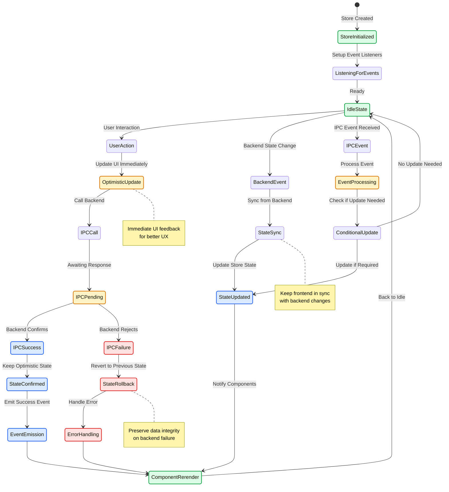

# ADR-004: Frontend State Management with Zustand

## Status

**Accepted** - Adopted across all frontend state management

## Context

The frontend needed a state management solution that would:

- Provide type safety for all state operations
- Enable modular, composable store architecture
- Support selective persistence of user preferences
- Integrate seamlessly with React components
- Avoid the complexity of Redux while maintaining predictable state updates

## Decision

We will use **Zustand** as our primary state management library with specific architectural patterns:

### 1. Store Architecture Patterns

We use two patterns based on store complexity:

#### A. Direct Create Pattern (Simple Stores)

For stores with single responsibility and straightforward state management:

```typescript
// Simple store example
export const useErrorStore = create<ErrorStore>()((set, get) => ({
 // Initial state
 isLoading: false,
 lastError: undefined,
 storeErrors: {},

 // Actions
 setError: (error: string | undefined) => {
  logStoreAction("ErrorStore", "setError", { error });
  set({ lastError: error });
 },
 setLoading: (loading: boolean) => {
  logStoreAction("ErrorStore", "setLoading", { loading });
  set({ isLoading: loading });
 },
}));
```

#### B. Modular Composition Pattern (Complex Stores)

For stores with multiple domains, extensive operations, or complex state management:

```typescript
// Main store composes multiple modules
export const useSitesStore = create<SitesStore>()((set, get) => {
 const stateActions = createSitesStateActions(set, get);
 const syncActions = createSiteSyncActions({
  getSites: () => get().sites,
  setSites: stateActions.setSites,
 });
 const operationsActions = createSiteOperationsActions({
  addSite: stateActions.addSite,
  getSites: () => get().sites,
  syncSitesFromBackend: syncActions.syncSitesFromBackend,
 });

 return {
  ...initialSitesState,
  ...stateActions,
  ...operationsActions,
  ...syncActions,
 };
});
```

### Store Pattern Decision Criteria

**Use Direct Create Pattern when:**

- Single responsibility/domain (e.g., error handling, settings, UI state)
- Simple state structure (typically <200 lines)
- Limited cross-cutting concerns
- Straightforward action implementations

**Use Modular Composition Pattern when:**

- Multiple interconnected domains (e.g., sites + monitors + history)
- Complex business logic requiring separation of concerns
- Extensive operations requiring dependency injection
- Large stores that would benefit from module separation (typically >300 lines)

**Examples by Pattern:**

- **Direct Pattern**: `useErrorStore`, `useUpdatesStore`, `useSettingsStore`, `useUIStore`
- **Modular Pattern**: `useSitesStore` (manages sites, monitors, sync, operations)

### 2. Typed Store Interfaces

All stores use comprehensive TypeScript interfaces:

```typescript
export interface SitesStore extends SitesState {
 // State actions
 addSite: (site: Site) => void;
 setSites: (sites: Site[]) => void;
 removeSite: (identifier: string) => void;

 // Operations actions
 createSite: (siteData: CreateSiteData) => Promise<Site>;
 deleteSite: (identifier: string) => Promise<void>;

 // Sync actions
 syncSitesFromBackend: () => Promise<void>;
}
```

### 3. Consistent Action Logging

All store actions include consistent logging for debugging:

```typescript
setSelectedSite: (site: Site | undefined) => {
 logStoreAction("UIStore", "setSelectedSite", { site });
 set({ selectedSiteIdentifier: site ? site.identifier : undefined });
};
```

### 4. Selective Persistence

UI preferences are persisted while transient state remains in memory:

```typescript
export const useUIStore = create<UIStore>()(
 persist(
  (set) => ({
   // State and actions...
  }),
  {
   name: "uptime-watcher-ui",
   partialize: (state) => ({
    // Only persist user preferences
    showAdvancedMetrics: state.showAdvancedMetrics,
    siteDetailsChartTimeRange: state.siteDetailsChartTimeRange,
    // Exclude transient state
    // showSettings: false,
    // showSiteDetails: false,
   }),
  }
 )
);
```

### 5. Error Integration

Stores integrate with the error handling system:

```typescript
import { SiteService } from "src/services/SiteService";

const performAction = async () => {
 await withErrorHandling(async () => {
  const result = await SiteService.addSite(data);
  addSite(result); // Update store state
  return result;
 }, errorStore);
};
```

## Store Categories

### Store Architecture and Component Relationships

````mermaid
graph TB
    subgraph "React Components"
        SitesList["Sites List"]
        SiteDetails["Site Details"]
        MonitorConfig["Monitor Config"]
        SettingsPanel["Settings Panel"]
        ErrorDisplay["Error Display"]
        UpdateNotification["Update Notification"]
    end

    subgraph "Zustand Stores"
        subgraph "Domain Stores"
            SitesStore["useSitesStore<br/>Complex - Modular Pattern"]
            MonitorTypesStore["useMonitorTypesStore<br/>Simple - Direct Pattern"]
        end

        subgraph "UI Stores"
            UIStore["useUIStore<br/>Simple - Direct Pattern<br/>+ Persistence"]
            ErrorStore["useErrorStore<br/>Simple - Direct Pattern"]
        end

        subgraph "System Stores"
            UpdatesStore["useUpdatesStore<br/>Simple - Direct Pattern"]
            SettingsStore["useSettingsStore<br/>Simple - Direct Pattern<br/>+ Persistence"]
        end
    end

    subgraph "External Systems"
        IPC["IPC/Electron API"]
        LocalStorage["Browser Storage"]
        EventSystem["Event System"]
    end

    subgraph "Store Modules (Complex Stores)"
        StateActions["State Actions Module"]
        OperationsActions["Operations Actions Module"]
        SyncActions["Sync Actions Module"]

        SitesStore -.-> StateActions
        SitesStore -.-> OperationsActions
        SitesStore -.-> SyncActions
    end

    %% Component to Store connections
    SitesList --> SitesStore
    SiteDetails --> SitesStore
    SiteDetails --> UIStore
    MonitorConfig --> MonitorTypesStore
    SettingsPanel --> SettingsStore
    ErrorDisplay --> ErrorStore
    UpdateNotification --> UpdatesStore

    %% Store to External connections
    SitesStore <--> IPC
    MonitorTypesStore <--> IPC
    SettingsStore <--> IPC
    UpdatesStore <--> IPC

    UIStore <--> LocalStorage
    SettingsStore <--> LocalStorage

    SitesStore <--> EventSystem
    ErrorStore <--> EventSystem

    classDef component fill:#dbeafe,stroke:#2563eb,stroke-width:2px,color:#1e3a8a
    classDef domainStore fill:#dcfce7,stroke:#16a34a,stroke-width:2px,color:#14532d
    classDef uiStore fill:#fef3c7,stroke:#d97706,stroke-width:2px,color:#92400e
    classDef systemStore fill:#f3e8ff,stroke:#9333ea,stroke-width:2px,color:#6b21a8
    classDef external fill:#fee2e2,stroke:#dc2626,stroke-width:2px,color:#991b1b
    classDef module fill:#e0f2fe,stroke:#0891b2,stroke-width:2px,color:#0e7490

    class SitesList,SiteDetails,MonitorConfig,SettingsPanel,ErrorDisplay,UpdateNotification component
    class SitesStore,MonitorTypesStore domainStore
    class UIStore,ErrorStore uiStore
    class UpdatesStore,SettingsStore systemStore
    class IPC,LocalStorage,EventSystem external
    class StateActions,OperationsActions,SyncActions module
```### 1. Domain Stores

Handle specific business domain state:

- `useSitesStore` - Site and monitor management
- `useMonitorTypesStore` - Monitor type configurations

### 2. UI Stores

Manage user interface state:

- `useUIStore` - Modal visibility, selected items, user preferences
- `useErrorStore` - Global error and loading states

### 3. System Stores

Handle application-level state:

- `useUpdatesStore` - Update management and notifications
- `useSettingsStore` - Application settings and configuration

## State Update Patterns

### Store Pattern Decision Flow

```mermaid
flowchart TD
    NewStore["New Store Needed"] --> Assess{"Assess Store Requirements"}

    Assess --> CheckResponsibility{"Single Responsibility?"}
    CheckResponsibility -->|Yes| CheckSize{"Simple State Structure?<br/>< 200 lines"}
    CheckResponsibility -->|No| UseModular["Use Modular Composition Pattern"]

    CheckSize -->|Yes| CheckConcerns{"Limited Cross-cutting Concerns?"}
    CheckSize -->|No| UseModular

    CheckConcerns -->|Yes| CheckActions{"Straightforward Actions?"}
    CheckConcerns -->|No| UseModular

    CheckActions -->|Yes| UseDirect["Use Direct Create Pattern"]
    CheckActions -->|No| UseModular

    UseDirect --> DirectExamples["Examples:<br/>• useErrorStore<br/>• useUpdatesStore<br/>• useSettingsStore<br/>• useUIStore"]

    UseModular --> ModularExamples["Examples:<br/>• useSitesStore<br/>• Complex domain stores<br/>• Multi-concern stores"]

    DirectExamples --> Implementation["Implementation"]
    ModularExamples --> Implementation

    Implementation --> AddPersistence{"User Preferences?"}
    AddPersistence -->|Yes| WithPersist["Add Persist Middleware"]
    AddPersistence -->|No| WithoutPersist["No Persistence"]

    WithPersist --> AddLogging["Add Action Logging"]
    WithoutPersist --> AddLogging
    AddLogging --> AddTypes["Define TypeScript Interfaces"]
    AddTypes --> Complete["Store Complete"]

    classDef decision fill:#fef3c7,stroke:#d97706,stroke-width:2px,color:#92400e
    classDef pattern fill:#dcfce7,stroke:#16a34a,stroke-width:2px,color:#14532d
    classDef example fill:#dbeafe,stroke:#2563eb,stroke-width:2px,color:#1e3a8a
    classDef complete fill:#f3e8ff,stroke:#9333ea,stroke-width:2px,color:#6b21a8

    class Assess,CheckResponsibility,CheckSize,CheckConcerns,CheckActions,AddPersistence decision
    class UseDirect,UseModular pattern
    class DirectExamples,ModularExamples,WithPersist,WithoutPersist,AddLogging,AddTypes example
    class Implementation,Complete complete
```### State Update Lifecycle

```mermaid
sequenceDiagram
    participant Component as React Component
    participant Store as Zustand Store
    participant Module as Store Module
    participant IPC as IPC Layer
    participant Backend as Backend Service
    participant LocalStorage as Local Storage
    participant EventSystem as Event System

    Note over Component, EventSystem: State Update with Full Integration

    Component->>Store: Trigger Action
    Store->>Store: Log Action (logStoreAction)

    alt Simple Store Pattern
        Store->>Store: Direct State Update
        Store->>LocalStorage: Persist (if configured)
        Store->>Component: State Change Notification
    else Modular Store Pattern
        Store->>Module: Delegate to Module
        Module->>Module: Process Business Logic

        alt Async Operation Required
            Module->>IPC: Call Backend API
            IPC->>Backend: Service Operation
            Backend-->>IPC: Response/Error
            IPC-->>Module: Result

            alt Success Path
                Module->>Store: Update State (Immutable)
                Store->>EventSystem: Emit Success Event
            else Error Path
                Module->>Store: Handle Error State
                Store->>EventSystem: Emit Error Event
            end
        else Sync Operation
            Module->>Store: Update State (Immutable)
        end

        Store->>LocalStorage: Persist Selected State
        Store->>Component: State Change Notification
    end

    alt Optimistic Update
        Note over Store: Immediate UI Update
        Store->>Component: Optimistic State
        Component->>Component: Update UI

        alt Backend Confirms
            Note over Store: Keep optimistic state
        else Backend Rejects
            Store->>Store: Rollback State
            Store->>Component: Corrected State
        end
    end

    Note over EventSystem: Events trigger other store updates
    EventSystem->>Store: Cross-store Updates
````

### 1. Immutable Updates

All state updates use immutable patterns:

```typescript
addSite: (site: Site) => {
 set((state) => ({
  sites: [...state.sites, site],
 }));
};
```

### 2. Async Operations

Async operations are handled in store actions:

```typescript
createSite: async (siteData: CreateSiteData) => {
 const result = await SiteService.addSite(siteData);
 get().addSite(result);
 return result;
};
```

### 3. Derived State

Complex derived state uses selectors:

```typescript
const sitesWithMonitorCount = useSitesStore((state) =>
 state.sites.map((site) => ({
  ...site,
  monitorCount: site.monitors.length,
 }))
);
```

## Integration with IPC

### Store-IPC Integration and Event Flow



### Event-Driven Updates

Stores listen to IPC events for backend state synchronization:

```typescript
import { StateSyncService } from "src/services/StateSyncService";

useEffect(() => {
 let unsubscribe: (() => void) | undefined;

 void (async () => {
  unsubscribe = await StateSyncService.onStateSyncEvent((data) => {
   if (data.type === "sites-updated") {
    syncSitesFromBackend();
   }
  });
 })();

 return () => {
  unsubscribe?.();
 };
}, [syncSitesFromBackend]);
```

### Optimistic Updates

UI updates optimistically, with rollback on failure:

```typescript
deleteSite: async (identifier: string) => {
 // Optimistic update
 const originalSites = get().sites;
 removeSite(identifier);

 try {
  await SiteService.removeSite(identifier);
 } catch (error) {
  // Rollback on failure
  setSites(originalSites);
  throw error;
 }
};
```

## Testing Patterns

### Store Testing

Stores are tested with renderHook from @testing-library:

```typescript
describe("useSitesStore", () => {
 beforeEach(() => {
  const store = useSitesStore.getState();
  act(() => {
   store.setSites([]);
  });
 });

 it("should add site", () => {
  const { result } = renderHook(() => useSitesStore());

  act(() => {
   result.current.addSite(mockSite);
  });

  expect(result.current.sites).toContain(mockSite);
 });
});
```

## Consequences

### Positive

- **Type safety** - Compile-time checking prevents runtime errors
- **Modularity** - Large stores broken into focused, testable modules
- **Performance** - Efficient updates and selective subscriptions
- **Persistence** - User preferences maintained across sessions
- **Integration** - Seamless integration with error handling and IPC
- **Developer experience** - Simple API with powerful capabilities

### Negative

- **Learning curve** - Developers need to understand Zustand patterns
- **Boilerplate** - Module composition requires more initial setup
- **Complexity** - Async operations and error handling add complexity

## Implementation Guidelines

### 1. Store Structure

```typescript
// 1. Define interfaces
interface StoreState {
 /* state shape */
}
interface StoreActions {
 /* action signatures */
}
interface Store extends StoreState, StoreActions {}

// 2. Create store with composition
export const useStore = create<Store>()((set, get) => ({
 // Initial state
 ...initialState,

 // Actions
 action: (params) => {
  logStoreAction("StoreName", "action", { params });
  set((state) => ({
   /* immutable update */
  }));
 },
}));
```

### 2. Persistence Configuration

```typescript
persist(storeImplementation, {
 name: "unique-storage-key",
 partialize: (state) => ({
  // Only include persistent fields
 }),
});
```

### 3. Error Integration

Always wrap async operations with error handling utilities.

## Compliance

All frontend state follows these patterns:

- **Type-safe store interfaces** for all stores
- **Consistent action logging** with `logStoreAction`
- **Pattern selection based on complexity**:
  - Direct create() pattern for simple stores
  - Modular composition for complex stores
- **Selective persistence** for user preferences
- **Integration with error handling system**

## Store Pattern Examples

### Current Implementation Compliance:

- ✅ `useSitesStore` - Complex store using modular composition
- ✅ `useErrorStore` - Simple store using direct create() pattern
- ✅ `useUpdatesStore` - Simple store using direct create() pattern
- ✅ `useSettingsStore` - Simple store using direct create() pattern
- ✅ `useUIStore` - Simple store using direct create() pattern
- ✅ `useMonitorTypesStore` - Focused store using direct create() pattern

### Current Implementation Audit (2025-11-04)

- Confirmed modular composition helpers in `src/stores/sites/modules/` remain the backbone of `useSitesStore`, with persistent slices configured via `persist` as documented.
- Reviewed `src/stores/error/useErrorStore.ts`, `src/stores/updates/useUpdatesStore.ts`, and `src/stores/settings/useSettingsStore.ts` to verify continued use of the direct `create()` pattern with readonly state contracts.
- Checked `src/stores/utils/storeErrorHandling.ts` and `logStoreAction.ts` to ensure action logging and error propagation still align with the guidance above.

## Related ADRs

- [ADR-003: Error Handling Strategy](./ADR_003_ERROR_HANDLING_STRATEGY.md)
- [ADR-005: IPC Communication Protocol](./ADR_005_IPC_COMMUNICATION_PROTOCOL.md)
