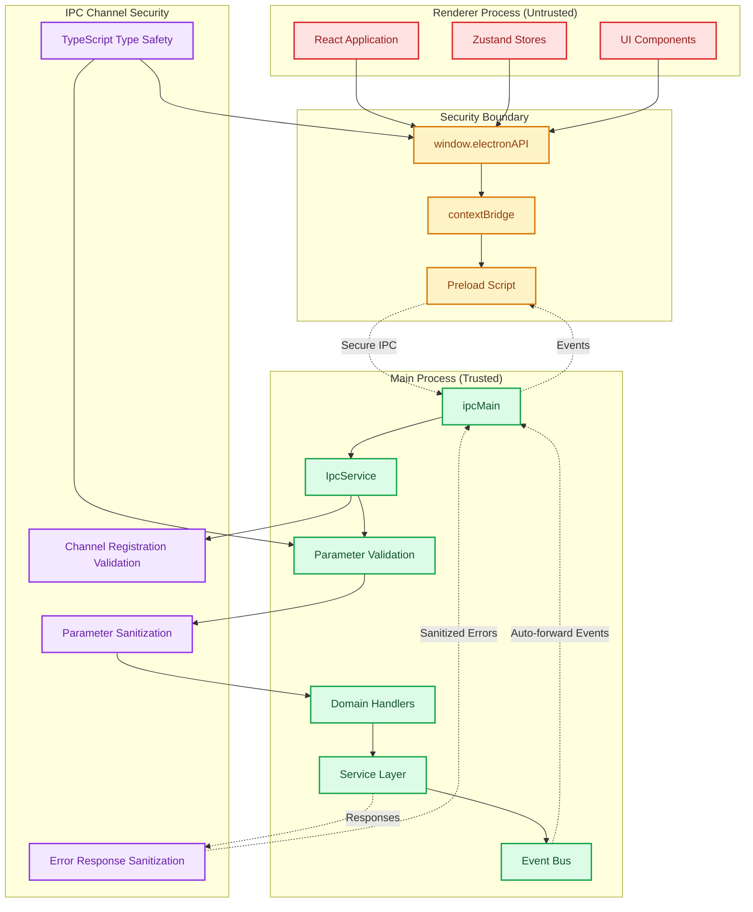
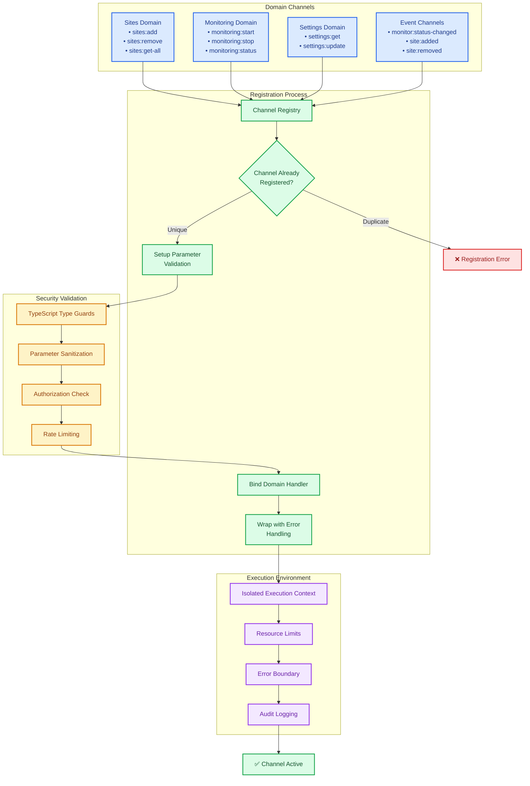
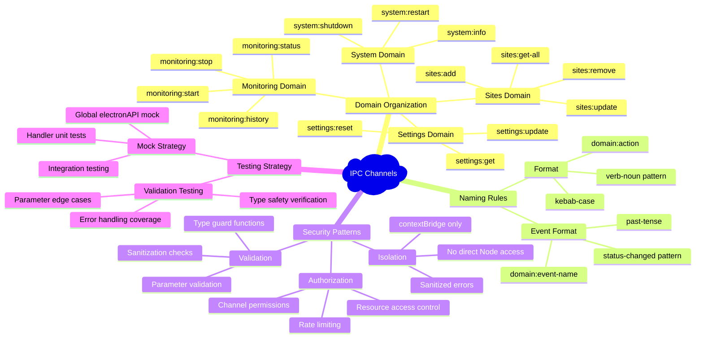

# ADR-005: IPC Communication Protocol

## Status

**Accepted** - Standardized protocol for all Electron IPC communication

## Context

The Electron application required a robust, type-safe communication protocol between the main process and renderer process. The solution needed to:

- Provide type safety for all IPC communications
- Handle validation and error responses consistently
- Support cleanup and resource management
- Enable easy testing through mocking
- Maintain security through contextBridge isolation

## Decision

We will implement a **standardized IPC communication protocol** using Electron's contextBridge with consistent patterns for all communication.

### IPC Security Architecture Overview



### 1. Centralized IPC Service

All IPC handlers are registered through a central `IpcService`:

```typescript
export class IpcService {
 private registeredHandlers = new Set<string>();

 public initialize(dependencies: IpcServiceDependencies): void {
  this.registerSitesHandlers(dependencies);
  this.registerMonitoringHandlers(dependencies);
  this.registerSettingsHandlers(dependencies);
  // ... other domain handlers
 }

 private registerStandardizedIpcHandler<T, R>(
  channel: string,
  handler: (params: T) => Promise<R>,
  validator?: (params: unknown) => params is T
 ): void {
  if (this.registeredHandlers.has(channel)) {
   throw new Error(`IPC handler already registered: ${channel}`);
  }

  ipcMain.handle(channel, async (_event, params: unknown) => {
   try {
    if (validator && !validator(params)) {
     throw new Error(`Invalid parameters for ${channel}`);
    }
    return await handler(params as T);
   } catch (error) {
    logger.error(`IPC handler failed: ${channel}`, error);
    throw error;
   }
  });

  this.registeredHandlers.add(channel);
 }
}
```

### 2. Domain-Specific Handler Groups

IPC handlers are organized by domain with consistent validation:

```typescript
private registerSitesHandlers(deps: IpcServiceDependencies): void {
    this.registerStandardizedIpcHandler(
        'sites:get-all',
        async () => deps.siteManager.getAllSites(),
        // No parameters to validate
    );

    this.registerStandardizedIpcHandler(
        'sites:add',
        async (params) => deps.siteManager.addSite(params),
        isSiteCreationData
    );

    this.registerStandardizedIpcHandler(
        'sites:remove',
        async (params) => deps.siteManager.removeSite(params.identifier),
        isIdentifierParams
    );
}
```

### 3. Type-Safe Preload API

The preload script exposes a type-safe API to the renderer:

```typescript
// preload.ts
const electronAPI = {
 sites: {
  addSite: (data: SiteCreationData): Promise<Site> =>
   ipcRenderer.invoke("sites:add", data),
  getSites: (): Promise<Site[]> => ipcRenderer.invoke("sites:get-all"),
  removeSite: (identifier: string): Promise<void> =>
   ipcRenderer.invoke("sites:remove", { identifier }),
 },
 events: {
  onMonitorStatusChanged: (callback: (data: MonitorStatusData) => void) => {
   const wrappedCallback = (_event: any, data: MonitorStatusData) =>
    callback(data);
   ipcRenderer.on("monitor:status-changed", wrappedCallback);
   return () => ipcRenderer.off("monitor:status-changed", wrappedCallback);
  },
 },
 // ... other domains
} as const;

contextBridge.exposeInMainWorld("electronAPI", electronAPI);
```

### 4. Event Forwarding Protocol

Backend events are automatically forwarded to the frontend:

```typescript
// In IpcService
private async forwardEventToRenderer(eventName: string, data: unknown): Promise<void> {
    if (this.webContents && !this.webContents.isDestroyed()) {
        this.webContents.send(eventName, data);
    }
}

// Events are forwarded automatically when emitted
await this.eventBus.emitTyped('monitor:status-changed', eventData);
// → Automatically sent to renderer via IPC
```

### 5. Validation and Error Handling

All IPC operations include validation and consistent error handling:

```typescript
// Validation functions for each domain
export function isSiteCreationData(data: unknown): data is SiteCreationData {
 return (
  typeof data === "object" &&
  data !== null &&
  "name" in data &&
  typeof (data as any).name === "string"
 );
}

// Error responses maintain consistent format
try {
 const result = await handler(params);
 return { success: true, data: result };
} catch (error) {
 logger.error(`IPC operation failed: ${channel}`, error);
 return {
  success: false,
  error: error instanceof Error ? error.message : "Unknown error",
 };
}
```

## Communication Patterns

### IPC Communication Flow and Validation Pipeline

```mermaid
sequenceDiagram
    participant React as React Component
    participant API as window.electronAPI
    participant Preload as Preload Script
    participant IpcMain as ipcMain
    participant Service as IpcService
    participant Validator as Parameter Validator
    participant Handler as Domain Handler
    participant Manager as Service Manager
    participant EventBus as Event Bus

    Note over React, EventBus: Secure IPC Request-Response Pattern

    React->>+API: Call API Method
    Note right of API: e.g., sites.addSite(data)

    API->>+Preload: Type-safe IPC call
    Note right of Preload: Channel: 'sites:add'

    Preload->>+IpcMain: ipcRenderer.invoke()
    Note right of IpcMain: Crosses security boundary

    IpcMain->>+Service: Route to registered handler
    Service->>+Validator: Validate parameters

    alt Invalid Parameters
        Validator-->>Service: ❌ Validation Error
        Service-->>IpcMain: Standardized Error Response
        IpcMain-->>Preload: Error propagated
        Preload-->>API: Type-safe error
        API-->>-React: Error thrown
    else Valid Parameters
        Validator-->>Service: ✅ Parameters validated
        Service->>+Handler: Execute domain logic

        Handler->>+Manager: Perform business operation
        Manager-->>Handler: Operation result
        Handler-->>-Service: Success result

        Service->>EventBus: Emit domain event (if applicable)
        Note right of EventBus: e.g., 'site:added'

        Service-->>-IpcMain: Success response
        IpcMain-->>-Preload: Result data
        Preload-->>-API: Type-safe result
        API-->>-React: Success value
    end

    Note over EventBus, React: Event Broadcasting Pattern
    EventBus->>IpcMain: Auto-forward event
    IpcMain->>Preload: Event broadcast
    Preload->>API: Event listener callback
    API->>React: State update trigger

    Note over React: Component re-renders with new state
```

### IPC Channel Isolation and Security



### 1. Request-Response Pattern

Standard async operations use the request-response pattern:

```typescript
// Frontend request
const result = await window.electronAPI.sites.addSite(siteData);

// Backend handler
async (params: SiteCreationData) => {
 const site = await this.siteManager.addSite(params);
 return site;
};
```

### 2. Event Broadcasting Pattern

State changes are broadcast as events:

```typescript
// Backend emits event
await this.eventBus.emitTyped("sites:added", { site: newSite });

// Frontend listens for event
const cleanup = window.electronAPI.events.onSiteAdded((data) => {
 sitesStore.addSite(data.site);
});
```

### 3. Cleanup Pattern

Event listeners return cleanup functions:

```typescript
useEffect(() => {
 const cleanup = window.electronAPI.events.onMonitorStatusChanged((data) => {
  handleStatusChange(data);
 });

 return cleanup; // Automatic cleanup on unmount
}, []);
```

## Channel Naming Convention

### Channel Organization and Naming Standards



### Format: `domain:action`

- **Sites**: `sites:add`, `sites:remove`, `sites:get-all`
- **Monitoring**: `monitoring:start`, `monitoring:stop`
- **Settings**: `settings:get`, `settings:update`
- **Events**: Use past tense for completed actions: `monitor:status-changed`

### Consistency Rules

1. **Domain prefix** - Always use domain prefix for grouping
2. **Kebab-case** - Use kebab-case for multi-word actions
3. **Verb-noun pattern** - Action followed by resource (`get-sites`, not `sites-get`)
4. **Past tense for events** - Events use past tense (`status-changed`)

## Security Considerations

### 1. ContextBridge Isolation

All IPC communication goes through contextBridge - no direct Node.js access in renderer.

### 2. Parameter Validation

All parameters are validated before processing to prevent injection attacks.

### 3. Error Sanitization

Error messages are sanitized before sending to renderer to prevent information leakage.

## Testing Strategy

### 1. Mock ElectronAPI

Global mock for testing:

```typescript
const mockElectronAPI = {
 sites: {
  addSite: vi.fn().mockResolvedValue(mockSite),
  getSites: vi.fn().mockResolvedValue([]),
  removeSite: vi.fn().mockResolvedValue(undefined),
 },
 events: {
  onMonitorStatusChanged: vi.fn((_callback) => vi.fn()),
 },
};

Object.defineProperty(window, "electronAPI", {
 value: mockElectronAPI,
 writable: true,
});
```

### 2. Handler Testing

IPC handlers are tested by mocking dependencies:

```typescript
describe("Sites IPC Handlers", () => {
 it("should handle add site request", async () => {
  const mockSiteManager = {
   addSite: vi.fn().mockResolvedValue(mockSite),
  };

  const ipcService = new IpcService();
  ipcService.initialize({ siteManager: mockSiteManager });

  const result = await ipcRenderer.invoke("sites:add", siteData);
  expect(result).toEqual(mockSite);
 });
});
```

## Consequences

### Positive

- **Type safety** - Compile-time checking for all IPC communications
- **Consistent patterns** - Standardized registration and handling
- **Error handling** - Uniform error responses and logging
- **Testability** - Easy mocking and testing of IPC operations
- **Security** - Proper isolation through contextBridge
- **Maintainability** - Domain-specific organization

### Negative

- **Boilerplate** - Requires validation functions and type definitions
- **Complexity** - Additional abstraction layer over raw IPC
- **Learning curve** - Developers need to understand IPC patterns

## Implementation Requirements

### 1. Handler Registration

All IPC handlers must be registered through `IpcService.registerStandardizedIpcHandler()`.

### 2. Type Definitions

All IPC operations must have corresponding TypeScript interfaces.

### 3. Validation Functions

All parameterized operations must include validation functions.

### 4. Error Handling

All handlers must use try-catch with proper error logging.

### 5. Cleanup Support

Event listeners must return cleanup functions.

## Compliance

All IPC communication follows this protocol:

- Centralized registration through IpcService
- Domain-specific handler grouping
- Type-safe preload API exposure
- Consistent validation and error handling
- Automatic event forwarding

## Related ADRs

- [ADR-002: Event-Driven Architecture](./ADR_002_EVENT_DRIVEN_ARCHITECTURE.md)
- [ADR-003: Error Handling Strategy](./ADR_003_ERROR_HANDLING_STRATEGY.md)
- [ADR-004: Frontend State Management](./ADR_004_FRONTEND_STATE_MANAGEMENT.md)
