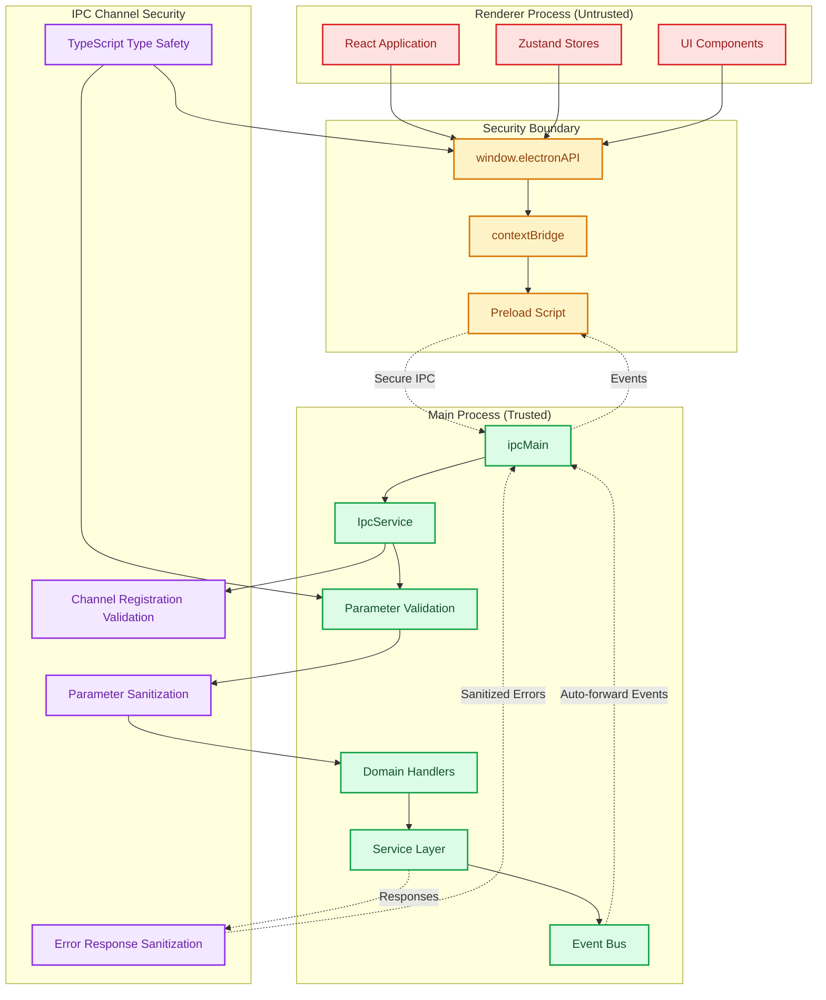
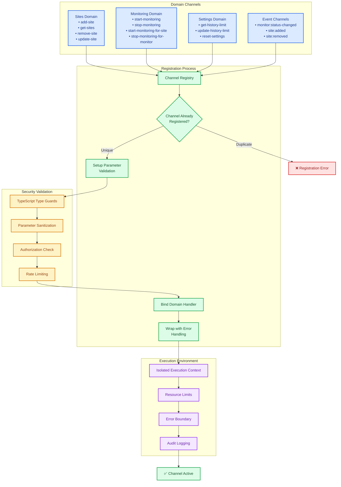
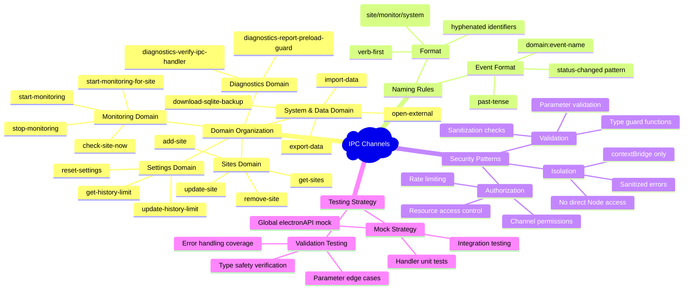

# ADR-005: IPC Communication Protocol

## Table of Contents

1. [Status](#status)
2. [Context](#context)
3. [Decision](#decision)
4. [Communication Patterns](#communication-patterns)
5. [Channel Naming Convention](#channel-naming-convention)
6. [Security Considerations](#security-considerations)
7. [Testing Strategy](#testing-strategy)
8. [Consequences](#consequences)
9. [Implementation Requirements](#implementation-requirements)
10. [Compliance](#compliance)
11. [Related ADRs](#related-adrs)

## Status

**Accepted** - Standardized protocol for all Electron IPC communication

## Context

The Electron application required a robust, type-safe communication protocol between the main process and renderer process. The solution needed to:

- Provide type safety for all IPC communications
- Handle validation and error responses consistently
- Support cleanup and resource management
- Enable easy testing through mocking
- Maintain security through contextBridge isolation

## Decision

We will implement a **standardized IPC communication protocol** using Electron's contextBridge with consistent patterns for all communication.

### IPC Security Architecture Overview



### 1. Centralized IPC Service

All IPC handlers are registered through a central `IpcService`:

```typescript
export class IpcService {
 private registeredHandlers = new Set<string>();

 public initialize(dependencies: IpcServiceDependencies): void {
  this.registerSitesHandlers(dependencies);
  this.registerMonitoringHandlers(dependencies);
  this.registerSettingsHandlers(dependencies);
  // ... other domain handlers
 }

 private registerStandardizedIpcHandler<T, R>(
  channel: string,
  handler: (params: T) => Promise<R>,
  validator?: (params: unknown) => params is T
 ): void {
  if (this.registeredHandlers.has(channel)) {
   throw new Error(`IPC handler already registered: ${channel}`);
  }

  ipcMain.handle(channel, async (_event, params: unknown) => {
   try {
    if (validator && !validator(params)) {
     throw new Error(`Invalid parameters for ${channel}`);
    }
    return await handler(params as T);
   } catch (error) {
    logger.error(`IPC handler failed: ${channel}`, error);
    throw error;
   }
  });

  this.registeredHandlers.add(channel);
 }
}
```

> **Implementation note:** The production implementation reuses the shared helper in `electron/services/ipc/utils.ts`. That module exposes `registerStandardizedIpcHandler` and `createValidationResponse`, so every handler registration in `IpcService` passes the channel name, async handler, validator, and the shared `registeredIpcHandlers` set. The helper takes care of duplicate registration checks, timing diagnostics, and consistent logging.

### 2. Domain-Specific Handler Groups

IPC handlers are organized by domain with consistent validation:

```typescript
import { SITES_CHANNELS } from "@shared/types/preload";
import { registerStandardizedIpcHandler } from "electron/services/ipc/utils";
import { SiteHandlerValidators } from "electron/services/ipc/validators/sites";

private setupSiteHandlers(): void {
    registerStandardizedIpcHandler(
        SITES_CHANNELS.addSite,
        async (...args: unknown[]) =>
            this.uptimeOrchestrator.addSite(args[0] as Site),
        SiteHandlerValidators.addSite,
        this.registeredIpcHandlers
    );

    registerStandardizedIpcHandler(
        SITES_CHANNELS.removeSite,
        async (...args: unknown[]) =>
            this.uptimeOrchestrator.removeSite(args[0] as string),
        SiteHandlerValidators.removeSite,
        this.registeredIpcHandlers
    );

    registerStandardizedIpcHandler(
        SITES_CHANNELS.getSites,
        async () => this.uptimeOrchestrator.getSites(),
        SiteHandlerValidators.getSites,
        this.registeredIpcHandlers
    );

    // ...additional site/monitor operations, each wired through the same helper
}
```

Validators live under `electron/services/ipc/validators/*` (one module per IPC domain) and reuse shared helpers from `electron/services/ipc/validators/shared.ts`. Keeping validation logic centralized prevents drift between IPC contracts and renderer-side TypeScript definitions.

### 3. Type-Safe Preload API

The preload script exposes a type-safe, domain-based API to the renderer. The
actual implementation uses shared contracts from `shared/types/preload.ts` and
the modular domain APIs under `electron/preload/domains/*Api.ts`:

```typescript
// preload.ts (simplified)
import type { ElectronBridgeApi } from "@shared/types/preload";
import { contextBridge } from "electron";

import type { EventsApi } from "./preload/domains/eventsApi";
import type { SystemApi } from "./preload/domains/systemApi";

import { dataApi } from "./preload/domains/dataApi";
import { createEventsApi } from "./preload/domains/eventsApi";
import { monitoringApi } from "./preload/domains/monitoringApi";
import { sitesApi } from "./preload/domains/sitesApi";
import { stateSyncApi } from "./preload/domains/stateSyncApi";
import { systemApi } from "./preload/domains/systemApi";

type ElectronAPI = ElectronBridgeApi<EventsApi, SystemApi>;

const electronAPI: ElectronAPI = {
 data: dataApi,
 events: createEventsApi(),
 monitoring: monitoringApi,
 sites: sitesApi,
 stateSync: stateSyncApi,
 system: systemApi,
 // ... other domains
};

contextBridge.exposeInMainWorld("electronAPI", electronAPI);
```

#### 2025-10-21 Contract Update

The `remove-monitor` invoke channel now returns the persisted `Site` snapshot emitted by the main process. The generated preload bridge mirrors this contract (`sitesApi.removeMonitor(): Promise<Site>`), allowing the renderer to reconcile state without performing ad-hoc reconstruction. Always apply the returned entity via `SiteService.removeMonitor` ➔ `applySavedSiteToStore` and avoid synthesizing partial results locally. This keeps optimistic updates aligned with the authoritative orchestrator payload and matches the guidance in `docs/Architecture/Stores/sites.md`. For a canonical implementation, reference [`SiteService.removeMonitor`](../../../src/services/SiteService.ts), which validates the persisted snapshot with the shared guards before updating renderer state.

#### 2025-10-26 Contract Update

- Added the `settings:history-limit-updated` renderer broadcast to surface persistence changes originating from imports, orchestrator migrations, or database maintenance. Renderer consumers **must** subscribe via `EventsService.onHistoryLimitUpdated` to keep the settings store in sync even when the local UI did not initiate the change. The payload includes both the new limit and the previously observed value so clients can display contextual messaging.
- Preload bridge types (`shared/types/eventsBridge.ts`) and the IPC channel inventory documentation are now generated from the canonical `RendererEventPayloadMap`/`IpcInvokeChannelMap` schema. Run `npm run generate:ipc` whenever event contracts change and gate CI with `npm run check:ipc` to detect drift between code and docs.
- The authoritative channel catalogue lives in `docs/Architecture/generated/IPC_CHANNEL_INVENTORY.md`. Do not hand-edit the table; update the schema and regenerate instead.

### 3.1 Static IPC Architecture Guards

To keep the IPC security boundary and layering guarantees enforceable over time, a dedicated static guard script validates key invariants on every lint run:

- **Command**: `npm run lint:architecture`
- **Integration**: Invoked automatically from `lint:all:fix` (local quality runs) and `lint:ci` (CI pipelines).

The script (`scripts/architecture-static-guards.mjs`) performs the following checks:

1. **Centralized `ipcMain.handle` registration** – Direct `ipcMain.handle(...)` calls are only allowed in the centralized IPC registration layer:

   - `electron/services/ipc/IpcService.ts`
   - `electron/services/ipc/utils.ts` (shared helper for handler wiring)

   Any other usage is flagged as a violation to prevent ad-hoc handlers that bypass validation, logging, or standardized response formatting.

2. **No direct `ipcRenderer` imports in `src/**`** – Renderer code may not import `ipcRenderer`directly from the`electron` package (excluding tests). All renderer IPC goes through the typed preload bridge (`window.electronAPI`) and domain-specific renderer services (for example `SiteService`, `SettingsService`). This guarantees that:
   - Renderer code never crosses the security boundary directly.
   - All IPC calls benefit from the shared `IpcResponse` validation and error handling implemented in the preload layer.

3. **Scoped `window.electronAPI` usage** – Direct references to `window.electronAPI` in `src/**` are limited to a small set of explicit helper/service modules and type definitions:

   - `src/types/ipc.ts` (documentation/example usage)
   - `src/services/DataService.ts`
   - `src/services/NotificationPreferenceService.ts`
   - `src/services/StateSyncService.ts`
   - `src/services/utils/createIpcServiceHelpers.ts`
   - `src/services/utils/electronBridgeReadiness.ts`

   All other renderer code, including Zustand stores and React components, must depend on the typed renderer service facades instead of touching `window.electronAPI` directly. Unit tests under `src/test/**` are exempt so they can freely mock the bridge.

4. **Typed event usage** – Event names passed to `.emitTyped()`, `.onTyped()`, `.offTyped()`, and `.onceTyped()` in production Electron code must be declared in `electron/events/eventTypes.ts`. This prevents drift between the authoritative event catalogue and the actual event bus usage.

These guard rails make the IPC protocol self-enforcing: new features that attempt to bypass the established patterns will fail fast during `lint:architecture`, rather than silently weakening the security or maintainability of the boundary.

### 3.2 Preload Domain API Complexity (Thin vs Hardened)

Preload domain modules under `electron/preload/domains/**` fall into two
categories. Mixing these patterns without intention leads to duplicated
validation logic and inconsistent boundary hardening.

#### Thin invoker domains (default)

Use a thin domain module when the API is primarily request/response IPC.

- Implementation: compose typed methods with `createTypedInvoker(CHANNEL)`.
- Avoid: bespoke retries, custom correlation IDs, ad-hoc logging per method.
- Example: `electron/preload/domains/sitesApi.ts` (thin typed invokers)

This keeps the preload surface area small and ensures shared behaviors (correlation
envelopes, response normalization, and error formatting) remain centralized.

#### Hardened boundary domains (special cases)

Use a hardened domain module when the API:

- registers long-lived event listeners / streaming handlers,

- forwards payloads to renderer callbacks,

- handles potentially sensitive/high-volume payloads, or

- needs strict payload size enforcement and redaction.

- Implementation: validate payloads before invoking renderer callbacks; attach structured log context; enforce size limits; ensure cleanup is deterministic.

- Example: `electron/preload/domains/eventsApi.ts` (guards + telemetry around the renderer event bridge)

#### Enforcement (guard rails)

To keep this consistent and prevent new AI-driven codepaths:

- Preload domains must not use `ipcRenderer` directly (core bridgeFactory owns it).
- Preload domains must not define inline IPC channel string constants; they must import shared registries from `shared/types/preload.ts`.

These invariants are enforced via the repository lint guard rails and the
custom `uptime-watcher/*` ESLint rules.

### 4. Event Forwarding Protocol

Backend events are automatically forwarded to the frontend:

```typescript
// In IpcService
private async forwardEventToRenderer(eventName: string, data: unknown): Promise<void> {
    if (this.webContents && !this.webContents.isDestroyed()) {
        this.webContents.send(eventName, data);
    }
}

// Events are forwarded automatically when emitted
await this.eventBus.emitTyped('monitor:status-changed', eventData);
// → Automatically sent to renderer via IPC
```

### 5. Validation and Error Handling

All IPC operations include validation and consistent error handling:

```typescript
// Validation functions for each domain
export function isSiteCreationData(data: unknown): data is SiteCreationData {
 return (
  typeof data === "object" &&
  data !== null &&
  "name" in data &&
  typeof (data as any).name === "string"
 );
}

// Error responses maintain consistent format
try {
 const result = await handler(params);
 return { success: true, data: result };
} catch (error) {
 logger.error(`IPC operation failed: ${channel}`, error);
 return {
  success: false,
  error: error instanceof Error ? error.message : "Unknown error",
 };
}
```

## Communication Patterns

### IPC Communication Flow and Validation Pipeline

```mermaid
sequenceDiagram
    participant React as React Component
    participant API as window.electronAPI
    participant Preload as Preload Script
    participant IpcMain as ipcMain
    participant Service as IpcService
    participant Validator as Parameter Validator
    participant Handler as Domain Handler
    participant Manager as Service Manager
    participant EventBus as Event Bus

    Note over React, EventBus: Secure IPC Request-Response Pattern

    React->>+API: Call API Method
    Note right of API: e.g., sites.addSite(data)

    API->>+Preload: Type-safe IPC call
    Note right of Preload: Channel: 'add-site'

    Preload->>+IpcMain: createTypedInvoker() → (internal invoke)
    Note right of IpcMain: Crosses security boundary (hidden behind the typed preload bridge)

    IpcMain->>+Service: Route to registered handler
    Service->>+Validator: Validate parameters

    alt Invalid Parameters
        Validator-->>Service: ❌ Validation Error
        Service-->>IpcMain: Standardized Error Response
        IpcMain-->>Preload: Error propagated
        Preload-->>API: Type-safe error
        API-->>-React: Error thrown
    else Valid Parameters
        Validator-->>Service: ✅ Parameters validated
        Service->>+Handler: Execute domain logic

        Handler->>+Manager: Perform business operation
        Manager-->>Handler: Operation result
        Handler-->>-Service: Success result

        Service->>EventBus: Emit domain event (if applicable)
        Note right of EventBus: e.g., 'site:added'

        Service-->>-IpcMain: Success response
        IpcMain-->>-Preload: Result data
        Preload-->>-API: Type-safe result
        API-->>-React: Success value
    end

    Note over EventBus, React: Event Broadcasting Pattern
    EventBus->>IpcMain: Auto-forward event
    IpcMain->>Preload: Event broadcast
    Preload->>API: Event listener callback
    API->>React: State update trigger

    Note over React: Component re-renders with new state
```

### IPC Channel Isolation and Security



### 1. Request-Response Pattern

Standard async operations use the request-response pattern:

```typescript
import { SiteService } from "@app/services/SiteService";

// Frontend request
const result = await SiteService.addSite(siteData);

// Backend handler
async (params: SiteCreationData) => {
 const site = await this.siteManager.addSite(params);
 return site;
};
```

### 2. Event Broadcasting Pattern

State changes are broadcast as events:

```typescript
// Backend emits event
await this.eventBus.emitTyped("sites:added", { site: newSite });

import { EventsService } from "@app/services/EventsService";

// Frontend listens for event
const cleanup = await EventsService.onSiteAdded((data) => {
 sitesStore.addSite(data.site);
});
```

### 3. Cleanup Pattern

Event listeners return cleanup functions:

```typescript
useEffect(() => {
 let unsubscribe: (() => void) | undefined;

 void (async () => {
  unsubscribe = await EventsService.onMonitorStatusChanged((data) => {
   handleStatusChange(data);
  });
 })();

 return () => {
  unsubscribe?.();
 };
}, []);
```

## Channel Naming Convention

### Channel Organization and Naming Standards



### Invoke channel format: verb-first hyphen-case

- **Sites**: `add-site`, `get-sites`, `remove-site`, `update-site`
- **Monitoring**: `start-monitoring`, `stop-monitoring`, `start-monitoring-for-site`, `check-site-now`
- **Settings**: `get-history-limit`, `update-history-limit`, `reset-settings`
- **System/Data**: `download-sqlite-backup`, `export-data`, `import-data`, `open-external`
- **Diagnostics**: `diagnostics-verify-ipc-handler`, `diagnostics-report-preload-guard`
- **Events**: Continue using domain-prefixed, past-tense identifiers (e.g., `monitor:status-changed`, `site:added`).

### Authoritative channel definitions

All invoke channels are defined once in `shared/types/ipc.ts` via
`IpcInvokeChannelMap`. Domain-specific channel maps in
`shared/types/preload.ts` (`SITES_CHANNELS`, `SETTINGS_CHANNELS`,
`MONITORING_CHANNELS`, etc.), the preload bridge contracts, and the generated
IPC channel inventory documentation are derived from this map.

`electron/services/ipc/IpcService.ts` and its helpers consume these
definitions when registering handlers. Runtime guards (such as the
`update-notification-preferences` consistency check) exist purely to detect
drift early; they do not introduce alternative channel identifiers and must
always agree with the shared map.

### Consistency Rules

1. **Verb-first actions** - Begin each invoke channel with an imperative verb (`add-`, `get-`, `start-`).
2. **Hyphenated resources** - Append the resource or scope using hyphenated nouns (`-site`, `-monitor`, `-history-limit`).
3. **Namespace by bridge object** - Renderer services scope channels by API surface (`electronAPI.sites`, `electronAPI.monitoring`) rather than embedding domains in the identifier.
4. **Event naming** - Retain `domain:event-name` with past-tense actions for broadcast events to distinguish them from invoke channels.

## Security Considerations

### 1. ContextBridge Isolation

All IPC communication goes through contextBridge - no direct Node.js access in renderer.

### 2. Parameter Validation

All parameters are validated before processing to prevent injection attacks.

### 3. Error Sanitization

Error messages are sanitized before sending to renderer to prevent information leakage.

## Testing Strategy

### 1. Mock ElectronAPI

Global mock for testing:

```typescript
const mockElectronAPI = {
 sites: {
  addSite: vi.fn().mockResolvedValue(mockSite),
  getSites: vi.fn().mockResolvedValue([]),
  removeSite: vi.fn().mockResolvedValue(undefined),
 },
 events: {
  onMonitorStatusChanged: vi.fn((_callback) => vi.fn()),
 },
};

Object.defineProperty(window, "electronAPI", {
 value: mockElectronAPI,
 writable: true,
});
```

### 2. Handler Testing

IPC handlers are tested by mocking dependencies:

```typescript
describe("Sites IPC Handlers", () => {
 it("should handle add site request", async () => {
  const mockOrchestrator = {
   addSite: vi.fn().mockResolvedValue(mockSite),
  } as unknown as UptimeOrchestrator;
  const mockUpdaterService = {
   quitAndInstall: vi.fn(),
  } as unknown as AutoUpdaterService;
  const mockNotificationService = {
   updateConfig: vi.fn(),
  } as unknown as NotificationService;

  const ipcService = new IpcService(
   mockOrchestrator,
   mockUpdaterService,
   mockNotificationService
  );
  ipcService.setupHandlers();

  // In production, preload exposes a typed invoker (createTypedInvoker)
  // for SITES_CHANNELS.addSite. Tests can call the invoker directly.
  const invokeAddSite = createTypedInvoker(SITES_CHANNELS.addSite);
  const result = await invokeAddSite(siteData);
  expect(result).toEqual(mockSite);
 });
});
```

## Consequences

### Positive

- **Type safety** - Compile-time checking for all IPC communications
- **Consistent patterns** - Standardized registration and handling
- **Error handling** - Uniform error responses and logging
- **Testability** - Easy mocking and testing of IPC operations
- **Security** - Proper isolation through contextBridge
- **Maintainability** - Domain-specific organization

### Negative

- **Boilerplate** - Requires validation functions and type definitions
- **Complexity** - Additional abstraction layer over raw IPC
- **Learning curve** - Developers need to understand IPC patterns

## Implementation Requirements

### 1. Handler Registration

All IPC handlers must be registered through the centralized helper
`registerStandardizedIpcHandler` (implemented in
`electron/services/ipc/utils.ts`) and should be wired from domain handler
modules under `electron/services/ipc/handlers/**`.

### 2. Type Definitions

All IPC operations must have corresponding TypeScript interfaces.

### 3. Validation Functions

All parameterized operations must include validation functions.

### 4. Error Handling

All handlers must use try-catch with proper error logging.

### 5. Cleanup Support

Event listeners must return cleanup functions.

## Compliance

All IPC communication follows this protocol:

- Centralized registration through IpcService
- Domain-specific handler grouping
- Type-safe preload API exposure
- Consistent validation and error handling
- Automatic event forwarding

### Current Implementation Audit (2025-11-04)

- Audited `electron/services/ipc/IpcService.ts` and `electron/services/ipc/utils.ts` to confirm `registerStandardizedIpcHandler` still guards against duplicate handlers and wraps responses with validation metadata.
- Reviewed `electron/preload/domains` bridges (notably `eventsApi.ts` and `sitesApi.ts`) to ensure contextBridge exposure matches the documented security boundary.
- Verified renderer helpers in `src/services/ipc` continue to consume the shared `@shared/types/ipc` contracts, preserving the type integrity described in this ADR.

## Related ADRs

- [ADR-002: Event-Driven Architecture](./ADR_002_EVENT_DRIVEN_ARCHITECTURE.md)
- [ADR-003: Error Handling Strategy](./ADR_003_ERROR_HANDLING_STRATEGY.md)
- [ADR-004: Frontend State Management](./ADR_004_FRONTEND_STATE_MANAGEMENT.md)
