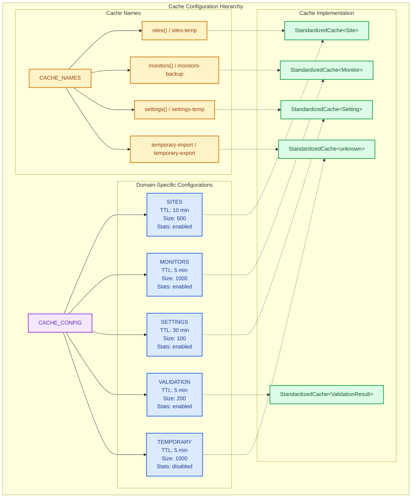
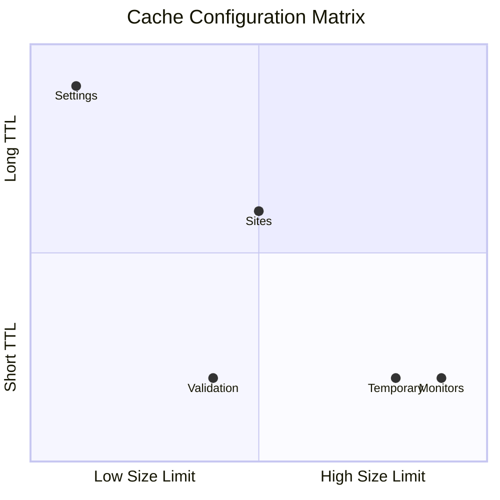
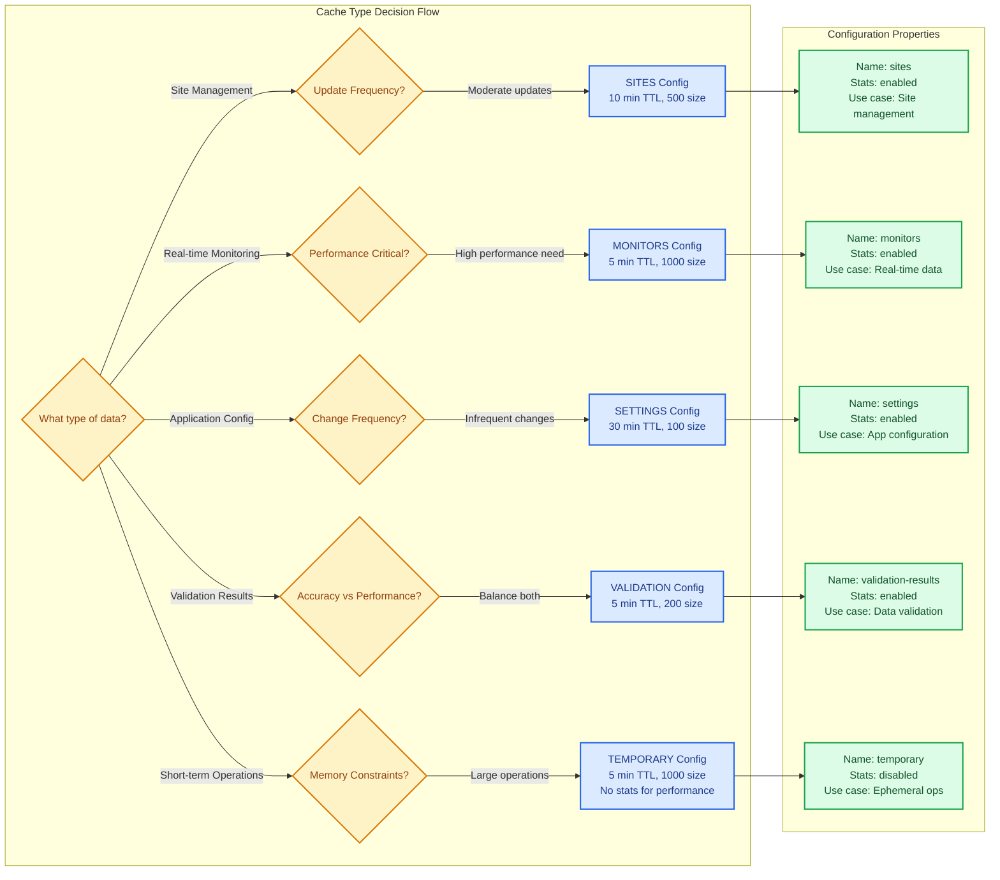

---

schema: "../../../config/schemas/doc-frontmatter.schema.json"
title: "ADR-006: Standardized Cache Configuration"
summary: "Defines standardized cache configuration constants and patterns for managers and services to ensure consistent TTLs and limits."
created: "2025-08-23"
last\_reviewed: "2025-11-15"
category: "guide"
author: "Nick2bad4u"
tags:

- "uptime-watcher"
- "architecture"
- "adr"
- "cache"
- "configuration"

---

# ADR-006: Standardized Cache Configuration

## Status

**Accepted** - Implemented across all cache-using managers and services

## Context

The application required consistent caching behavior across multiple managers and services, but cache configurations were scattered throughout the codebase with inconsistent TTL values, size limits, and naming conventions. This led to:

- Inconsistent cache expiration times (5 minutes vs 10 minutes vs 30 minutes)
- Varying cache size limits without clear reasoning
- Non-standardized cache naming patterns
- Difficulty in adjusting cache behavior application-wide
- Maintenance overhead when cache requirements changed
- Performance variations due to inconsistent configurations

## Decision

We will implement **Standardized Cache Configuration** using centralized constants and configuration objects with the following characteristics:

### 1. Centralized Configuration

- **Shared configuration file** (`shared/constants/cacheConfig.ts`) containing all cache settings
- **Domain-specific configurations** (SITES, MONITORS, SETTINGS, VALIDATION, TEMPORARY)
- **Consistent TTL values** based on data freshness requirements
- **Standardized size limits** based on expected data volume

### 2. Configuration Structure



```typescript
export const CACHE_CONFIG = Object.freeze({
 SITES: Object.freeze({
  name: "sites",
  ttl: 600_000, // 10 minutes
  maxSize: 500,
  enableStats: true,
 }),

 MONITORS: Object.freeze({
  name: "monitors",
  ttl: 300_000, // 5 minutes - shorter for real-time monitoring
  maxSize: 1000,
  enableStats: true,
 }),

 SETTINGS: Object.freeze({
  name: "settings",
  ttl: 1_800_000, // 30 minutes - longer for infrequent changes
  maxSize: 100,
  enableStats: true,
 }),

 VALIDATION: Object.freeze({
  name: "validation-results",
  ttl: 300_000, // 5 minutes
  maxSize: 200,
  enableStats: true,
 }),

 TEMPORARY: Object.freeze({
  name: "temporary",
  ttl: 300_000, // 5 minutes
  maxSize: 1000,
  enableStats: false, // Disabled for performance
 }),
} as const);
```

### 3. Naming Conventions

- **Standardized naming functions** for consistent cache identifiers
- **Dynamic naming** for temporary operations (`temporary-import`, `temporary-export`)
- **Suffix support** for specialized caches (`sites-temp`, `monitors-backup`)

```typescript
export const CACHE_NAMES = Object.freeze({
 temporary: (operation: string): string => `temporary-${operation}`,
 sites: (suffix?: string): string => (suffix ? `sites-${suffix}` : "sites"),
 monitors: (suffix?: string): string =>
  suffix ? `monitors-${suffix}` : "monitors",
 settings: (suffix?: string): string =>
  suffix ? `settings-${suffix}` : "settings",
} as const);
```

### 4. Integration Pattern

```typescript
// Before (inconsistent)
const sitesCache = new StandardizedCache<Site>({
 ttl: 600_000, // 10 minutes
 enableStats: true,
 eventEmitter: this.eventEmitter,
 maxSize: 500,
 name: "sites",
});

// After (standardized)
const sitesCache = new StandardizedCache<Site>({
 ...CACHE_CONFIG.SITES,
 eventEmitter: this.eventEmitter,
});
```

### 5. TTL Reasoning

### Cache Lifecycle and TTL Management

```mermaid
gantt
    title Cache TTL Timeline and Data Freshness
    dateFormat X
    axisFormat %s

    section Real-time Monitoring
    Monitors (5 min)     :monitors, 0, 300
    Validation (5 min)   :validation, 0, 300
    Temporary (5 min)    :temporary, 0, 300

    section Site Management
    Sites (10 min)       :sites, 0, 600

    section Configuration
    Settings (30 min)    :settings, 0, 1800

    section Refresh Cycles
    Monitor Refresh      :milestone, monitors-refresh, 300
    Site Refresh         :milestone, sites-refresh, 600
    Settings Refresh     :milestone, settings-refresh, 1800
```

### Cache Size and Performance Relationship



- **SITES (10 minutes)**: Moderate expiration balancing freshness with performance for site management operations
- **MONITORS (5 minutes)**: Shorter expiration for real-time monitoring requirements
- **SETTINGS (30 minutes)**: Longer expiration since configuration changes are infrequent
- **VALIDATION (5 minutes)**: Moderate expiration balancing accuracy with performance
- **TEMPORARY (5 minutes)**: Short expiration for ephemeral operations

### 6. Size Limit Reasoning

- **SITES (500)**: Expected maximum of \~200-300 sites in typical deployments
- **MONITORS (1000)**: Multiple monitors per site, higher volume expected
- **SETTINGS (100)**: Limited number of configuration values
- **VALIDATION (200)**: Moderate cache for validation results
- **TEMPORARY (1000)**: Large buffer for temporary operations

### Current Implementation Audit (2025-11-04)

- Confirmed centralized values in `shared/constants/cacheConfig.ts` match all TTL and size settings documented above.
- Reviewed cache consumers in `electron/managers/SiteManager.ts`, `electron/managers/ConfigurationManager.ts`, and `electron/utils/database/serviceFactory.ts` to ensure they spread the shared configuration rather than hard-code limits.
- Verified renderer utilities in `src/utils/cache.ts` continue to build typed caches by spreading `CACHE_CONFIG` and use `CACHE_NAMES` for temporary operations, preserving diagnostic naming consistency.

## Consequences

### Positive

- **Consistency**: All caches use standardized configurations appropriate for their data type
- **Maintainability**: Single location to adjust cache behavior application-wide
- **Performance**: Optimized TTL and size settings based on data characteristics
- **Debugging**: Predictable cache behavior across all components
- **Documentation**: Clear reasoning for cache configuration decisions
- **Type Safety**: TypeScript interfaces ensure correct configuration usage

### Negative

- **Migration Effort**: Existing cache configurations need to be updated
- **Additional Abstraction**: One more layer between cache usage and configuration
- **Test Updates**: Tests referencing hardcoded cache values require updates

### Neutral

- **Backward Compatibility**: Changes are internal to implementation, no public API changes
- **Performance Impact**: Negligible - configuration lookup is compile-time resolved

## Implementation

### Files Modified

1. **`shared/constants/cacheConfig.ts`** - New centralized configuration file
2. **`electron/managers/SiteManager.ts`** - Updated to use `CACHE_CONFIG.SITES`
3. **`electron/utils/database/serviceFactory.ts`** - Updated to use `CACHE_CONFIG.TEMPORARY`
4. **`electron/constants.ts`** - Extended `CACHE_TTL` and `CACHE_SIZE_LIMITS` for new cache types

### Configuration Matrix



| Cache Type | TTL    | Max Size | Stats | Use Case                   |
| ---------- | ------ | -------- | ----- | -------------------------- |
| SITES      | 10 min | 500      | ✓     | Site management operations |
| MONITORS   | 5 min  | 1000     | ✓     | Real-time monitoring data  |
| SETTINGS   | 30 min | 100      | ✓     | Application configuration  |
| VALIDATION | 5 min  | 200      | ✓     | Validation result caching  |
| TEMPORARY  | 5 min  | 1000     | ✗     | Short-term operations      |

## Related ADRs

- **ADR-001**: Repository Pattern - Provides the database layer that caches optimize
- **ADR-002**: Event-Driven Architecture - Cache events integrate with the event system
- **ADR-003**: Error Handling Strategy - Cache operations use standardized error handling

## Review

This ADR should be reviewed when:

- Cache performance requirements change significantly
- New cache types are introduced to the system
- TTL requirements change based on usage patterns
- Memory constraints require cache size adjustments
