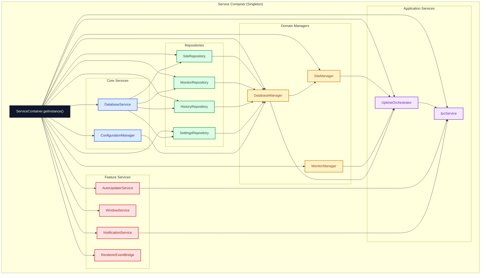
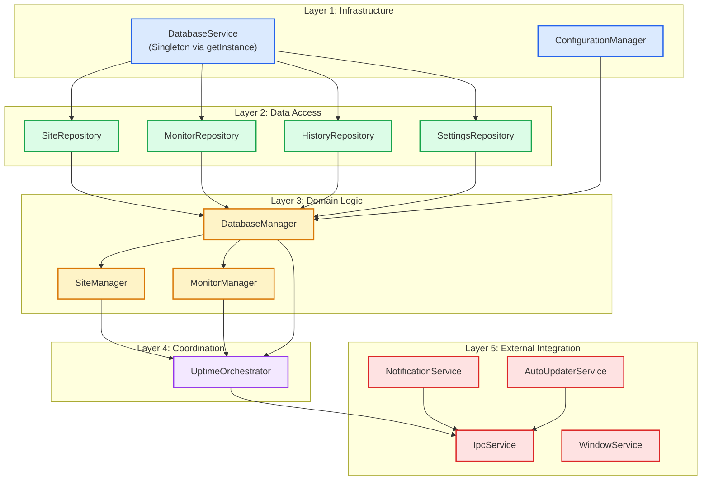
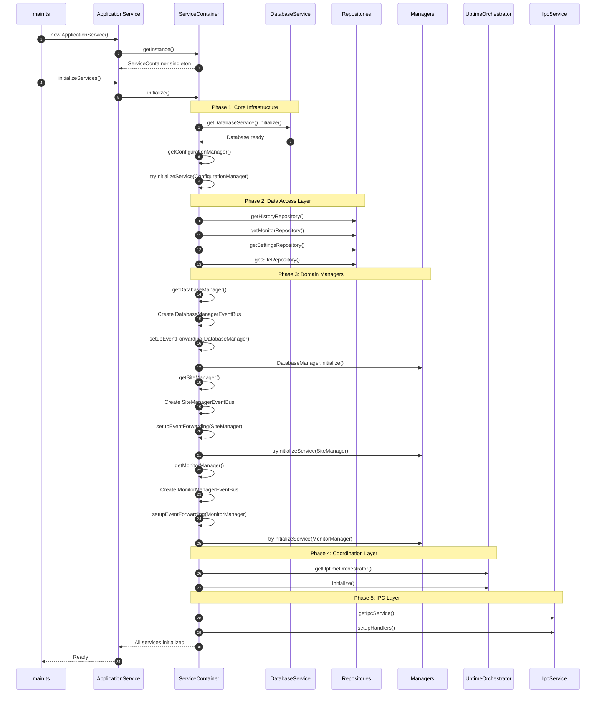
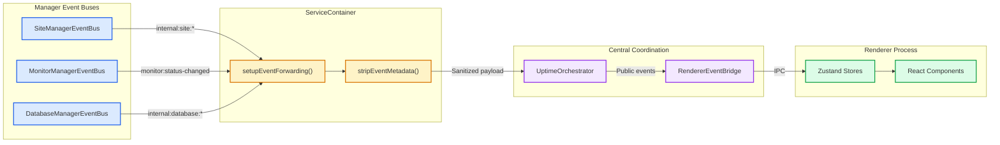

# ADR-007: Service Container and Dependency Injection Pattern

## Table of Contents

1. [Status](#status)
2. [Context](#context)
3. [Decision](#decision)
4. [Service Categories](#service-categories)
5. [Initialization Sequence](#initialization-sequence)
6. [Event Forwarding Architecture](#event-forwarding-architecture)
7. [Consequences](#consequences)
8. [Implementation Guidelines](#implementation-guidelines)
9. [Testing Considerations](#testing-considerations)
10. [Compliance](#compliance)
11. [Related ADRs](#related-adrs)

## Status

**Accepted** - Core bootstrap pattern for all Electron main process services

## Context

The Electron main process requires coordination of multiple interdependent services including:

- Database services and repositories
- Domain managers (Site, Monitor, Database)
- IPC communication handlers
- Event buses for inter-component communication
- Utility services (Window, Notifications, Auto-updater)

Without centralized dependency management, the application would face:

- **Initialization order issues**: Services depending on uninitialized dependencies
- **Circular dependency risks**: Managers requiring each other during construction
- **Singleton management complexity**: Multiple instances of services that should be singletons
- **Testing difficulties**: Hard-coded dependencies preventing mocking and isolation
- **Event bus fragmentation**: Multiple disconnected event buses without coordination

## Decision

We will implement a **centralized Service Container** pattern using lazy initialization and singleton management for all Electron main process services.

### Service Container Architecture Overview



### 1. Singleton Container Pattern

```typescript
export class ServiceContainer {
 private static instance: ServiceContainer | undefined;

 public static getInstance(config?: ServiceContainerConfig): ServiceContainer {
  ServiceContainer.instance ??= new ServiceContainer(config ?? {});
  return ServiceContainer.instance;
 }

 public static getExistingInstance(): ServiceContainer | undefined {
  return ServiceContainer.instance;
 }

 public static resetForTesting(): void {
  ServiceContainer.instance = undefined;
 }

 private constructor(config: ServiceContainerConfig = {}) {
  this.config = config;
 }
}
```

### 2. Lazy Initialization with Dependency Resolution

Each service is lazily initialized when first requested, with dependencies resolved automatically:

```typescript
public getSiteManager(): SiteManager {
    if (!this.siteManager) {
        // Dependencies are resolved via other getter methods
        const siteEventBus = new TypedEventBus<UptimeEvents>("SiteManagerEventBus");

        this.siteManager = new SiteManager({
            configurationManager: this.getConfigurationManager(),
            databaseService: this.getDatabaseService(),
            eventEmitter: siteEventBus,
            historyRepository: this.getHistoryRepository(),
            monitoringOperations: this.createMonitoringOperations(),
            monitorRepository: this.getMonitorRepository(),
            settingsRepository: this.getSettingsRepository(),
            siteRepository: this.getSiteRepository(),
        });

        // Set up event forwarding to orchestrator
        this.setupEventForwarding(siteEventBus, "SiteManager");
    }
    return this.siteManager;
}
```

### 3. Explicit Initialization Sequence

The `initialize()` method ensures services are created and initialized in the correct order.

It is also **idempotent**: repeated calls reuse the same in-flight promise.

```typescript
public async initialize(): Promise<void> {
    logger.info("[ServiceContainer] Initializing services");

    // Phase 1: Core infrastructure
    this.getDatabaseService().initialize();
    await this.tryInitializeService(this.getConfigurationManager(), "ConfigurationManager");

    // Phase 2: Repositories (depend on DatabaseService)
    this.getHistoryRepository();
    this.getMonitorRepository();
    this.getSettingsRepository();
    this.getSiteRepository();

    // Phase 3: Orchestrator (initializes the managers it coordinates)
    await this.getUptimeOrchestrator().initialize();

    // Phase 4: IPC handlers (expose orchestrator to renderer)
    this.getIpcService().setupHandlers();

    // Phase 5: Background schedulers (depend on IPC readiness)
    await this.tryInitializeService(this.getCloudSyncScheduler(), "CloudSyncScheduler");

    logger.info("[ServiceContainer] All services initialized successfully");
}
```

### 4. Cross-Manager Communication via Operations Interface

To avoid circular dependencies between managers, the container provides operation interfaces:

```typescript
const monitoringOperations: IMonitoringOperations = {
 setHistoryLimit: async (limit: number): Promise<void> => {
  const databaseManager = this.getDatabaseManager();
  await databaseManager.setHistoryLimit(limit);
 },

 setupNewMonitors: async (
  site: Site,
  newMonitorIds: string[]
 ): Promise<void> => {
  const monitorManager = this.getMonitorManager();
  return monitorManager.setupNewMonitors(site, newMonitorIds);
 },

 startMonitoringForSite: async (
  identifier: string,
  monitorId: string
 ): Promise<boolean> => {
  const monitorManager = this.getMonitorManager();
  return monitorManager.startMonitoringForSite(identifier, monitorId);
 },

 stopMonitoringForSite: async (
  identifier: string,
  monitorId: string
 ): Promise<boolean> => {
  const monitorManager = this.getMonitorManager();
  return monitorManager.stopMonitoringForSite(identifier, monitorId);
 },
};
```

## Service Categories

### Service Dependency Hierarchy



### 1. Core Services (Layer 1)

Infrastructure services with no domain dependencies:

| Service                | Responsibility               | Initialization        |
| ---------------------- | ---------------------------- | --------------------- |
| `DatabaseService`      | SQLite connection management | Synchronous singleton |
| `ConfigurationManager` | Application configuration    | Async initialization  |

### 2. Repositories (Layer 2)

Data access layer implementing ADR-001 Repository Pattern:

| Repository           | Domain              | Dependencies    |
| -------------------- | ------------------- | --------------- |
| `SiteRepository`     | Site persistence    | DatabaseService |
| `MonitorRepository`  | Monitor persistence | DatabaseService |
| `HistoryRepository`  | Status history      | DatabaseService |
| `SettingsRepository` | App settings        | DatabaseService |

### 3. Domain Managers (Layer 3)

Business logic coordinators with event bus integration:

| Manager           | Responsibility                 | Event Bus               |
| ----------------- | ------------------------------ | ----------------------- |
| `DatabaseManager` | Data operations, import/export | DatabaseManagerEventBus |
| `SiteManager`     | Site lifecycle, caching        | SiteManagerEventBus     |
| `MonitorManager`  | Monitoring operations          | MonitorManagerEventBus  |

### 4. Application Services (Layer 4-5)

High-level coordination and external integration:

| Service               | Role                     | Dependencies                         |
| --------------------- | ------------------------ | ------------------------------------ |
| `UptimeOrchestrator`  | Central coordinator      | All managers                         |
| `IpcService`          | Renderer communication   | Orchestrator, Updater, Notifications |
| `NotificationService` | System notifications     | None                                 |
| `WindowService`       | BrowserWindow management | None                                 |
| `AutoUpdaterService`  | App updates              | None                                 |

## Initialization Sequence

### Application Bootstrap Flow



## Event Forwarding Architecture

The ServiceContainer coordinates event forwarding from manager-specific event buses to the central orchestrator:

### Event Flow Between Managers



### Forwarded Events

The container forwards these events from manager buses to the orchestrator:

```typescript
const eventsToForward = [
 // Monitor events
 "monitor:status-changed",
 "monitor:up",
 "monitor:down",
 "internal:monitor:started",
 "internal:monitor:stopped",
 "internal:monitor:manual-check-completed",
 "internal:monitor:site-setup-completed",

 // Site events
 "internal:site:added",
 "internal:site:removed",
 "internal:site:updated",
 "sites:state-synchronized",

 // Database events
 "internal:database:data-imported",
 "internal:database:history-limit-updated",
 "internal:database:sites-refreshed",
 "internal:database:update-sites-cache-requested",

 // System events
 "system:error",
] as const;
```

### Metadata Stripping

Event payloads are sanitized before forwarding to remove bus-specific metadata:

```typescript
private stripEventMetadata<EventName extends keyof UptimeEvents>(
    eventName: EventName,
    payload: ForwardableEventPayload<EventName>
): UptimeEvents[EventName] {
    // Remove _meta, _originalMeta, and symbol-based metadata
    // Preserve original payload shape for orchestrator consumption
}
```

## Consequences

### Positive

- **Centralized dependency management**: Single source of truth for service instances
- **Correct initialization order**: Explicit sequence prevents dependency issues
- **Singleton guarantees**: Each service instantiated exactly once
- **Event bus coordination**: Manager events flow to central orchestrator
- **Testability**: `resetForTesting()` enables clean test isolation
- **Debug logging**: Optional verbose logging for initialization troubleshooting
- **Introspection**: `getInitializationStatus()` and `getInitializedServices()` for diagnostics

### Negative

- **Single point of failure**: Container issues affect entire application
- **Initialization complexity**: Sequence must be carefully maintained
- **Memory footprint**: All services persist for application lifetime
- **Learning curve**: Developers must understand container patterns

### Neutral

- **Lazy initialization**: Services created on first access (not at container creation)
- **No runtime DI framework**: Custom implementation vs. external library

## Implementation Guidelines

### 1. Adding a New Service

```typescript
// 1. Add private field
private myNewService?: MyNewService;

// 2. Add getter with lazy initialization
public getMyNewService(): MyNewService {
    if (!this.myNewService) {
        this.myNewService = new MyNewService({
            dependency1: this.getDependency1(),
            dependency2: this.getDependency2(),
        });
        if (this.config.enableDebugLogging) {
            logger.debug("[ServiceContainer] Created MyNewService");
        }
    }
    return this.myNewService;
}

// 3. Add to getInitializationStatus()
MyNewService: this.myNewService !== undefined,

// 4. Add to getInitializedServices() serviceMap
MyNewService: this.myNewService,

// 5. If service has initialize(), add to initialize() sequence
await this.tryInitializeService(this.getMyNewService(), "MyNewService");
```

### 2. Adding Event Bus Forwarding

```typescript
// Create typed event bus for manager
const myManagerEventBus = new TypedEventBus<UptimeEvents>("MyManagerEventBus");

// Set up forwarding after manager creation
this.setupEventForwarding(myManagerEventBus, "MyManager");
```

### 3. Avoiding Circular Dependencies

Use operation interfaces instead of direct manager references:

```typescript
// ❌ Bad - direct circular reference
class SiteManager {
 constructor(private monitorManager: MonitorManager) {}
}

// ✅ Good - operation interface
interface IMonitoringOperations {
 startMonitoringForSite: (
  identifier: string,
  monitorId: string
 ) => Promise<boolean>;
}

class SiteManager {
 constructor(private monitoringOperations: IMonitoringOperations) {}
}
```

## Testing Considerations

### Test Isolation

```typescript
beforeEach(() => {
 // Reset singleton for clean test state
 ServiceContainer.resetForTesting();
});

afterEach(() => {
 ServiceContainer.resetForTesting();
});
```

### Mocking Dependencies

```typescript
// Create container with test configuration
const container = ServiceContainer.getInstance({
 enableDebugLogging: true,
 notificationConfig: {
  showDownAlerts: false,
  showUpAlerts: false,
 },
});
```

### Verifying Initialization

```typescript
it("should initialize all services in correct order", async () => {
 const container = ServiceContainer.getInstance();
 await container.initialize();

 const status = container.getInitializationStatus();
 expect(status.DatabaseService).toBe(true);
 expect(status.SiteManager).toBe(true);
 expect(status.UptimeOrchestrator).toBe(true);
});
```

## Compliance

All Electron main process services are managed through `ServiceContainer`:

- ✅ `DatabaseService` - Core infrastructure
- ✅ `ConfigurationManager` - Application configuration
- ✅ `SiteRepository`, `MonitorRepository`, `HistoryRepository`, `SettingsRepository` - Data access
- ✅ `DatabaseManager`, `SiteManager`, `MonitorManager` - Domain logic
- ✅ `UptimeOrchestrator` - Central coordination
- ✅ `IpcService` - Renderer communication
- ✅ `NotificationService`, `WindowService`, `AutoUpdaterService` - Feature services
- ✅ `RendererEventBridge` - Event forwarding

### Current Implementation Audit (2025-11-25)

- Verified `electron/services/ServiceContainer.ts` implements singleton pattern with lazy initialization
- Confirmed `initialize()` method follows documented phase sequence
- Checked event forwarding setup for all three manager event buses
- Validated `resetForTesting()` usage across test files for proper isolation
- Reviewed `ApplicationService` integration for proper container lifecycle management

## Related ADRs

- [ADR-001: Repository Pattern](./ADR_001_REPOSITORY_PATTERN.md) - Data access layer managed by container
- [ADR-002: Event-Driven Architecture](./ADR_002_EVENT_DRIVEN_ARCHITECTURE.md) - Event buses coordinated by container
- [ADR-005: IPC Communication Protocol](./ADR_005_IPC_COMMUNICATION_PROTOCOL.md) - IpcService managed by container
