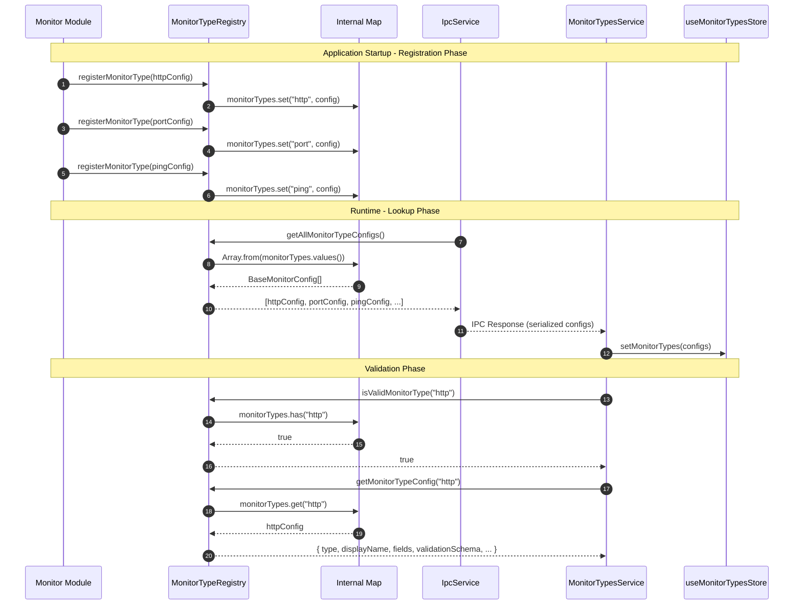
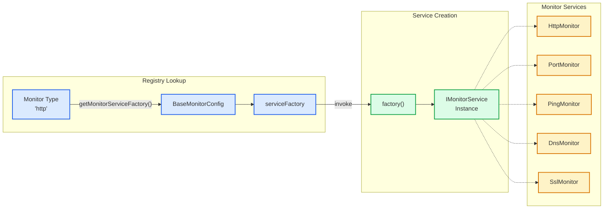
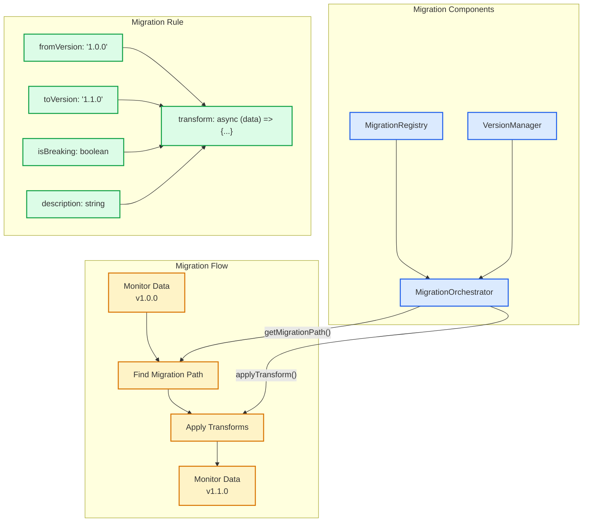

# ADR-008: Monitor Type Registry and Plugin Architecture

## Table of Contents

1. [Status](#status)
2. [Context](#context)
3. [Decision](#decision)
4. [Registry Architecture](#registry-architecture)
5. [Monitor Type Configuration](#monitor-type-configuration)
6. [Migration System](#migration-system)
7. [Frontend Integration](#frontend-integration)
8. [Consequences](#consequences)
9. [Implementation Guidelines](#implementation-guidelines)
10. [Compliance](#compliance)
11. [Related ADRs](#related-adrs)

## Status

**Accepted** - Core extensibility pattern for all monitoring capabilities

## Context

The application needed to support multiple monitor types (HTTP, Port, Ping, DNS, SSL, etc.) with:

- Different validation schemas per type
- Type-specific UI form field definitions
- Distinct service implementations for each monitoring protocol
- Version migration support for evolving configurations
- Dynamic form generation in the frontend

A hard-coded approach would require changes in multiple files when adding new monitor types:

- Validation schemas
- Type definitions
- Service implementations
- UI components
- IPC handlers

This leads to:

- **Code duplication**: Similar patterns repeated for each type
- **Maintenance burden**: Changes require updates in multiple files
- **Testing complexity**: Each type requires separate test coverage
- **Brittleness**: Easy to miss a file when adding new types

## Decision

We will implement a **Plugin-Based Monitor Type Registry** that centralizes monitor type definitions with:

1. **Single registration point** for each monitor type
2. **Zod schema binding** for runtime validation
3. **Dynamic field definitions** for UI form generation
4. **Service factory pattern** for monitor instantiation
5. **Version management** with migration support

### Monitor Type Registry Overview

```mermaid
graph TB
    subgraph "Monitor Type Registry"
        Registry["MonitorTypeRegistry<br/>(Map<string, BaseMonitorConfig>)"]

        subgraph "Registration API"
            Register["registerMonitorType()"]
            GetConfig["getMonitorTypeConfig()"]
            GetAll["getAllMonitorTypeConfigs()"]
            IsValid["isValidMonitorType()"]
            GetFactory["getMonitorServiceFactory()"]
        end

        subgraph "Registered Types"
            HTTP["http"]
            HTTPHeader["http-header"]
            HTTPKeyword["http-keyword"]
            HTTPJson["http-json"]
            HTTPStatus["http-status"]
            HTTPLatency["http-latency"]
            Port["port"]
            Ping["ping"]
            DNS["dns"]
            SSL["ssl"]
            CDN["cdn-edge-consistency"]
            Replication["replication"]
            Heartbeat["server-heartbeat"]
            WebSocket["websocket-keepalive"]
        end
    end

    subgraph "BaseMonitorConfig"
        Type["type: string"]
        DisplayName["displayName: string"]
        Description["description: string"]
        Fields["fields: MonitorFieldDefinition[]"]
        Schema["validationSchema: z.ZodType"]
        Factory["serviceFactory: () => IMonitorService"]
        UIConfig["uiConfig?: MonitorUIConfig"]
        Version["version: string"]
    end

    subgraph "Consumer Layers"
        IPC["IpcService<br/>(get-all-monitor-types)"]
        Frontend["MonitorTypesService"]
        Validation["Monitor Validation"]
        Services["Monitor Services"]
    end

    Register --> Registry
    GetConfig --> Registry
    GetAll --> Registry
    IsValid --> Registry
    GetFactory --> Registry

    Registry --> HTTP
    Registry --> HTTPHeader
    Registry --> HTTPKeyword
    Registry --> HTTPJson
    Registry --> HTTPStatus
    Registry --> HTTPLatency
    Registry --> Port
    Registry --> Ping
    Registry --> DNS
    Registry --> SSL
    Registry --> CDN
    Registry --> Replication
    Registry --> Heartbeat
    Registry --> WebSocket

    HTTP --> Type
    HTTP --> DisplayName
    HTTP --> Description
    HTTP --> Fields
    HTTP --> Schema
    HTTP --> Factory
    HTTP --> UIConfig
    HTTP --> Version

    GetAll --> IPC
    IPC --> Frontend
    Schema --> Validation
    Factory --> Services

    classDef registry fill:#dbeafe,stroke:#2563eb,stroke-width:2px
    classDef api fill:#dcfce7,stroke:#16a34a,stroke-width:2px
    classDef types fill:#fef3c7,stroke:#d97706,stroke-width:2px
    classDef config fill:#f3e8ff,stroke:#9333ea,stroke-width:2px
    classDef consumer fill:#fee2e2,stroke:#dc2626,stroke-width:2px

    class Registry registry
    class Register,GetConfig,GetAll,IsValid,GetFactory api
    class HTTP,HTTPHeader,HTTPKeyword,HTTPJson,HTTPStatus,HTTPLatency,Port,Ping,DNS,SSL,CDN,Replication,Heartbeat,WebSocket types
    class Type,DisplayName,Description,Fields,Schema,Factory,UIConfig,Version config
    class IPC,Frontend,Validation,Services consumer
```



### 1. BaseMonitorConfig Interface

Each monitor type provides a comprehensive configuration object:

```typescript
export interface BaseMonitorConfig {
    /** Unique identifier for the monitor type */
    readonly type: string;

    /** Human-readable display name for UI */
    readonly displayName: string;

    /** Description of what this monitor checks */
    readonly description: string;

    /** Field definitions for dynamic form generation */
    readonly fields: MonitorFieldDefinition[];

    /** Zod validation schema for this monitor type */
    readonly validationSchema: z.ZodType;

    /** Factory function to create monitor service instances */
    readonly serviceFactory: () => IMonitorService;

    /** UI display configuration */
    readonly uiConfig?: MonitorUIConfig;

    /** Version of the monitor implementation */
    readonly version: string;
}
```

### 2. Internal Registry Storage

The registry uses a Map for O(1) lookup performance:

```typescript
const monitorTypes = new Map<string, BaseMonitorConfig>();

export function registerMonitorType(config: BaseMonitorConfig): void {
    monitorTypes.set(config.type, config);
}

export function getMonitorTypeConfig(type: string): BaseMonitorConfig | undefined {
    return monitorTypes.get(type);
}

export function isValidMonitorType(type: string): boolean {
    return monitorTypes.has(type);
}

export function getAllMonitorTypeConfigs(): BaseMonitorConfig[] {
    return Array.from(monitorTypes.values());
}

export function getRegisteredMonitorTypes(): readonly string[] {
    return Array.from(monitorTypes.keys());
}
```

### 3. Monitor Type Registration Example

```typescript
registerMonitorType({
    type: "http",
    displayName: "HTTP (Website/API)",
    description: "Monitors HTTP/HTTPS endpoints for availability and response time",
    version: "1.0.0",

    fields: [
        {
            name: "url",
            label: "Website URL",
            type: "url",
            placeholder: "https://example.com",
            required: true,
            helpText: "Enter the full URL including http:// or https://",
        },
    ],

    validationSchema: monitorSchemas.http,

    serviceFactory: () => new HttpMonitor(),

    uiConfig: {
        display: {
            showAdvancedMetrics: true,
            showUrl: true,
        },
        detailFormats: {
            analyticsLabel: "HTTP Response Time",
            historyDetail: (details: string) => `Response Code: ${details}`,
        },
        formatDetail: (details: string) => `Response Code: ${details}`,
        formatTitleSuffix: (monitor: Monitor) =>
            monitor.url ? ` (${monitor.url})` : "",
        helpTexts: {
            primary: "Enter the full URL including http:// or https://",
            secondary: "The monitor will check this URL according to your monitoring interval",
        },
        supportsAdvancedAnalytics: true,
        supportsResponseTime: true,
    },
});
```

## Registry Architecture

### Registration and Lookup Flow



### Service Factory Pattern



## Monitor Type Configuration

### Field Definition Schema

Each monitor type defines fields for dynamic form generation:

```typescript
interface MonitorFieldDefinition {
    /** Field identifier matching monitor property name */
    name: string;

    /** Human-readable label for the form field */
    label: string;

    /** Field input type */
    type: "text" | "url" | "number" | "select";

    /** Placeholder text for empty fields */
    placeholder?: string;

    /** Whether the field is required */
    required: boolean;

    /** Help text displayed near the field */
    helpText?: string;

    /** For number fields: minimum value */
    min?: number;

    /** For number fields: maximum value */
    max?: number;

    /** For select fields: available options */
    options?: Array<{ label: string; value: string }>;
}
```

### UI Configuration

Display preferences and formatters for the frontend:

```typescript
interface MonitorUIConfig {
    /** Display preferences */
    display?: {
        showAdvancedMetrics?: boolean;
        showUrl?: boolean;
        showPort?: boolean;
    };

    /** Detail label formatters */
    detailFormats?: {
        analyticsLabel?: string;
        historyDetail?: (details: string) => string;
    };

    /** Format function for history detail column */
    formatDetail?: (details: string) => string;

    /** Format function for chart title suffix */
    formatTitleSuffix?: (monitor: Monitor) => string;

    /** Help text for form fields */
    helpTexts?: {
        primary?: string;
        secondary?: string;
    };

    /** Feature support flags */
    supportsAdvancedAnalytics?: boolean;
    supportsResponseTime?: boolean;
}
```

### Currently Registered Monitor Types

| Type                   | Display Name            | Category       |
| ---------------------- | ----------------------- | -------------- |
| `http`                 | HTTP (Website/API)      | HTTP           |
| `http-header`          | HTTP Header Match       | HTTP           |
| `http-keyword`         | HTTP Keyword Match      | HTTP           |
| `http-json`            | HTTP JSON Match         | HTTP           |
| `http-status`          | HTTP Status Code        | HTTP           |
| `http-latency`         | HTTP Latency Threshold  | HTTP           |
| `port`                 | Port (Host/Port)        | Network        |
| `ping`                 | Ping (Host)             | Network        |
| `dns`                  | DNS (Domain Resolution) | Network        |
| `ssl`                  | SSL Certificate         | Security       |
| `cdn-edge-consistency` | CDN Edge Consistency    | Infrastructure |
| `replication`          | Replication Lag         | Database       |
| `server-heartbeat`     | Server Heartbeat        | Infrastructure |
| `websocket-keepalive`  | WebSocket Keepalive     | Real-time      |

## Migration System

The registry includes a versioned migration system for evolving monitor configurations:

### Migration Architecture



### Migration Rule Interface

```typescript
export interface MigrationRule {
    /** Source version for the migration */
    fromVersion: string;

    /** Target version for the migration */
    toVersion: string;

    /** Human-readable description */
    description: string;

    /** Whether migration may require user intervention */
    isBreaking: boolean;

    /** Transformation function */
    transform: (data: UnknownRecord) => Promise<UnknownRecord>;
}
```

### Migration Usage

```typescript
// Register migration
migrationRegistry.registerMigration("http", {
    fromVersion: "1.0.0",
    toVersion: "1.1.0",
    description: "Add timeout field with default value",
    isBreaking: false,
    transform: async (data) => ({
        ...data,
        timeout: data.timeout ?? 30000,
    }),
});

// Apply migration
const result = await migrateMonitorType(
    "http",
    "1.0.0",
    "1.1.0",
    monitorData
);

if (result.success) {
    console.log("Applied migrations:", result.appliedMigrations);
    return result.data;
}
```

## Frontend Integration

### IPC Exposure

The registry is exposed to the renderer via IPC:

```typescript
// IpcService.ts
registerStandardizedIpcHandler(
    MONITOR_TYPES_CHANNELS.getAllMonitorTypes,
    async () => {
        const configs = getAllMonitorTypeConfigs();
        return configs.map(serializeMonitorConfig);
    },
    MonitorTypesHandlerValidators.getAllMonitorTypes,
    this.registeredIpcHandlers
);
```

### Frontend Service

```typescript
// MonitorTypesService.ts
export const MonitorTypesService = {
    async getAllMonitorTypes(): Promise<MonitorTypeConfig[]> {
        return window.electronAPI.monitorTypes.getAllMonitorTypes();
    },

    async getMonitorTypeConfig(type: string): Promise<MonitorTypeConfig | undefined> {
        return window.electronAPI.monitorTypes.getMonitorTypeConfig(type);
    },

    isValidMonitorType(type: string): boolean {
        const store = useMonitorTypesStore.getState();
        return store.monitorTypes.some((t) => t.type === type);
    },
};
```

### Zustand Store Integration

```typescript
// useMonitorTypesStore.ts
interface MonitorTypesState {
    monitorTypes: MonitorTypeConfig[];
    isLoading: boolean;
    error: string | undefined;
}

interface MonitorTypesActions {
    loadMonitorTypes: () => Promise<void>;
    getMonitorTypeByType: (type: string) => MonitorTypeConfig | undefined;
    getFieldsForType: (type: string) => MonitorFieldDefinition[];
}

export const useMonitorTypesStore = create<MonitorTypesState & MonitorTypesActions>()(
    (set, get) => ({
        monitorTypes: [],
        isLoading: false,
        error: undefined,

        loadMonitorTypes: async () => {
            set({ isLoading: true, error: undefined });
            try {
                const types = await MonitorTypesService.getAllMonitorTypes();
                set({ monitorTypes: types, isLoading: false });
            } catch (error) {
                set({ error: String(error), isLoading: false });
            }
        },

        getMonitorTypeByType: (type) => {
            return get().monitorTypes.find((t) => t.type === type);
        },

        getFieldsForType: (type) => {
            const config = get().getMonitorTypeByType(type);
            return config?.fields ?? [];
        },
    })
);
```

## Consequences

### Positive

- **Single registration point**: One file to modify when adding new types
- **Type safety**: Zod schemas provide compile-time and runtime validation
- **Dynamic UI**: Forms generated from field definitions
- **Extensibility**: New types require no changes to existing code
- **Version support**: Migration system handles schema evolution
- **Consistency**: All types follow the same registration pattern
- **Testability**: Registry functions are easily unit tested

### Negative

- **Initial complexity**: More upfront design for simple types
- **Serialization overhead**: Configs must be serialized for IPC
- **Memory usage**: All type configs loaded at startup
- **Learning curve**: Developers must understand registry patterns

### Neutral

- **Centralized registration**: All types defined in one module
- **Factory pattern**: Services created on demand, not at registration

## Implementation Guidelines

### Adding a New Monitor Type

1. **Create the Monitor Service**

   ```typescript
   // electron/services/monitoring/MyNewMonitor.ts
   export class MyNewMonitor implements IMonitorService {
       async check(config: Monitor): Promise<MonitorCheckResult> {
           // Implementation
       }
   }
   ```

2. **Define the Zod Schema**

   ```typescript
   // shared/validation/schemas.ts
   export const myNewMonitorSchema = baseMonitorSchema.extend({
       type: z.literal("my-new-type"),
       customField: z.string().min(1),
   }).strict();
   ```

3. **Register the Monitor Type**

   ```typescript
   // electron/services/monitoring/MonitorTypeRegistry.ts
   registerMonitorType({
       type: "my-new-type",
       displayName: "My New Monitor",
       description: "Monitors something new",
       version: "1.0.0",
       fields: [
           {
               name: "customField",
               label: "Custom Field",
               type: "text",
               required: true,
               helpText: "Enter the custom value",
           },
       ],
       validationSchema: monitorSchemas["my-new-type"],
       serviceFactory: () => new MyNewMonitor(),
       uiConfig: {
           display: { showAdvancedMetrics: true },
           supportsResponseTime: true,
       },
   });

   // Set version
   versionManager.setVersion("my-new-type", "1.0.0");
   ```

4. **Update TypeScript Types**

   ```typescript
   // shared/types.ts
   export type MonitorType =
       | "http"
       | "port"
       // ... existing types
       | "my-new-type";
   ```

### Adding a Migration

```typescript
// Register migration for type evolution
migrationRegistry.registerMigration("my-type", {
    fromVersion: "1.0.0",
    toVersion: "1.1.0",
    description: "Add new optional field with default",
    isBreaking: false,
    transform: async (data) => ({
        ...data,
        newField: data.newField ?? "default-value",
    }),
});
```

## Compliance

All monitor types are registered through `MonitorTypeRegistry`:

- ✅ `http` - HTTP/HTTPS endpoint monitoring
- ✅ `http-header` - HTTP header value validation
- ✅ `http-keyword` - Response body keyword matching
- ✅ `http-json` - JSON path value validation
- ✅ `http-status` - Status code verification
- ✅ `http-latency` - Response time threshold monitoring
- ✅ `port` - TCP port connectivity
- ✅ `ping` - ICMP ping monitoring
- ✅ `dns` - DNS record resolution
- ✅ `ssl` - TLS certificate monitoring
- ✅ `cdn-edge-consistency` - CDN edge response comparison
- ✅ `replication` - Database replication lag
- ✅ `server-heartbeat` - Heartbeat endpoint validation
- ✅ `websocket-keepalive` - WebSocket keepalive monitoring

### Current Implementation Audit (2025-11-25)

- Verified `electron/services/monitoring/MonitorTypeRegistry.ts` contains all 14 monitor type registrations
- Confirmed each registration includes `type`, `displayName`, `description`, `fields`, `validationSchema`, `serviceFactory`, and `version`
- Checked `MigrationSystem.ts` provides `MigrationRegistry`, `MigrationOrchestrator`, and `VersionManager`
- Validated IPC exposure via `IpcService.setupMonitorTypesHandlers()`
- Reviewed frontend integration through `MonitorTypesService` and `useMonitorTypesStore`

## Related ADRs

- [ADR-007: Service Container](./ADR_007_SERVICE_CONTAINER_DEPENDENCY_INJECTION.md) - Service factories managed by container
- [ADR-009: Validation Strategy](./ADR_009_VALIDATION_STRATEGY.md) - Zod schemas used by registry
- [ADR-005: IPC Communication Protocol](./ADR_005_IPC_COMMUNICATION_PROTOCOL.md) - Registry exposed via IPC
