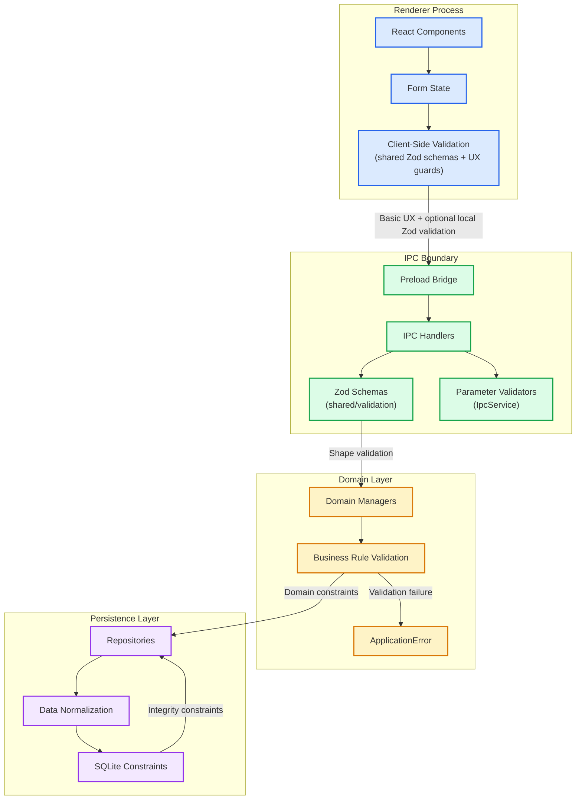
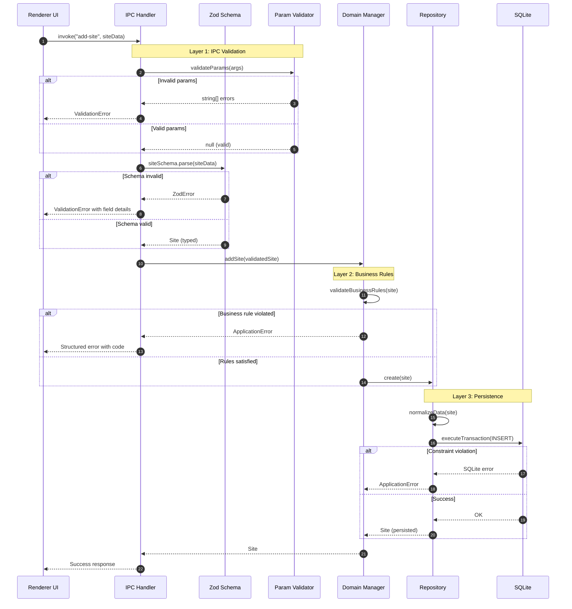
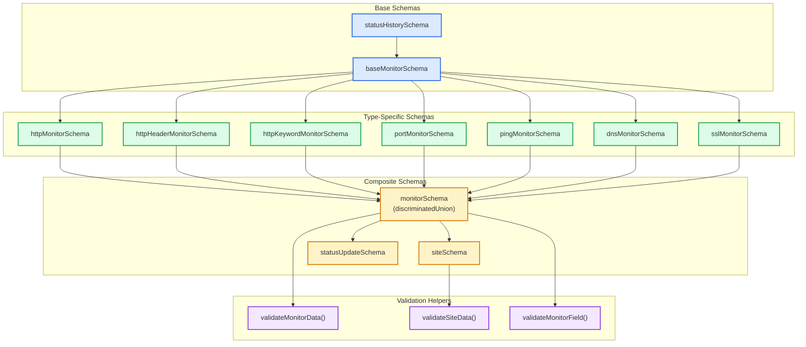

# ADR-009: Layered Validation Strategy with Zod

## Table of Contents

1. [Status](#status)
2. [Context](#context)
3. [Decision](#decision)
4. [Validation Layers](#validation-layers)
5. [Zod Schema Architecture](#zod-schema-architecture)
6. [IPC Validation](#ipc-validation)
7. [Manager Validation](#manager-validation)
8. [Repository Validation](#repository-validation)
9. [Consequences](#consequences)
10. [Implementation Guidelines](#implementation-guidelines)
11. [Compliance](#compliance)
12. [Related ADRs](#related-adrs)

## Status

**Accepted** - Core data integrity pattern across all application layers

## Context

The application processes data across multiple boundaries:

- Renderer to main process via IPC
- IPC handlers to domain managers
- Managers to repositories
- Repositories to SQLite database

Each boundary presents validation challenges:

- **Type safety**: TypeScript provides compile-time safety but not runtime guarantees
- **IPC boundary**: Data arrives as `unknown` from the renderer process
- **Business rules**: Domain-specific constraints beyond type validation
- **Data integrity**: Database constraints and normalization requirements

Without a coherent validation strategy:

- **Runtime errors**: Invalid data causes crashes deep in the call stack
- **Inconsistent handling**: Different validation approaches per module
- **Silent failures**: Invalid data persisted without detection
- **Poor error messages**: Users receive technical errors instead of actionable feedback

## Decision

We will implement a **Layered Validation Strategy** using Zod as the primary validation library, with each layer having distinct responsibilities:

### Validation Architecture Overview



### Core Principles

1. **Single Responsibility Per Layer**: Each layer validates what it owns
2. **Fail Fast**: Reject invalid data at the earliest boundary
3. **Structured Errors**: Use `ApplicationError` for actionable feedback
4. **Immutable Inputs**: Never mutate incoming data; create sanitized copies
5. **Tests at the Source**: Each validation rule tested in its owning layer

## Validation Layers

### Layer Responsibility Matrix

| Layer                   | Entry Points                                         | Responsibilities                                                                                                                   | Tooling                               |
| ----------------------- | ---------------------------------------------------- | ---------------------------------------------------------------------------------------------------------------------------------- | ------------------------------------- |
| **UI/Renderer**         | React components, form state                         | Basic UX guards (required fields, formatting hints). Optional local schema checks for faster feedback. Never trusts its own input. | Shared Zod schemas, client helpers    |
| **IPC Boundary**        | `electron/preload`, `registerStandardizedIpcHandler` | Type and shape validation for IPC payloads. Rejects malformed input early.                                                         | Zod schemas, IPC validators           |
| **Managers**            | `SiteManager`, `MonitorManager`, `DatabaseManager`   | Business rule validation: cross-entity invariants, referential checks, domain constraints.                                         | Domain validators, `ApplicationError` |
| **Repositories**        | `electron/services/database`                         | Persistence invariants: unique constraints, transactional safety, data normalization.                                              | SQLite constraints, transactions      |
| **Background Services** | Monitoring scheduler, notifications                  | Runtime guardrails: invalid schedules, retry logic. Surfaces issues via structured errors.                                         | Domain services, telemetry            |

### Validation Flow



## Zod Schema Architecture

### Shared Schema Organization

Canonical Zod schemas are organized under `shared/validation/*` for cross-process consistency.

- Monitor schemas + helpers: `shared/validation/monitorSchemas.ts`
- Site schemas: `shared/validation/siteSchemas.ts`
- Status update schemas: `shared/validation/statusUpdateSchemas.ts`
- Reusable safe-parse guards: `shared/validation/guards.ts`

The renderer may validate locally using shared schemas (for example via `src/utils/monitorValidation.ts`) and the main process must validate again at IPC and manager boundaries.

```typescript
// shared/validation/monitorSchemas.ts (excerpt)
import * as z from "zod";

export const monitorSchema = z.discriminatedUnion("type", [
 // httpMonitorSchema,
 // portMonitorSchema,
 // ...
]);

export const monitorSchemas = {
 // http: httpMonitorSchema,
 // port: portMonitorSchema,
 // ...
} as const;

export function validateMonitorData(type: string, data: unknown) {
 // Returns a structured ValidationResult with success/errors/warnings.
}
```

### Internationalized error messaging

Zod schema errors are currently formatted into human-readable strings (for example via `shared/utils/zodIssueFormatting.ts`). This is suitable for developer diagnostics and basic UX, but it is not a durable i18n strategy.

For user-facing errors, prefer **structured errors** that can be localized:

- Use stable error `code`s (for example `ApplicationError.code`) + structured `details`.
- Avoid embedding localized English prose into the backend.
- Localize in the renderer based on `code` and `details`.

If we later localize Zod-derived errors, do it by returning structured issue data (path + issue kind) and mapping to translation keys in the renderer.

### Schema Composition Pattern



### Validation Result Interface

```typescript
export interface ValidationResult {
 success: boolean;
 data?: unknown;
 errors: string[];
 warnings: string[];
 metadata: {
  monitorType?: string;
  fieldName?: string;
  siteIdentifier?: string;
  monitorCount?: number;
  validatedDataSize?: number;
 };
}
```

## IPC Validation

### Parameter Validators

IPC handlers use a two-stage validation approach:

```typescript
// electron/services/ipc/validators/sites.ts

// Stage 1: Parameter count and basic type validation
export const SiteHandlerValidators: SiteHandlerValidatorsInterface = {
 addSite: createParamValidator(1, [
  (value) => IpcValidators.requiredObject(value, "site data"),
 ]),

 removeSite: createParamValidator(1, [
  (value) => IpcValidators.requiredString(value, "site identifier"),
 ]),

 getSites: createNoParamsValidator(),

 updateSite: createParamValidator(2, [
  (value) => IpcValidators.requiredString(value, "identifier"),
  (value) => IpcValidators.requiredObject(value, "updates"),
 ]),
};

// Stage 2: Schema validation in handler
registerStandardizedIpcHandler(
 SITES_CHANNELS.addSite,
 async (...args: unknown[]) => {
  const siteData = args[0];
  const parseResult = siteSchema.safeParse(siteData);

  if (!parseResult.success) {
   throw new ValidationError(
    "Invalid site data",
    parseResult.error.issues.map(formatZodIssue)
   );
  }

  return orchestrator.addSite(parseResult.data);
 },
 SiteHandlerValidators.addSite,
 registeredIpcHandlers
);
```

### Standardized IPC Handler Pattern

```typescript
// electron/services/ipc/utils.ts
//
// Key rules:
// - channel name comes from a shared *_CHANNELS registry (shared/types/preload.ts)
// - ipcMain.handle(...) is called only inside this centralized helper
// - validators run at the IPC boundary
import type { IpcInvokeChannel } from "@shared/types/ipc";
import { SITES_CHANNELS } from "@shared/types/preload";

export function registerStandardizedIpcHandler<
 TChannel extends IpcInvokeChannel,
>(
 channelName: TChannel,
 handler: StrictIpcInvokeHandler<TChannel>,
 validateParams: IpcParameterValidator | null,
 registeredHandlers: Set<IpcInvokeChannel>
): void {
 // Prevent duplicate handler registration
 if (registeredHandlers.has(channelName)) {
  throw new Error(`Duplicate IPC handler: ${channelName}`);
 }

 registeredHandlers.add(channelName);

 ipcMain.handle(channelName, async (_event, ...rawArgs: unknown[]) => {
  const { args, correlationId } = extractIpcCorrelationContext(rawArgs);

  // Stage 1: validate boundary parameters
  if (validateParams) {
   const errors = validateParams(args);
   if (errors) {
    return createValidationErrorResponse(channelName, errors, correlationId);
   }
  }

  // Stage 2: execute handler and normalize errors
  return executeIpcHandler(channelName, handler, args, correlationId);
 });
}

// Example usage (in a handler module):
registerStandardizedIpcHandler(
 SITES_CHANNELS.addSite,
 async (site) => uptimeOrchestrator.addSite(site),
 SiteHandlerValidators.addSite,
 registeredHandlers
);
```

## Manager Validation

### Business Rule Validation

Managers validate domain-specific rules after IPC schema validation:

```typescript
// electron/managers/SiteManager.ts
export class SiteManager {
 async addSite(site: Site): Promise<Site> {
  // Business rule: Site identifier must be unique
  const existing = await this.siteRepository.findByIdentifier(site.identifier);
  if (existing) {
   throw new ApplicationError({
    code: "DUPLICATE_SITE_IDENTIFIER",
    message: `Site with identifier '${site.identifier}' already exists`,
    operation: "SiteManager.addSite",
    details: { identifier: site.identifier },
   });
  }

  // Business rule: At least one monitor required
  if (site.monitors.length === 0) {
   throw new ApplicationError({
    code: "NO_MONITORS",
    message: "Site must have at least one monitor",
    operation: "SiteManager.addSite",
    details: { siteIdentifier: site.identifier },
   });
  }

  // Business rule: Monitor IDs must be unique within site
  const monitorIds = site.monitors.map((m) => m.id);
  const uniqueIds = new Set(monitorIds);
  if (uniqueIds.size !== monitorIds.length) {
   throw new ApplicationError({
    code: "DUPLICATE_MONITOR_ID",
    message: "Monitor IDs must be unique within a site",
    operation: "SiteManager.addSite",
    details: { siteIdentifier: site.identifier },
   });
  }

  return this.siteRepository.create(site);
 }
}
```

### ApplicationError Structure

```typescript
// shared/utils/errorHandling.ts
export interface ApplicationErrorOptions {
 /** Machine-readable error code */
 code: string;

 /** Human-readable error message */
 message: string;

 /** Operation that failed */
 operation: string;

 /** Additional context for debugging */
 details?: Record<string, unknown>;

 /** Original error if wrapping */
 cause?: Error;
}

export class ApplicationError extends Error {
 public readonly code: string;
 public readonly operation: string;
 public readonly details?: Record<string, unknown>;
 public readonly cause?: Error;

 constructor(options: ApplicationErrorOptions) {
  super(options.message);
  this.name = "ApplicationError";
  this.code = options.code;
  this.operation = options.operation;
  this.details = options.details;
  this.cause = options.cause;
 }
}
```

## Repository Validation

### Data Normalization

Repositories normalize data before persistence:

```typescript
// electron/services/database/SiteRepository.ts
export class SiteRepository {
 public async create(site: Site): Promise<Site> {
  return withDatabaseOperation(async () => {
   return this.databaseService.executeTransaction((db) => {
    // Normalize before persistence
    const normalizedSite = this.normalizeSite(site);

    this.createInternal(db, normalizedSite);
    return Promise.resolve(normalizedSite);
   });
  }, "SiteRepository.create");
 }

 private normalizeSite(site: Site): Site {
  return {
   ...site,
   identifier: site.identifier.trim(),
   name: site.name.trim(),
   monitors: site.monitors.map((monitor) => ({
    ...monitor,
    id: monitor.id.trim(),
    url: monitor.url?.trim().toLowerCase(),
   })),
  };
 }
}
```

### SQLite Constraints

Database schema enforces persistence-level constraints:

```sql
CREATE TABLE IF NOT EXISTS sites (
    identifier TEXT PRIMARY KEY NOT NULL,
    name TEXT NOT NULL,
    monitoring INTEGER NOT NULL DEFAULT 0,
    created_at INTEGER NOT NULL DEFAULT (strftime('%s', 'now') * 1000),
    updated_at INTEGER NOT NULL DEFAULT (strftime('%s', 'now') * 1000),
    CONSTRAINT chk_identifier_not_empty CHECK (length(trim(identifier)) > 0),
    CONSTRAINT chk_name_not_empty CHECK (length(trim(name)) > 0)
);

CREATE TABLE IF NOT EXISTS monitors (
    id TEXT PRIMARY KEY NOT NULL,
    site_identifier TEXT NOT NULL,
    type TEXT NOT NULL,
    status TEXT NOT NULL DEFAULT 'pending',
    FOREIGN KEY (site_identifier) REFERENCES sites(identifier)
        ON DELETE CASCADE ON UPDATE CASCADE,
    CONSTRAINT chk_id_not_empty CHECK (length(trim(id)) > 0)
);

CREATE UNIQUE INDEX IF NOT EXISTS idx_monitors_site_id
    ON monitors(site_identifier, id);
```

## Consequences

### Positive

- **Type safety at boundaries**: Runtime validation catches data issues early
- **Consistent error handling**: `ApplicationError` provides structured feedback
- **Single source of truth**: Schemas shared between renderer and main process
- **Maintainable validation**: Each layer owns its validation concerns
- **Testable**: Each validation layer can be unit tested independently
- **Developer experience**: Zod provides strong TypeScript inference

### Negative

- **Multiple validation points**: Data validated at each layer
- **Schema maintenance**: Schemas must stay in sync with types
- **Runtime overhead**: Validation adds processing time
- **Learning curve**: Developers must understand Zod patterns

### Neutral

- **Zod dependency**: Runtime validation library adds to bundle size
- **Strict mode**: `.strict()` schemas reject unknown properties

## Implementation Guidelines

### Adding New Validation

1. **Define Schema** (if new data structure)

   ```typescript
    // shared/validation/<domain>Schemas.ts
   export const newDataSchema = z
    .object({
     field: z.string().min(1),
     count: z.number().positive(),
    })
    .strict();
   ```

2. **Add IPC Validator**

   ```typescript
   // electron/services/ipc/validators/sites.ts
   export const NewHandlerValidators = {
    createNew: createParamValidator(1, [
     (value) => IpcValidators.requiredObject(value, "new data"),
    ]),
   };
   ```

3. **Add Business Rules in Manager**

   ```typescript
   // electron/managers/NewManager.ts
   async createNew(data: NewData): Promise<NewData> {
       if (data.count > MAX_ALLOWED) {
           throw new ApplicationError({
               code: "COUNT_EXCEEDED",
               message: `Count cannot exceed ${MAX_ALLOWED}`,
               operation: "NewManager.createNew",
               details: { count: data.count, max: MAX_ALLOWED },
           });
       }
       return this.repository.create(data);
   }
   ```

4. **Add Repository Normalization**

   ```typescript
   // electron/services/database/NewRepository.ts
   private normalizeData(data: NewData): NewData {
       return {
           ...data,
           field: data.field.trim(),
       };
   }
   ```

### Review Checklist

- [ ] IPC handler rejects invalid payloads before reaching managers
- [ ] Managers throw `ApplicationError` with remediation-friendly messages
- [ ] Repositories never assume data is valid—transactions enforce integrity
- [ ] Tests exist for new validation logic at each layer
- [ ] Schemas updated under `shared/validation/*`

## Compliance

All data flows follow the layered validation strategy:

### Zod Schemas

- ✅ `baseMonitorSchema` - Shared monitor fields
- ✅ `httpMonitorSchema`, `portMonitorSchema`, etc. - Type-specific monitors
- ✅ `monitorSchema` - Discriminated union of all types
- ✅ `siteSchema` - Complete site structure
- ✅ `statusUpdateSchema` - Monitor status updates

### IPC Validators

- ✅ `SiteHandlerValidators` - Site operations
- ✅ `MonitoringHandlerValidators` - Monitoring control
- ✅ `SettingsHandlerValidators` - Settings operations
- ✅ `DataHandlerValidators` - Import/export operations
- ✅ `MonitorTypeHandlerValidators` - Monitor type queries

### Validation Guards

- ✅ `validateSiteSnapshot()` - Site validation helper
- ✅ `validateStatusUpdate()` - Status update validation
- ✅ `validateMonitorData()` - Monitor validation with warnings
- ✅ `validateMonitorField()` - Single field validation

### Current Implementation Audit (2026-02-11)

- Verified monitor schemas and helpers live in `shared/validation/monitorSchemas.ts` (discriminated union + per-type schema map).
- Verified site + status schemas live in `shared/validation/siteSchemas.ts` and `shared/validation/statusUpdateSchemas.ts`.
- Confirmed reusable safe-parse guards are exposed from `shared/validation/guards.ts`.
- Confirmed per-domain parameter validators under `electron/services/ipc/validators/*` cover handler groups.
- Verified manager-layer validation uses shared Zod schemas plus business rules (for example `electron/managers/validators/MonitorValidator.ts`).

## Related ADRs

- [ADR-003: Error Handling Strategy](./ADR_003_ERROR_HANDLING_STRATEGY.md) - ApplicationError usage
- [ADR-005: IPC Communication Protocol](./ADR_005_IPC_COMMUNICATION_PROTOCOL.md) - IPC validation integration
- [ADR-008: Monitor Type Registry](./ADR_008_MONITOR_TYPE_REGISTRY.md) - Schema binding for monitor types
