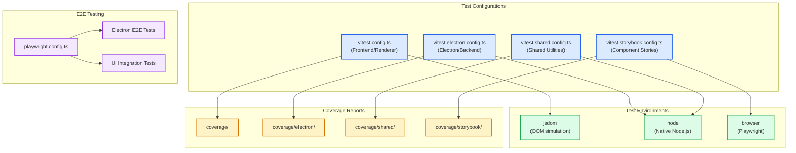
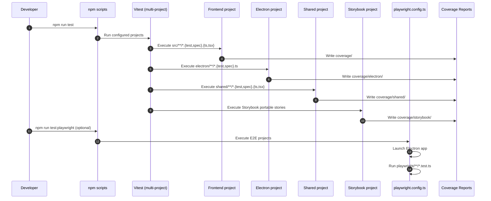
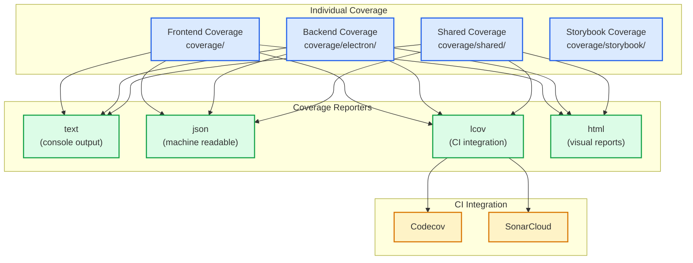
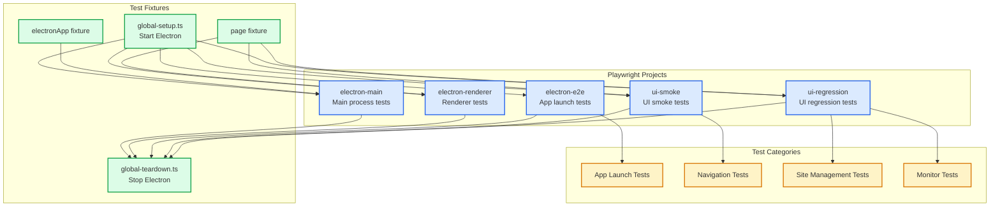

# ADR-010: Multi-Configuration Testing Strategy

## Table of Contents

1. [Status](#status)
2. [Context](#context)
3. [Decision](#decision)
4. [Testing Pyramid and Responsibilities](#testing-pyramid-and-responsibilities)
5. [Test Configuration Architecture](#test-configuration-architecture)
6. [Coverage Strategy](#coverage-strategy)
7. [Mocking Strategy](#mocking-strategy)
8. [Property-Based Testing](#property-based-testing)
9. [Component Testing (Storybook)](#component-testing-storybook)
10. [E2E Testing](#e2e-testing)
11. [Flake Management](#flake-management)
12. [CI Gating](#ci-gating)
13. [Consequences](#consequences)
14. [Implementation Guidelines](#implementation-guidelines)
15. [Compliance](#compliance)
16. [Related ADRs](#related-adrs)

## Status

**Accepted** - Core testing infrastructure for all application layers

## Context

The application spans multiple runtime environments:

- **Renderer process**: React components with jsdom environment
- **Main process**: Electron/Node.js services with native APIs
- **Shared utilities**: Cross-process code used by both environments
- **Component stories**: Visual component testing via Storybook
- **End-to-end**: Full application testing via Playwright

A single test configuration cannot adequately address these requirements:

- **Environment mismatch**: jsdom vs Node.js APIs
- **Mock requirements**: ElectronAPI mocking for renderer, database mocking for backend
- **Coverage isolation**: Separate coverage reports per layer
- **Threshold differences**: Different coverage requirements per layer
- **Plugin conflicts**: React testing plugins not needed for backend

## Decision

We will implement a **Multi-Configuration Testing Strategy** with separate Vitest configurations for each layer, unified by consistent patterns and shared utilities.

### Testing Architecture Overview



### Configuration Matrix

| Config                                           | Environment                       | Coverage Dir          | Thresholds                                            | Setup File                  |
| ------------------------------------------------ | --------------------------------- | --------------------- | ----------------------------------------------------- | --------------------------- |
| `vitest.config.ts` (Frontend project)            | jsdom                             | `coverage/`           | branches 77 / functions 92 / lines 93 / statements 89 | `src/test/setup.ts`         |
| `vitest.electron.config.ts` (Electron project)   | node                              | `coverage/electron/`  | 90% all                                               | `electron/test/setup.ts`    |
| `vitest.shared.config.ts` (Shared project)       | node                              | `coverage/shared/`    | branches 90 / functions 95 / lines 95 / statements 95 | `shared/test/setup.ts`      |
| `vitest.storybook.config.ts` (Component project) | browser (Chromium via Playwright) | `coverage/storybook/` | no thresholds enforced (coverage still collected)     | `storybook/vitest.setup.ts` |

Additional projects exist for specialized suites (e.g. `vitest.linting.config.ts`, `vitest.docsTooling.config.ts`) and are primarily used for internal tooling validation.

## Testing Pyramid and Responsibilities

Our test strategy follows a pragmatic pyramid. The goal is **fast feedback
first**, with heavier tests reserved for integration boundaries and end-to-end
flows.

| Layer             | Primary tools                               | What we validate                                                                                          |
| ----------------- | ------------------------------------------- | --------------------------------------------------------------------------------------------------------- |
| Static checks     | TypeScript, ESLint, Stylelint, docs checks  | Types, unsafe patterns, formatting, documentation correctness                                             |
| Unit tests        | Vitest (node/jsdom)                         | Pure logic (parsers, utilities, small state reducers)                                                     |
| Integration tests | Vitest (node/jsdom)                         | Cross-module behavior (repositories/services/managers), IPC contract validation, monitor execution wiring |
| Component tests   | Storybook portable stories + Vitest browser | Visual/interactive component behavior in a real browser runtime                                           |
| E2E tests         | Playwright (Electron + UI projects)         | Full user flows, real renderer behavior, real Chromium rendering                                          |

## Test Configuration Architecture

### Frontend Configuration (vitest.config.ts)

```typescript
// Dedicated config primarily so editors (e.g. VS Code) can discover frontend
// tests with the correct project name. Most settings are inherited from
// vite.config.ts.
import { defineConfig, mergeConfig } from "vitest/config";

import viteConfig from "./vite.config";

export default defineConfig((configEnv) =>
        mergeConfig(
                viteConfig(configEnv),
                defineConfig({
                        cacheDir: "./.cache/vitest/",
                        test: {
                                name: { color: "cyan", label: "Frontend" },
                        },
                })
        )
);
```

Notes:

- The canonical frontend test settings (environment, includes, coverage, worker
  limits, and `test.projects`) live in `vite.config.ts` under the `test` block.
- Current frontend coverage thresholds are enforced there: branches 77 /
  functions 92 / lines 93 / statements 89.

<!-- remark-ignore-start -->

### Backend Configuration (vitest.electron.config.ts)

<!-- remark-ignore-end -->

```typescript
// Standalone config for Electron main process
export default defineConfig({
 cacheDir: "./.cache/vitest/.vitest-backend",
 test: {
  name: { color: "magenta", label: "Backend" },
  environment: "node",
  setupFiles: ["electron/test/setup.ts"],
  include: [
   "electron/**/*.{test,spec}.{ts,tsx}",
   "tests/strictTests/electron/**/*.{test,spec}.{ts,tsx}",
  ],
  coverage: {
   provider: "v8",
   reportsDirectory: "./coverage/electron",
   include: ["electron/**/*.{ts,tsx}"],
   thresholds: {
    branches: 90,
    functions: 90,
    lines: 90,
    statements: 90,
   },
  },
  pool: "threads",
  poolOptions: {
   threads: {
    maxThreads: process.env.CI ? 1 : 16,
    singleThread: Boolean(process.env.CI),
   },
  },
 },
});
```

### Shared Configuration (vitest.shared.config.ts)

```typescript
// Cross-process utilities testing
export default defineConfig({
 cacheDir: "./.cache/vitest/.vitest-shared",
 test: {
  name: { color: "yellow", label: "Shared" },
  environment: "node",
  setupFiles: ["shared/test/setup.ts"],
  include: [
   "shared/**/*.{test,spec}.{ts,tsx}",
   "tests/strictTests/shared/**/*.{test,spec}.{ts,tsx}",
  ],
  coverage: {
   provider: "v8",
   reportsDirectory: "./coverage/shared",
   include: ["shared/**/*.{ts,tsx}"],
   thresholds: {
    branches: 90,
    functions: 95,
    lines: 95,
    statements: 95,
   },
  },
 },
});
```

### Test Execution Flow



## Coverage Strategy

### Coverage Aggregation



### Coverage Thresholds

| Layer     | Lines                               | Functions                           | Branches                            | Statements                          |
| --------- | ----------------------------------- | ----------------------------------- | ----------------------------------- | ----------------------------------- |
| Frontend  | 93%                                 | 92%                                 | 77%                                 | 89%                                 |
| Backend   | 90%                                 | 90%                                 | 90%                                 | 90%                                 |
| Shared    | 95%                                 | 95%                                 | 90%                                 | 95%                                 |
| Storybook | (collected, no thresholds enforced) | (collected, no thresholds enforced) | (collected, no thresholds enforced) | (collected, no thresholds enforced) |

### Coverage Commands

```bash
# Individual coverage
npm run test:coverage           # Frontend coverage (vitest.config.ts)
npm run test:electron:coverage  # Backend coverage
npm run test:shared:coverage    # Shared coverage
npm run test:storybook:coverage # Storybook coverage

# Aggregate coverage
npm run test:all:coverage       # All suites with coverage
```

## Mocking Strategy

### Default global mocks

- **Frontend (renderer) suites**: `src/test/setup.ts` imports `src/test/mock-setup.ts`, which installs a canonical typed `globalThis.electronAPI` and `window.electronAPI` mock.
- **Electron (main-process) suites**: `electron/test/setup.ts` provides global module mocks for `electron` and `node-sqlite3-wasm` to keep backend tests deterministic and fast.

### Per-test overrides (frontend)

Prefer `src/test/utils/electronApiMock.ts` to override a small portion of the
API surface without leaking changes into other tests:

```typescript
import { vi } from "vitest";

// Example usage from a frontend test under src/test/...
import { installElectronApiMock } from "./utils/electronApiMock";

it("loads sites from the preload API", async () => {
        const { restore } = installElectronApiMock({
                sites: {
                getSites: vi.fn(async () => []),
                },
        });

        try {
                // ...assertions...
        } finally {
                restore();
        }
});
```

Notes:

- Do not use `vi.resetModules()` as a default pattern. It is slow and often hides dependency/architecture problems.
- Prefer `vi.clearAllMocks()` / `vi.restoreAllMocks()` plus explicit per-test overrides.

## Property-Based Testing

### Fast-Check Configuration

```typescript
// src/test/setup.ts
import fc from "fast-check";
import { resolveFastCheckEnvOverrides } from "@shared/test/utils/fastCheckEnv";

const current = fc.readConfigureGlobal() ?? {};
const baseNumRuns = (current as { numRuns?: number }).numRuns ?? 10;
const fastCheckOverrides = resolveFastCheckEnvOverrides(baseNumRuns);

fc.configureGlobal({
    ...current,
    ...fastCheckOverrides,

    // Reporting / debugging helpers
    verbose: 2,
    includeErrorInReport: true,

    // Failure and time limits
    endOnFailure: true,
    timeout: 3000,
    interruptAfterTimeLimit: 5 * 60 * 1000,
    markInterruptAsFailure: true,
    skipAllAfterTimeLimit: 60 * 1000,

    // Duplicate handling and skipping
    maxSkipsPerRun: 100,
});
```

We prefer `@fast-check/vitest` for ergonomic property test integration where
appropriate, while still allowing direct `fast-check` usage.

### Property-Based Test Example

```typescript
import fc from "fast-check";

describe("Site validation", () => {
 it("should accept valid site names", () => {
  fc.assert(
   fc.property(fc.string({ minLength: 1, maxLength: 200 }), (name) => {
    const result = validateSiteName(name.trim());
    return name.trim().length > 0 ? result.success : !result.success;
   })
  );
 });

 it("should reject empty identifiers", () => {
  fc.assert(
   fc.property(fc.string({ maxLength: 0 }), (identifier) => {
    const result = validateSiteIdentifier(identifier);
    return !result.success;
   })
  );
 });
});
```

## Component Testing (Storybook)

Component tests are executed as **portable Storybook stories** in a real
Chromium runtime (Vitest browser mode + Playwright provider). This gives us a
middle layer between jsdom unit tests and full end-to-end tests.

Key points:

- Configuration: `vitest.storybook.config.ts`.
- Runner: `@vitest/browser-playwright` (Chromium).
- Parallelism is intentionally constrained (`maxWorkers: 1`, `fileParallelism: false`) to reduce flake and resource contention.
- A small transform wrapper is applied so Storybook’s `vitestTransform` is used consistently on Windows.

Relevant scripts:

```bash
npm run test:storybook
npm run test:storybook:coverage
```

## E2E Testing

### Playwright Configuration

```typescript
// playwright.config.ts
const isCI = Boolean(process.env.CI);
const isAttachmentsEnabled = process.env.PLAYWRIGHT_ENABLE_ATTACHMENTS === "true";

export default defineConfig({
    testDir: "./playwright/tests",
    outputDir: "playwright/test-results/",
    globalSetup: "./playwright/fixtures/global-setup.ts",
    globalTeardown: "./playwright/fixtures/global-teardown.ts",

    forbidOnly: isCI,
    retries: isCI ? 2 : 0,

    // Project set is built via helpers in playwright.config.ts (see
    // createElectronProject/createUiProject).
    projects: [
        { name: "electron-main" },
        { name: "electron-renderer" },
        { name: "electron-e2e" },
        { name: "ui-smoke" },
        { name: "ui-regression" },
    ],

    use: {
        // Attachments are gated by PLAYWRIGHT_ENABLE_ATTACHMENTS so local runs
        // stay fast and CI only captures heavy diagnostics when enabled.
        screenshot: isAttachmentsEnabled ? "only-on-failure" : "off",
        trace: isAttachmentsEnabled ? "on-first-retry" : "off",
        video: isAttachmentsEnabled ? "retain-on-failure" : "off",
    },
});
```

### E2E Test Structure



## Flake Management

Flaky tests cost more than they save. Our strategy is to prevent flake first,
then contain it when it slips in.

- **Constrain parallelism where it matters**: Storybook browser tests run with `maxWorkers: 1` and `fileParallelism: false`.
- **Prefer deterministic inputs**: seed randomness for property tests (fast-check prints seed/path on failure) and use fake timers where time is part of logic.
- **Avoid real external dependencies**: no real network calls in unit/integration suites; use mocks/MSW or controlled fakes.
- **Playwright containment**: CI retries are enabled (`retries: isCI ? 2 : 0`), heavy diagnostics are gated behind `PLAYWRIGHT_ENABLE_ATTACHMENTS`, and smoke vs regression is separated via the `ui-smoke` and `ui-regression` projects.

## CI Gating

CI is expected to gate on the same classes of failures developers see locally:

- **Static checks**: `npm run lint:ci` (includes docs link checks and frontmatter validation).
- **Type safety**: `npm run type-check:all`.
- **Unit/integration/component**: `npm run test` (Vitest multi-project).
- **E2E**: `npm run test:playwright`.

Notes:

- CI should run with a Node.js version compatible with the repo’s declared `engines.node`. If workflows drift, fix the workflow rather than loosening expectations in this ADR.

## Consequences

### Positive

- **Environment isolation**: Each layer tested in appropriate environment
- **Coverage granularity**: Per-layer coverage reports and thresholds
- **Parallel execution**: Independent test suites can run concurrently
- **Mock isolation**: Environment-specific mocking strategies
- **CI optimization**: Layer-specific caching and parallelization
- **Developer experience**: Clear test organization and fast feedback

### Negative

- **Configuration complexity**: Multiple config files to maintain
- **Duplication risk**: Some settings repeated across configs
- **Learning curve**: Developers must understand multi-config setup
- **CI time**: Full test suite takes longer with multiple configs

### Neutral

- **Tool choice**: Vitest for unit/integration, Playwright for E2E
- **Coverage provider**: V8 for all configurations
- **Test runner**: Worker threads in local, single thread in CI

## Implementation Guidelines

### Adding New Tests

1. **Determine the appropriate layer**:
   - React components → `src/test/`
   - Electron services → `electron/test/`
   - Shared utilities → `shared/test/`
   - Visual components → `storybook/stories/`
   - Full app flows → `playwright/tests/`

2. **Follow naming conventions**:
   - Unit tests: `*.test.ts` or `*.spec.ts`
   - Storybook tests: `*.stories.tsx`
   - Playwright tests: `*.playwright.test.ts`

3. **Use appropriate setup**:
   - Import mocks from setup files
   - Reset mocks in `beforeEach`
   - Clean up in `afterEach`

### Test File Organization

```text
src/
├── test/
│   ├── setup.ts              # Frontend test setup
│   ├── mock-setup.ts         # ElectronAPI mocks
│   └── components/           # Component tests
│       └── Button.test.tsx
electron/
├── test/
│   ├── setup.ts              # Backend test setup
│   ├── services/             # Service tests
│   │   └── DatabaseService.test.ts
│   └── managers/             # Manager tests
│       └── SiteManager.test.ts
shared/
├── test/
│   ├── setup.ts              # Shared test setup
│   └── utils/                # Utility tests
│       └── errorHandling.test.ts
playwright/
├── fixtures/                 # Test fixtures
│   ├── global-setup.ts
│   └── global-teardown.ts
├── tests/                    # E2E tests
│   ├── app-launch.playwright.test.ts
│   └── ui-sites.playwright.test.ts
└── helpers/                  # Test helpers
```

### Running Tests

```bash
# Individual suites
npm run test                  # Frontend only
npm run test:electron         # Backend only
npm run test:shared           # Shared only
npm run test:storybook        # Storybook only
npm run test:playwright       # E2E only

# All suites
npm run test:all              # Run all test suites

# With coverage
npm run test:coverage         # Frontend with coverage
npm run test:all:coverage     # All with coverage

# Watch mode
npm run test -- --watch       # Frontend watch
npm run test:electron -- --watch  # Backend watch

# UI mode
npm run test -- --ui          # Vitest UI
npm run test:playwright --ui  # Playwright UI
```

## Compliance

### Test Configurations

- ✅ `vitest.config.ts` - Frontend/renderer tests
- ✅ `vitest.electron.config.ts` - Backend/Electron tests
- ✅ `vitest.shared.config.ts` - Shared utility tests
- ✅ `vitest.storybook.config.ts` - Storybook component tests
- ✅ `playwright.config.ts` - E2E tests

### Setup Files

- ✅ `src/test/setup.ts` - ElectronAPI mocking, jsdom setup
- ✅ `electron/test/setup.ts` - Database mocking, Node.js setup
- ✅ `shared/test/setup.ts` - Cross-environment utilities

### Coverage Requirements

- ✅ Frontend: 90% lines, functions, branches, statements
- ✅ Backend: 90% lines, functions, branches, statements
- ✅ Shared: 95% lines/functions, 90% branches, 95% statements

### Current Implementation Audit (2025-11-25)

- Verified all four Vitest configurations exist with appropriate environments
- Confirmed setup files provide environment-specific mocking
- Checked coverage thresholds match documented requirements
- Validated Playwright configuration for E2E testing
- Reviewed fast-check integration for property-based testing

## Related ADRs

- [ADR-007: Service Container](./ADR_007_SERVICE_CONTAINER_DEPENDENCY_INJECTION.md) - ServiceContainer.resetForTesting()
- [ADR-009: Validation Strategy](./ADR_009_VALIDATION_STRATEGY.md) - Schema testing patterns
- [ADR-005: IPC Communication Protocol](./ADR_005_IPC_COMMUNICATION_PROTOCOL.md) - ElectronAPI mock patterns
