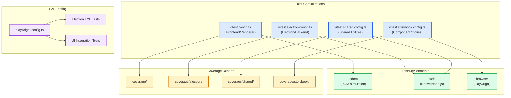
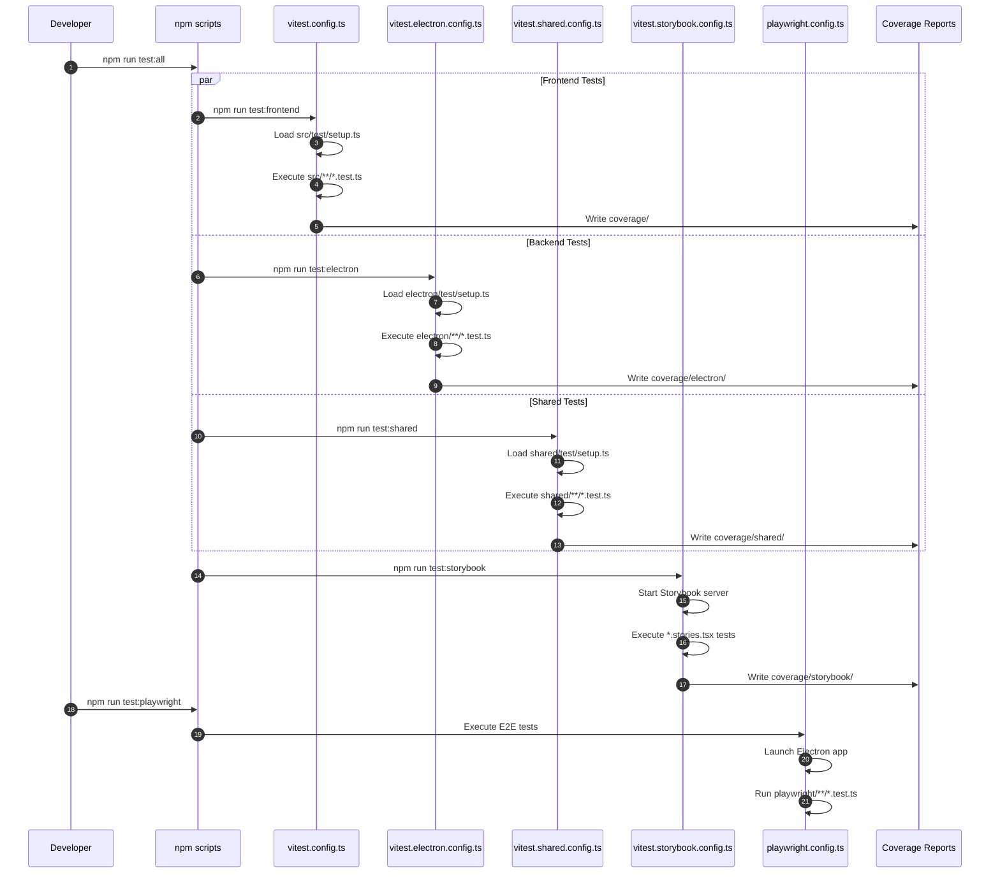
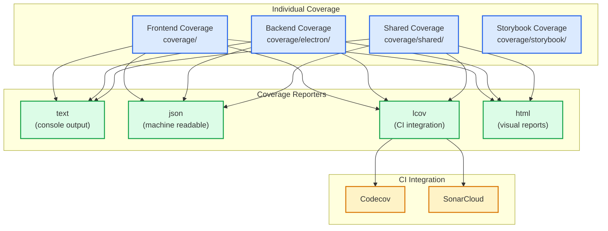
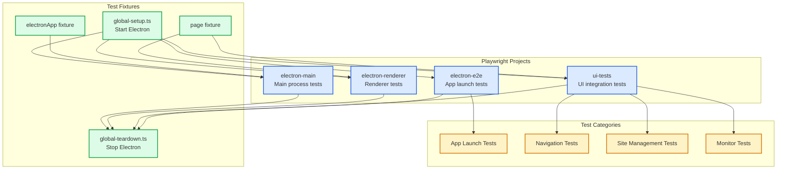

# ADR-010: Multi-Configuration Testing Strategy

## Table of Contents

1. [Status](#status)
2. [Context](#context)
3. [Decision](#decision)
4. [Test Configuration Architecture](#test-configuration-architecture)
5. [Coverage Strategy](#coverage-strategy)
6. [Mocking Strategy](#mocking-strategy)
7. [Property-Based Testing](#property-based-testing)
8. [E2E Testing](#e2e-testing)
9. [Consequences](#consequences)
10. [Implementation Guidelines](#implementation-guidelines)
11. [Compliance](#compliance)
12. [Related ADRs](#related-adrs)

## Status

**Accepted** - Core testing infrastructure for all application layers

## Context

The application spans multiple runtime environments:

- **Renderer process**: React components with jsdom environment
- **Main process**: Electron/Node.js services with native APIs
- **Shared utilities**: Cross-process code used by both environments
- **Component stories**: Visual component testing via Storybook
- **End-to-end**: Full application testing via Playwright

A single test configuration cannot adequately address these requirements:

- **Environment mismatch**: jsdom vs Node.js APIs
- **Mock requirements**: ElectronAPI mocking for renderer, database mocking for backend
- **Coverage isolation**: Separate coverage reports per layer
- **Threshold differences**: Different coverage requirements per layer
- **Plugin conflicts**: React testing plugins not needed for backend

## Decision

We will implement a **Multi-Configuration Testing Strategy** with separate Vitest configurations for each layer, unified by consistent patterns and shared utilities.

### Testing Architecture Overview



### Configuration Matrix

| Config                       | Environment | Coverage Dir          | Thresholds          | Setup File               |
| ---------------------------- | ----------- | --------------------- | ------------------- | ------------------------ |
| `vitest.config.ts`           | jsdom       | `coverage/`           | 90% all             | `src/test/setup.ts`      |
| `vitest.electron.config.ts`  | node        | `coverage/electron/`  | 90% all             | `electron/test/setup.ts` |
| `vitest.shared.config.ts`    | node        | `coverage/shared/`    | 95% lines/functions | `shared/test/setup.ts`   |
| `vitest.storybook.config.ts` | browser     | `coverage/storybook/` | (disabled)          | Storybook config         |

## Test Configuration Architecture

### Frontend Configuration (vitest.config.ts)

```typescript
// Merges with vite.config.ts for React/DOM testing
export default defineConfig((configEnv) =>
 mergeConfig(
  viteConfig(configEnv),
  defineConfig({
   cacheDir: "./.cache/vitest/",
   test: {
    name: { color: "cyan", label: "Frontend" },
    environment: "jsdom",
    setupFiles: ["src/test/setup.ts"],
    include: ["src/**/*.{test,spec}.{ts,tsx}"],
    coverage: {
     provider: "v8",
     reportsDirectory: "./coverage",
     thresholds: {
      branches: 90,
      functions: 90,
      lines: 90,
      statements: 90,
     },
    },
   },
  })
 )
);
```

<!-- remark-ignore-start -->

### Backend Configuration (vitest.electron.config.ts)

<!-- remark-ignore-end -->

```typescript
// Standalone config for Electron main process
export default defineConfig({
 cacheDir: "./.cache/vitest/.vitest-backend",
 test: {
  name: { color: "magenta", label: "Backend" },
  environment: "node",
  setupFiles: ["electron/test/setup.ts"],
  include: [
   "electron/**/*.{test,spec}.{ts,tsx}",
   "tests/strictTests/electron/**/*.{test,spec}.{ts,tsx}",
  ],
  coverage: {
   provider: "v8",
   reportsDirectory: "./coverage/electron",
   include: ["electron/**/*.{ts,tsx}"],
   thresholds: {
    branches: 90,
    functions: 90,
    lines: 90,
    statements: 90,
   },
  },
  pool: "threads",
  poolOptions: {
   threads: {
    maxThreads: process.env.CI ? 1 : 16,
    singleThread: Boolean(process.env.CI),
   },
  },
 },
});
```

### Shared Configuration (vitest.shared.config.ts)

```typescript
// Cross-process utilities testing
export default defineConfig({
 cacheDir: "./.cache/vitest/.vitest-shared",
 test: {
  name: { color: "yellow", label: "Shared" },
  environment: "node",
  setupFiles: ["shared/test/setup.ts"],
  include: [
   "shared/**/*.{test,spec}.{ts,tsx}",
   "tests/strictTests/shared/**/*.{test,spec}.{ts,tsx}",
  ],
  coverage: {
   provider: "v8",
   reportsDirectory: "./coverage/shared",
   include: ["shared/**/*.{ts,tsx}"],
   thresholds: {
    branches: 90,
    functions: 95,
    lines: 95,
    statements: 95,
   },
  },
 },
});
```

### Test Execution Flow



## Coverage Strategy

### Coverage Aggregation



### Coverage Thresholds

| Layer     | Lines      | Functions  | Branches   | Statements |
| --------- | ---------- | ---------- | ---------- | ---------- |
| Frontend  | 90%        | 90%        | 90%        | 90%        |
| Backend   | 90%        | 90%        | 90%        | 90%        |
| Shared    | 95%        | 95%        | 90%        | 95%        |
| Storybook | (disabled) | (disabled) | (disabled) | (disabled) |

### Coverage Commands

```bash
# Individual coverage
npm run test:coverage           # Frontend coverage (vitest.config.ts)
npm run test:electron:coverage  # Backend coverage
npm run test:shared:coverage    # Shared coverage
npm run test:storybook:coverage # Storybook coverage

# Aggregate coverage
npm run test:all:coverage       # All suites with coverage
```

## Mocking Strategy

### ElectronAPI Mocking (Frontend)

The frontend setup provides comprehensive ElectronAPI mocking:

```typescript
// src/test/setup.ts
const mockElectronAPI = {
 sites: {
  addSite: vi.fn(),
  getSites: vi.fn().mockResolvedValue([]),
  removeSite: vi.fn(),
  updateSite: vi.fn(),
 },
 monitoring: {
  startMonitoring: vi.fn(),
  stopMonitoring: vi.fn(),
  checkSiteNow: vi.fn(),
 },
 events: {
  onMonitorStatusChanged: vi.fn((callback) => {
   // Return cleanup function
   return vi.fn();
  }),
  onSiteAdded: vi.fn((callback) => vi.fn()),
  onSiteRemoved: vi.fn((callback) => vi.fn()),
 },
 settings: {
  getHistoryLimit: vi.fn().mockResolvedValue(100),
  updateHistoryLimit: vi.fn(),
 },
 monitorTypes: {
  getMonitorTypes: vi.fn().mockResolvedValue([]),
  formatMonitorDetail: vi.fn(),
  formatMonitorTitleSuffix: vi.fn(),
  validateMonitorData: vi.fn(),
 },
 data: {
  exportData: vi.fn(),
  importData: vi.fn(),
 },
 system: {
  openExternal: vi.fn(),
 },
};

Object.defineProperty(window, "electronAPI", {
 value: mockElectronAPI,
 writable: true,
 configurable: true,
});
```

### Database Mocking (Backend)

Backend tests mock the database layer:

```typescript
// electron/test/setup.ts
vi.mock("../services/database/DatabaseService", () => ({
 DatabaseService: {
  getInstance: vi.fn(() => ({
   initialize: vi.fn(),
   getDatabase: vi.fn(() => mockDatabase),
   executeTransaction: vi.fn((callback) => callback(mockDatabase)),
   close: vi.fn(),
  })),
 },
}));

const mockDatabase = {
 run: vi.fn(),
 all: vi.fn().mockReturnValue([]),
 get: vi.fn(),
 prepare: vi.fn(() => ({
  run: vi.fn(),
  finalize: vi.fn(),
 })),
};
```

### Mock Reset Pattern

```typescript
// Consistent mock reset in beforeEach
beforeEach(() => {
 vi.clearAllMocks();
 vi.resetModules();

 // Reset specific mocks to default state
 mockElectronAPI.sites.getSites.mockResolvedValue([]);
 mockElectronAPI.settings.getHistoryLimit.mockResolvedValue(100);
});

afterEach(() => {
 vi.restoreAllMocks();
});
```

## Property-Based Testing

### Fast-Check Configuration

```typescript
// src/test/setup.ts
import fc from "fast-check";

fc.configureGlobal({
 numRuns: 10, // Base number of test runs
 verbose: 2, // Most verbose output
 endOnFailure: true, // Stop on first failure
 timeout: 3000, // Per-case timeout (ms)
 interruptAfterTimeLimit: 5 * 60 * 1000, // 5 minute cap
 maxSkipsPerRun: 100, // Tolerance for filters
 markInterruptAsFailure: true,
});
```

### Property-Based Test Example

```typescript
import fc from "fast-check";

describe("Site validation", () => {
 it("should accept valid site names", () => {
  fc.assert(
   fc.property(fc.string({ minLength: 1, maxLength: 200 }), (name) => {
    const result = validateSiteName(name.trim());
    return name.trim().length > 0 ? result.success : !result.success;
   })
  );
 });

 it("should reject empty identifiers", () => {
  fc.assert(
   fc.property(fc.string({ maxLength: 0 }), (identifier) => {
    const result = validateSiteIdentifier(identifier);
    return !result.success;
   })
  );
 });
});
```

## E2E Testing

### Playwright Configuration

```typescript
// playwright.config.ts
export default defineConfig({
 testDir: "./playwright/tests",
 outputDir: "playwright/test-results/",

 globalSetup: "./playwright/fixtures/global-setup.ts",
 globalTeardown: "./playwright/fixtures/global-teardown.ts",

 projects: [
  {
   name: "electron-main",
   testMatch: "**/main-process.*.playwright.test.ts",
   fullyParallel: false,
  },
  {
   name: "electron-renderer",
   testMatch: "**/renderer-process.*.playwright.test.ts",
   fullyParallel: false,
  },
  {
   name: "electron-e2e",
   testMatch: "**/app-launch.*.playwright.test.ts",
   fullyParallel: false,
  },
  {
   name: "ui-tests",
   testMatch: "**/ui-*.playwright.test.ts",
   fullyParallel: false,
  },
 ],

 use: {
  trace: "on-first-retry",
  screenshot: "only-on-failure",
  video: "retain-on-failure",
 },

 reporter: [
  ["html", { outputFolder: "playwright/reports/html" }],
  ["json", { outputFile: "playwright/reports/results.json" }],
 ],
});
```

### E2E Test Structure



## Consequences

### Positive

- **Environment isolation**: Each layer tested in appropriate environment
- **Coverage granularity**: Per-layer coverage reports and thresholds
- **Parallel execution**: Independent test suites can run concurrently
- **Mock isolation**: Environment-specific mocking strategies
- **CI optimization**: Layer-specific caching and parallelization
- **Developer experience**: Clear test organization and fast feedback

### Negative

- **Configuration complexity**: Multiple config files to maintain
- **Duplication risk**: Some settings repeated across configs
- **Learning curve**: Developers must understand multi-config setup
- **CI time**: Full test suite takes longer with multiple configs

### Neutral

- **Tool choice**: Vitest for unit/integration, Playwright for E2E
- **Coverage provider**: V8 for all configurations
- **Test runner**: Worker threads in local, single thread in CI

## Implementation Guidelines

### Adding New Tests

1. **Determine the appropriate layer**:
   - React components → `src/test/`
   - Electron services → `electron/test/`
   - Shared utilities → `shared/test/`
   - Visual components → `storybook/stories/`
   - Full app flows → `playwright/tests/`

2. **Follow naming conventions**:
   - Unit tests: `*.test.ts` or `*.spec.ts`
   - Storybook tests: `*.stories.tsx`
   - Playwright tests: `*.playwright.test.ts`

3. **Use appropriate setup**:
   - Import mocks from setup files
   - Reset mocks in `beforeEach`
   - Clean up in `afterEach`

### Test File Organization

```text
src/
├── test/
│   ├── setup.ts              # Frontend test setup
│   ├── mock-setup.ts         # ElectronAPI mocks
│   └── components/           # Component tests
│       └── Button.test.tsx
electron/
├── test/
│   ├── setup.ts              # Backend test setup
│   ├── services/             # Service tests
│   │   └── DatabaseService.test.ts
│   └── managers/             # Manager tests
│       └── SiteManager.test.ts
shared/
├── test/
│   ├── setup.ts              # Shared test setup
│   └── utils/                # Utility tests
│       └── errorHandling.test.ts
playwright/
├── fixtures/                 # Test fixtures
│   ├── global-setup.ts
│   └── global-teardown.ts
├── tests/                    # E2E tests
│   ├── app-launch.playwright.test.ts
│   └── ui-sites.playwright.test.ts
└── helpers/                  # Test helpers
```

### Running Tests

```bash
# Individual suites
npm run test                  # Frontend only
npm run test:electron         # Backend only
npm run test:shared           # Shared only
npm run test:storybook        # Storybook only
npm run test:playwright       # E2E only

# All suites
npm run test:all              # Run all test suites

# With coverage
npm run test:coverage         # Frontend with coverage
npm run test:all:coverage     # All with coverage

# Watch mode
npm run test -- --watch       # Frontend watch
npm run test:electron -- --watch  # Backend watch

# UI mode
npm run test -- --ui          # Vitest UI
npm run test:playwright --ui  # Playwright UI
```

## Compliance

### Test Configurations

- ✅ `vitest.config.ts` - Frontend/renderer tests
- ✅ `vitest.electron.config.ts` - Backend/Electron tests
- ✅ `vitest.shared.config.ts` - Shared utility tests
- ✅ `vitest.storybook.config.ts` - Storybook component tests
- ✅ `playwright.config.ts` - E2E tests

### Setup Files

- ✅ `src/test/setup.ts` - ElectronAPI mocking, jsdom setup
- ✅ `electron/test/setup.ts` - Database mocking, Node.js setup
- ✅ `shared/test/setup.ts` - Cross-environment utilities

### Coverage Requirements

- ✅ Frontend: 90% lines, functions, branches, statements
- ✅ Backend: 90% lines, functions, branches, statements
- ✅ Shared: 95% lines/functions, 90% branches, 95% statements

### Current Implementation Audit (2025-11-25)

- Verified all four Vitest configurations exist with appropriate environments
- Confirmed setup files provide environment-specific mocking
- Checked coverage thresholds match documented requirements
- Validated Playwright configuration for E2E testing
- Reviewed fast-check integration for property-based testing

## Related ADRs

- [ADR-007: Service Container](./ADR_007_SERVICE_CONTAINER_DEPENDENCY_INJECTION.md) - ServiceContainer.resetForTesting()
- [ADR-009: Validation Strategy](./ADR_009_VALIDATION_STRATEGY.md) - Schema testing patterns
- [ADR-005: IPC Communication Protocol](./ADR_005_IPC_COMMUNICATION_PROTOCOL.md) - ElectronAPI mock patterns
