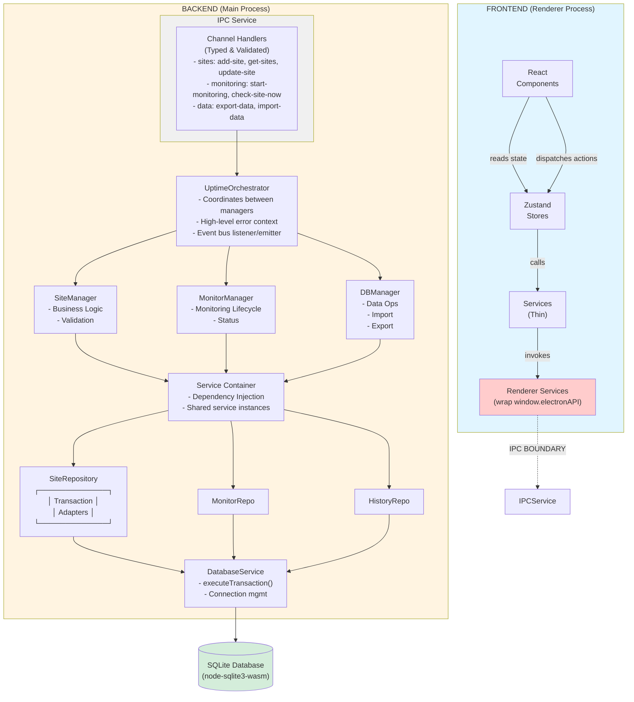
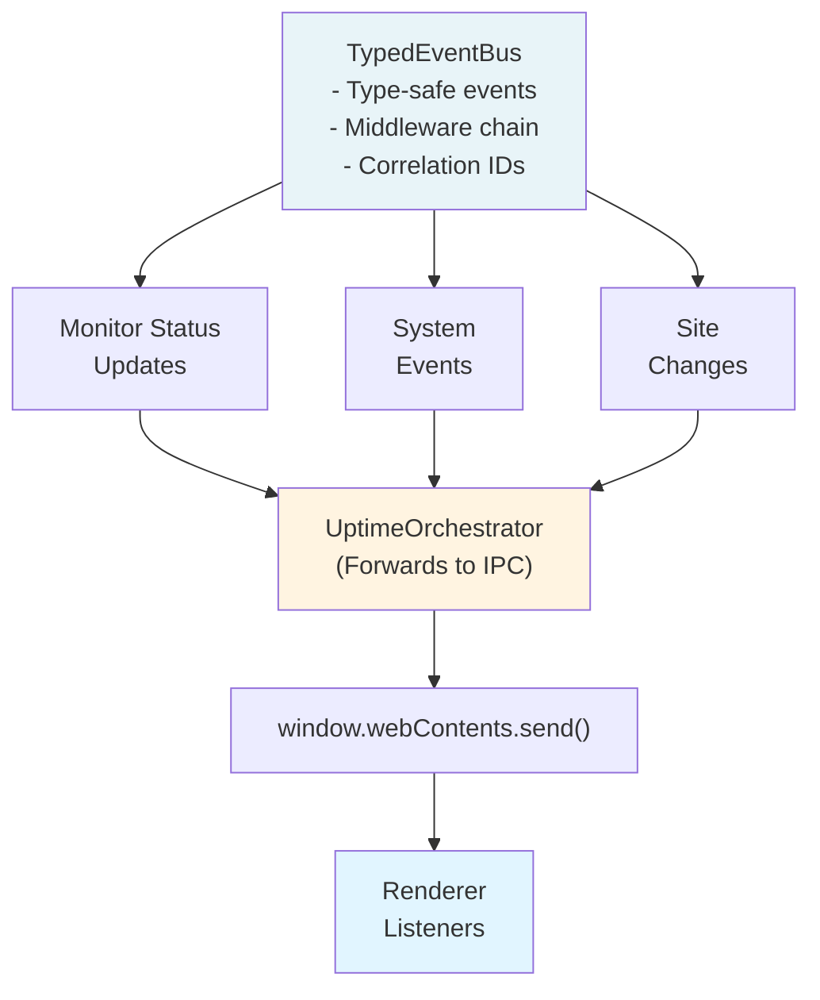
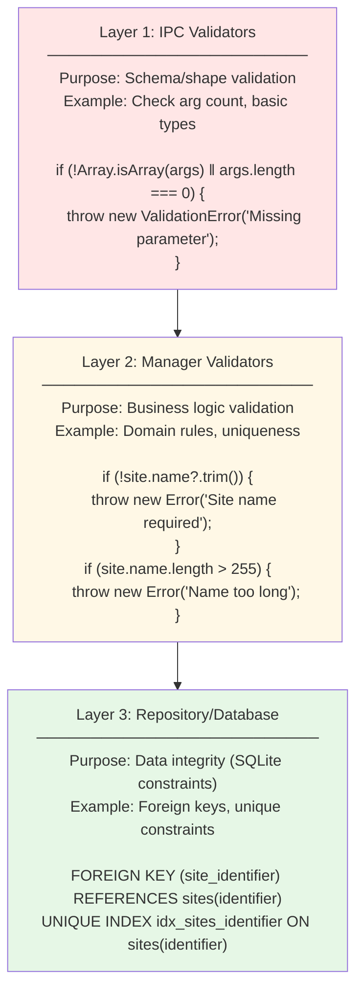
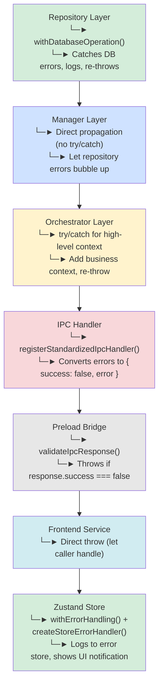
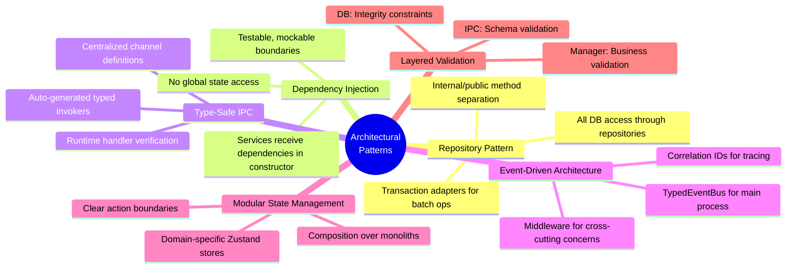

# Uptime Watcher Architecture Diagram

## Complete Data Flow Visualization

## Event Bus Flow

## Validation Layers

## Error Propagation Flow

## Key Architectural Patterns

## Notes

1. **IPC Boundary** is the security barrier between renderer (untrusted) and main (trusted)
2. **Event Bus** enables loose coupling between components
3. **Transaction Adapters** allow batch operations without breaking encapsulation
4. **Validation Layers** ensure data quality at appropriate boundaries
5. **Error Propagation** follows a consistent path with context added at orchestrator level
6. **Service Container** provides dependency injection for all backend services
7. **Repositories** handle all database operations with transaction support

## Current Implementation Audit (2025-11-04)

- Validated the backend orchestration flow against `electron/UptimeOrchestrator.ts` and `electron/managers/*` to ensure the diagram still reflects the coordination between orchestrator, managers, and repositories.
- Checked `electron/services/ipc/IpcService.ts` and preload bridges under `electron/preload/domains/` to confirm the IPC boundary annotations remain accurate.
- Reviewed renderer wiring in `src/stores` and `src/services` to verify the state/action pathways shown in the diagram continue to mirror production code.
