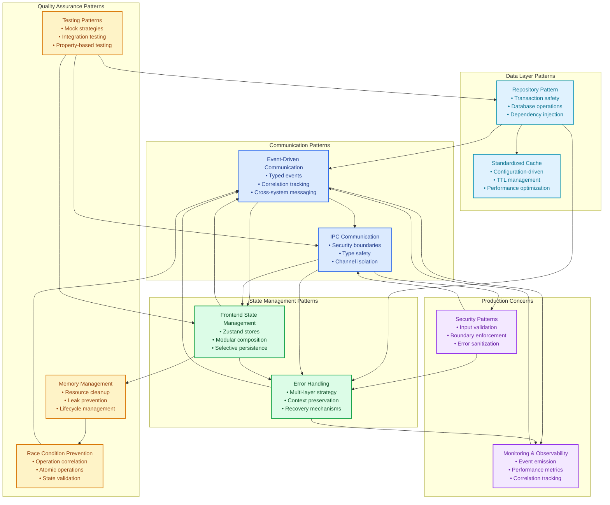
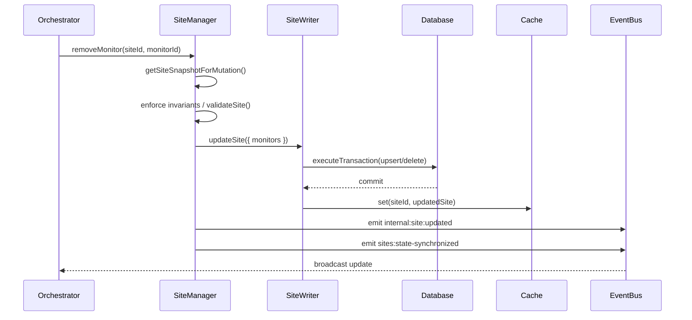

---

schema: "../../../config/schemas/doc-frontmatter.schema.json"
title: "Development Patterns Guide"
summary: "Documents the core architectural and development patterns used across Uptime Watcher, including repositories, events, state, IPC, and testing."
created: "2025-08-05"
last_reviewed: "2025-11-15"
category: "guide"
author: "Nick2bad4u"
tags:

- "uptime-watcher"
- "architecture"
- "patterns"
- "guidelines"

---

# Development Patterns Guide

This guide documents the established architectural patterns used throughout the Uptime-Watcher application. Following these patterns ensures consistency, maintainability, predictable behavior, and production-grade quality across the codebase.

## Architectural Patterns Overview



## Table of Contents

1. [Repository Pattern](#repository-pattern)
2. [Event-Driven Communication](#event-driven-communication)
3. [Error Handling Patterns](#error-handling-patterns)
4. [Frontend State Management](#frontend-state-management)
5. [IPC Communication](#ipc-communication)
6. [Standardized Cache Configuration](#standardized-cache-configuration)
7. [Memory Management](#memory-management)
8. [Race Condition Prevention](#race-condition-prevention)
9. [Site Mutation Pipeline](#site-mutation-pipeline)
10. [Shared Utility Imports](#shared-utility-imports)
11. [Logging Format & Prefix Standards](#logging-format--prefix-standards)
12. [Testing Patterns](#testing-patterns)

## Repository Pattern

### Repository Pattern Overview

All database access uses the Repository Pattern with comprehensive transaction handling, race condition prevention, and production-grade reliability.

### Key Characteristics

- **Dual methods**: Public async methods create transactions, internal sync methods work within existing transactions
- **Enhanced transaction safety**: All mutations wrapped in `executeTransaction()` with automatic rollback
- **Advanced operational hooks**: Use `withDatabaseOperation()` for retry logic, event emission, and monitoring
- **Dependency injection**: Constructor-based dependency injection for testability
- **Race condition immunity**: Synchronous database operations (node-sqlite3-wasm) eliminate race conditions
- **Memory management**: Proper resource cleanup and connection management

### Repository Implementation Template

```typescript
export interface ExampleRepositoryDependencies {
 databaseService: DatabaseService;
}

const EXAMPLE_QUERIES = {
 SELECT_ALL: "SELECT * FROM example_table",
 INSERT: "INSERT INTO example_table (field) VALUES (?)",
 DELETE_ALL: "DELETE FROM example_table",
} as const;

export class ExampleRepository {
 private readonly databaseService: DatabaseService;

 constructor(dependencies: ExampleRepositoryDependencies) {
  this.databaseService = dependencies.databaseService;
 }

 // Public async method with transaction
 public async create(data: ExampleData): Promise<Example> {
  return withDatabaseOperation(async () => {
   return this.databaseService.executeTransaction((db) => {
    this.createInternal(db, data);
    return Promise.resolve(createdExample);
   });
  }, "ExampleRepository.create");
 }

 // Internal sync method for transaction contexts
 public createInternal(db: Database, data: ExampleData): void {
  db.run(EXAMPLE_QUERIES.INSERT, [data.field]);
  logger.debug("[ExampleRepository] Example created (internal)");
 }

 // Read operations (no transaction needed)
 public async findAll(): Promise<Example[]> {
  const db = this.getDb();
  return db.all(EXAMPLE_QUERIES.SELECT_ALL);
 }

 private getDb(): Database {
  return this.databaseService.getDatabase();
 }
}
```

### Repository Usage Guidelines

- ✅ Use dual methods for operations that might be called within transactions
- ✅ Wrap all mutations in `withDatabaseOperation()`
- ✅ Include descriptive operation names for debugging
- ✅ Use query constants to prevent SQL duplication
- ❌ Don't bypass the repository pattern for direct database access
- ❌ Don't create transactions within internal methods

## Event-Driven Communication

### Event-Driven Communication Overview

The application uses a TypedEventBus for decoupled communication between components with compile-time type safety.

### Event Naming Convention

- **Format**: `domain:action` (e.g., `sites:added`, `monitor:status-changed`)
- **Domain**: Major category (sites, monitors, database, system)
- **Action**: Specific action in past tense for completed events
- **Consistency**: Use kebab-case for multi-word actions

### Settings Retention Synchronization

The database retention policy is surfaced to renderers through the `settings:history-limit-updated` broadcast. The orchestrator tracks the last observed limit so the payload always includes both the **new** limit and the **previous** limit, enabling toast messaging and audit logs to explain why the value changed.

- Subscribe via `EventsService.onHistoryLimitUpdated` inside the settings store.
- Only mutate state if the incoming limit differs from the current store value (the service already implements this guard).
- Treat backend-originated changes (imports, CLI migrations) the same as UI mutations--there is no special casing in the renderer.
- The renderer callback runs inside the store module; avoid calling the IPC service from within the handler to prevent feedback loops.

### Event-Driven Implementation Template

```typescript
// 1\. Define event interfaces
interface DomainEvents extends Record<string, unknown> {
 "domain:action-completed": {
  entityId: string;
  timestamp: number;
  // ... other event-specific data
 };
 "domain:action-failed": {
  entityId: string;
  selectedSiteIdentifier?: string;
  timestamp: number;
 };
}
```

## Shared Utility Imports

### Shared Utility Import Overview

All consumers must import helpers from explicit module paths under `@shared/utils/*`. Barrel imports are disallowed to keep dependency graphs predictable and prevent circular references across Electron, renderer, and shared packages.

### Shared Utility Guidelines

- ✅ Import directly from the feature module (e.g., `@shared/utils/errorHandling`, `@shared/utils/logTemplates`)
- ✅ Prefer named exports and avoid default exports for utilities
- ✅ Keep renderer and Electron imports symmetrical to ensure identical logic paths
- ❌ Do not re-export `@shared/utils` helpers from new barrels
- ❌ Do not rely on relative `../../utils` hops inside shared code

### Shared Utility Example

```typescript
import { withUtilityErrorHandling } from "@shared/utils/errorHandling";
import { LOG_TEMPLATES } from "@shared/utils/logTemplates";

export async function invokeOperation(): Promise<Result> {
 return withUtilityErrorHandling(async () => {
  // ...operation logic
 }, LOG_TEMPLATES.utilities.OPERATION_FAILED);
}
```

## Logging Format & Prefix Standards

### Logging Overview

Logging across main and renderer processes uses structured prefixes and reusable templates to keep telemetry consistent. Prefixes originate from `electron/utils/logger.ts` (BACKEND, DB, MONITOR) and renderer-side adapters, while message templates live in `@shared/utils/logTemplates`.

### Logging Guidelines

- ✅ Use `LOG_TEMPLATES` when available to standardize message structure
- ✅ Include contextual metadata objects instead of string concatenation
- ✅ Preserve correlation IDs and site identifiers in log payloads
- ✅ Prefer logger instances created via `createLogger` for new domains (supply uppercase prefix)
- ❌ Do not log raw errors without using `buildErrorLogArguments`; surfaces stack traces improperly
- ❌ Do not invent ad-hoc prefixes or bypass shared logger helpers

### Logging Example

```typescript
import { logger } from "electron/utils/logger";
import {
 createTemplateLogger,
 LOG_TEMPLATES,
} from "@shared/utils/logTemplates";

const templateLogger = createTemplateLogger(logger);

export function recordSiteCacheBootstrap(count: number): void {
 templateLogger.info(LOG_TEMPLATES.services.SITE_MANAGER_INITIALIZED, {
  count,
 });
}
```

```typescript
// 2\. Emit events in services
export class ExampleService {
 constructor(private readonly eventBus: TypedEventBus<UptimeEvents>) {}

 async performAction(id: string): Promise<void> {
  try {
   // Perform operation
   const result = await this.doSomething(id);

   // Emit success event
   await this.eventBus.emitTyped("domain:action-completed", {
    entityId: id,
    result,
    timestamp: Date.now(),
   });
  } catch (error) {
   // Emit failure event
   await this.eventBus.emitTyped("domain:action-failed", {
    entityId: id,
    error: error instanceof Error ? error.message : "Unknown error",
    timestamp: Date.now(),
   });
   throw error;
  }
 }
}

// 3\. Listen to events
eventBus.onTyped("domain:action-completed", (data) => {
 // data is properly typed and includes _meta
 console.log(`Action completed for ${data.entityId} at ${data.timestamp}`);
 console.log(`Correlation ID: ${data._meta.correlationId}`);
});
```

### Event-Driven Usage Guidelines

- ✅ Use typed events with proper interfaces
- ✅ Include timestamps in all events
- ✅ Emit both success and failure events for operations
- ✅ Use correlation IDs for request tracing
- ❌ Don't emit events for every minor operation
- ❌ Don't include sensitive data in event payloads

## Error Handling Patterns

### Error Handling Overview

Multi-layered error handling ensures system stability and provides consistent error reporting across all application layers.

### Shared Error Handling Utilities

#### Frontend with Store Integration

```typescript
// For operations that need store state management
import { SiteService } from "src/services/SiteService";

const handleUserAction = async () => {
 await withErrorHandling(async () => {
  const result = await SiteService.addSite(siteData);
  // Handle success
  return result;
 }, errorStore); // Automatically manages loading/error state
};
```

#### Backend with Logger Integration

```typescript
// For backend operations that need logging
const performBackendOperation = async () => {
 return withErrorHandling(
  async () => {
   const result = await this.repository.performOperation();
   return result;
  },
  { logger, operationName: "performOperation" }
 );
};
```

#### Database Operations

```typescript
// For database operations (includes retry logic)
public async databaseOperation(): Promise<Result> {
    return withDatabaseOperation(async () => {
        return this.databaseService.executeTransaction((db) => {
            // Database operations
            return result;
        });
    }, "Service.databaseOperation");
}
```

#### Utility Functions

```typescript
// For utility functions with fallback values
export async function utilityFunction(): Promise<string> {
 return withUtilityErrorHandling(
  async () => {
   // Perform operation
   return result;
  },
  "utilityFunction",
  "fallback-value"
 );
}
```

### Error Preservation Pattern

```typescript
// ✅ Good - preserves original error
try {
 return await operation();
} catch (error) {
 logger.error("Operation failed", error);
 // Emit failure event
 await eventBus.emitTyped("operation:failed", {
  error: error instanceof Error ? error.message : String(error),
 });
 throw error; // Re-throw original
}

// ❌ Bad - loses error context
try {
 return await operation();
} catch (error) {
 throw new Error("Operation failed"); // Original error lost
}
```

### Error Handling Usage Guidelines

- ✅ Always re-throw errors after handling (logging/state management)
- ✅ Use appropriate error handling utility for the context
- ✅ Include correlation IDs for request tracing
- ✅ Emit failure events for monitoring
- ❌ Don't swallow errors without proper handling
- ❌ Don't lose original error context and stack traces

## Frontend State Management

### State Management Overview

Zustand-based state management with modular composition for complex stores and type safety throughout.

### Simple Store Pattern

```typescript
// ExampleService represents a domain-specific renderer facade exported from src/services

interface SimpleStore {
 // State
 value: string;
 isLoading: boolean;

 // Actions
 setValue: (value: string) => void;
 setLoading: (loading: boolean) => void;
 performAsyncAction: () => Promise<void>;
}

export const useSimpleStore = create<SimpleStore>()((set, get) => ({
 // Initial state
 value: "",
 isLoading: false,

 // Actions
 setValue: (value: string) => {
  logStoreAction("SimpleStore", "setValue", { value });
  set({ value });
 },

 setLoading: (isLoading: boolean) => {
  logStoreAction("SimpleStore", "setLoading", { isLoading });
  set({ isLoading });
 },

 performAsyncAction: async () => {
  await withErrorHandling(async () => {
   get().setLoading(true);
   // Perform async operation via a renderer service facade
   const result = await ExampleService.someOperation();
   get().setValue(result);
  }, errorStore);
  get().setLoading(false);
 },
}));
```

### Complex Store with Modules

```typescript
// 1\. Define module interfaces
interface StateModule {
 sites: Site[];
 selectedSiteIdentifier?: string;
 setSites: (sites: Site[]) => void;
 setSelectedSite: (site: Site | undefined) => void;
}

interface OperationsModule {
 createSite: (data: SiteCreationData) => Promise<Site>;
 deleteSite: (id: string) => Promise<void>;
}

// 2\. Create module implementations
export function createStateModule(
 set: SetFunction,
 get: GetFunction
): StateModule {
 return {
  sites: [],
  selectedSiteIdentifier: undefined,

  setSites: (sites: Site[]) => {
   logStoreAction("SitesStore", "setSites", { count: sites.length });
   set({ sites });
  },

  setSelectedSite: (site: Site | undefined) => {
   logStoreAction("SitesStore", "setSelectedSite", {
    siteIdentifier: site?.identifier,
   });
   set({ selectedSiteIdentifier: site?.identifier });
  },
 };
}

// 3\. Compose in main store
export interface SitesStore extends StateModule, OperationsModule {}

export const useSitesStore = create<SitesStore>()((set, get) => {
 const stateModule = createStateModule(set, get);
 const operationsModule = createOperationsModule(set, get);

 return {
  ...stateModule,
  ...operationsModule,
 };
});
```

### Persistence Pattern

```typescript
export const useUIStore = create<UIStore>()(
 persist(
  (set) => ({
   // Store implementation
  }),
  {
   name: "uptime-watcher-ui",
   partialize: (state) => ({
    // Only persist user preferences
    theme: state.theme,
    showAdvancedMetrics: state.showAdvancedMetrics,
    // Exclude transient state
    // showModal: false,
    // isLoading: false,
   }),
  }
 )
);
```

### Overflow Marquee Hook

Use `useOverflowMarquee` when headline or metric text may exceed its container. The hook measures horizontal overflow, re-checks on resize, and returns `isOverflowing` so components can apply marquee animations only when needed.

```tsx
import clsx from "clsx";
import { useOverflowMarquee } from "../../hooks/ui/useOverflowMarquee";

export function SiteTitle({ title }: { title: string }): JSX.Element {
 const { containerRef, isOverflowing } = useOverflowMarquee<HTMLDivElement>();

 return (
  <div
   ref={containerRef}
   className={clsx("truncate", isOverflowing && "animate-marquee")}
   title={title}
  >
   {title}
  </div>
 );
}
```

> **CSS alignment:** Pair the hook with the shared marquee utility classes in `tailwind.config.mjs` (`animate-marquee` / `marquee-pause-on-hover`) to ensure consistent animation speed and pause-on-hover behavior.

### State Management Usage Guidelines

- ✅ Use modular composition for complex stores
- ✅ Include action logging for debugging
- ✅ Integrate with error handling utilities
- ✅ Use selective persistence for user preferences
- ❌ Don't mutate state directly
- ❌ Don't persist transient UI state

### Manual Monitoring Check Optimistic Updates

Manual health checks now return the authoritative `StatusUpdate` payload from the backend. `createSiteMonitoringActions.checkSiteNow` applies the update via `applyStatusUpdateSnapshot`, providing instant UI feedback without waiting for the follow-up event broadcast.

- The optimistic reducer reuses the same merge logic as the `StatusUpdateManager`, guaranteeing consistency with live event handling.
- If the payload is incomplete (missing a monitor or site snapshot), the helper no-ops and logs a debug message--callers do not need additional guards.
- Always update store state through the injected `setSites` action so that derived selectors and persistence continue to work as expected.

## IPC Communication

### IPC Communication Overview

Standardized IPC protocol using contextBridge with type safety, validation, and consistent error handling.

> **Generation-first workflow:** The preload bridge and channel documentation are generated from the canonical schema. Update the schema (typically `RendererEventPayloadMap`/`IpcInvokeChannelMap`) and re-run `npm run generate:ipc`; CI enforces drift detection via `npm run check:ipc`.

### Handler Registration Pattern

```typescript
// 1\. Define validation functions
export function isExampleParams(data: unknown): data is ExampleParams {
    return typeof data === 'object' &&
           data !== null &&
           'field' in data &&
           typeof (data as any).field === 'string';
}

// 2\. Register handlers by domain
private registerExampleHandlers(deps: IpcServiceDependencies): void {
    this.registerStandardizedIpcHandler(
        'create-example',
        async (params: ExampleParams) => {
            const result = await deps.exampleManager.create(params);
            return result;
        },
        isExampleParams
    );

    this.registerStandardizedIpcHandler(
        'get-examples',
        async () => {
            const results = await deps.exampleManager.getAll();
            return results;
        }
        // No validation needed for parameterless operations
    );
}
```

### Preload API Pattern

```typescript
// preload.ts
const electronAPI = {
 example: {
  create: (params: ExampleParams): Promise<Example> =>
   ipcRenderer.invoke("create-example", params),
  getAll: (): Promise<Example[]> => ipcRenderer.invoke("get-examples"),
 },
 events: {
  onExampleEvent: (callback: (data: ExampleEventData) => void) => {
   const wrappedCallback = (_event: any, data: ExampleEventData) =>
    callback(data);
   ipcRenderer.on("example:event", wrappedCallback);
   return () => ipcRenderer.off("example:event", wrappedCallback);
  },
 },
} as const;

contextBridge.exposeInMainWorld("electronAPI", electronAPI);

// types.d.ts
declare global {
 interface Window {
  electronAPI: typeof electronAPI;
 }
}
```

#### Sites domain contract highlights

- `remove-monitor` **must** resolve to the persisted `Site` snapshot provided by the orchestrator. Treat the payload as authoritative and feed it directly into `SiteService.removeMonitor` ➔ `applySavedSiteToStore`.
- Cross-check the canonical implementation in [`SiteService.removeMonitor`](../../../src/services/SiteService.ts), which demonstrates validating the persisted snapshot with `validateSiteSnapshot` before mutating store state.
- Avoid reconstructing monitor arrays in the renderer. Any transformation risks diverging from the validated schema maintained in [`@shared/validation/schemas`](../../../shared/validation/schemas.ts).
- Reference `docs/TSDoc/stores/sites.md` for the end-to-end mutation flow and optimistic update guidance.

### IPC Communication Usage Guidelines

- ✅ Use domain-specific grouping for handlers
- ✅ Include validation for all parameterized operations
- ✅ Return cleanup functions for event listeners
- ✅ Use consistent invoke channel naming (verb-first hyphenated) and retain domain-prefixed event names (`domain:event`)
- ❌ Don't expose Node.js APIs directly to renderer
- ❌ Don't bypass validation for any parameters

## Testing Patterns

### Store Testing

```typescript
describe("useExampleStore", () => {
 beforeEach(() => {
  // Reset store state
  const store = useExampleStore.getState();
  act(() => {
   store.reset();
  });
  vi.clearAllMocks();
 });

 it("should update state correctly", () => {
  const { result } = renderHook(() => useExampleStore());

  act(() => {
   result.current.setValue("test");
  });

  expect(result.current.value).toBe("test");
 });

 it("should handle async operations", async () => {
  const { result } = renderHook(() => useExampleStore());

  await act(async () => {
   await result.current.performAsyncAction();
  });

  expect(mockElectronAPI.example.getAll).toHaveBeenCalled();
 });
});
```

### Repository Testing

```typescript
describe("ExampleRepository", () => {
 let repository: ExampleRepository;
 let mockDatabaseService: any;
 let mockDatabase: any;

 beforeEach(() => {
  mockDatabase = {
   run: vi.fn().mockReturnValue({ changes: 1 }),
   all: vi.fn().mockReturnValue([]),
   get: vi.fn().mockReturnValue(undefined),
  };

  mockDatabaseService = {
   getDatabase: vi.fn().mockReturnValue(mockDatabase),
   executeTransaction: vi.fn().mockImplementation(async (callback) => {
    return callback(mockDatabase);
   }),
  };

  repository = new ExampleRepository({ databaseService: mockDatabaseService });
 });

 it("should create example successfully", async () => {
  await repository.create(mockData);

  expect(mockDatabaseService.executeTransaction).toHaveBeenCalled();
  expect(mockDatabase.run).toHaveBeenCalledWith(
   expect.stringContaining("INSERT"),
   expect.any(Array)
  );
 });
});
```

### Testing Usage Guidelines

- ✅ Reset state in beforeEach for store tests
- ✅ Use act() for state updates in React tests
- ✅ Mock dependencies consistently
- ✅ Test both success and error paths
- ❌ Don't test implementation details
- ❌ Don't share state between test cases

## Standardized Cache Configuration

### Cache Configuration Overview

All caching in the application uses standardized configurations to ensure consistent performance, predictable behavior, and maintainable cache management across all managers and services.

### Cache Configuration Key Characteristics

- **Centralized configuration**: All cache settings defined in `shared/constants/cacheConfig.ts`
- **Domain-specific configs**: Separate configurations for SITES, MONITORS, SETTINGS, VALIDATION, and TEMPORARY caches
- **Consistent TTL values**: Standardized expiration times based on data freshness requirements
- **Standardized naming**: Consistent cache naming patterns with helper functions
- **Type safety**: Full TypeScript support with proper interfaces

### Configuration Structure

```typescript
import { CACHE_CONFIG, CACHE_NAMES } from "@shared/constants/cacheConfig";

// Standard cache creation
const sitesCache = new StandardizedCache<Site>({
 ...CACHE_CONFIG.SITES,
 eventEmitter: this.eventEmitter,
});

// Temporary cache with custom naming
const tempCache = new StandardizedCache<Site>({
 ...CACHE_CONFIG.TEMPORARY,
 name: CACHE_NAMES.temporary("import"),
 eventEmitter: this.eventEmitter,
});
```

### Cache Type Guidelines

| Cache Type     | TTL    | Max Size | Use Case                   | Stats Enabled |
| -------------- | ------ | -------- | -------------------------- | ------------- |
| **SITES**      | 10 min | 500      | Site management operations | ✓             |
| **MONITORS**   | 5 min  | 1000     | Real-time monitoring data  | ✓             |
| **SETTINGS**   | 30 min | 100      | Application configuration  | ✓             |
| **VALIDATION** | 5 min  | 200      | Validation result caching  | ✓             |
| **TEMPORARY**  | 5 min  | 1000     | Short-term operations      | ✗             |

### Cache Configuration Implementation Template

```typescript
import { StandardizedCache } from "@electron/utils/cache/StandardizedCache";
import { CACHE_CONFIG, CACHE_NAMES } from "@shared/constants/cacheConfig";

export class ExampleManager {
 private readonly dataCache: StandardizedCache<DataType>;

 constructor(dependencies: Dependencies) {
  // Standard domain cache
  this.dataCache = new StandardizedCache<DataType>({
   ...CACHE_CONFIG.SITES, // Choose appropriate config
   eventEmitter: dependencies.eventEmitter,
  });
 }

 private createTemporaryCache(operation: string): StandardizedCache<DataType> {
  return new StandardizedCache<DataType>({
   ...CACHE_CONFIG.TEMPORARY,
   name: CACHE_NAMES.temporary(operation),
   eventEmitter: this.eventEmitter,
  });
 }
}
```

### Cache Configuration Usage Guidelines

- ✅ Always use `CACHE_CONFIG` constants instead of hardcoded values
- ✅ Use `CACHE_NAMES` functions for consistent naming
- ✅ Choose the appropriate cache type based on data characteristics
- ✅ Include `eventEmitter` for cache event integration
- ✅ Use temporary caches for short-lived operations
- ❌ Don't hardcode TTL values or cache sizes
- ❌ Don't create caches without following naming conventions
- ❌ Don't bypass standardized configurations for production code

### Cache Selection Guide

**Use SITES config when:**

- Caching site-related data that changes moderately
- Need balance between freshness and performance
- Expected volume is moderate (< 500 items)

**Use MONITORS config when:**

- Caching real-time monitoring data
- Need shorter expiration for accuracy
- Expected high volume (< 1000 items)

**Use SETTINGS config when:**

- Caching configuration values
- Data changes infrequently
- Small dataset size (< 100 items)

**Use VALIDATION config when:**

- Caching validation results
- Need to balance accuracy with performance
- Moderate dataset size (< 200 items)

**Use TEMPORARY config when:**

- Short-lived operations (import, export, sync)
- Performance is critical (stats disabled)
- Large buffer needed (< 1000 items)

## Memory Management

### Memory Management Overview

Comprehensive memory management patterns to prevent leaks and ensure optimal performance in long-running Electron applications.

### Event Listener Cleanup Pattern

```typescript
// Frontend component cleanup
import { EventsService } from "src/services/EventsService";

useEffect(() => {
 let unsubscribe: (() => void) | undefined;

 void (async () => {
  unsubscribe = await EventsService.onMonitorStatusChanged((data) => {
   handleStatusChange(data);
  });
 })();

 // Cleanup function prevents memory leaks
 return () => {
  unsubscribe?.();
 };
}, []);

// Service event listener management
class StatusUpdateManager {
 private cleanupFunctions: Array<() => void> = [];

 public async subscribe(): Promise<void> {
  // Clean up existing subscriptions first
  this.unsubscribe();

  const [cleanup1, cleanup2] = await Promise.all([
   EventsService.onMonitorStatusChanged(handler),
   EventsService.onMonitoringStarted(handler),
  ]);

  this.cleanupFunctions.push(cleanup1, cleanup2);
 }

 public unsubscribe(): void {
  for (const cleanup of this.cleanupFunctions) {
   cleanup();
  }
  this.cleanupFunctions = [];
 }
}
```

### Resource Disposal Pattern

```typescript
// Timeout management with cleanup
const timeouts = new Map<string, NodeJS.Timeout>();

function scheduleTimeout(
 id: string,
 callback: () => void,
 delay: number
): void {
 // Clear existing timeout if any
 clearManagedTimeout(id);

 const timeout = setTimeout(() => {
  callback();
  timeouts.delete(id);
 }, delay);

 timeouts.set(id, timeout);
}

function clearManagedTimeout(id: string): void {
 const timeout = timeouts.get(id);
 if (timeout) {
  clearTimeout(timeout);
  timeouts.delete(id);
 }
}

// Service cleanup on shutdown
class ServiceManager {
 async shutdown(): Promise<void> {
  // Clear all managed timeouts
  for (const [id] of timeouts) {
   clearManagedTimeout(id);
  }

  // Close database connections
  this.databaseService.close();

  // Cleanup caches
  this.cache.clear();
 }
}
```

### Cache Management Pattern

```typescript
// Standardized cache with proper cleanup
class StandardizedCache<T> {
 private readonly invalidationCallbacks = new Set<(key?: string) => void>();

 public onInvalidation(callback: (key?: string) => void): () => void {
  this.invalidationCallbacks.add(callback);

  // Return cleanup function
  return () => {
   this.invalidationCallbacks.delete(callback);
  };
 }

 public clear(): void {
  this.cache.clear();

  // Notify listeners with error isolation
  for (const callback of this.invalidationCallbacks) {
   try {
    callback();
   } catch (error) {
    logger.warn("Cache invalidation callback failed", error);
   }
  }
 }
}
```

### Memory Management Usage Guidelines

- ✅ Always provide cleanup functions for event listeners
- ✅ Clear timeouts and intervals on component unmount
- ✅ Implement proper service shutdown procedures
- ✅ Use Map/Set for complex cleanup tracking
- ❌ Don't rely on garbage collection for critical resources
- ❌ Don't forget to call cleanup functions in error paths

## Race Condition Prevention

### Race Condition Prevention Overview

Comprehensive patterns to prevent race conditions in async operations, particularly in monitoring and database operations.

### Operation Correlation Pattern

```typescript
// Enhanced monitoring with operation tracking
class MonitorOperationRegistry {
 private activeOperations = new Map<string, MonitorCheckOperation>();

 initiateCheck(monitorId: string): string {
  // Generate unique operation ID with collision detection
  let operationId: string;
  let attempts = 0;
  do {
   operationId = crypto.randomUUID();
   attempts++;
  } while (this.activeOperations.has(operationId) && attempts < 5);

  if (this.activeOperations.has(operationId)) {
   throw new Error("Failed to generate unique operation ID");
  }

  const operation = {
   id: operationId,
   monitorId,
   initiatedAt: new Date(),
   cancelled: false,
  };

  this.activeOperations.set(operationId, operation);
  return operationId;
 }

 validateOperation(operationId: string): boolean {
  const operation = this.activeOperations.get(operationId);
  return operation !== undefined && !operation.cancelled;
 }

 completeOperation(operationId: string): void {
  this.activeOperations.delete(operationId);
 }
}

// Usage in monitor checks
async function performMonitorCheck(monitorId: string): Promise<void> {
 const operationId = operationRegistry.initiateCheck(monitorId);

 try {
  const result = await doActualCheck();

  // Validate operation still active before updating state
  if (operationRegistry.validateOperation(operationId)) {
   await updateMonitorStatus(monitorId, result);
  } else {
   logger.debug(`Operation ${operationId} cancelled, skipping status update`);
  }
 } finally {
  operationRegistry.completeOperation(operationId);
 }
}
```

### Atomic State Updates Pattern

```typescript
// Database cache with atomic replacement
class DatabaseManager {
 private async loadSites(): Promise<void> {
  // Load into temporary cache first
  const tempCache = new Map<string, Site>();
  const sites = await this.siteRepository.getAll();

  for (const site of sites) {
   tempCache.set(site.identifier, site);
  }

  // Atomically replace the main cache (prevents race conditions)
  this.siteCache.clear();
  for (const [key, site] of tempCache.entries()) {
   this.siteCache.set(key, site);
  }
 }
}

// State updates with validation
class StatusUpdateHandler {
 async handleStatusUpdate(update: StatusUpdate): Promise<void> {
  const currentSites = this.getSites();
  const updatedSites = [...currentSites];

  // Find and validate site exists
  const siteIndex = updatedSites.findIndex(
   (s) => s.identifier === update.siteIdentifier
  );
  if (siteIndex === -1) {
   logger.warn(`Status update for unknown site: ${update.siteIdentifier}`);
   return;
  }

  // Atomic update with validation
  const updatedSite = this.applyStatusUpdate(updatedSites[siteIndex], update);
  updatedSites[siteIndex] = updatedSite;

  // Apply all changes atomically
  this.setSites(updatedSites);
 }
}
```

### Concurrency Control Pattern

```typescript
// Operation queuing for critical sections
class OperationQueue {
 private readonly queue: Array<() => Promise<void>> = [];
 private isProcessing = false;

 async enqueue<T>(operation: () => Promise<T>): Promise<T> {
  return new Promise((resolve, reject) => {
   this.queue.push(async () => {
    try {
     const result = await operation();
     resolve(result);
    } catch (error) {
     reject(error);
    }
   });

   void this.processQueue();
  });
 }

 private async processQueue(): Promise<void> {
  if (this.isProcessing || this.queue.length === 0) {
   return;
  }

  this.isProcessing = true;

  while (this.queue.length > 0) {
   const operation = this.queue.shift()!;
   try {
    await operation();
   } catch (error) {
    logger.error("Queued operation failed", error);
   }
  }

  this.isProcessing = false;
 }
}
```

### Race Condition Prevention Usage Guidelines

- ✅ Use operation correlation for async operations that can be cancelled
- ✅ Implement atomic state updates for cache management
- ✅ Validate operation state before applying changes
- ✅ Use operation queues for critical sections
- ❌ Don't rely on timing for synchronization
- ❌ Don't ignore cancellation flags in long-running operations

## Site Mutation Pipeline

### Mutation Flow Overview

The site mutation pipeline enforces a strict layering contract that keeps the database, in-memory caches, and monitoring orchestration in sync. Every write follows the same sequence:

1. **SiteManager** receives a domain command (add/update/remove) and extracts a **mutable snapshot** via `getSiteSnapshotForMutation()`. The helper guarantees the caller works on a cloned structure so cache entries remain immutable.
2. **Domain invariants** are enforced before touching persistent storage. Examples include preventing removal of the final monitor, validating monitor schemas, and re-running `validateSite()` with the proposed changes.
3. **SiteWriterService** performs the actual mutation through `updateSite` / `createSite` / `deleteSite`. All write operations are wrapped in `DatabaseService.executeTransaction()` and reuse shared helpers such as `updateMonitorsPreservingHistory()` to keep history tables intact.
4. **Repository layer** executes the SQL statements. Internal synchronous methods (`*_Internal`) are the only functions allowed to call `Database#run` / `Database#all` directly.
5. **Cache synchronization** happens inside `SiteWriterService`, which updates the `StandardizedCache` instance that backs `SiteManager`. Only sanitized copies are stored to avoid accidental mutations.
6. **Event emission** completes the cycle: `SiteManager` publishes `internal:site:*` and `sites:state-synchronized` events so the renderer, orchestrator, and automation hooks receive consistent updates.



### Layer Responsibilities

- **SiteManager**

  - Protects domain invariants (e.g., cannot remove the final monitor from a site).
  - Performs structured validation with [`ERROR_CATALOG`](../../../shared/utils/errorCatalog.ts) for consistent messaging.
  - Emits fully populated events with timestamps and updated field metadata.

- **SiteWriterService**

  - Owns transactional boundaries via `DatabaseService.executeTransaction`.
  - Applies monitor updates through `updateMonitorsPreservingHistory` so historical rows remain attached to surviving monitors.
  - Writes sanitized copies into the shared `StandardizedCache` instance.

- **Repositories**

  - Contain only synchronous `*_Internal` helpers that assume an active transaction.
  - Never call `getDatabase()` directly inside internal helpers; transaction management is delegated to the caller.

### Invariant Checklist

- ✅ Every mutation must pass through `SiteWriterService`; bypassing it forfeits transactional hooks and cache consistency.
- ✅ Never allow a site to reach zero monitors; throw `ERROR_CATALOG.monitors.CANNOT_REMOVE_LAST` instead.
- ✅ Run `validateSite()` with the candidate payload before invoking the writer to catch schema drift early.
- ✅ Emit both `internal:site:*` and `sites:state-synchronized` events after successful commits to keep the renderer caches aligned.
- ✅ Update unit and comprehensive tests whenever the pipeline changes to cover transaction outcomes and event emission.

### Usage Guidelines

- ✅ Fetch mutable data via `getSiteSnapshotForMutation()` or a repository call and immediately clone it before applying changes.
- ✅ Limit direct repository usage to read-only helpers; prefer the writer for any mutation, even if it appears trivial.
- ✅ When adding new mutations, extend `SiteWriterService` first, then point `SiteManager` to the new method.
- ❌ Do not mutate objects retrieved from `sitesCache` in place; always build new structures and let the writer persist them.
- ❌ Do not emit success events before the transaction commits; let the writer finish and emit only after the cache is updated.

## Best Practices Summary

1. **Consistency**: Follow established patterns rather than creating new ones
2. **Type Safety**: Use TypeScript interfaces for all data structures
3. **Error Handling**: Always preserve original errors and provide appropriate fallbacks
4. **Testing**: Write comprehensive tests following established patterns
5. **Documentation**: Include TSDoc comments with examples
6. **Logging**: Use consistent logging with correlation IDs
7. **Events**: Emit events for significant state changes
8. **Validation**: Validate all external inputs and IPC parameters

## Current Implementation Audit (2025-11-04)

- Verified each referenced pattern against current modules: repositories (`electron/services/database/*.ts`), event system (`electron/events/TypedEventBus.ts`), error handling (`shared/utils/errorHandling.ts`), and IPC service (`electron/services/ipc/IpcService.ts`).
- Confirmed frontend guidance matches active stores and services under `src/stores` and `src/services`, including modular composition and action logging utilities.
- Cross-checked testing practices with `tests/strictTests`, `shared/test/strictTests`, and renderer test suites to ensure property-based and strict coverage workflows remain in place.
