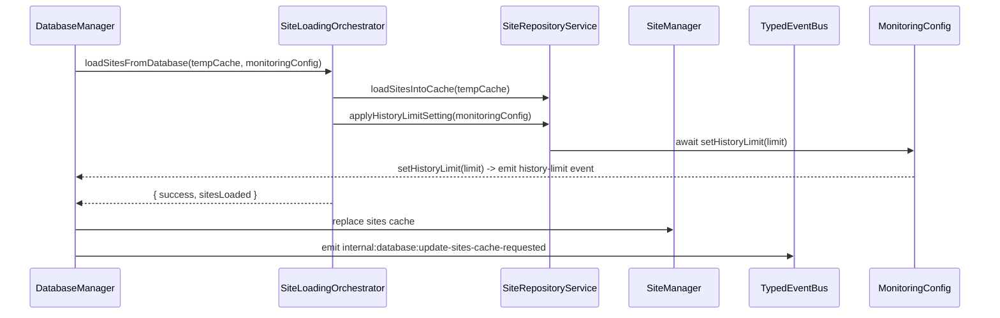

# Site Loading & Monitoring Orchestration

This guide documents how the **Site Loading Orchestrator** and its collaborating services coordinate database hydration, cache synchronization, and monitoring bootstrap inside the Electron main process.

## Overview

The loading pipeline is split across three collaborators:

1. **`DatabaseManager`** – owns startup, persistence commands, and global history-limit state.
2. **`SiteLoadingOrchestrator`** – wraps `SiteRepositoryService` to populate caches and surface metrics.
3. **`SiteManager`** – exposes mutation APIs and long-lived in-memory cache used by renderer stores.

A shared `MonitoringConfig` object links these layers and guarantees that asynchronous side effects (history-limit updates, monitoring start/stop, cache synchronization) complete in a deterministic order.

## MonitoringConfig Contract

`MonitoringConfig` is passed from `DatabaseManager` into repository helpers and mutators. All methods are now **async** and MUST be awaited by callers:

| Method                                   | Responsibility                                                             | Failure behaviour                                                            |
| ---------------------------------------- | -------------------------------------------------------------------------- | ---------------------------------------------------------------------------- |
| `setHistoryLimit(limit)`                 | Updates in-memory limit and emits `settings:history-limit-updated`.        | Propagates rejections so repository loaders halt when the event bus fails.   |
| `setupNewMonitors(site, ids)`            | Configures freshly persisted monitors via `MonitorManager`.                | Bubbles rejections to the originating mutation (add/update site).            |
| `startMonitoring(identifier, monitorId)` | Requests monitoring start through typed events after forcing a cache sync. | Logs and rethrows when the event bus rejects to avoid silent watch failures. |
| `stopMonitoring(identifier, monitorId)`  | Requests monitoring stop and surfaces event failures.                      | Logs and rethrows.                                                           |

These semantics enforce the guarantees described in ADR-003 (Error Handling Strategy): no monitoring transition can be silently skipped, and renderer state is only updated after auxiliary work completes.

## History-Limit Sequencing

1. `SiteRepositoryService.applyHistoryLimitSetting` reads the persisted limit.
2. The service **awaits** `monitoringConfig.setHistoryLimit`, ensuring:
   - `DatabaseManager` updates its in-memory limit immediately.
   - `HistoryLimitCoordinator` broadcasts deterministic `settings:history-limit-updated` events before cache synchronization continues.
3. Any rejection halts loading and surfaces rich error logs in both `SiteManager` and `DatabaseManager`.

## Cache Synchronization & Background Hydration

- Initial loads replace the entire `StandardizedCache` and emit `sites:state-synchronized` with a sanitized snapshot.
- `SiteManager.loadSiteInBackground` now hydrates a single site via `getSiteFromDatabase(identifier)`:
  - On success, it updates the cache, emits `STATE_SYNC_ACTION.UPDATE` through `emitSitesStateSynchronized`, and publishes `internal:site:cache-updated` for cross-process observers.
  - When the site is missing or hydration fails, it emits `internal:site:cache-miss` to trigger fallback flows.

This targeted hydration removes unnecessary full-table reads and guarantees renderer stores converge without manual resync requests.

## Operational Invariants

- Every cache mutation that hits the database must call `emitSitesStateSynchronized` so renderer stores receive delta payloads.
- Monitoring-related event emissions (`start-/stop-monitoring-requested`) may **not** be swallowed; upstream orchestrators rely on propagated rejections for retries/backoff.
- History-limit changes are transactional: the in-memory value, persisted setting, and pruning logic run in a single `withDatabaseOperation` invocation.

## Implementation Checklist

- [ ] Await `MonitoringConfig.setHistoryLimit` in any new loader or mutation.
- [ ] Propagate monitoring start/stop rejections, logging before rethrowing.
- [ ] When adding background hydration paths, emit both `sites:state-synchronized` and `internal:site:cache-updated`.
- [ ] Update this document when the orchestration flow or event contracts change.

## Current Implementation Audit (2025-11-04)

- Reviewed `electron/utils/database/SiteRepositoryService.ts` to confirm `SiteLoadingOrchestrator` continues to await `MonitoringConfig` hooks and emits the documented events on success and failure.
- Verified `electron/managers/SiteManager.ts` still funnels mutations through `SiteWriterService` and publishes `internal:site:*` plus `sites:state-synchronized` events after cache swaps.
- Cross-checked integration coverage in `electron/test/utils/database/SiteRepositoryService.comprehensive.test.ts` to ensure deterministic sequencing and cache replacement remain enforced by automated tests.
