# Architecture Documentation Index

This directory contains comprehensive architectural documentation for the Uptime-Watcher application, including Architecture Decision Records (ADRs), development patterns, code templates, and documentation standards.

## 📁 Directory Structure

```text
docs/Architecture/
├── README.md                     # This file
├── ADRs/                        # Architecture Decision Records
│   ├── ADR_001_REPOSITORY_PATTERN.md
│   ├── ADR_002_EVENT_DRIVEN_ARCHITECTURE.md
│   ├── ADR_003_ERROR_HANDLING_STRATEGY.md
│   ├── ADR_004_FRONTEND_STATE_MANAGEMENT.md
│   ├── ADR_005_IPC_COMMUNICATION_PROTOCOL.md
│   └── ADR_006_STANDARDIZED_CACHE_CONFIGURATION.md
├── generated/                   # Auto-generated reference artifacts
│   └── IPC_CHANNEL_INVENTORY.md
├── Patterns/                    # Development patterns guide
│   ├── COMPONENT_PROPS_STANDARDS.md
│   ├── DEVELOPMENT_PATTERNS_GUIDE.md
│   └── SITE_LOADING_ORCHESTRATION.md
├── Templates/                   # Code templates for common patterns
│   ├── IPC_HANDLER_TEMPLATE.md
│   ├── REPOSITORY_TEMPLATE.md
│   ├── REPOSITORY_TEMPLATE_CLEAN.md
│   └── ZUSTAND_STORE_TEMPLATE.md
├── UsageGuides/                 # Onboarding & navigation guidance
│   └── Using-This-Documentation.md
└── TSDOC_STANDARDS.md           # Documentation standards
```

### Architecture documentation map

```mermaid
flowchart TD
    classDef hub fill:#0f172a,stroke:#0f172a,stroke-width:2px,color:#f8fafc;
    classDef section fill:#e2e8f0,stroke:#1e293b,stroke-width:2px,color:#0f172a;
    classDef file fill:#fef3c7,stroke:#c2410c,stroke-width:2px,color:#7c2d12;

    Docs(("Architecture Knowledge Base"))
    Docs --> ADRs["ADRs"]
    Docs --> Patterns["Patterns"]
    Docs --> Templates["Templates"]
    Docs --> Standards["Standards"]
    Docs --> UsageGuides["Usage Guides"]
    Docs --> Generated["Generated Artifacts"]

    ADRs --> ADR1["ADR-001 Repository Pattern"]
    ADRs --> ADR2["ADR-002 Event-Driven Architecture"]
    ADRs --> ADR3["ADR-003 Error Handling Strategy"]
    ADRs --> ADR4["ADR-004 Frontend State Management"]
    ADRs --> ADR5["ADR-005 IPC Protocol"]
    ADRs --> ADR6["ADR-006 Standardized Cache Configuration"]

    Patterns --> PatternGuide["Development Patterns Guide"]
    Patterns --> ComponentProps["Component Props Standards"]
    Patterns --> SiteLoading["Site Loading & Monitoring"]
    Templates --> RepoTemplate["Repository Template"]
    Templates --> RepoTemplateClean["Repository Template (Clean)"]
    Templates --> StoreTemplate["Zustand Store Template"]
    Templates --> IPCTemplate["IPC Handler Template"]
    Standards --> TsdocStandards["TSDoc Standards"]
    UsageGuides --> QuickStart["Using This Documentation"]
    Generated --> IPCInventory["IPC Channel Inventory"]

    class Docs hub;
    class ADRs,Patterns,Templates,Standards,UsageGuides,Generated section;
    class ADR1,ADR2,ADR3,ADR4,ADR5,ADR6,PatternGuide,ComponentProps,SiteLoading,RepoTemplate,RepoTemplateClean,StoreTemplate,IPCTemplate,TsdocStandards,QuickStart,IPCInventory file;
```



## 🏗️ Architecture Decision Records (ADRs)

ADRs document the key architectural decisions made during development, their context, consequences, and implementation guidelines.

### [ADR-001: Repository Pattern](./ADRs/ADR_001_REPOSITORY_PATTERN.md)

**Status: Accepted** - Establishes the repository pattern for all database access

- Dual method pattern (public async + internal sync)
- Transaction safety with `executeTransaction()`
- Consistent error handling and event emission
- All repositories follow this pattern: `SiteRepository`, `MonitorRepository`, `HistoryRepository`, `SettingsRepository`

### [ADR-002: Event-Driven Architecture](./ADRs/ADR_002_EVENT_DRIVEN_ARCHITECTURE.md)

**Status: Accepted** - Core communication mechanism using TypedEventBus

- Type-safe event system with compile-time checking
- Automatic metadata injection (correlation IDs, timestamps)
- Domain-based event naming (`domain:action`)
- IPC event forwarding for frontend integration

### [ADR-003: Error Handling Strategy](./ADRs/ADR_003_ERROR_HANDLING_STRATEGY.md)

**Status: Accepted** - Multi-layered error handling across all application layers

- Shared `withErrorHandling()` utility with frontend/backend overloads
- `withDatabaseOperation()` for retry logic and database operations
- Error preservation principles maintaining stack traces
- Safe store operations preventing cascading failures

### [ADR-004: Frontend State Management](./ADRs/ADR_004_FRONTEND_STATE_MANAGEMENT.md)

**Status: Accepted** - Zustand-based state management with modular composition

- Type-safe store interfaces with comprehensive TypeScript
- Modular composition for complex stores
- Selective persistence for user preferences
- Integration with error handling and IPC systems

### [ADR-005: IPC Communication Protocol](./ADRs/ADR_005_IPC_COMMUNICATION_PROTOCOL.md)

**Status: Accepted** - Standardized Electron IPC communication

- Centralized IPC service with domain-specific handlers
- Type-safe preload API with contextBridge isolation
- Consistent validation and error handling
- Event forwarding protocol for real-time updates

## 📋 Development Patterns

### [Development Patterns Guide](./Patterns/DEVELOPMENT_PATTERNS_GUIDE.md)

Comprehensive guide to all established patterns in the codebase:

- **Repository Pattern** - Database access with transaction safety
- **Event-Driven Communication** - TypedEventBus usage and event naming
- **Error Handling Patterns** - Multi-layered error handling strategies
- **Frontend State Management** - Zustand stores and modular composition
- **IPC Communication** - Electron IPC patterns and type safety
- **Testing Patterns** - Consistent testing approaches across layers

### [Component Props Standards](./Patterns/COMPONENT_PROPS_STANDARDS.md)

Detailed prop authoring standards for React components:

- **Interface Naming** - `Properties` suffix for all prop interfaces
- **Readonly Props** - Enforce immutability to avoid side effects
- **Event Handling** - Normalised handler signatures and accessibility defaults
- **Compliance Checklist** - Quick validation before code review

### [Site Loading & Monitoring Orchestration](./Patterns/SITE_LOADING_ORCHESTRATION.md)

End-to-end walkthrough of the main-process site loading pipeline:

- `DatabaseManager` startup and cache replacement flow
- `SiteLoadingOrchestrator` responsibilities and metrics
- Asynchronous `MonitoringConfig` guarantees (history limit, start/stop propagation)
- Renderer synchronization (`sites:state-synchronized`) and background hydration logic

## 🛠️ Code Templates

Ready-to-use templates for implementing common patterns:

### [Repository Template](./Templates/REPOSITORY_TEMPLATE.md)

Complete template for creating new repository classes:

- Full TypeScript implementation with dual methods
- Query constants and dependency injection
- Comprehensive TSDoc documentation
- Test template and integration checklist

### [Zustand Store Template](./Templates/ZUSTAND_STORE_TEMPLATE.md)

Templates for both simple and complex Zustand stores:

- Simple store pattern for straightforward state
- Complex store with modular composition
- Module templates for focused functionality
- Testing patterns and error integration

### [IPC Handler Template](./Templates/IPC_HANDLER_TEMPLATE.md)

Complete IPC communication implementation:

- Handler registration with validation
- Preload API extensions
- Type definitions and error handling
- Test templates and naming conventions

## 📚 Documentation Standards

### [TSDoc Standards](./TSDOC_STANDARDS.md)

Standardized documentation patterns for inline code examples:

- Repository pattern documentation examples
- Event system documentation standards
- Frontend store documentation patterns
- Error handling documentation
- IPC communication documentation
- Code example categories and validation checklist

## 🧾 Generated Artifacts

### [IPC Channel Inventory](./generated/IPC_CHANNEL_INVENTORY.md)

Auto-generated reference documenting the authoritative list of IPC channels exposed via the preload bridge. Regenerate via `npm run generate:ipc` and keep this file in sync by running `npm run check:ipc` (also enforced in CI).

## 🎯 Using This Documentation

### For New Developers

1. **Start with ADRs** - Understand the architectural decisions and their context
2. **Read the Patterns Guide** - Learn the established patterns and conventions
3. **Use Templates** - Implement new features using the provided templates
4. **Follow TSDoc Standards** - Document your code using the established patterns

### For Existing Developers

1. **Reference ADRs** - When making architectural changes, consult existing decisions
2. **Update Patterns** - If you discover new patterns, document them in the guide
3. **Improve Templates** - Update templates based on learnings and improvements
4. **Maintain Standards** - Follow and improve the documentation standards

### For Code Reviews

1. **Check Pattern Compliance** - Ensure new code follows established patterns
2. **Verify Documentation** - Check that TSDoc follows the standards
3. **Validate Architecture** - Ensure changes align with ADR decisions
4. **Template Usage** - Verify that new repositories/stores/handlers use templates

## 🔄 Maintenance Guidelines

### When to Update ADRs

- **Status Changes** - Mark ADRs as superseded when patterns evolve
- **New Decisions** - Create new ADRs for significant architectural changes
- **Context Updates** - Update context and consequences as understanding improves

### Pattern Evolution

- **Document New Patterns** - Add emerging patterns to the guide
- **Update Templates** - Evolve templates based on best practices
- **Maintain Consistency** - Ensure all patterns work together harmoniously

### Documentation Quality

- **Regular Reviews** - Periodically review and update documentation
- **Example Accuracy** - Ensure code examples remain current and accurate
- **Cross-References** - Maintain links between related documents

### Automation & Review Cadence

- **Link Validation** - `npm run docs:check-links` verifies internal Markdown links and runs on every `lint:ci`
- **Quarterly Sync** - Architecture documentation reviewed during the first week of each quarter; action items tracked in `TODO.md`
- **CI Enforcement** - Documentation checks block merges alongside linting and IPC analysis to prevent drift

## 📊 Compliance Tracking

### Repository Pattern

- ✅ All database access uses repository pattern
- ✅ All repositories implement dual-method pattern
- ✅ All mutations use `executeTransaction()`
- ✅ All operations use `withDatabaseOperation()`

## Current Documentation Audit (2025-11-04)

- Verified directory listings against the live tree to ensure all paths, filenames, and cross-links (ADRs, patterns, templates, usage guides, generated artifacts) remain accurate.
- Click-tested intra-document links (mermaid references, pattern sections, and generated inventory) to confirm they resolve to existing files.
- Confirmed automation references (`npm run generate:ipc`, `npm run check:ipc`, `npm run docs:check-links`) still exist in `package.json` and CI scripts, ensuring the maintenance guidance is actionable.

### Event System

- ✅ All communication uses TypedEventBus
- ✅ All events follow naming conventions
- ✅ All events include proper metadata
- ✅ IPC events are automatically forwarded

### Error Handling

- ✅ All layers use appropriate error handling utilities
- ✅ All errors preserve original context
- ✅ All operations emit appropriate events
- ✅ Frontend stores use safe operations

### Frontend State

- ✅ All stores use TypeScript interfaces
- ✅ Complex stores use modular composition
- ✅ Persistence is selective and purposeful
- ✅ Actions include consistent logging

### IPC Communication

- ✅ All handlers use standardized registration
- ✅ All parameters are validated
- ✅ All channels follow naming conventions
- ✅ Preload API is type-safe

## 🚀 Quick Start

To implement a new feature:

1. **Identify the pattern** - Determine which architectural pattern applies
2. **Use the template** - Start with the appropriate template
3. **Follow the standards** - Use TSDoc standards for documentation
4. **Test thoroughly** - Use testing patterns from the guide
5. **Review compliance** - Ensure the implementation follows all relevant ADRs

## 📞 Support

For questions about architectural patterns or documentation:

1. **Check the ADRs** - Look for existing decisions
2. **Review the patterns guide** - Find established conventions
3. **Use the templates** - Adapt templates to your needs
4. **Follow the standards** - Use TSDoc standards for consistency

This documentation represents the living architectural knowledge of the Uptime-Watcher project. It should be updated as the architecture evolves and new patterns emerge.
