# Architecture Documentation Index

## Table of Contents

1. [📁 Directory Structure](#-directory-structure)
2. [🏗️ Architecture Decision Records (ADRs)](#️-architecture-decision-records-adrs)
3. [Additional ADRs (Draft)](#additional-adrs-draft)
4. [📋 Development Patterns](#-development-patterns)
5. [🧩 Recent Consistency Updates](#-recent-consistency-updates)
6. [🛠️ Code Templates](#️-code-templates)
7. [📚 Documentation Standards](#-documentation-standards)
8. [🧾 Generated Artifacts](#-generated-artifacts)
9. [🎯 Using This Documentation](#-using-this-documentation)
10. [🔄 Maintenance Guidelines](#-maintenance-guidelines)
11. [📊 Compliance Tracking](#-compliance-tracking)
12. [Current Documentation Audit (2025-11-04)](#current-documentation-audit-2025-11-04)
13. [🚀 Quick Start](#-quick-start)
14. [📞 Support](#-support)

## 📁 Directory Structure

```text
docs/Architecture/
├── README.md                     # This file
├── ADRs/                        # Architecture Decision Records
│   ├── ADR_001_REPOSITORY_PATTERN.md
│   ├── ADR_002_EVENT_DRIVEN_ARCHITECTURE.md
│   ├── ADR_003_ERROR_HANDLING_STRATEGY.md
│   ├── ADR_004_FRONTEND_STATE_MANAGEMENT.md
│   ├── ADR_005_IPC_COMMUNICATION_PROTOCOL.md
│   ├── ADR_006_STANDARDIZED_CACHE_CONFIGURATION.md
│   ├── ADR_007_SERVICE_CONTAINER_DEPENDENCY_INJECTION.md
│   ├── ADR_008_MONITOR_TYPE_REGISTRY.md
│   ├── ADR_009_VALIDATION_STRATEGY.md
│   ├── ADR_010_TESTING_STRATEGY.md
│   ├── ADR_011_SCHEDULER_AND_BACKOFF.md
│   ├── ADR_012_NOTIFICATIONS_AND_ALERTING.md
│   ├── ADR_013_DATA_PORTABILITY_AND_BACKUP.md
│   ├── ADR_014_LOGGING_TELEMETRY_AND_DIAGNOSTICS.md
│   ├── ADR_015_CLOUD_SYNC_AND_REMOTE_BACKUP.md
│   ├── ADR_016_MULTI_DEVICE_SYNC_MODEL.md
│   ├── ADR_017_EXTERNAL_ALERT_INTEGRATIONS.md
│   ├── ADR_018_MAINTENANCE_WINDOWS_AND_SILENCING.md
│   ├── ADR_019_TEMPLATES_AND_BULK_OPERATIONS.md
│   ├── ADR_020_SUPPORT_DIAGNOSTICS_BUNDLE.md
│   ├── ADR_021_CLOUD_PROVIDER_SELECTION_AND_SETTINGS_UI.md
│   ├── ADR_022_OAUTH_LOOPBACK_REDIRECT_AND_CALLBACK_ROUTING.md
│   ├── ADR_023_SECRET_STORAGE_AND_ENCRYPTION_POLICY.md
│   ├── ADR_024_CLOUD_PROVIDER_SWITCHING_AND_MIGRATION_POLICY.md
│   ├── ADR_025_RELEASE_ASSET_NAMING_AND_UPLOAD_STRATEGY.md
│   ├── ADR_026_ELECTRON_SECURITY_MODEL_AND_RENDERER_ISOLATION.md
│   ├── ADR_027_AUTO_UPDATE_STRATEGY_AND_RELEASE_CHANNELS.md
│   ├── ADR_028_DATABASE_SCHEMA_VERSIONING_AND_MIGRATIONS.md
│   ├── ADR_029_BACKUP_FORMAT_ENCRYPTION_AND_COMPATIBILITY_POLICY.md
│   ├── ADR_030_APP_CONFIGURATION_AND_SETTINGS_PERSISTENCE_MODEL.md
│   ├── ADR_031_PACKAGING_SIGNING_AND_NOTARIZATION_POLICY.md
│   ├── ADR_032_SUPPORT_AND_DIAGNOSTICS_DATA_POLICY.md
│   └── ARCHITECTURE_DIAGRAM.md
├── generated/                   # Auto-generated reference artifacts
│   └── IPC_CHANNEL_INVENTORY.md
├── Patterns/                    # Development patterns guide
│   ├── COMPONENT_PROPS_STANDARDS.md
│   ├── DEVELOPMENT_PATTERNS_GUIDE.md
│   └── SITE_LOADING_ORCHESTRATION.md
├── Stores/                      # Store reference docs (renderer state)
│   ├── README.md
│   ├── alerts.md
│   ├── confirm-dialog.md
│   ├── error.md
│   ├── monitor-types.md
│   ├── settings.md
│   ├── sites.md
│   ├── ui.md
│   └── updates.md
├── Templates/                   # Code templates for common patterns
│   ├── EVENT_EMISSION_CHECKLIST.md
│   ├── IPC_DIAGNOSTICS_HANDLER_TEMPLATE.md
│   ├── IPC_HANDLER_TEMPLATE.md
│   ├── REPOSITORY_TEMPLATE.md
│   ├── SCHEDULER_JOB_TEMPLATE.md
│   └── ZUSTAND_STORE_TEMPLATE.md
├── UsageGuides/                 # Onboarding & navigation guidance
│   └── Using-This-Documentation.md
└── TSDOC_STANDARDS.md           # Documentation standards
```

### Architecture documentation map

```mermaid
flowchart TD
    classDef hub fill:#0f172a,stroke:#0f172a,stroke-width:2px,color:#f8fafc;
    classDef section fill:#e2e8f0,stroke:#1e293b,stroke-width:2px,color:#0f172a;
    classDef file fill:#fef3c7,stroke:#c2410c,stroke-width:2px,color:#7c2d12;

    Docs(("Architecture Knowledge Base"))
    Docs --> ADRs["ADRs"]
    Docs --> Patterns["Patterns"]
    Docs --> Templates["Templates"]
    Docs --> Standards["Standards"]
    Docs --> UsageGuides["Usage Guides"]
    Docs --> Generated["Generated Artifacts"]

    ADRs --> ADR1["ADR-001 Repository Pattern"]
    ADRs --> ADR2["ADR-002 Event-Driven Architecture"]
    ADRs --> ADR3["ADR-003 Error Handling Strategy"]
    ADRs --> ADR4["ADR-004 Frontend State Management"]
    ADRs --> ADR5["ADR-005 IPC Protocol"]
    ADRs --> ADR6["ADR-006 Standardized Cache Configuration"]
    ADRs --> ADR7["ADR-007 Service Container & DI"]
    ADRs --> ADR8["ADR-008 Monitor Type Registry"]
    ADRs --> ADR9["ADR-009 Validation Strategy"]
    ADRs --> ADR10["ADR-010 Testing Strategy"]
    ADRs --> ADR11["ADR-011 Scheduler & Backoff"]
    ADRs --> ADR12["ADR-012 Notifications & Alerting"]
    ADRs --> ADR13["ADR-013 Data Portability & Backup"]
    ADRs --> ADR14["ADR-014 Logging & Diagnostics"]
    ADRs --> ADR15["ADR-015 Cloud Sync & Remote Backup"]
    ADRs --> ADR16["ADR-016 Multi-Device Sync Model"]
    ADRs --> ADR17["ADR-017 External Alert Integrations"]
    ADRs --> ADR18["ADR-018 Maintenance Windows & Silencing"]
    ADRs --> ADR19["ADR-019 Templates & Bulk Operations"]
    ADRs --> ADR20["ADR-020 Support Diagnostics Bundle"]
    ADRs --> ADR21["ADR-021 Cloud Provider Selection UI"]
    ADRs --> ADR22["ADR-022 OAuth Loopback Redirect"]
    ADRs --> ADR23["ADR-023 Secret Storage Policy"]
    ADRs --> ADR24["ADR-024 Provider Switching Policy"]
    ADRs --> ADR25["ADR-025 Release Asset Upload Strategy"]
    ADRs --> ADR26["ADR-026 Electron Security Model"]
    ADRs --> ADR27["ADR-027 Auto-Update Strategy"]
    ADRs --> ADR28["ADR-028 DB Schema Migrations"]
    ADRs --> ADR29["ADR-029 Backup Format & Encryption"]
    ADRs --> ADR30["ADR-030 App Configuration Model"]
    ADRs --> ADR31["ADR-031 Packaging & Signing"]
    ADRs --> ADR32["ADR-032 Support Diagnostics Data Policy"]

    Patterns --> PatternGuide["Development Patterns Guide"]
    Patterns --> ComponentProps["Component Props Standards"]
    Patterns --> SiteLoading["Site Loading & Monitoring"]
    Patterns --> InitImport["Initialization & Data Import"]
    Templates --> RepoTemplate["Repository Template"]
    Templates --> RepoTemplateClean["Repository Template (Clean)"]
    Templates --> StoreTemplate["Zustand Store Template"]
    Templates --> IPCTemplate["IPC Handler Template"]
    Templates --> IPCDiagnosticsTemplate["IPC Diagnostics Handler Template"]
    Templates --> SchedulerTemplate["Scheduler Job Template"]
    Templates --> EventChecklist["Event Emission Checklist"]
    Standards --> TsdocStandards["TSDoc Standards"]
    UsageGuides --> QuickStart["Using This Documentation"]
    Generated --> IPCInventory["IPC Channel Inventory"]

    class Docs hub;
    class ADRs,Patterns,Templates,Standards,UsageGuides,Generated section;
    class ADR1,ADR2,ADR3,ADR4,ADR5,ADR6,ADR7,ADR8,ADR9,ADR10,ADR11,ADR12,ADR13,ADR14,ADR15,ADR16,ADR17,ADR18,ADR19,ADR20,ADR21,ADR22,ADR23,ADR24,ADR25,ADR26,ADR27,ADR28,ADR29,ADR30,ADR31,ADR32,PatternGuide,ComponentProps,SiteLoading,InitImport,RepoTemplate,RepoTemplateClean,StoreTemplate,IPCTemplate,IPCDiagnosticsTemplate,SchedulerTemplate,EventChecklist,TsdocStandards,QuickStart,IPCInventory file;
```



## 🏗️ Architecture Decision Records (ADRs)

ADRs document the key architectural decisions made during development, their context, consequences, and implementation guidelines.

### [ADR-001: Repository Pattern](./ADRs/ADR_001_REPOSITORY_PATTERN.md)

**Status: Accepted** - Establishes the repository pattern for all database access

- Dual method pattern (public async + internal sync)
- Transaction safety with `executeTransaction()`
- Consistent error handling and event emission
- All repositories follow this pattern: `SiteRepository`, `MonitorRepository`, `HistoryRepository`, `SettingsRepository`

### [ADR-002: Event-Driven Architecture](./ADRs/ADR_002_EVENT_DRIVEN_ARCHITECTURE.md)

**Status: Accepted** - Core communication mechanism using TypedEventBus

- Type-safe event system with compile-time checking
- Automatic metadata injection (correlation IDs, timestamps)
- Domain-based event naming (`domain:action`)
- IPC event forwarding for frontend integration

### [ADR-003: Error Handling Strategy](./ADRs/ADR_003_ERROR_HANDLING_STRATEGY.md)

**Status: Accepted** - Multi-layered error handling across all application layers

- Shared `withErrorHandling()` utility with frontend/backend overloads
- `withDatabaseOperation()` for retry logic and database operations
- Error preservation principles maintaining stack traces
- Safe store operations preventing cascading failures

### [ADR-004: Frontend State Management](./ADRs/ADR_004_FRONTEND_STATE_MANAGEMENT.md)

**Status: Accepted** - Zustand-based state management with modular composition

- Type-safe store interfaces with comprehensive TypeScript
- Modular composition for complex stores
- Selective persistence for user preferences
- Integration with error handling and IPC systems

### [ADR-005: IPC Communication Protocol](./ADRs/ADR_005_IPC_COMMUNICATION_PROTOCOL.md)

**Status: Accepted** - Standardized Electron IPC communication

- Centralized IPC service with domain-specific handlers
- Type-safe preload API with contextBridge isolation
- Consistent validation and error handling
- Event forwarding protocol for real-time updates

### [ADR-006: Standardized Cache Configuration](./ADRs/ADR_006_STANDARDIZED_CACHE_CONFIGURATION.md)

**Status: Accepted** - Unified cache limits and TTLs for services and managers

- Shared cache constants for eviction, TTL, and size limits
- Applies to orchestrator managers and services to avoid configuration drift
- Documents cache invalidation triggers and alignment with repository freshness guarantees

### [ADR-007: Service Container and Dependency Injection](./ADRs/ADR_007_SERVICE_CONTAINER_DEPENDENCY_INJECTION.md)

**Status: Accepted** - Centralized service container for Electron main

- Lazy singleton creation for managers, repositories, and utilities
- Deterministic initialization order with dependency graph awareness
- Event bus wiring and IPC handler registration mediated by the container for consistency

### [ADR-008: Monitor Type Registry and Plugin Architecture](./ADRs/ADR_008_MONITOR_TYPE_REGISTRY.md)

**Status: Accepted** - Extensible registry for monitor types

- Plugin-style registration covering validation schemas, UI configuration, and factories
- Supports versioned migrations for monitor definitions
- Frontend integration through registry metadata and typed IPC contracts

### [ADR-009: Layered Validation Strategy with Zod](./ADRs/ADR_009_VALIDATION_STRATEGY.md)

**Status: Accepted** - Multi-layer validation across IPC, managers, and persistence

- Zod schemas at IPC boundaries for payload safety
- Business-rule validation in managers; persistence constraints in repositories
- Shared error surface and telemetry for validation failures

### [ADR-010: Multi-Configuration Testing Strategy](./ADRs/ADR_010_TESTING_STRATEGY.md)

**Status: Accepted** - Comprehensive test matrix across app layers

- Separate Vitest configs for frontend, electron, shared, and Storybook runner
- Playwright E2E coverage and property-based testing guidance
- Coverage strategy and mocking guidance to keep suites reliable and fast

### [ADR-015: Cloud Sync and Remote Backup Providers](./ADRs/ADR_015_CLOUD_SYNC_AND_REMOTE_BACKUP.md)

**Status: Accepted (MVP implemented)** - Provider-backed remote backup and true multi-device sync integration.

- Dropbox OAuth PKCE + token refresh + encrypted token storage (safeStorage)
- Provider abstraction + filesystem provider for development/integration
- Main-process sync engine integration and background polling

Related guide:

- [Dropbox Cloud Sync Setup](../Guides/CLOUD_SYNC_DROPBOX_SETUP.md)

### [ADR-016: Multi-Device Sync Data Model](./ADRs/ADR_016_MULTI_DEVICE_SYNC_MODEL.md)

**Status: Accepted (implemented)** - Deterministic operation-log + snapshot sync model.

- Canonical sync domain state (sites/monitors/settings)
- Deterministic merge rules and convergence guarantees
- Property and integration tests for determinism and multi-device convergence

## Additional ADRs (Draft)

### [ADR-011: Scheduler and Backoff Strategy](./ADRs/ADR_011_SCHEDULER_AND_BACKOFF.md)

**Status: Draft** - Defines monitor scheduling cadence, jitter/backoff, timeout defaults, and how manual checks interact with the scheduler.

- Interval selection, jitter, exponential backoff, and cancellation semantics
- Timeout handling and propagation to monitor workers
- Reconciliation when manual or priority checks pre-empt scheduled runs

### [ADR-012: Notifications and Alerting Policy](./ADRs/ADR_012_NOTIFICATIONS_AND_ALERTING.md)

**Status: Draft** - Establishes desktop notification and sound alert rules, throttling, suppression, and reliability expectations for outage/restore signals.

- Channels (desktop, sound), debounce/backoff rules, suppression windows
- Reliability/ordering expectations for outage vs. restore signals
- Notification lifecycle mapped to monitor events and user preferences

### [ADR-013: Data Portability & Backup/Restore](./ADRs/ADR_013_DATA_PORTABILITY_AND_BACKUP.md)

**Status: Draft** - Documents export/import/backup guarantees, formats, integrity checks, and retention expectations for local SQLite backups.

- Backup formats, checksum/integrity validation, retention guidance
- User-facing messaging and error handling for backup/restore failures
- Import/export compatibility and versioning expectations

### [ADR-014: Logging, Telemetry, and Diagnostics](./ADRs/ADR_014_LOGGING_TELEMETRY_AND_DIAGNOSTICS.md)

**Status: Draft** - Standardizes log levels/fields, correlation IDs, diagnostics IPC flows, and privacy/redaction bounds.

- electron-log levels, structured fields, correlation IDs, and retention
- Diagnostics IPC (e.g., `diagnostics-report-preload-guard`) and validation
- Privacy, redaction, and PII handling rules across logs and diagnostics artifacts

## 📋 Development Patterns

### [Development Patterns Guide](./Patterns/DEVELOPMENT_PATTERNS_GUIDE.md)

Comprehensive guide to all established patterns in the codebase:

- **Repository Pattern** - Database access with transaction safety
- **Event-Driven Communication** - TypedEventBus usage and event naming
- **Error Handling Patterns** - Multi-layered error handling strategies
- **Frontend State Management** - Zustand stores and modular composition
- **IPC Communication** - Electron IPC patterns and type safety
- **Testing Patterns** - Consistent testing approaches across layers

### [Component Props Standards](./Patterns/COMPONENT_PROPS_STANDARDS.md)

Detailed prop authoring standards for React components:

- **Interface Naming** - `Properties` suffix for all prop interfaces
- **Readonly Props** - Enforce immutability to avoid side effects
- **Event Handling** - Normalised handler signatures and accessibility defaults
- **Compliance Checklist** - Quick validation before code review

### [Site Loading & Monitoring Orchestration](./Patterns/SITE_LOADING_ORCHESTRATION.md)

End-to-end walkthrough of the main-process site loading pipeline:

- `DatabaseManager` startup and cache replacement flow
- `SiteLoadingOrchestrator` responsibilities and metrics
- Asynchronous `MonitoringConfig` guarantees (history limit, start/stop propagation)
- Renderer synchronization (`sites:state-synchronized`) and background hydration logic

### [Boundary Validation Strategy](./Patterns/BOUNDARY_VALIDATION_STRATEGY.md)

Canonical pattern for handling untrusted data at boundaries:

- Parse safely (`JsonValue`/`unknown`)
- Validate via shared Zod schemas in `shared/validation/*`
- Transform explicitly at layer boundaries (rows ↔ domain)
- Emit typed diagnostics/events for failures

## 🧩 Recent Consistency Updates

The following areas were recently clarified and brought into closer alignment
with the implemented architecture:

- **2025-12-29 consistency audit**: See the full categorized report and
  roadmap in [`CONSISTENCY_AUDIT_2025_12_29.md`](./CONSISTENCY_AUDIT_2025_12_29.md).

- **Event naming**: ADR-002 and ADR-005 now include an explicit public-event
  summary table and terminology notes that match the canonical
  `UptimeEvents`/`OrchestratorEvents` definitions in code.

- **History limit behavior**: The history-limit propagation section and
  `SettingsService.updateHistoryLimit` documentation precisely describe how
  invalid user input and invalid backend responses are handled, including when
  a `TypeError` is surfaced versus when a sanitised fallback is used.

- **Error model and helper usage**: The error handling guide and ADR-003 now
  share a single helper-selection model covering `withErrorHandling`,
  `withUtilityErrorHandling`, JSON/object safety helpers, and the
  renderer-specific wrappers in `src/utils/fallbacks.ts`.

- **IPC validation contract**: Both request and response payloads must be
  validated on each side of the bridge. Monitor types now flow through the
  shared schema in `@shared/validation/dataSchemas.ts`, while the data backup
  and import/export channels rely on the same helper plus structured
  diagnostics in `DataService`.

### IPC validation expectations (data + monitor types)

**Request + response symmetry**

- All IPC traffic that crosses the Electron bridge must validate on _both_
  the main-process handler and the renderer service. The canonical schemas
  live under `@shared/validation`, ensuring both sides can share the same
  contract.
- Renderer services call `withUtilityErrorHandling` (directly or via
  higher-level helpers) to log structured context and then delegate to the
  shared validator. Main-process handlers use the same schema when serializing
  results back to the renderer.

**Monitor type registry**

- `shared/validation/dataSchemas.ts#monitorTypeConfigArraySchema` defines the
  authoritative shape for monitor types and their `fields`. Renderer-side
  access goes through `MonitorTypesService.getMonitorTypes`, which now rejects
  malformed payloads instead of silently filtering them out.
- `useMonitorTypesStore` propagates validation failures via `lastError`, so
  UI surfaces can fail fast when the backend returns invalid data. Valid but
  empty arrays remain a supported scenario (e.g., onboarding flows).

**Data exports, imports, and backups**

- `DataService` wraps every IPC call with `runDataOperation`, a helper that
  uses `withUtilityErrorHandling` to log `[DataService] <operation>` context.
  Validation failures include serialized diagnostics (such as the original
  filename) so issues can be traced even when the renderer is the only source
  of logs.
- Main-process handlers continue to use the same `serializedDatabase*` schemas
  before responding. If either side detects invalid data, the error propagates
  with enough context for telemetry to capture the root cause.

### History limit propagation (settings & database)

This subsection summarizes how history limit changes flow through the system.
For full implementation details, see the code references listed in
`docs/Architecture/ADRs/ADR_002_EVENT_DRIVEN_ARCHITECTURE.md` and
`docs/Architecture/ADRs/ADR_004_FRONTEND_STATE_MANAGEMENT.md`.

**End-to-end flow**

1. **Renderer settings request**
   - The UI calls `SettingsService.updateHistoryLimit` in
     `src/services/SettingsService.ts`.
   - The service validates the requested limit with
     `normalizeHistoryLimit(DEFAULT_HISTORY_LIMIT_RULES)` and forwards the
     request over the typed IPC channel `"update-history-limit"` (via
     `SETTINGS_CHANNELS.updateHistoryLimit`).

2. **Main-process IPC handling**
   - `electron/services/ipc/IpcService.ts` registers the
     `SETTINGS_CHANNELS.updateHistoryLimit` handler through
     `registerStandardizedIpcHandler`, delegating to
     `DatabaseManager.setHistoryLimit` on the orchestrator.
   - The IPC handler uses the per-domain parameter validators in
     `electron/services/ipc/validators/settings.ts` to enforce a numeric payload
     before invoking the manager.

3. **Database history limit update**
   - `electron/managers/DatabaseManager.ts` normalizes the limit using the
     shared history rules from `@shared/constants/history`.
   - The manager calls `setHistoryLimit` in
     `electron/utils/database/historyLimitManager.ts` to persist the new limit
     and prune history in a single transaction.
   - As soon as the limit has been normalized, the manager updates its
     in-memory `historyLimit` and calls `emitHistoryLimitUpdated` with the
     final value.

4. **Internal database event emission**
   - `emitHistoryLimitUpdated` emits the typed event
     `"internal:database:history-limit-updated"` via
     `TypedEventBus<UptimeEvents>`.
   - The event payload includes the new `limit`, the `operation`
     `"history-limit-updated"`, and a `timestamp`.

5. **HistoryLimitCoordinator forwarding**
   - `electron/coordinators/HistoryLimitCoordinator.ts` subscribes to
     `"internal:database:history-limit-updated"` on the orchestrator event
     bus.
   - It validates the new limit, tracks `previousLimit`, and forwards a
     sanitized `settings:history-limit-updated` event to renderer listeners
     using the shared `HistoryLimitUpdatedEventData` contract from
     `@shared/types/events` and `shared/ipc/rendererEvents.ts`.

6. **Preload bridge and renderer events**
   - `electron/preload/domains/eventsApi.ts` exposes the
     `settings:history-limit-updated` renderer channel and validates incoming
     payloads before forwarding them to `window.electronAPI.events`.
   - `src/services/EventsService.ts` provides
     `EventsService.onHistoryLimitUpdated`, wiring the preload contract into a
     typed renderer subscription with validated cleanup semantics.

7. **Renderer consumption**
   - The settings store (`src/stores/settings/useSettingsStore.ts`) and any
     interested components subscribe via `EventsService.onHistoryLimitUpdated`.
   - Store operations update local state based on the authoritative event
     payload, ensuring the renderer reflects the same limit as the backend and
     that future monitoring operations use the updated retention rules.

**Error handling semantics**

- **Invalid user input**: When the caller supplies a limit that violates the
  shared history rules (for example, exceeding the configured maximum),
  `SettingsService.updateHistoryLimit` surfaces a `TypeError` (via
  `normalizeHistoryLimitError`). Callers should treat this as a user-input
  validation error and avoid assuming the limit was changed.
- **Invalid backend response**: When the caller supplies a valid limit but the
  backend returns an invalid value, the renderer falls back to the sanitised
  request limit, logs a structured warning, and forwards the corrected limit
  through `settings:history-limit-updated`. This ensures the renderer and
  backend converge on a consistent value even in the presence of transient
  backend issues.

This flow keeps history-limit logic centralized in the database/manager layer
while providing a clear, event-driven path from a user action in the UI to the
final persisted configuration and back to the renderer.

### [Initialization & Data Import Orchestration](./Patterns/INITIALIZATION_AND_DATA_IMPORT_ORCHESTRATION.md)

Documents how `DatabaseManager`, `UptimeOrchestrator`, and the React `App`
coordinate:

- Startup phases across main and renderer processes
- `database:transaction-completed` event semantics and `operation` values
- JSON data import flows and related `internal:database:data-imported` events
- End-to-end site lifecycle flows for adding sites, adding monitors, and
  importing data

## 🛠️ Code Templates

Ready-to-use templates for implementing common patterns:

### [Repository Template](./Templates/REPOSITORY_TEMPLATE.md)

Complete template for creating new repository classes:

- Full TypeScript implementation with dual methods
- Query constants and dependency injection
- Comprehensive TSDoc documentation
- Test template and integration checklist

### [Zustand Store Template](./Templates/ZUSTAND_STORE_TEMPLATE.md)

Templates for both simple and complex Zustand stores:

- Simple store pattern for straightforward state
- Complex store with modular composition
- Module templates for focused functionality
- Testing patterns and error integration

### [IPC Handler Template](./Templates/IPC_HANDLER_TEMPLATE.md)

Complete IPC communication implementation:

- Handler registration with validation
- Preload API extensions
- Type definitions and error handling
- Test templates and naming conventions

### [IPC Diagnostics Handler Template](./Templates/IPC_DIAGNOSTICS_HANDLER_TEMPLATE.md)

Diagnostics/report IPC pattern:

- Zod validation and payload size limits
- Redaction of PII/secrets in responses
- Structured logging with correlation IDs and error surfacing
- Tests for malformed/oversized payloads and happy path

### [Scheduler Job Template](./Templates/SCHEDULER_JOB_TEMPLATE.md)

Monitor scheduling/backoff job pattern:

- Job descriptor shape (monitorId, siteIdentifier, scheduledAt, deadline, backoffState, correlationId)
- Jitter/backoff helpers and cancellation hooks
- Manual-check pre-emption and reconciliation guidance
- Tests for backoff bounds and next-run calculation

### [Event Emission Checklist](./Templates/EVENT_EMISSION_CHECKLIST.md)

Checklist for new events across main/renderer:

- Channel naming aligned to RendererEventPayloadMap
- Payload validation and metadata/correlationId inclusion
- Renderer broadcast contract and preload validation
- Logging/telemetry expectations and suppression rules

### Template maintenance

Templates are maintained alongside their corresponding ADRs and should be
updated whenever architectural boundaries, contracts, or naming conventions
change.

## 📚 Documentation Standards

### [TSDoc Standards](./TSDOC_STANDARDS.md)

Standardized documentation patterns for inline code examples:

- Repository pattern documentation examples
- Event system documentation standards
- Frontend store documentation patterns
- Error handling documentation
- IPC communication documentation
- Code example categories and validation checklist

## 🧾 Generated Artifacts

### [IPC Channel Inventory](./generated/IPC_CHANNEL_INVENTORY.md)

Auto-generated reference documenting the authoritative list of IPC channels exposed via the preload bridge. Regenerate via `npm run generate:ipc` and keep this file in sync by running `npm run check:ipc` (also enforced in CI).

## 🎯 Using This Documentation

### For New Developers

1. **Start with ADRs** - Understand the architectural decisions and their context
2. **Read the Patterns Guide** - Learn the established patterns and conventions
3. **Use Templates** - Implement new features using the provided templates
4. **Follow TSDoc Standards** - Document your code using the established patterns

### For Existing Developers

1. **Reference ADRs** - When making architectural changes, consult existing decisions
2. **Update Patterns** - If you discover new patterns, document them in the guide
3. **Improve Templates** - Update templates based on learnings and improvements
4. **Maintain Standards** - Follow and improve the documentation standards

### For Code Reviews

1. **Check Pattern Compliance** - Ensure new code follows established patterns
2. **Verify Documentation** - Check that TSDoc follows the standards
3. **Validate Architecture** - Ensure changes align with ADR decisions
4. **Template Usage** - Verify that new repositories/stores/handlers use templates

## 🔄 Maintenance Guidelines

### When to Update ADRs

- **Status Changes** - Mark ADRs as superseded when patterns evolve
- **New Decisions** - Create new ADRs for significant architectural changes
- **Context Updates** - Update context and consequences as understanding improves

### Pattern Evolution

- **Document New Patterns** - Add emerging patterns to the guide
- **Update Templates** - Evolve templates based on best practices
- **Maintain Consistency** - Ensure all patterns work together harmoniously

### Documentation Quality

- **Regular Reviews** - Periodically review and update documentation
- **Example Accuracy** - Ensure code examples remain current and accurate
- **Cross-References** - Maintain links between related documents

### Automation & Review Cadence

- Run `npm run generate:ipc` and `npm run check:ipc` whenever IPC channels change.
- Re-run Docusaurus mermaid diagrams review after new ADRs land (Scheduler, Notifications) to extend `system-architecture.mdx` and `ipc-communication.mdx` diagrams.
- When templates are added (diagnostics IPC, scheduler/backoff), link them here and in Templates/README for AI discoverability.
- **Link Validation** - `npm run docs:check-links` verifies internal Markdown links and runs on every `lint:ci`.
- **Quarterly Sync** - Architecture documentation reviewed during the first week of each quarter; action items tracked in `TODO.md`.
- **CI Enforcement** - Documentation checks block merges alongside linting and IPC analysis to prevent drift.

## 📊 Compliance Tracking

### Repository Pattern

- ✅ All database access uses repository pattern
- ✅ All repositories implement dual-method pattern
- ✅ All mutations use `executeTransaction()`
- ✅ All operations use `withDatabaseOperation()`

## Current Documentation Audit (2025-11-04)

- Verified directory listings against the live tree to ensure all paths, filenames, and cross-links (ADRs, patterns, templates, usage guides, generated artifacts) remain accurate.
- Click-tested intra-document links (mermaid references, pattern sections, and generated inventory) to confirm they resolve to existing files.
- Confirmed automation references (`npm run generate:ipc`, `npm run check:ipc`, `npm run docs:check-links`) still exist in `package.json` and CI scripts, ensuring the maintenance guidance is actionable.

### Event System

- ✅ All communication uses TypedEventBus
- ✅ All events follow naming conventions
- ✅ All events include proper metadata
- ✅ IPC events are automatically forwarded

### Error Handling

- ✅ All layers use appropriate error handling utilities
- ✅ All errors preserve original context
- ✅ All operations emit appropriate events
- ✅ Frontend stores use safe operations

### Frontend State

- ✅ All stores use TypeScript interfaces
- ✅ Complex stores use modular composition
- ✅ Persistence is selective and purposeful
- ✅ Actions include consistent logging

### IPC Communication

- ✅ All handlers use standardized registration
- ✅ All parameters are validated
- ✅ All channels follow naming conventions
- ✅ Preload API is type-safe

### State synchronization pipeline (sites & cache)

This subsection summarizes how site state synchronization works across main,
preload, and renderer. It complements the detailed mutation and lifecycle
guidance in `docs/Architecture/Stores/sites.md`.

**Main-process responsibilities**

1. **Authoritative state and events**
   - `SiteManager` maintains the canonical in-memory cache of `Site` entities
     and emits `sites:state-synchronized` events when bulk or targeted sync
     operations occur.
   - `UptimeOrchestrator` coordinates site and monitoring managers and
     forwards relevant events through its own typed event bus.

2. **IPC endpoints**
   - `electron/services/ipc/IpcService.ts` registers the typed
     state-synchronization handlers:
     - `STATE_SYNC_CHANNELS.requestFullSync` (`"request-full-sync"`) for
       explicit full resync requests.
     - `STATE_SYNC_CHANNELS.getSyncStatus` (`"get-sync-status"`) for
       lightweight status snapshots.
   - Both handlers use shared `StateSyncStatusSummary` and
     `StateSyncFullSyncResult` contracts from `@shared/types/stateSync`.

**Preload responsibilities**

3. **Validation and channel exposure**
   - `electron/preload/domains/eventsApi.ts` validates
     state-sync-related events using the `StateSyncEventData` guard from
     `@shared/types/events` before they reach renderer callbacks.
   - The preload layer exposes `stateSync` IPC invoke methods on
     `window.electronAPI.stateSync` according to the
     `StateSyncDomainBridge` mapping in `shared/types/preload.ts`, and
     exposes the corresponding broadcast subscription via
     `window.electronAPI.events.onStateSyncEvent`.

**Renderer responsibilities**

4. **IPC abstraction**
   - `src/services/StateSyncService.ts` is the single renderer entrypoint for
     state-sync IPC:
     - `getSyncStatus()` wraps `stateSync.getSyncStatus()` and parses the
       result via `parseStateSyncStatusSummary`.
     - `requestFullSync()` wraps `stateSync.requestFullSync()` and parses the
       payload via `parseStateSyncFullSyncResult`.
     - `onStateSyncEvent()` subscribes to incremental state sync events,
       handling invalid payloads and coordinating automatic recovery via full
       sync when needed.

5. **Store coordination**
   - `src/stores/sites/useSiteSync.ts` composes the site sync actions on top
     of `StateSyncService` and the shared snapshot utilities:
     - `fullResyncSites()` coalesces concurrent resync requests, delegates to
       `syncSites()`, and logs pending/success/failure telemetry for
       diagnostics.
     - `syncSites()` always performs a backend `requestFullSync()`,
       normalizes the resulting snapshot with `deriveSiteSnapshot`, and
       replaces the local `sites` state in a single step.
     - `subscribeToSyncEvents()` wires `StateSyncService.onStateSyncEvent`
       into the store and uses `prepareSiteSyncSnapshot` plus
       `hasSiteSyncChanges` to derive incremental deltas without redundant
       store updates.
     - Status-update subscription helpers rely on `StatusUpdateManager` while
       keeping cache invalidations and state sync semantics aligned.

6. **Cache invalidation and debounce**
   - Cache invalidation events (`cache:invalidated`) act as **coarse-grained
     triggers** that tell the renderer “something changed” at the cache or
     database layer, but they do **not** carry the new site data themselves.
   - The site store uses a short debounce window so clustered invalidations
     (for example, during bulk imports or monitor lifecycle transitions) lead
     to a **single** resynchronization request rather than a cascade of
     redundant full-syncs.

7. **State-sync events as the payload carrier**
   - The actual site snapshots and deltas always flow through
     `sites:state-synchronized` events and the state-sync IPC surface
     (`STATE_SYNC_CHANNELS.requestFullSync` / `STATE_SYNC_CHANNELS.getSyncStatus`).
   - Renderer consumers combine these **fine-grained** state-sync payloads
     with the **coarse** `cache:invalidated` triggers: invalidations prompt a
     refresh, while state-sync events provide the authoritative data used to
     update local stores.

Together, these responsibilities ensure that the renderer's view of site data
remains consistent with the backend while preserving the event-driven,
debounced synchronization strategy defined in ADR-002 and ADR-004. Cache
events remain the wake-up signal, while state-sync events are the single
source of truth for what actually changed.

## 🚀 Quick Start

To implement a new feature:

1. **Identify the pattern** - Determine which architectural pattern applies
2. **Use the template** - Start with the appropriate template
3. **Follow the standards** - Use TSDoc standards for documentation
4. **Test thoroughly** - Use testing patterns from the guide
5. **Review compliance** - Ensure the implementation follows all relevant ADRs

## 📞 Support

For questions about architectural patterns or documentation:

1. **Check the ADRs** - Look for existing decisions
2. **Review the patterns guide** - Find established conventions
3. **Use the templates** - Adapt templates to your needs
4. **Follow the standards** - Use TSDoc standards for consistency

This documentation represents the living architectural knowledge of the Uptime-Watcher project. It should be updated as the architecture evolves and new patterns emerge.
