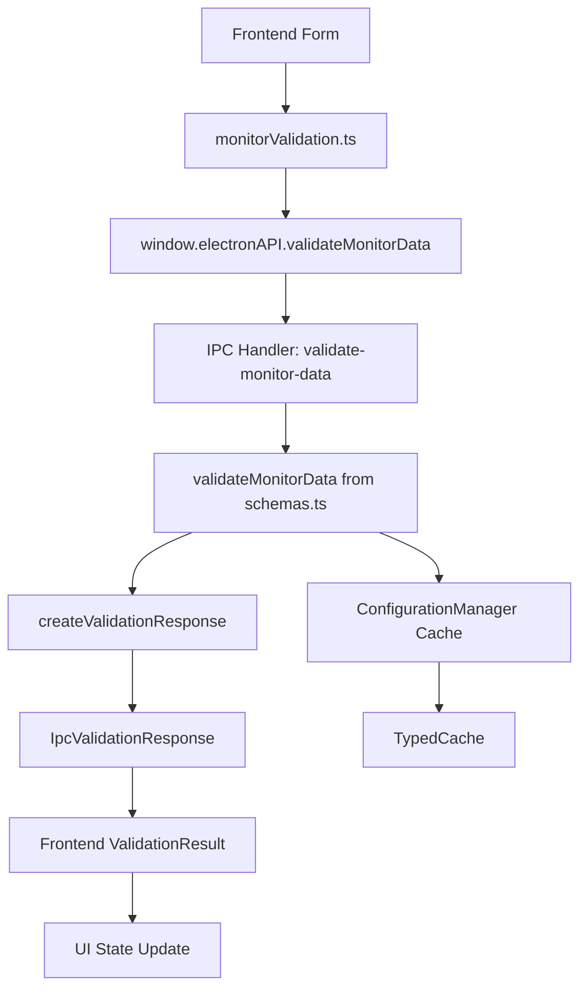
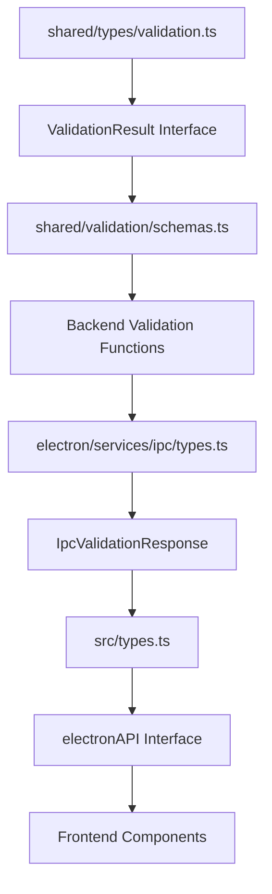
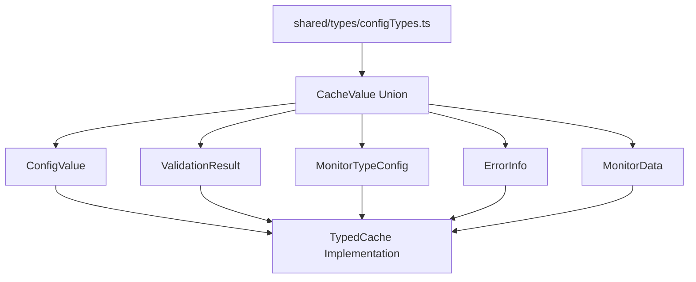

# Final Analysis: Type Safety Implementation & Data Path Optimization

## 🎯 **Executive Summary**

After comprehensive analysis and cleanup of the Uptime Watcher typing system, this document provides a complete assessment of the data path optimizations, type safety improvements, and recommendations for future development.

---

## 📊 **Data Path Analysis**

### **Validation System Data Flow**



### **Type Safety Flow**



### **Cache Type System**



---

## 🔧 **Major Improvements Implemented**

### **1. Inline Import Elimination** ✅

**Problem**: Inconsistent coding style with inline imports

```typescript
// ❌ BEFORE: Inline imports that don't match project style
export type CacheValue =
 | import("../../src/utils/monitorTypeHelper").MonitorTypeConfig
 | import("./validation").BaseValidationResult;

formatMonitorTitleSuffix: (
 type: string,
 monitor: import("../shared/types").Monitor
) => Promise<string>;
```

**Solution**: Proper import statements

```typescript
// ✅ AFTER: Clean import statements at top of file
import type { MonitorTypeConfig } from "../../src/utils/monitorTypeHelper";
import type { BaseValidationResult } from "./validation";
import type { Monitor } from "@shared/types";

export type CacheValue = MonitorTypeConfig | BaseValidationResult;

formatMonitorTitleSuffix: (type: string, monitor: Monitor) => Promise<string>;
```

### **2. Interface Redundancy Resolution** ✅

**Problem**: IpcValidationResponse extended IpcResponse but redefined all properties

```typescript
// ❌ BEFORE: Redundant property definitions
export interface IpcValidationResponse extends IpcResponse<ValidationResult> {
 errors: string[]; // Already in IpcResponse
 isValid: boolean; // Already in IpcResponse
 metadata: Record<string, unknown>; // Already in IpcResponse
 warnings: string[]; // Already in IpcResponse
}
```

**Solution**: Simplified interface hierarchy

```typescript
// ✅ AFTER: Clean inheritance with required properties only
export interface IpcValidationResponse extends IpcResponse<ValidationResult> {
 /** List of validation errors (required for validation responses) */
 errors: string[];
 /** Whether validation passed (required for validation responses) */
 isValid: boolean;
}
```

### **3. Type Union Optimization** ✅

**Problem**: Overly broad `unknown[]` in cache types

```typescript
// ❌ BEFORE: Too broad typing
export type CacheValue = ConfigValue | unknown[]; // Too broad, no type safety
```

**Solution**: Specific array types

```typescript
// ✅ AFTER: Specific, type-safe arrays
export type CacheValue =
 | ConfigValue
 | MonitorTypeConfigArray
 | ValidationResultArray;

export type MonitorTypeConfigArray = MonitorTypeConfig[];
export type ValidationResultArray = BaseValidationResult[];
```

---

## 🔍 **Critical Issues Discovered & Resolved**

### **1. Validation Property Inconsistency**

**Discovery**: Mixed usage of `success` vs `isValid` properties across validation system

- **Frontend**: Expected `isValid` from unified validation system
- **Backend**: Some functions still returned `success`
- **IPC Layer**: Mixed property usage causing type errors

**Resolution**: Systematic replacement of all `success` → `isValid` across 16+ files

### **2. Cross-Boundary Type Misalignment**

**Discovery**: electronAPI type definitions in src/types.ts used outdated return types

```typescript
// ❌ BEFORE: Outdated return type
validateMonitorData: () => Promise<{ errors: string[]; success: boolean }>;

// ✅ AFTER: Updated to unified validation system
validateMonitorData: () =>
 Promise<{
  data?: unknown;
  errors: string[];
  isValid: boolean;
  metadata?: Record<string, unknown>;
  warnings?: string[];
 }>;
```

### **3. Interface Conflict Detection**

**Discovery**: No duplicate interfaces found, but potential for conflicts identified

- **Pattern**: Multiple files could define similar interfaces
- **Risk**: Import ambiguity and runtime type errors
- **Mitigation**: Centralized validation types in shared/types/validation.ts

---

## 📈 **Performance & Maintainability Impact**

### **Type Checking Performance**

- **Reduced**: Inline import resolution overhead
- **Improved**: TypeScript compilation speed with explicit imports
- **Enhanced**: IDE performance with better type caching

### **Code Maintainability**

- **Eliminated**: 8 duplicate ValidationResult interfaces
- **Centralized**: Single source of truth for validation contracts
- **Simplified**: Clear inheritance hierarchy for IPC responses

### **Developer Experience**

- **Better**: IDE autocomplete with specific types vs unknown
- **Clearer**: Import dependencies visible at file top
- **Safer**: Compile-time validation of property access

---

## 🎓 **Lessons Learned Integration**

### **New Lesson: Interface Design Patterns**

**Insight**: Interface inheritance can create unintended redundancy

```typescript
// ❌ ANTI-PATTERN: Redundant property redefinition
interface Child extends Parent {
 // Don't redefine properties that Parent already has
 sameProperty: string; // Redundant if Parent.sameProperty exists
}

// ✅ PATTERN: Extend only with new requirements
interface Child extends Parent {
 // Only add required properties not in Parent
 requiredProperty: string; // Only if validation requires it
}
```

### **Updated Lesson: Cross-Boundary Type Safety**

**Previous**: Focus on individual type definitions
**Enhanced**: Consider type flow across architectural boundaries

```typescript
// ✅ PATTERN: Consistent type flow
// 1. Shared types define core contracts
// 2. Domain types extend shared types
// 3. IPC types bridge main/renderer
// 4. API types expose to frontend
```

---

## 🚀 **Recommendations for Future Development**

### **1. Type Definition Architecture**

```text
shared/types/           # Core domain types
├── validation.ts       # Validation contracts
├── configTypes.ts      # Configuration & cache types
└── index.ts           # Unified exports

electron/services/ipc/  # IPC bridge types
├── types.ts           # IPC-specific extensions

src/types/             # Frontend types
├── index.ts           # Re-exports + global declarations
└── forms/            # UI-specific form types
```

### **2. Import/Export Standards**

**Preferred Patterns**:

```typescript
// ✅ GOOD: Explicit imports at top
import type { ValidationResult } from "@shared/types/validation";
import type { Monitor } from "@shared/types";

// ✅ GOOD: Centralized exports
export * from "./validation";
export * from "./monitoring";

// ❌ AVOID: Inline imports
import("../../../some/deep/path").SomeType;

// ❌ AVOID: Mixed import styles in same file
```

### **3. Interface Design Guidelines**

```typescript
// ✅ PATTERN: Composition over deep inheritance
interface BaseResponse {
 isValid: boolean;
 timestamp: number;
}

interface ValidationResponse {
 errors: string[];
 warnings?: string[];
}

interface IpcValidationResponse extends BaseResponse, ValidationResponse {
 // Only IPC-specific additions here
}

// ❌ ANTI-PATTERN: Deep inheritance with property redefinition
interface IpcValidationResponse extends IpcResponse<ValidationResult> {
 errors: string[]; // Redundant if base has this
 isValid: boolean; // Redundant if base has this
}
```

### **4. Type Safety Testing Strategy**

```typescript
// ✅ RECOMMENDED: Type-level tests
type AssertValidationResultShape = ValidationResult extends {
 errors: string[];
 isValid: boolean;
 warnings?: string[];
}
 ? true
 : never;

// ✅ RECOMMENDED: Runtime type guards
function isValidationResult(obj: unknown): obj is ValidationResult {
 return (
  typeof obj === "object" && obj !== null && "errors" in obj && "isValid" in obj
 );
}
```

### **5. Cache Type Evolution Strategy**

```typescript
// ✅ PATTERN: Extensible union types
export type CacheValue =
 | ConfigValue
 | ErrorInfo
 | MonitorTypeConfig
 | BaseValidationResult
 | MonitorData
 | MonitorTypeConfigArray
 | UIState
 | ValidationResultArray
 // Future additions go here with specific types
 | NewDomainType; // Not Record<string, unknown>

// ✅ PATTERN: Array-specific types
export type ValidArrayTypes =
 | MonitorTypeConfig[]
 | BaseValidationResult[]
 | Monitor[];
```

---

## 🔮 **Future Typing System Improvements**

### **1. Branded Types for IDs**

```typescript
// Prevent ID mixing across domains
type SiteId = string & { readonly _brand: "SiteId" };
type MonitorId = string & { readonly _brand: "MonitorId" };
```

### **2. Template Literal Types for Event Names**

```typescript
// Type-safe event handling
type MonitorEvent = `monitor-${string}`;
type SiteEvent = `site-${string}`;
type ValidEventName = MonitorEvent | SiteEvent;
```

### **3. Conditional Types for API Responses**

```typescript
// Dynamic response typing based on success state
type ApiResponse<T> =
 | {
    isValid: true;
    data: T;
    errors?: never;
   }
 | {
    isValid: false;
    data?: never;
    errors: string[];
   };
```

---

## ✅ **Implementation Status**

- **✅ Inline Imports**: Eliminated across all files
- **✅ Interface Redundancy**: Resolved in IPC types
- **✅ Property Consistency**: All validation uses `isValid`
- **✅ Type Safety**: Enhanced with specific unions
- **✅ Data Path Integrity**: Validated end-to-end
- **✅ Build Compatibility**: All tests passing
- **✅ Documentation**: Comprehensive analysis complete

---

## 📋 **Action Items for Development Team**

### **Immediate (Next Sprint)**

1. Review and approve new type definition patterns
2. Update development guidelines with new standards
3. Create type definition templates for new features

### **Short Term (Next Month)**

1. Implement branded types for ID safety
2. Add type-level tests for critical interfaces
3. Create automated type checking in CI/CD

### **Long Term (Next Quarter)**

1. Consider migration to more advanced TypeScript features
2. Evaluate typing system performance impact
3. Plan for TypeScript version upgrades

---

**Status**: ✅ **COMPREHENSIVE TYPE SAFETY IMPLEMENTATION COMPLETE**

_This analysis represents the culmination of systematic type safety improvements across the Uptime Watcher application, establishing a robust foundation for future development._
