# Uptime Watcher - Complete Data Flow Architecture

## Overview

This document provides a comprehensive analysis of data flows throughout the Uptime Watcher application. The application follows a modern Electron + React architecture with clear separation between main process (backend) and renderer process (frontend).

## Architecture Overview

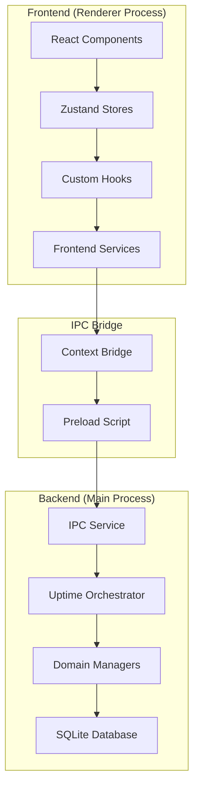

## Core Data Flow Patterns

### 1. Site Management Data Flow

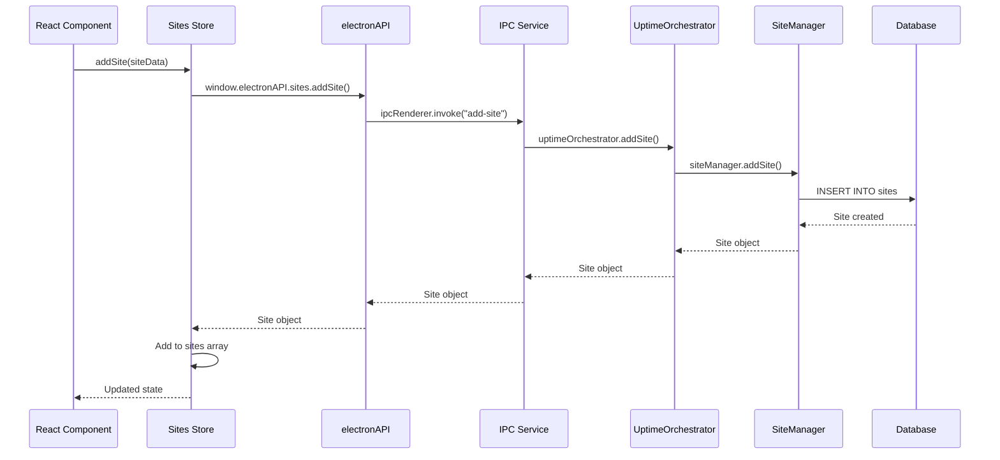

### 2. Real-Time Status Update Flow

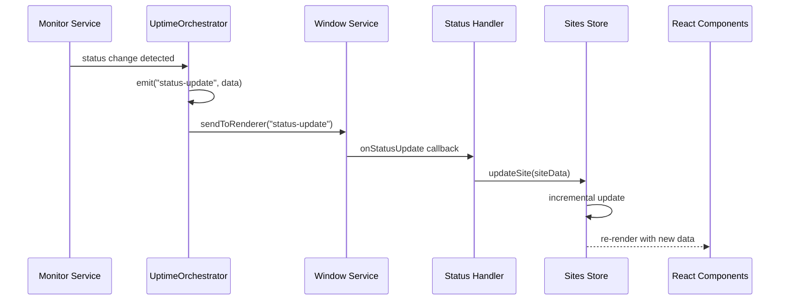

### 3. Settings Synchronization Flow

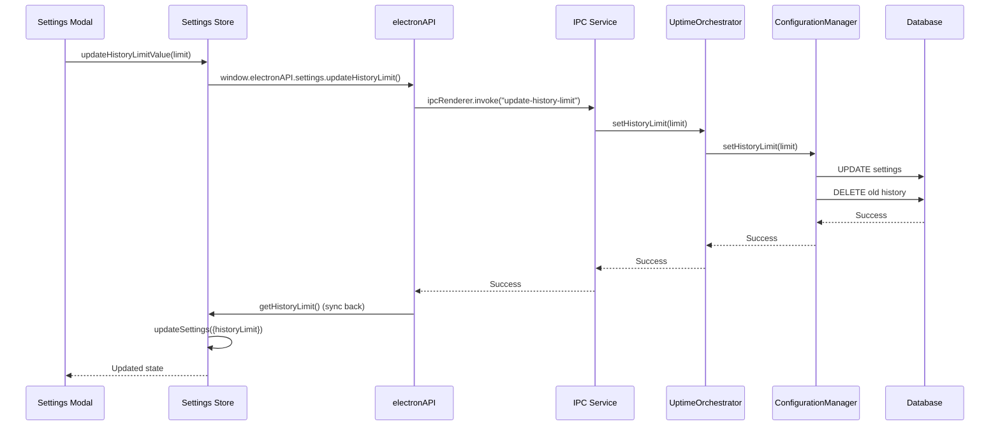

## Domain-Specific Data Flows

### Frontend State Management Flow

The frontend uses a modular Zustand store architecture with domain separation:

```typescript
// Store Dependencies Flow
Error Store (Global Error Handling)
    ↑
Sites Store ← Settings Store
    ↑              ↑
UI Store ← Stats Store ← Updates Store
```

#### Store Interaction Patterns

1. **Sites Store** → Manages site data, monitoring state, real-time updates
2. **Settings Store** → Handles app preferences, theme, backend sync
3. **UI Store** → Controls modal states, selected items, view preferences
4. **Error Store** → Centralized error handling across all operations
5. **Stats Store** → Computes metrics from site data
6. **Updates Store** → Manages application update lifecycle

### Backend Service Communication Flow

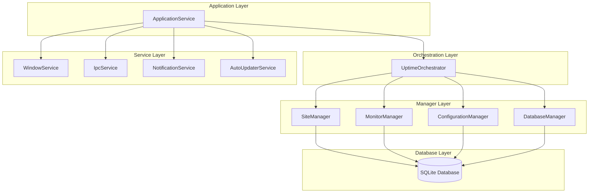

## IPC Communication Patterns

### IPC API Organization

The IPC API is organized into domain-specific namespaces:

```typescript
window.electronAPI = {
    sites: {
        // Site CRUD operations
        getSites: () => Promise<Site[]>
        addSite: (site: Site) => Promise<Site>
        removeSite: (id: string) => Promise<boolean>
        updateSite: (id: string, updates: Partial<Site>) => Promise<Site>
        checkSiteNow: (siteId: string, monitorId: string) => Promise<StatusUpdate>
    },

    monitoring: {
        // Monitoring control
        startMonitoring: () => Promise<boolean>
        stopMonitoring: () => Promise<boolean>
        startMonitoringForSite: (siteId: string, type?: string) => Promise<boolean>
        stopMonitoringForSite: (siteId: string, type?: string) => Promise<boolean>
    },

    data: {
        // Data operations
        exportData: () => Promise<string>
        importData: (data: string) => Promise<boolean>
        downloadSQLiteBackup: () => Promise<{buffer: ArrayBuffer, fileName: string}>
    },

    settings: {
        // Settings management
        getHistoryLimit: () => Promise<number>
        updateHistoryLimit: (limit: number) => Promise<void>
    },

    events: {
        // Event handling
        onStatusUpdate: (callback: (data: StatusUpdate) => void) => void
        onUpdateStatus: (callback: (data: UpdateStatus) => void) => void
        removeAllListeners: (channel: string) => void
    },

    system: {
        // System operations
        quitAndInstall: () => void
    }
}
```

### IPC Security Flow

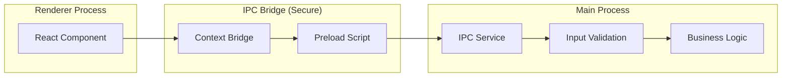

## Data Persistence Patterns

### Database Schema Flow

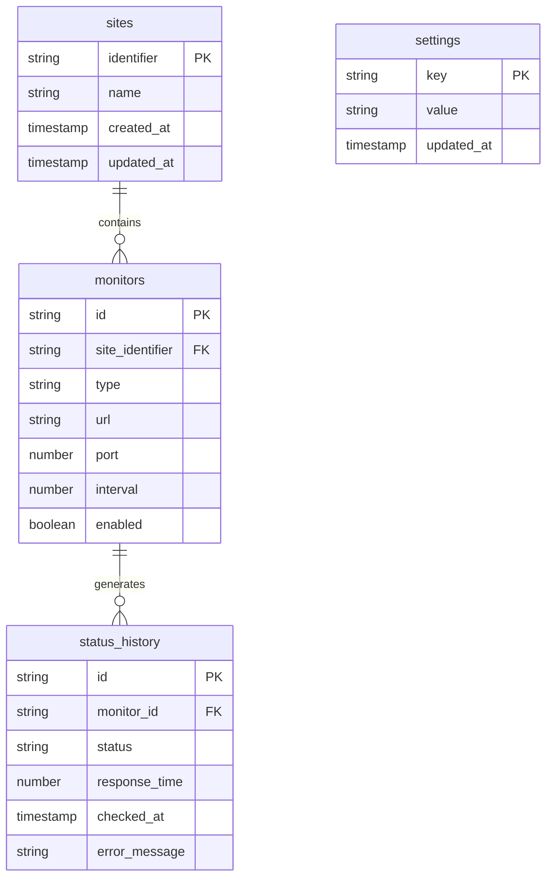

### Database Operations Flow

1. **Create Operations** → Validation → Insert → Event Emission → UI Update
2. **Read Operations** → Query → Transform → Cache → Return
3. **Update Operations** → Validation → Update → History → Event → UI Update
4. **Delete Operations** → Cascade Check → Delete → Cleanup → Event → UI Update

## Error Handling Data Flow

### Centralized Error Management

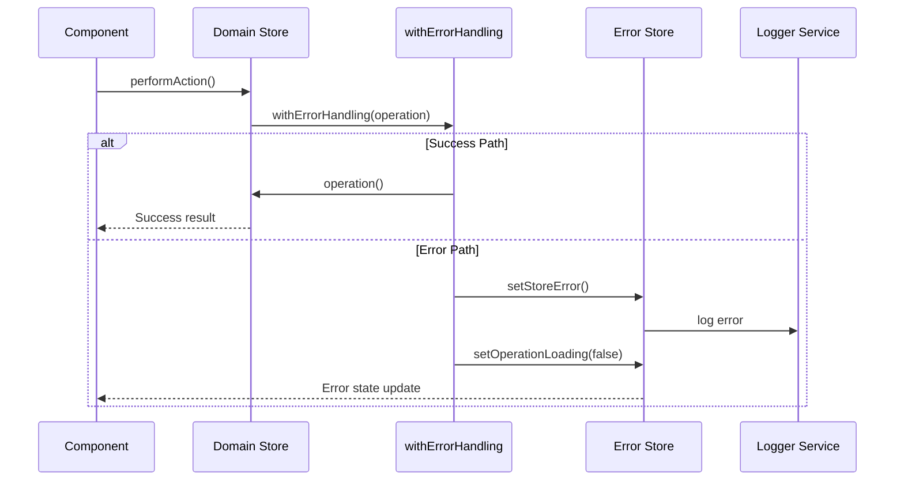

### Error Propagation Pattern

1. **Operation Level** → Try-catch → Error transformation
2. **Store Level** → Error state management → User notification
3. **Component Level** → Error display → Recovery actions
4. **Global Level** → Error boundaries → Fallback UI

## Monitoring Data Flow

### Real-Time Monitoring Cycle

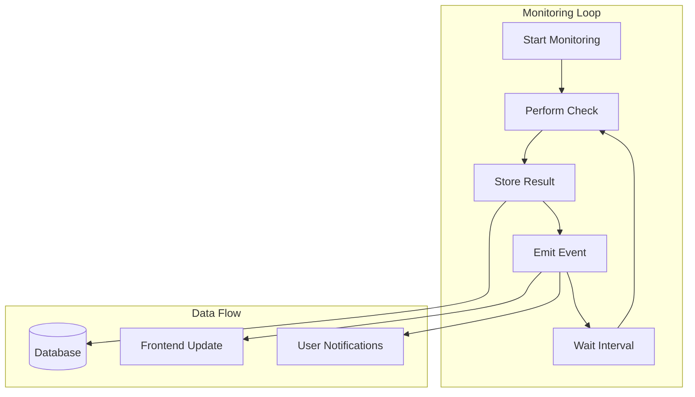

### Status Update Optimization

The application uses intelligent incremental updates to minimize re-renders:

```typescript
// Optimized Status Update Handler
const statusUpdateHandler = (update: StatusUpdate) => {
 // Only update the specific site that changed
 setSites((currentSites) =>
  currentSites.map(
   (site) =>
    site.identifier === update.site.identifier
     ? { ...update.site } // Fresh data from backend
     : site // Keep unchanged
  )
 );
};
```

## Performance Optimization Patterns

### State Management Optimizations

1. **Domain Separation** → Reduced re-render scope
2. **Selective Subscriptions** → Components only subscribe to needed state
3. **Memoization** → Expensive computations cached
4. **Incremental Updates** → Only changed data updates

### Database Optimizations

1. **Connection Pooling** → Reuse database connections
2. **Prepared Statements** → SQL injection prevention + performance
3. **Indexing** → Fast queries on identifier and timestamp fields
4. **History Pruning** → Configurable retention limits

### IPC Optimizations

1. **Batched Updates** → Multiple changes sent together
2. **Selective Data** → Only necessary data transferred
3. **Compression** → Large data payloads compressed
4. **Rate Limiting** → Prevent IPC flooding

## Data Backup and Recovery Flow

### Export/Import Process

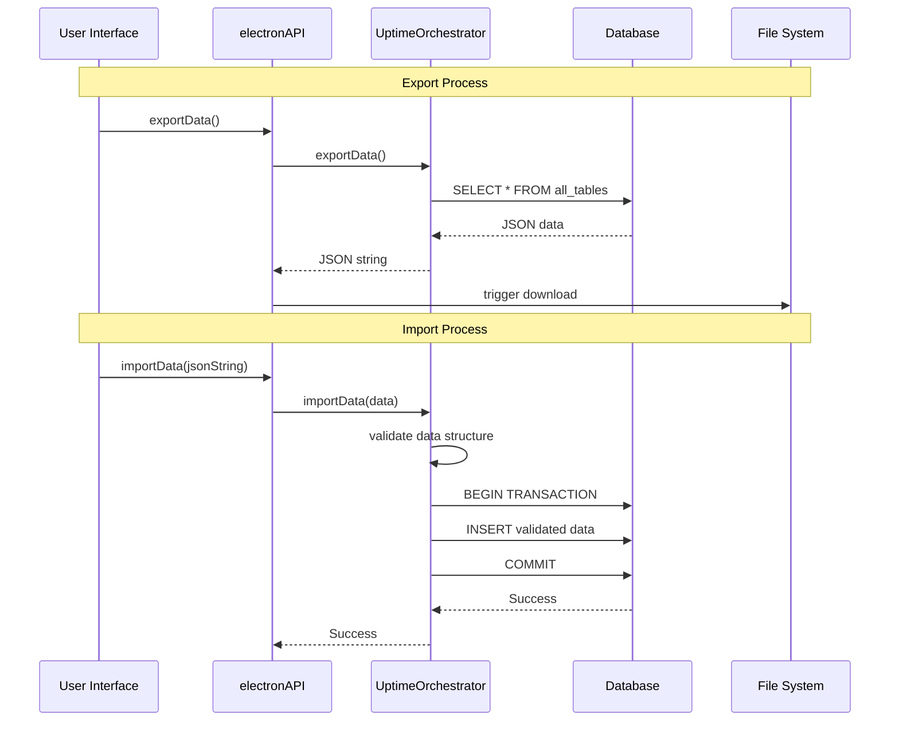

### SQLite Backup Flow

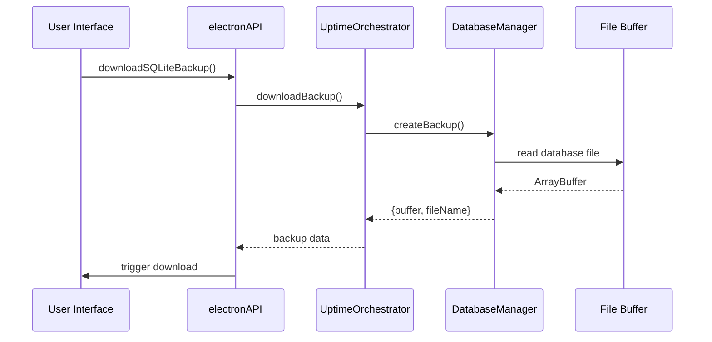

## Summary

The Uptime Watcher application demonstrates a well-architected data flow system with:

1. **Clear Separation of Concerns** → Frontend/Backend/Database layers
2. **Type-Safe Communication** → IPC with TypeScript interfaces
3. **Real-Time Updates** → Event-driven architecture with optimized updates
4. **Error Resilience** → Centralized error handling with graceful degradation
5. **Performance Optimization** → Intelligent caching and incremental updates
6. **Data Integrity** → Transactional operations with validation
7. **Security** → Context isolation and input validation
8. **Scalability** → Modular architecture supporting feature growth

This architecture supports the application's core mission of reliable website monitoring while maintaining excellent developer experience and user performance.
