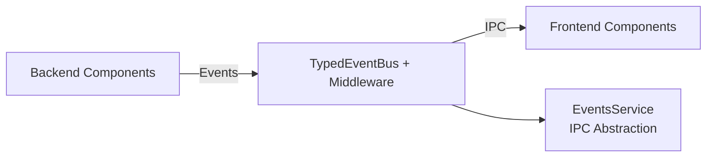

# Event System Guide

This guide provides comprehensive documentation for the TypedEventBus-based event system in Uptime Watcher, covering event-driven architecture patterns, automatic metadata injection, IPC forwarding, and real-time communication between backend and frontend.

## Table of Contents

- [Architecture Overview](#architecture-overview)
- [TypedEventBus Implementation](#typedeventbus-implementation)
- [Event Types and Contracts](#event-types-and-contracts)
- [EventsService Integration](#eventsservice-integration)
- [Frontend Event Handling](#frontend-event-handling)
- [Middleware System](#middleware-system)
- [Event Metadata](#event-metadata)
- [Best Practices](#best-practices)
- [Testing Events](#testing-events)
- [Debugging and Diagnostics](#debugging-and-diagnostics)

## Architecture Overview

The event system is built around a type-safe event bus that enables real-time communication throughout the application:



### Key Components

1. **TypedEventBus**: Core event emission and listening with type safety
2. **EventsService**: Frontend abstraction for monitor/cache/update events via IPC
3. **StateSyncService**: Dedicated state synchronization surface (status, full-sync, event stream)
4. **Event Contracts**: Shared type definitions in `@shared/types/events`
5. **Automatic Metadata**: Correlation IDs, timestamps, and debugging info
6. **Middleware System**: Cross-cutting concerns like logging and validation

## TypedEventBus Implementation

### Basic Usage

```typescript
import { TypedEventBus } from "@/events/TypedEventBus";

// Define event contracts
interface MyEvents {
 "user:login": { userId: string; timestamp: number };
 "data:updated": { table: string; records: number };
 "monitor:status": { monitorId: string; status: "up" | "down" };
}

// Create typed event bus
const eventBus = new TypedEventBus<MyEvents>("my-service");

// Register listeners
eventBus.onTyped("user:login", (data) => {
 // data is automatically typed as { userId: string; timestamp: number; _meta: EventMetadata }
 console.log(`User ${data.userId} logged in at ${data.timestamp}`);
 console.log(`Event correlation ID: ${data._meta.correlationId}`);
});

// Emit events
await eventBus.emitTyped("user:login", {
 userId: "123",
 timestamp: Date.now(),
});
```

### Automatic Metadata Enhancement

All events are automatically enhanced with metadata:

```typescript
// Original event data
const eventData = { userId: '123', timestamp: Date.now() };

// After emission, listeners receive:
{
  userId: '123',
  timestamp: Date.now(),
  _meta: {
    busId: 'my-service',
    correlationId: 'evt_abc123',
    eventName: 'user:login',
    timestamp: 1704067200000
  }
}
```

### Data Type Handling

The TypedEventBus handles different data types intelligently:

```typescript
// Object events (typical case)
await bus.emitTyped("user:data", { name: "John", age: 30 });
// Listener receives: { name: 'John', age: 30, _meta: {...} }

// Array events
await bus.emitTyped("batch:data", [1, 2, 3]);
// Listener receives: [1, 2, 3] with non-enumerable _meta property

// Primitive events
await bus.emitTyped("count:updated", 42);
// Listener receives: { value: 42, _meta: {...} }

// Events with existing _meta property
await bus.emitTyped("complex:data", { data: "test", _meta: "existing" });
// Listener receives: { data: 'test', _meta: EventMetadata, _originalMeta: 'existing' }
```

## Event Types and Contracts

Event contracts are defined in `@shared/types/events.ts` to ensure type safety between backend and frontend:

### Core Event Types

```typescript
// State synchronization
interface StateSyncEventData extends BaseEventData {
 action: "bulk-sync" | "delete" | "update";
 siteIdentifier?: string;
 sites: Site[];
 source: "cache" | "database" | "frontend";
}

// Cache invalidation
interface CacheInvalidatedEventData extends BaseEventData {
 type: "all" | "monitor" | "site";
 identifier?: string;
 reason: "delete" | "expiry" | "manual" | "update";
}

// Monitor status changes
interface MonitorUpEventData extends BaseEventData {
 monitorId: string;
 siteIdentifier: string;
 responseTime: number;
 statusCode: number;
}

interface MonitorDownEventData extends BaseEventData {
 monitorId: string;
 siteIdentifier: string;
 error: string;
 statusCode?: number;
}
```

### Base Event Interface

All events extend `BaseEventData`:

```typescript
interface BaseEventData {
 timestamp: number; // Unix timestamp when event occurred
}
```

## EventsService Integration

The EventsService provides a clean abstraction for frontend event handling:

### Service Initialization

```typescript
import { EventsService } from "@/services/EventsService";
import { StateSyncService } from "@/services/StateSyncService";

// Initialize services (ensures electron API is available for each surface)
await Promise.all([EventsService.initialize(), StateSyncService.initialize()]);
```

### Event Registration

```typescript
// Register event listeners with automatic cleanup
const cleanupFunctions: (() => void)[] = [];

// Monitor status events
cleanupFunctions.push(
 await EventsService.onMonitorUp((data) => {
  console.log(
   `Monitor ${data.monitorId} is up - Response time: ${data.responseTime}ms`
  );
 })
);

cleanupFunctions.push(
 await EventsService.onMonitorDown((data) => {
  console.error(`Monitor ${data.monitorId} is down - Error: ${data.error}`);
 })
);

// Cache invalidation events
cleanupFunctions.push(
 await EventsService.onCacheInvalidated((data) => {
  console.log(`Cache invalidated: ${data.type} - Reason: ${data.reason}`);
 })
);

// Cleanup on component unmount
// State synchronization lives in the dedicated StateSyncService
cleanupFunctions.push(
 await StateSyncService.onStateSyncEvent((event) => {
  switch (event.action) {
   case "bulk-sync":
    console.log(`Bulk sync: ${event.sites.length} sites`);
    break;
   case "update":
    console.log(`Site updated: ${event.siteIdentifier}`);
    break;
   case "delete":
    console.log(`Site deleted: ${event.siteIdentifier}`);
    break;
  }
 })
);

const cleanup = () => {
 cleanupFunctions.forEach((fn) => fn());
};
```

## Frontend Event Handling

### React Component Integration

```typescript
import { useEffect, useState } from 'react';
import { EventsService } from '@/services/EventsService';
import type { MonitorUpEventData, MonitorDownEventData } from '@shared/types/events';

interface MonitorStatusProps {
  monitorId: string;
}

export const MonitorStatus: React.FC<MonitorStatusProps> = ({ monitorId }) => {
  const [status, setStatus] = useState<'up' | 'down' | 'unknown'>('unknown');
  const [lastUpdate, setLastUpdate] = useState<number | null>(null);

  useEffect(() => {
    const cleanupFunctions: (() => void)[] = [];

    const setupEventListeners = async () => {
      // Monitor up events
      cleanupFunctions.push(
        await EventsService.onMonitorUp((data: MonitorUpEventData) => {
          if (data.monitorId === monitorId) {
            setStatus('up');
            setLastUpdate(data.timestamp);
          }
        })
      );

      // Monitor down events
      cleanupFunctions.push(
        await EventsService.onMonitorDown((data: MonitorDownEventData) => {
          if (data.monitorId === monitorId) {
            setStatus('down');
            setLastUpdate(data.timestamp);
          }
        })
      );
    };

    setupEventListeners().catch(console.error);

    return () => {
      cleanupFunctions.forEach(fn => fn());
    };
  }, [monitorId]);

  return (
    <div className={`monitor-status ${status}`}>
      <span>Status: {status}</span>
      {lastUpdate && <span>Last update: {new Date(lastUpdate).toLocaleString()}</span>}
    </div>
  );
};
```

### Zustand Store Integration

```typescript
import { StateSyncService } from "@/services/StateSyncService";
import type { StateSyncEventData } from "@shared/types/events";

// In your store initialization
export const initializeEventListeners = async (): Promise<() => void> => {
 const cleanupFunctions: (() => void)[] = [];

 // State sync events
 cleanupFunctions.push(
  await StateSyncService.onStateSyncEvent((data: StateSyncEventData) => {
   const { fullResyncSites, setSites } = useSitesStore.getState();

   switch (data.action) {
    case "bulk-sync":
     setSites(data.sites);
     break;
    case "update":
    case "delete":
     setSites(data.sites);
     break;
    default:
     void fullResyncSites();
   }
  })
 );

 return () => {
  cleanupFunctions.forEach((fn) => fn());
 };
};

// When a full refresh is needed outside the event stream, request it directly:
const { sites } = await StateSyncService.requestFullSync();
useSitesStore.getState().setSites(sites);
```

## Middleware System

Middleware enables cross-cutting concerns like logging, validation, and rate limiting:

### Built-in Middleware

The system includes several built-in middleware functions:

```typescript
// Logging middleware (automatically applied)
const loggingMiddleware: EventMiddleware = async (event, data, next) => {
 logger.debug(`Processing event: ${event}`);
 const start = Date.now();

 await next();

 const duration = Date.now() - start;
 logger.debug(`Completed event: ${event} in ${duration}ms`);
};

// Validation middleware example
const validationMiddleware: EventMiddleware = async (event, data, next) => {
 // Validate event data structure
 if (!data || typeof data !== "object") {
  throw new Error(`Invalid event data for ${event}`);
 }

 await next();
};
```

### Custom Middleware Registration

```typescript
const eventBus = new TypedEventBus<MyEvents>("my-service");

// Add custom middleware
eventBus.use(async (event, data, next) => {
 // Rate limiting
 if (await rateLimiter.isLimited(event)) {
  throw new Error(`Rate limit exceeded for ${event}`);
 }

 await next();
});

// Add metrics collection
eventBus.use(async (event, data, next) => {
 metrics.increment(`events.${event}.count`);
 const start = Date.now();

 await next();

 metrics.timing(`events.${event}.duration`, Date.now() - start);
});
```

## Event Metadata

Every event includes comprehensive metadata for debugging and tracking:

### Metadata Structure

```typescript
interface EventMetadata {
 busId: string; // Event bus identifier
 correlationId: string; // Unique event correlation ID
 eventName: string; // Name of the emitted event
 timestamp: number; // Unix timestamp of emission
}
```

### Using Metadata

```typescript
eventBus.onTyped("user:action", (data) => {
 const { _meta } = data;

 // Log with correlation ID for tracing
 logger.info(`Processing user action`, {
  correlationId: _meta.correlationId,
  eventName: _meta.eventName,
  busId: _meta.busId,
 });

 // Track event processing time
 const processingStart = Date.now();
 processUserAction(data);
 const processingTime = Date.now() - processingStart;

 logger.debug(`Event processed`, {
  correlationId: _meta.correlationId,
  emissionTime: _meta.timestamp,
  processingTime,
  totalLatency: Date.now() - _meta.timestamp,
 });
});
```

## Best Practices

### Event Naming Conventions

Follow consistent naming patterns:

```typescript
// Use namespace:action format
"monitor:status-changed";
"site:created";
"cache:invalidated";
"user:authenticated";

// Avoid generic names
"update"; // ❌ Too generic
"site:updated"; // ✅ Specific and clear

"change"; // ❌ Too vague
"monitor:down"; // ✅ Specific state

### Layered Emission Strategy

- **Managers emit internal lifecycle topics.** `SiteManager` and
  `MonitorManager` raise `internal:site:*` and `internal:monitor:*` events for
  CRUD and monitoring lifecycle operations. High-frequency telemetry such as
  `monitor:status-changed` continues to originate directly from
  `MonitorManager`, which remains the single source of truth for real-time
  status transitions.
- **`ServiceContainer` forwards internal events (plus selected telemetry).**
  The container bridges manager buses to the `UptimeOrchestrator` for
  lifecycle events and a curated set of telemetry events that still originate
  from managers. This prevents duplicate public emissions while preserving the
  low-latency paths needed for status updates.
- **`UptimeOrchestrator` is the public source of truth.** It hydrates payloads,
  sanitizes metadata, and emits public events (`site:*`, `monitoring:*`,
  `monitor:*`) plus the canonical `cache:invalidated` notifications. Global
  monitoring transitions now use `{ type: "all" }` so renderer caches can
  short-circuit to a full resync.
- **Frontend listens only to orchestrator output.** `ApplicationService`
  subscribes to the orchestrator and uses `RendererEventBridge` to fan out to
  windows, guaranteeing every renderer sees the same sanitized payloads.
```

### Event Data Design

Design event payloads to be self-contained:

```typescript
// ✅ Good: Self-contained event data
interface SiteUpdatedEventData {
 siteIdentifier: string;
 changes: Partial<Site>;
 updatedBy: string;
 timestamp: number;
}

// ❌ Bad: Requires additional context
interface SiteUpdatedEventData {
 id: string; // Unclear what type of ID
 // Missing change details
}
```

### Error Handling

Always handle event errors gracefully:

```typescript
// In event listeners
eventBus.onTyped("site:updated", async (data) => {
 try {
  await processSiteUpdate(data);
 } catch (error) {
  logger.error("Failed to process site update", {
   correlationId: data._meta.correlationId,
   siteIdentifier: data.siteIdentifier,
   error: ensureError(error),
  });

  // Emit error event for monitoring
  await eventBus.emitTyped("site:update-failed", {
   siteIdentifier: data.siteIdentifier,
   originalCorrelationId: data._meta.correlationId,
   error: ensureError(error).message,
   timestamp: Date.now(),
  });
 }
});
```

### Memory Management

Always clean up event listeners:

```typescript
// React component
useEffect(() => {
 const cleanupFunctions: (() => void)[] = [];

 const setupListeners = async () => {
  cleanupFunctions.push(
   await EventsService.onSiteUpdated(handleSiteUpdate),
   await EventsService.onMonitorStatus(handleMonitorStatus)
  );
 };

 setupListeners().catch(console.error);

 return () => {
  cleanupFunctions.forEach((fn) => fn());
 };
}, []);

// Service initialization
class MyService {
 private cleanupFunctions: (() => void)[] = [];

 async initialize() {
  this.cleanupFunctions.push(
   await StateSyncService.onStateSyncEvent(this.handleStateSync.bind(this))
  );
 }

 async shutdown() {
  this.cleanupFunctions.forEach((fn) => fn());
  this.cleanupFunctions = [];
 }
}
```

## Testing Events

### Testing Event Emission

```typescript
import { describe, it, expect, vi, beforeEach } from "vitest";
import { TypedEventBus } from "@/events/TypedEventBus";

describe("Event System", () => {
 let eventBus: TypedEventBus<TestEvents>;

 beforeEach(() => {
  eventBus = new TypedEventBus("test-bus");
 });

 it("should emit events with metadata", async () => {
  const listener = vi.fn();
  eventBus.onTyped("test:event", listener);

  const eventData = { message: "test", value: 42 };
  await eventBus.emitTyped("test:event", eventData);

  expect(listener).toHaveBeenCalledWith({
   message: "test",
   value: 42,
   _meta: expect.objectContaining({
    busId: "test-bus",
    eventName: "test:event",
    correlationId: expect.stringMatching(/^evt_/),
    timestamp: expect.any(Number),
   }),
  });
 });

 it("should process middleware in order", async () => {
  const order: string[] = [];

  eventBus.use(async (event, data, next) => {
   order.push("middleware1:start");
   await next();
   order.push("middleware1:end");
  });

  eventBus.use(async (event, data, next) => {
   order.push("middleware2:start");
   await next();
   order.push("middleware2:end");
  });

  eventBus.onTyped("test:event", () => {
   order.push("listener");
  });

  await eventBus.emitTyped("test:event", { test: true });

  expect(order).toEqual([
   "middleware1:start",
   "middleware2:start",
   "listener",
   "middleware2:end",
   "middleware1:end",
  ]);
 });
});
```

### Testing EventsService

```typescript
import { describe, it, expect, vi, beforeEach } from "vitest";
import { EventsService } from "@/services/EventsService";

// Mock electron API
const mockElectronAPI = {
 events: {
  onSiteUpdated: vi.fn(),
  onMonitorStatus: vi.fn(),
  onCacheInvalidated: vi.fn(),
 },
};

vi.stubGlobal("window", {
 electronAPI: mockElectronAPI,
});

describe("EventsService", () => {
 beforeEach(() => {
  vi.clearAllMocks();
 });

 it("should register event listeners", async () => {
  const callback = vi.fn();
  mockElectronAPI.events.onSiteUpdated.mockReturnValue(() => {});

  await EventsService.onSiteUpdated(callback);

  expect(mockElectronAPI.events.onSiteUpdated).toHaveBeenCalledWith(callback);
 });

 it("should return cleanup function", async () => {
  const cleanup = vi.fn();
  mockElectronAPI.events.onSiteUpdated.mockReturnValue(cleanup);

  const result = await EventsService.onSiteUpdated(() => {});

  expect(result).toBe(cleanup);
 });
});
```

## Debugging and Diagnostics

### Event Bus Diagnostics

Get runtime information about event bus instances:

```typescript
const diagnostics = eventBus.getDiagnostics();
console.log("Event Bus Diagnostics:", {
 busId: diagnostics.busId,
 listenerCounts: diagnostics.listenerCounts,
 middlewareCount: diagnostics.middlewareCount,
 middlewareUtilization: diagnostics.middlewareUtilization,
});
```

### Debug Logging

Enable debug logging to trace event flow:

```typescript
// Set log level to debug in development
process.env.LOG_LEVEL = "debug";

// Events will log:
// - Event emission start
// - Middleware processing
// - Event emission complete
// - Listener execution
// - Error details
```

### Correlation ID Tracing

Use correlation IDs to trace events across the system:

```typescript
// In logs, search for correlation ID to see full event lifecycle
logger.debug("Processing event", { correlationId: data._meta.correlationId });

// In error handling
logger.error("Event processing failed", {
 correlationId: data._meta.correlationId,
 eventName: data._meta.eventName,
 error: error.message,
});
```

### Common Issues and Solutions

**Issue**: Events not reaching listeners

- **Check**: Ensure event names match exactly (case-sensitive)
- **Check**: Verify listener registration before emission
- **Check**: Check for middleware errors that prevent emission

**Issue**: Memory leaks from event listeners

- **Solution**: Always call cleanup functions returned by event registration
- **Solution**: Use `AbortController` for automatic cleanup

**Issue**: Type errors with event data

- **Check**: Ensure event contracts in `@shared/types/events` are up to date
- **Check**: Verify event data matches the defined interface exactly

**Issue**: Events not crossing IPC boundary

- **Check**: Ensure EventsService is properly initialized
- **Check**: Verify electron API is available (`window.electronAPI`)
- **Check**: Check preload script for proper API exposure

## Related Documentation

- [API Documentation](./api-documentation.md) - Comprehensive IPC API reference
- [Developer Quick Start](./DEVELOPER-QUICK-START.md) - Architecture overview with event system integration
- [Error Handling Guide](./error-handling-guide.md) - Error handling patterns with events
- [Testing Methodology](./testing-methodology-react-components.md) - Testing patterns including event testing
