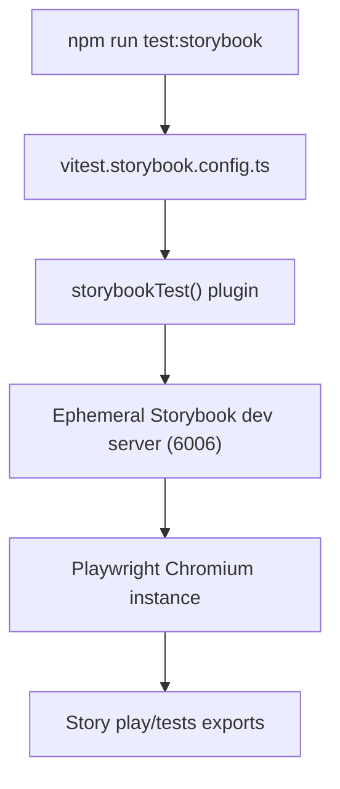

# Storybook Vitest Component Testing

## Table of Contents

1. [Why This Exists](#why-this-exists)
2. [Configuration Overview](#configuration-overview)
3. [Running the Suite](#running-the-suite)
4. [Execution Flow](#execution-flow)
5. [Writing Tests](#writing-tests)
6. [Coverage](#coverage)
7. [Mocking Network Traffic with MSW](#mocking-network-traffic-with-msw)
8. [CI Reporting Outputs](#ci-reporting-outputs)
9. [Troubleshooting](#troubleshooting)

## Why This Exists

Running tests through Storybook lets us exercise rendered stories inside a real browser context. The addon bridges Storybook's story annotations with Vitest so that:

- decorators, globals, and parameters defined in `storybook/preview.ts` are reused in tests
- component stories run inside Chromium via Playwright, matching how the UI behaves in Storybook
- Electron preload bridges stay mocked consistently between Storybook and Vitest

Use this suite for interactive component behaviour that requires a browser or when you want to validate Storybook play functions.

## Configuration Overview

Key pieces live alongside the main Storybook configuration:

- `storybook/main.ts` registers `@storybook/addon-vitest`, configures `@storybook/addon-coverage` with the same include/exclude globbing as Vitest, and keeps our shared Vite customisations (React compiler, CSS modules, aliases, optimiseDeps for MSW).
- `.storybook/main.ts` extends the shared config and guarantees the addon stays enabled for any consumer of the `.storybook` directory.
- `storybook/preview.ts` initialises `msw-storybook-addon`, registers the global `mswLoader`, injects the shared theme styles, and installs the Electron preload mock so the UI and tests share identical network stubs.
- `storybook/vitest.setup.ts` installs the Electron preload mock and forwards the Storybook preview annotations (including MSW handlers and decorators) to Vitest via `setProjectAnnotations`.
- `vitest.storybook.config.ts` is a dedicated Vitest config that:
  - loads the same React compiler plugins used in Storybook
  - enables the `storybookTest()` Vite plugin with `configDir: .storybook`
  - runs tests in Playwright Chromium (`test.browser`) to match Storybook's runtime
  - pre-configures the dot reporter so CLI output stays consistent even without script overrides
  - keeps coverage disabled by default but wires JSON/LCOV reporters when `--coverage` is supplied, storing artefacts in `coverage/storybook`
  - writes structured results (`test-results.json`) plus a Sonar-compatible XML report (`sonar-report.xml`) to `coverage/storybook`
  - pre-bundles Storybook/MSW dependencies so the warmup pass stays deterministic
- `tsconfig.json` and `vite.config.ts` both reference `vitest.storybook.config.ts` so type information and tooling stay aware of the new project.

When customising Storybook's Vite behaviour, keep `storybook/main.ts` as the single source of truth and import it from `.storybook/main.ts` to avoid divergence between local builds and addons.

## Running the Suite

Storybook tests run through dedicated npm scripts:

```powershell
npm run test:storybook             # Single run (recommended for CI)
npm run test:storybook:watch       # Watch mode with live reruns
npm run test:storybook:coverage    # Generate LCOV/TXT coverage artefacts
```

Variant reporters mirror the rest of the test suite (`test:storybook:{minimal|quiet|verbose|detailed}`), so aggregate commands such as `npm run test:all`, `npm run test:all:coverage`, and their quiet/minimal/verbose counterparts now include the Storybook project automatically. Use `npm run check:storybook` for targeted TS validation; the `check-types*` aggregates call it for you.

Every run spins up an ephemeral Storybook dev server through `npm run storybook`. Ensure port `6006` is free beforehand; if a local Storybook instance is already running, simply visit `http://localhost:6006` before triggering the tests to skip the warmup.

Vitest executes in browser mode, so expect slightly longer start-up times than jsdom-based suites. The configuration pins the dot reporter, and the wrapper script still passes `--silent` to hide Vitest banners so only failures surface.

## Execution Flow



## Writing Tests

The addon supports two primary patterns:

1. **Play functions** – stories export `play` implementations that drive user interactions. Any assertions inside the play function run automatically when the story executes in Vitest.
2. **`tests` exports** – stories can export a `tests` object mapping a label to a callback. The callback receives the testing context (canvas, fixture, `expect`) and is ideal for declarative assertions that do not belong in `play`.

Example excerpt inside a story module:

```typescript
export const Default: Story = {
 play: async ({ canvasElement, step }) => {
  const canvas = within(canvasElement);
  await step("shows initial state", async () => {
   await expect(canvas.getByText("All systems go")).toBeVisible();
  });
 },
 tests: {
  "renders without errors": async ({ canvasElement, expect }) => {
   const canvas = within(canvasElement);
   await expect(canvas.getByRole("button", { name: /retry/i })).toBeVisible();
  },
 },
};
```

Every story still benefits from our standard lint rules (for example, always prefer `useMount` over `useEffect`) because the tests reuse the shipped story files verbatim.

## Coverage

Instrumentation is gated behind the `VITE_COVERAGE` environment variable. Storybook loads `vite-plugin-istanbul` through `@storybook/addon-coverage` with `requireEnv: true`, so regular browsing sessions avoid the runtime cost unless coverage is explicitly requested.

- `npm run test:storybook:coverage` sets `VITE_COVERAGE=true` and enables Vitest's `--coverage` flag. The V8 provider applies the same include/exclude filters as Storybook and writes artefacts to `coverage/storybook` (LCOV, JSON summary, and per-test JSON).
- To explore results inside Storybook's UI, start the dev server with instrumentation enabled: `VITE_COVERAGE=true npm run storybook`. The Vitest addon reuses the Istanbul output to show the "Coverage" section once a run completes and mirrors the HTML report inside Storybook's cache directory.

With the flag unset, instrumentation stays off for both Storybook and Vitest, keeping everyday feedback loops quick and avoiding accidental pollution of the shared `coverage/` directory.

## Mocking Network Traffic with MSW

Storybook and the Vitest suite share the same Mock Service Worker setup via `msw-storybook-addon`.

- The service worker lives in `public/mockServiceWorker.js`. Regenerate it with `npx msw init public --save` whenever MSW updates.
- Declare handlers inside stories using the standard `parameters.msw.handlers` API. Both Storybook's preview and the test runner pick them up automatically.
- The shared `mswLoader` waits for the worker activation and applies handlers ahead of each story/test run, replacing the deprecated decorator hook.
- Handlers run in the browser context, so they can rely on cookies, headers, and other request metadata exactly as the UI would receive them.

Example usage inside a story module:

```typescript
import type { Meta, StoryObj } from "@storybook/react";
import { http, HttpResponse } from "msw";

import { DeviceStatusCard } from "../DeviceStatusCard";

const meta: Meta<typeof DeviceStatusCard> = {
 component: DeviceStatusCard,
 parameters: {
  msw: {
   handlers: [
    http.get("/api/devices/42/status", () =>
     HttpResponse.json({ uptimePercentage: 99.9 })
    ),
   ],
  },
 },
};

export default meta;

export const Online: StoryObj<typeof DeviceStatusCard> = {};
```

During tests the decorator mirrors Storybook's behaviour, so you do not need to import or initialise MSW manually. Use `onUnhandledRequest: "bypass"` (already configured in `storybook/preview.ts`) to surface real network calls without failing the suite.

## CI Reporting Outputs

Each Storybook Vitest run emits machine-consumable artefacts alongside console output:

- `coverage/storybook/test-results.json` – Vitest's structured result file used for triaging flaky specs.
- `coverage/storybook/sonar-report.xml` – Generated by `vitest-sonar-reporter` and already registered in `sonar-project.properties` as both `sonar.testExecutionReportPaths` and `sonar.genericTest.reportPaths`.
- `coverage/storybook/lcov.info` – Produced when `VITE_COVERAGE=true`, enabling Sonar and other coverage dashboards to merge component coverage with the rest of the suite.

Because the reporter is always active, CI jobs simply need to run `npm run test:storybook` (optionally with `npm run test:storybook:coverage`) before invoking the Sonar scanner. Downstream tooling can rely on the artefacts being refreshed on every run.

## Troubleshooting

- **MDX warning** – the CLI may print `No story files found for the specified pattern: storybook\stories\**\*.mdx` because the project currently uses CSF-only stories. This is harmless; add an MDX story or remove the MDX story glob in `storybook/main.ts` if you want to silence it.
- **Storybook port busy** – stop any running Storybook instance or change the port in both `storybookScript` and `storybookUrl` inside `vitest.storybook.config.ts`.
- **Missing decorators/parameters** – ensure new preview changes land in `storybook/preview.ts`. The Vitest setup mirrors exactly what Storybook exports from that file.
- **Renderer services missing bridge** – confirm the story imports `useMount` and relies on the `installElectronAPIMock` helper so renderer services (e.g., `SiteService`) have a mocked bridge during the test run.

For broader testing guidance (coverage thresholds, test location conventions, CI workflows), see `docs/Guides/TESTING.md` and `docs/Guides/TESTING_METHODOLOGY_REACT_COMPONENTS.md`
