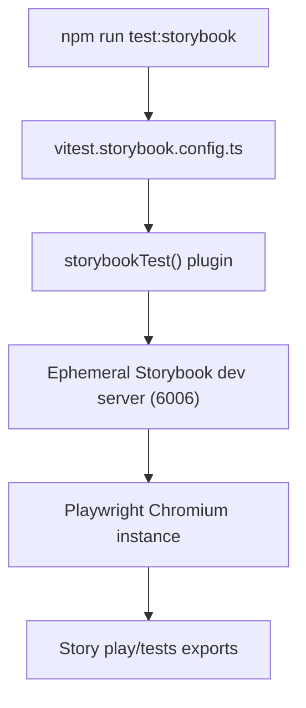

# Storybook Vitest Component Testing

This guide explains how the project runs browser-driven tests against Storybook stories using the `@storybook/addon-vitest` integration.

## Why This Exists

Running tests through Storybook lets us exercise rendered stories inside a real browser context. The addon bridges Storybook's story annotations with Vitest so that:

- decorators, globals, and parameters defined in `storybook/preview.ts` are reused in tests
- component stories run inside Chromium via Playwright, matching how the UI behaves in Storybook
- Electron preload bridges stay mocked consistently between Storybook and Vitest

Use this suite for interactive component behaviour that requires a browser or when you want to validate Storybook play functions.

## Configuration Overview

Key pieces live alongside the main Storybook configuration:

- `storybook/main.ts` registers `@storybook/addon-vitest` and keeps our shared Vite customisations (React compiler, CSS modules, aliases).
- `.storybook/main.ts` extends the shared config and guarantees the addon stays enabled for any consumer of the `.storybook` directory.
- `storybook/vitest.setup.ts` installs the Electron preload mock and forwards the Storybook preview annotations to Vitest via `setProjectAnnotations`.
- `vitest.storybook.config.ts` is a dedicated Vitest config that:
  - loads the same React compiler plugins used in Storybook
  - enables the `storybookTest()` Vite plugin with `configDir: .storybook`
  - runs tests in Playwright Chromium (`test.browser`) to match Storybook's runtime
  - pre-configures the dot reporter so CLI output stays consistent even without script overrides
  - keeps coverage disabled by default but wires JSON/LCOV reporters when `--coverage` is supplied, storing artefacts in `coverage/storybook`
  - writes structured results to `coverage/storybook/test-results.json`
- `tsconfig.json` and `vite.config.ts` both reference `vitest.storybook.config.ts` so type information and tooling stay aware of the new project.

When customising Storybook's Vite behaviour, keep `storybook/main.ts` as the single source of truth and import it from `.storybook/main.ts` to avoid divergence between local builds and addons.

## Running the Suite

Storybook tests run through dedicated npm scripts:

```powershell
npm run test:storybook             # Single run (recommended for CI)
npm run test:storybook:watch       # Watch mode with live reruns
npm run test:storybook:coverage    # Generate LCOV/TXT coverage artefacts
```

Variant reporters mirror the rest of the test suite (`test:storybook:{minimal|quiet|verbose|detailed}`), so aggregate commands such as `npm run test:all`, `npm run test:all:coverage`, and their quiet/minimal/verbose counterparts now include the Storybook project automatically. Use `npm run check:storybook` for targeted TS validation; the `check-types*` aggregates call it for you.

Every run spins up an ephemeral Storybook dev server through `npm run storybook`. Ensure port `6006` is free beforehand; if a local Storybook instance is already running, simply visit `http://localhost:6006` before triggering the tests to skip the warmup.

Vitest executes in browser mode, so expect slightly longer start-up times than jsdom-based suites. The configuration pins the dot reporter, and the wrapper script still passes `--silent` to hide Vitest banners so only failures surface.

## Execution Flow



## Writing Tests

The addon supports two primary patterns:

1. **Play functions** – stories export `play` implementations that drive user interactions. Any assertions inside the play function run automatically when the story executes in Vitest.
2. **`tests` exports** – stories can export a `tests` object mapping a label to a callback. The callback receives the testing context (canvas, fixture, `expect`) and is ideal for declarative assertions that do not belong in `play`.

Example excerpt inside a story module:

```typescript
export const Default: Story = {
 play: async ({ canvasElement, step }) => {
  const canvas = within(canvasElement);
  await step("shows initial state", async () => {
   await expect(canvas.getByText("All systems go")).toBeVisible();
  });
 },
 tests: {
  "renders without errors": async ({ canvasElement, expect }) => {
   const canvas = within(canvasElement);
   await expect(canvas.getByRole("button", { name: /retry/i })).toBeVisible();
  },
 },
};
```

Every story still benefits from our standard lint rules (for example, always prefer `useMount` over `useEffect`) because the tests reuse the shipped story files verbatim.

## Coverage

Run `npm run test:storybook:coverage` when you need instrumentation. The V8 provider reuses our standard include/exclude filters and writes:

- LCOV output to `coverage/storybook/lcov.info` (for merging with other suites)
- human-readable summaries to the terminal and `coverage/storybook/coverage-final.json`

Because coverage is disabled by default, routine runs stay fast and avoid polluting the aggregate coverage directory unless the flag is set.

## Troubleshooting

- **MDX warning** – the CLI may print `No story files found for the specified pattern: storybook\stories\**\*.mdx` because the project currently uses CSF-only stories. This is harmless; add an MDX story or remove the MDX story glob in `storybook/main.ts` if you want to silence it.
- **Storybook port busy** – stop any running Storybook instance or change the port in both `storybookScript` and `storybookUrl` inside `vitest.storybook.config.ts`.
- **Missing decorators/parameters** – ensure new preview changes land in `storybook/preview.ts`. The Vitest setup mirrors exactly what Storybook exports from that file.
- **Electron API usage fails** – confirm the story imports `useMount` and relies on `window.electronAPI`. The `installElectronAPIMock` call in the setup guarantees the mock is present before tests run.

For broader testing guidance (coverage thresholds, test location conventions, CI workflows), see `docs/Guides/TESTING.md` and `docs/Guides/TESTING_METHODOLOGY_REACT_COMPONENTS.md`.
