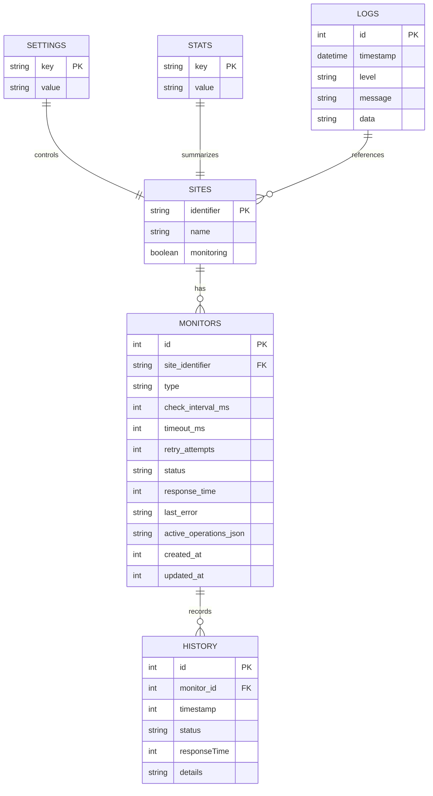

# Data Models & Database Schema

These diagrams describe the shape of the local SQLite database and the major relationships between core tables.

The goal is to help contributors understand **where data lives**, **how it relates**, and **which entities are considered authoritative** in the Electron layer.

## Entity Relationship Diagram

