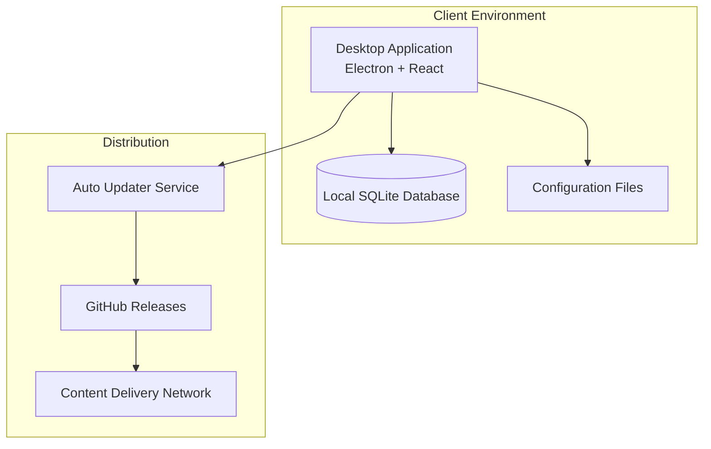

# Deployment & Infrastructure

This page documents the _documentation site’s_ high-level deployment model (GitHub Pages) and how the desktop app is distributed.

It’s meant as a conceptual map for contributors so we keep build/release assumptions consistent.

## Deployment Architecture

