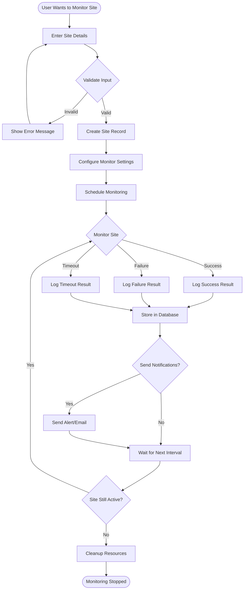
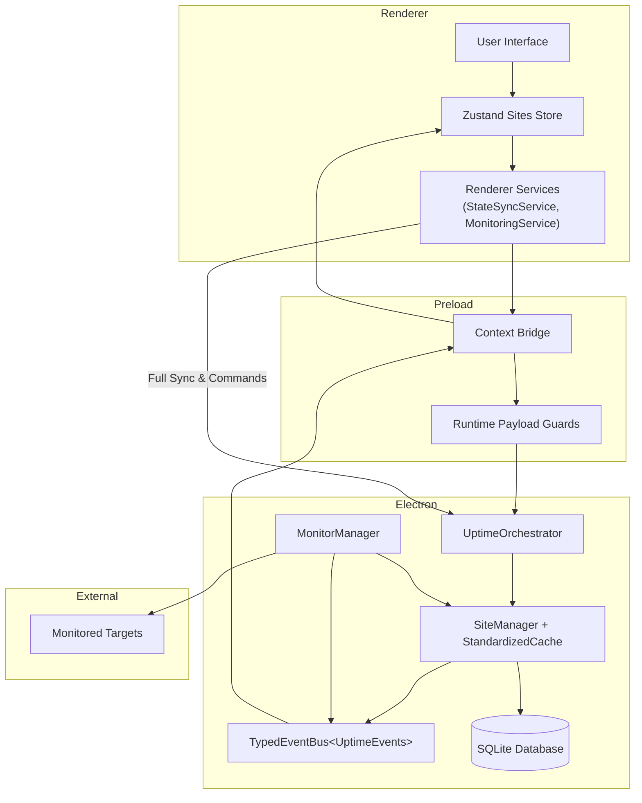

# Monitoring Workflows

This page focuses on the monitoring lifecycle and the cross-process synchronization model.

It’s intentionally high-level: the goal is to document **how the system behaves** rather than every internal function call.

## Site Monitoring Lifecycle

## Data Flow and Synchronization Strategy

