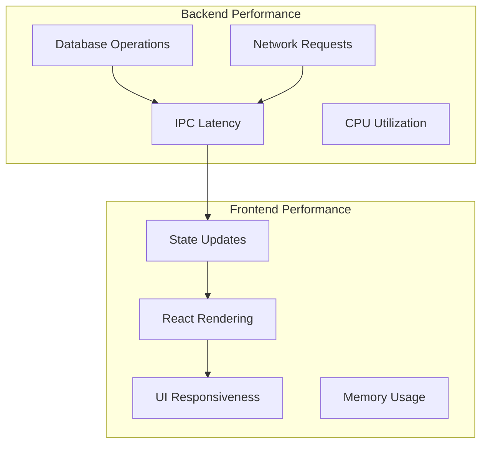

# Performance Metrics

This page highlights where performance costs show up in Uptime Watcher and which subsystems tend to dominate resource usage.

The intent is to provide a shared vocabulary when discussing bottlenecks (renderer responsiveness vs. IPC overhead vs. database throughput).

## Application Performance Overview

## Notes

- Renderer performance is most sensitive to the _volume and frequency_ of state updates.
- Main-process performance is often dominated by network concurrency and database writes.
