# System Architecture Overview

This page provides a comprehensive view of the Uptime Watcher system architecture using interactive Mermaid diagrams.

## High-Level System Architecture

```mermaid
graph TB
  %% Main Application Layer
  UI[Frontend UI<br/>React + TypeScript]
  Store[State Management<br/>Zustand Stores]

  %% IPC Communication
  IPC[IPC Bridge<br/>Secure Context Bridge]

  %% Electron Main Process
  Main[Electron Main Process]
  Services[Service Container<br/>Dependency Injection]

  %% Core Services
  Site[Site Manager<br/>Site orchestration]
  Monitor[Monitor Manager<br/>Dynamic Registry:<br/> HTTP • DNS • SSL • Ping • Port • CDN • Replication • Heartbeat • WebSocket]
  Config[Configuration Manager<br/>Settings & Preferences]
  DB[Database Manager<br/>SQLite Operations]

  %% Database & Storage
  SQLite[(SQLite Database<br/>Sites, History, Settings)]

  %% External Systems
  Network[Network Resources<br/>Monitored Sites]

  %% UI Components
  UI --> Store
  Store --> IPC
  IPC --> Main

  %% Main Process Services
  Main --> Services
  Services --> Monitor
  Services --> Site
  Services --> Config
  Services --> DB

  %% Database Operations
  DB --> SQLite

  %% External Monitoring
  Monitor --> Network

  %% Data Flow
  SQLite -.-> Site
  Site -.-> Store
  Monitor -.-> Store

  %% Styling
  classDef frontend fill:#3b82f6,stroke:#1e40af,color:#ffffff
  classDef backend fill:#059669,stroke:#047857,color:#ffffff
  classDef database fill:#dc2626,stroke:#b91c1c,color:#ffffff
  classDef external fill:#7c3aed,stroke:#5b21b6,color:#ffffff
  classDef ipc fill:#ea580c,stroke:#c2410c,color:#ffffff

  class UI,Store frontend
  class Main,Services,Monitor,Site,Config,DB backend
  class SQLite database
  class Network external
  class IPC ipc
```



## Component Interaction Flow


## Monitor Type Hierarchy


## Site Provisioning Control Plane

```mermaid
flowchart LR
  %% Domains
  subgraph Renderer["Renderer Process"]
    UI[AddSiteForm]
    SitesSvc["SiteService<br/>(waitForElectronBridge)"]
  end

  subgraph Preload["Preload Bridge"]
    SitesAPI[electronAPI.sites.addSite]
  end

  subgraph MainProcess["Electron Main Process"]
    Ipc["IpcService<br/>registerStandardizedIpcHandler"]
    subgraph Managers["ServiceContainer Managers"]
      Orchestrator[UptimeOrchestrator.addSite]
      SiteMgr[SiteManager.addSite]
      MonitorMgr[MonitorManager.setupSiteForMonitoring]
      AppSvc[ApplicationService]
      Notify[NotificationService]
    end
    subgraph Persistence["Persistence & Scheduling"]
      Writer[SiteWriterService.createSite]
      DbTx[DatabaseService.executeTransaction]
      Repos["Site/Monitor Repositories"]
      Scheduler[MonitorScheduler.startSite]
      CheckerStart[EnhancedMonitorChecker.startMonitoring]
    end
  end

  subgraph Events["Cache & Event Bus"]
    SitesCache[StandardizedCache&lt;Site&gt;]
    EventBus[TypedEventBus&lt;UptimeEvents&gt;]
  end

  subgraph FrontendSync["Renderer Sync"]
    RendererBridge[RendererEventBridge.sendToRenderers]
    EventsAPI[electronAPI.events.on...]
    SiteStore[useSiteSync & sites store]
  end

  UI -->|submit site config| SitesSvc
  SitesSvc -->|invoke| SitesAPI
  SitesAPI -->|ipc invoke "add-site"| Ipc
  Ipc --> Orchestrator
  Orchestrator --> SiteMgr
  SiteMgr -->|validate & persist| Writer
  Writer --> DbTx --> Repos --> SiteMgr
  SiteMgr -->|cache set| SitesCache
  SiteMgr -->|emit "site:added"| EventBus
  Orchestrator -->|auto setup| MonitorMgr
  MonitorMgr --> Scheduler --> CheckerStart
  CheckerStart -->|start monitoring events| EventBus
  EventBus --> AppSvc
  AppSvc --> Notify
  AppSvc --> RendererBridge
  SitesCache -->|cache-updated| EventBus
  RendererBridge -->|webContents.send| EventsAPI
  EventsAPI -->|contextBridge dispatch| SiteStore
  SiteStore -->|hydrate state| UI
```

---

For deeper insights into each module, see the API documentation and code references in the repository.
