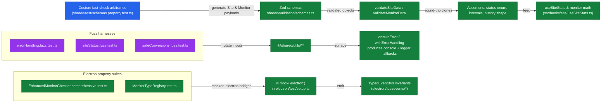
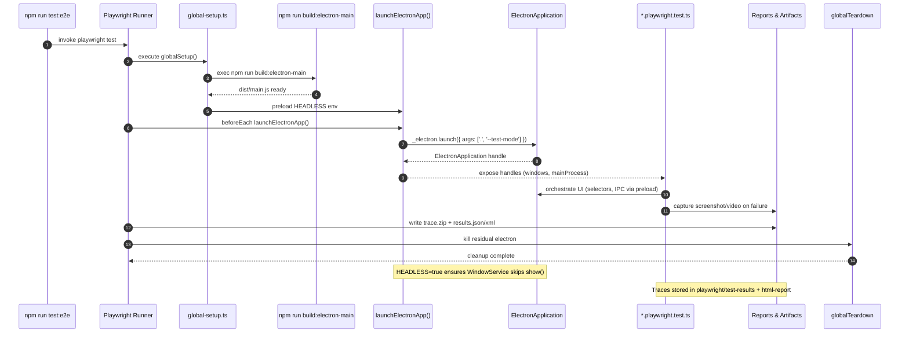

# Testing Architecture & Quality Gates

This document maps every automated test surface in Uptime Watcher—unit, integration, property-based, fuzzing, Storybook component and runner suites, and Playwright E2E—in one place.

Each diagram references the actual configs and directories so contributors can trace where data flows and how coverage gates are enforced.

## Test Suite Topology

```mermaid
graph TD
    subgraph CLI["npm scripts (package.json)"]
      testAll["npm run test:all\n(renderer + storybook + story runner)"]
      testAllCoverage["npm run test:all:coverage\n(renderer + electron + shared + storybook + story runner)"]
      testAllDetailed["npm run test:all:detailed"]
      testPlaywright["npm run test:playwright (alias test:e2e)"]
      fuzz["npm run fuzz"]
    end

    subgraph VitestFront["Vitest Frontend\n(vitest.config.ts)"]
      FrontDir["src/test/**/*.*"]
      FrontSetup["src/test/setup.ts\n& src/test/dom-setup.ts"]
      FrontEnv["JSDOM + @testing-library/jest-dom"]
    end

    subgraph VitestElectron["Vitest Electron\n(vitest.electron.config.ts)"]
      ElectronDir["electron/test/**/*.*"]
      ElectronSetup["electron/test/setup.ts\n(mocked electron, fc.configureGlobal)"]
      ElectronEnv["Node environment\n+ threads pool"]
    end

    subgraph VitestShared["Vitest Shared\n(vitest.shared.config.ts)"]
      SharedDir["shared/test/**/*.*"]
      SharedSetup["shared/test/setup.ts"]
      SharedFc["@fast-check/vitest\nnumRuns=10, verbose=2"]
    end

    subgraph VitestStorybook["Vitest Storybook\n(vitest.storybook.config.ts)"]
      StorybookDir["storybook stories\nvia @storybook/addon-vitest"]
      StorybookPlugins["storybookTest plugin\n+ React compiler"]
    end

    subgraph StorybookRunner["Storybook Runner\n(scripts/run-storybook-tests.mjs)"]
      RunnerSuites["Playwright-driven story runner"]
    end

    subgraph Playwright["Playwright E2E & UI\n(playwright.config.ts)"]
      GlobalSetup["global-setup.ts\nbuild:electron-main + HEADLESS"]
      GlobalTeardown["global-teardown.ts\nkill lingering electron"]
      ElectronHelpers["fixtures/electron-helpers.ts\nlaunchElectronApp"]
      PWTests["playwright/tests/**/*.playwright.test.ts"]
    end

    subgraph Typecheck["TS type-check configs\n(config/testing)"]
      tsFrontend["tsconfig.test.json"]
      tsElectron["tsconfig.electron.test.json"]
      tsShared["tsconfig.shared.test.json"]
      tsPlaywright["playwright/tsconfig.json"]
    end

    testAll -->|runs| VitestFront
    testAll -->|runs| VitestStorybook
    testAll -->|runs| StorybookRunner

    testAllCoverage -->|collects| VitestFront
    testAllCoverage -->|collects| VitestElectron
    testAllCoverage -->|collects| VitestShared
    testAllCoverage -->|collects| VitestStorybook
    testAllCoverage -->|collects| StorybookRunner

    testAllDetailed -->|verbose reports| VitestFront
    testAllDetailed -->|verbose reports| VitestElectron
    testAllDetailed -->|verbose reports| VitestShared
    testAllDetailed -->|verbose reports| VitestStorybook
    testAllDetailed -->|verbose reports| StorybookRunner

    testPlaywright --> Playwright
    fuzz --> SharedDir

    VitestFront --> FrontDir
    VitestFront --> FrontSetup
    VitestFront --> FrontEnv

    VitestElectron --> ElectronDir
    VitestElectron --> ElectronSetup
    VitestElectron --> ElectronEnv

    VitestShared --> SharedDir
    VitestShared --> SharedSetup
    VitestShared --> SharedFc

    VitestStorybook --> StorybookDir
    VitestStorybook --> StorybookPlugins

    StorybookRunner --> RunnerSuites

    Playwright --> GlobalSetup
    Playwright --> PWTests
    Playwright --> ElectronHelpers
    Playwright --> GlobalTeardown

    TsDeps["npm run check:frontend:test"] --> tsFrontend
    TsDeps2["npm run check:electron:test"] --> tsElectron
    TsDeps3["npm run check:shared:test"] --> tsShared
    TsDeps4["npm run check:playwright"] --> tsPlaywright

    classDef cli fill:#0ea5e9,stroke:#0369a1,color:#ffffff
    classDef vitest fill:#312e81,stroke:#1e1b4b,color:#ffffff
    classDef setup fill:#1f2937,stroke:#111827,color:#f1f5f9
    classDef type fill:#15803d,stroke:#166534,color:#f0fdf4

    class testAll,testAllCoverage,testAllDetailed,testPlaywright,fuzz cli
    class VitestFront,VitestElectron,VitestShared,VitestStorybook,StorybookRunner,Playwright vitest
    class FrontDir,FrontSetup,FrontEnv setup
    class ElectronDir,ElectronSetup,ElectronEnv setup
    class SharedDir,SharedSetup,SharedFc setup
    class StorybookDir,StorybookPlugins setup
    class RunnerSuites setup
    class GlobalSetup,GlobalTeardown,ElectronHelpers,PWTests setup
    class tsFrontend,tsElectron,tsShared,tsPlaywright,TsDeps,TsDeps2,TsDeps3,TsDeps4 type
```

## Property & Fuzz Validation Pipelines

Shared and Electron tests use `@fast-check/vitest` to hammer the Zod schemas, monitor factories, and error-handling routines.

## Playwright & Electron End-to-End Flow

Playwright projects exercise the packaged Electron app.

