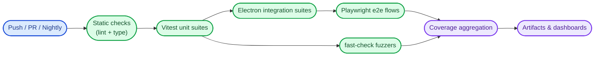

# Testing documentation

This directory contains comprehensive testing guides, best practices, and methodology documentation for the Uptime Watcher application.

## 📁 Directory structure

```text
docs/Testing/
├── README.md                              # This file
├── CODEGEN-BEST-PRACTICES.md             # Code generation best practices
├── CODEGEN_TEMPLATE_USAGE.md             # Template usage for test generation
├── FAST-CHECK-FUZZING-COVERAGE.md       # Property-based testing with fast-check
├── HEADLESS_TESTING.md                   # Headless test execution strategies
├── PLAYWRIGHT_CODEGEN_GUIDE.md          # Playwright test generation workflows
├── PLAYWRIGHT_TESTING_GUIDE.md          # Comprehensive Playwright testing guide
├── ZERO_COVERAGE_AUDIT.md               # Workflow for spotting orphaned tests
└── TEST_VERBOSITY_GUIDE.md               # Test output configuration and debugging
```

## 🧪 Testing framework overview

The Uptime Watcher application uses a comprehensive testing strategy with multiple frameworks:

* __Vitest__ - Unit and integration testing
* __Playwright__ - End-to-end and Electron testing
* __Fast-check__ - Property-based testing and fuzzing
* __Coverage analysis__ - Comprehensive code coverage tracking

### Test pipeline overview



## 🚀 Quick start testing

For new developers getting started with testing:

1. __[Playwright testing guide](./PLAYWRIGHT_TESTING_GUIDE.md)__ - Complete E2E testing setup
2. __[Headless testing](./HEADLESS_TESTING.md)__ - Running tests without UI
3. __[Test verbosity guide](./TEST_VERBOSITY_GUIDE.md)__ - Configuring test output

## 📖 Testing guides

### Playwright testing

| Guide                                                     | Description                              | Use case                    |
| --------------------------------------------------------- | ---------------------------------------- | --------------------------- |
| [Playwright testing guide](./PLAYWRIGHT_TESTING_GUIDE.md) | Comprehensive Playwright setup and usage | E2E and Electron testing    |
| [Playwright codegen guide](./PLAYWRIGHT_CODEGEN_GUIDE.md) | Test generation workflows and automation | Creating new test cases     |
| [Headless testing](./HEADLESS_TESTING.md)                 | Running tests without UI in CI/CD        | Automated testing pipelines |

### Code generation and templates

| Guide                                                 | Description                                   | Use case                     |
| ----------------------------------------------------- | --------------------------------------------- | ---------------------------- |
| [Codegen best practices](./CODEGEN-BEST-PRACTICES.md) | Guidelines for effective code generation      | Test maintenance and quality |
| [Template usage](./CODEGEN_TEMPLATE_USAGE.md)         | Using templates for consistent test structure | Standardizing test patterns  |

### Advanced testing techniques

| Guide                                                        | Description                                   | Use case                           |
| ------------------------------------------------------------ | --------------------------------------------- | ---------------------------------- |
| [Fast-check fuzzing coverage](./FAST-CHECK-FUZZING-GUIDE.md) | Property-based testing and fuzzing strategies | Finding edge cases and bugs        |
| [Zero coverage audit](./ZERO_COVERAGE_AUDIT.md)              | Isolate tests that no longer execute code     | Pruning stale specs safely         |
| [Test verbosity guide](./TEST_VERBOSITY_GUIDE.md)            | Configuring test output and debugging         | Test debugging and CI optimization |

## 🏃‍♂️ Running tests

### Available test commands

```bash
# Run all tests
npm run test

# Run Electron-specific tests
npm run test:electron

# Run tests with coverage
npm run test:coverage
npm run test:electron:coverage

# Run shared module tests with coverage
npm run test:shared:coverage

# Run performance benchmarks
npm run bench
```

### Testing different components

* __Frontend tests__ - React component testing with Vitest
* __Electron tests__ - Main process and IPC testing
* __Shared module tests__ - Utility and service testing
* __E2E tests__ - Full application workflow testing with Playwright

## 🔧 Test configuration

Test configuration files are located in the project root:

* `vitest.config.ts` - Main Vitest configuration
* `vitest.electron.config.ts` - Electron-specific test configuration
* `vitest.shared.config.ts` - Shared module test configuration
* `playwright.config.ts` - Playwright E2E test configuration

## 🎯 Testing best practices

### Unit testing

* Test individual functions and components in isolation
* Use mocking for external dependencies
* Aim for high code coverage on critical paths
* Follow AAA pattern (Arrange, Act, Assert)

### Integration testing

* Test component interactions and data flows
* Verify IPC communication between processes
* Test database operations and state management
* Use real services where possible, mock external APIs

### End-to-end testing

* Test complete user workflows
* Verify UI behavior and user interactions
* Test across different operating systems
* Use Playwright for cross-browser compatibility

### Property-based testing

* Use fast-check for testing invariants
* Generate random inputs to find edge cases
* Focus on critical algorithms and data processing
* Supplement unit tests with property-based tests

## 🗂️ Navigation

* __[Main documentation](../../README.md)__ - Project overview and setup
* __[Architecture documentation](../Architecture/README.md)__ - System design and patterns
* __[Guides documentation](../Guides/README.md)__ - Development guides and tutorials
* __[TSDoc documentation](../TSDoc/README.md)__ - Code documentation standards

## 📝 Contributing to testing

When adding new tests or testing documentation:

1. Follow the [documentation style guide](../DOCUMENTATION_STYLE_GUIDE.md)
2. Update this README to include new testing guides
3. Ensure tests follow established patterns and conventions
4. Add appropriate coverage for new features
5. Update test documentation for any new testing approaches
